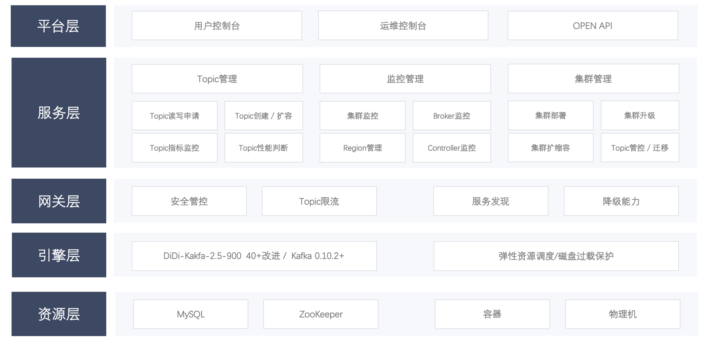

---

**一站式`Apache Kafka`集群指标监控与运维管控平台**

--- 

## 主要功能特性

### 集群监控维度

- 多版本集群管控，支持从`0.10.2`到`2.x`版本；
- 集群Topic、Broker等多维度历史与实时关键指标查看；

### 集群管控维度

- 集群运维，包括逻辑Region方式管理集群
- Broker运维，包括优先副本选举
- Topic运维，包括创建、查询、扩容、修改属性、数据采样及迁移等；
- 消费组运维，包括指定时间或指定偏移两种方式进行重置消费偏移

### 用户使用维度

- Kafka用户、Kafka研发、Kafka运维 视角区分
- Kafka用户、Kafka研发、Kafka运维 权限区分

## kafka-manager架构图

## 相关文档

- [kafka-manager 安装手册](docs/install_guide/install_guide_cn.md)
- [kafka-manager 接入集群](docs/user_guide/add_cluster/add_cluster.md)
- [kafka-manager 用户使用手册](docs/user_guide/user_guide_cn.md)

## 钉钉交流群

  钉钉群ID：32821440

## 项目成员

### 内部核心人员

`iceyuhui`、`liuyaguang`、`limengmonty`、`zhangliangmike`、`nullhuangyiming`、`zengqiao`、`eilenexuzhe`、`huangjiaweihjw`

### 外部贡献者

`fangjunyu`、`zhoutaiyang`

## 协议

`kafka-manager`基于`Apache-2.0`协议进行分发和使用，更多信息参见[协议文件](./LICENSE)
