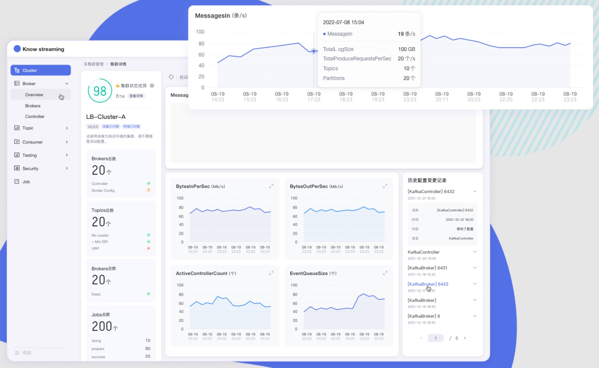

    <a href="https://knowstreaming.com">产品官网</a> | 
    <a href="https://github.com/didi/KnowStreaming/releases">下载地址</a> | 
    <a href="https://doc.knowstreaming.com">文档资源</a> | 
    <a href="https://demo.knowstreaming.com">体验环境</a> 

<!--最近一次提交时间-->

<!--最新版本-->

<!--License信息-->

<!--Open-Issue-->

<!--知识星球-->

---

## `Know Streaming` 简介

`Know Streaming`专注于Kafka运维管控、监控告警、资源治理、多活容灾等核心场景，经历大规模集群、海量大数据考验，在用户体验、监控、运维管控上进行了平台化、可视化、智能化的建设，提供一系列特色的功能，极大地方便了用户和运维人员的日常使用。与其他Kafka管控产品相比，`Know Streaming` 具有以下特点：

- 👀 &nbsp;**简单易用**：提炼高频的 CLI 能力，设计合理的产品使用路径，绘制清新美观的 GUI 页面，始终将简单易用作为产品的主要目标。

- 🌪️ &nbsp;**功能丰富**：主要包含`多集群管理`和`系统管理`两大块，具体包含：
  1. 多集群管理：包括集群管理、Broker管理、Topic管理、Group管理、Security管理、Jobs管理等六大功能模块，几乎涵盖 CLI 的所有高频能力。
  2. 系统管理：包括配置管理、用户管理、审计日志等3大功能模块，基本满足开源用户的使用需要。

- 👏 &nbsp;**版本兼容**：支持 0.10 及以上，**`ZK`** 或 **`Raft`** 运行模式的Kafka版本，此外在兼容架构上具备良好的扩展性。

- 🚀 &nbsp;**专业能力**：不仅是 CLI 到 GUI 的优秀翻译，更是涵盖一系列专业能力的产品，包括但不限于：
  1. 观测提升： **`多维度指标观测大盘`**、**`观测指标最佳实践`** 等功能。
  2. 异常巡检：**`集群多维度健康巡检`**、 **`集群多维度健康分`** 等功能。
  3. 能力增强：**`Topic扩缩副本`**、**`Topic副本迁移`** 等功能。

- ⚡️ &nbsp;**支持分布式**：具备水平扩展能力，只需要增加节点即可获取更强的采集及对外服务能力。

&nbsp;
**产品图**

## 文档资源

**`开发相关手册`**

- [打包编译手册](docs/install_guide/源码编译打包手册.md)
- [单机部署手册](docs/install_guide/单机部署手册.md)
- [版本升级手册](docs/install_guide/版本升级手册.md)
- [本地源码启动手册](docs/dev_guide/本地源码启动手册.md)

**`产品相关手册`**

- [产品使用指南](docs/user_guide/用户使用手册.md)
- [2.x与3.x新旧对比手册](docs/user_guide/新旧对比手册.md)
- [FAQ](docs/user_guide/faq.md)

**点击 [这里](https://doc.knowstreaming.com/product/1-quick-start)，也可以从官网获取到更多文档**

## 成为社区贡献者

点击 [这里](CONTRIBUTING.md)，了解如何成为 Know Streaming 的贡献者

## 加入技术交流群

**`1、知识星球`**

       

 
 
 
 
 
 
 
 

👍 我们组建了国内最大，最权威的 **[Kafka中文社区](https://z.didi.cn/5gSF9)**

在这里你可以结交各大互联网的 Kafka大佬 以及 4000+ Kafka爱好者，一起实现知识共享，实时掌控最新行业资讯，期待 👏 &nbsp; 您的加入中～ https://z.didi.cn/5gSF9

有问必答~！ 互动有礼~！

PS: 提问请尽量把问题一次性描述清楚，并告知环境信息情况～！如使用版本、操作步骤、报错/警告信息等，方便大V们快速解答～

&nbsp;

**`2、微信群`**

微信加群：添加`mike_zhangliang`、`PenceXie`的微信号备注Kafka加群。
