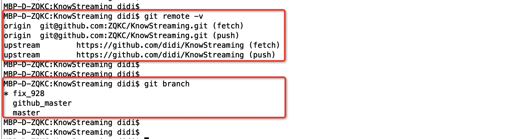
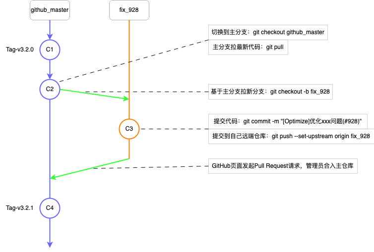
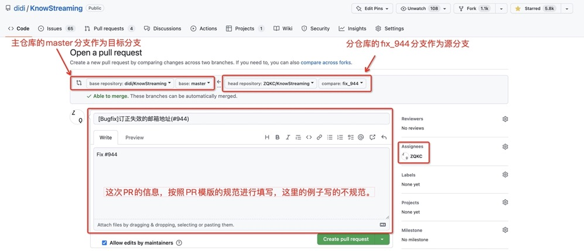

# 贡献指南

- [贡献指南](#贡献指南)
  - [1、行为准则](#1行为准则)
  - [2、仓库规范](#2仓库规范)
    - [2.1、Issue 规范](#21issue-规范)
    - [2.2、Commit-Log 规范](#22commit-log-规范)
    - [2.3、Pull-Request 规范](#23pull-request-规范)
  - [3、操作示例](#3操作示例)
    - [3.1、初始化环境](#31初始化环境)
    - [3.2、认领问题](#32认领问题)
    - [3.3、处理问题 \& 提交解决](#33处理问题--提交解决)
    - [3.4、请求合并](#34请求合并)
  - [4、常见问题](#4常见问题)
    - [4.1、如何将多个 Commit-Log 合并为一个？](#41如何将多个-commit-log-合并为一个)


---


欢迎 👏🏻 👏🏻 👏🏻 来到 `KnowStreaming`。本文档是关于如何为 `KnowStreaming` 做出贡献的指南。如果您发现不正确或遗漏的内容, 请留下您的意见/建议。


---


## 1、行为准则

请务必阅读并遵守我们的：[行为准则](https://github.com/didi/KnowStreaming/blob/master/CODE_OF_CONDUCT.md)。


## 2、仓库规范

### 2.1、Issue 规范

按要求，在 [创建Issue](https://github.com/didi/KnowStreaming/issues/new/choose) 中创建ISSUE即可。

需要重点说明的是：
- 提供出现问题的环境信息，包括使用的系统，使用的KS版本等；
- 提供出现问题的复现方式；


### 2.2、Commit-Log 规范

`Commit-Log` 包含三部分 `Header`、`Body`、`Footer`。其中 `Header` 是必须的，格式固定，`Body` 在变更有必要详细解释时使用。


**1、`Header` 规范**

`Header` 格式为 `[Type]Message`， 主要有三部分组成，分别是`Type`、`Message`，

- `Type`：说明这个提交是哪一个类型的，比如有 Bugfix、Feature、Optimize等；
- `Message`：说明提交的信息，比如修复xx问题；


实际例子：[`[Bugfix]修复新接入的集群，Controller-Host不显示的问题`](https://github.com/didi/KnowStreaming/pull/933/commits)


**2、`Body` 规范**

一般不需要，如果解决了较复杂问题，或者代码较多，需要 `Body` 说清楚解决的问题，解决的思路等信息。

---

**3、实际例子**

```
[Optimize]优化 MySQL & ES 测试容器的初始化

主要的变更
1、knowstreaming/knowstreaming-manager 容器；
2、knowstreaming/knowstreaming-mysql 容器调整为使用 mysql:5.7 容器；
3、初始化 mysql:5.7 容器后，增加初始化 MySQL 表及数据的动作；

被影响的变更：
1、移动 km-dist/init/sql 下的MySQL初始化脚本至 km-persistence/src/main/resource/sql 下，以便项目测试时加载到所需的初始化 SQL；
2、删除无用的 km-dist/init/template 目录；
3、因为 km-dist/init/sql 和 km-dist/init/template 目录的调整，因此也调整 ReleaseKnowStreaming.xml 内的文件内容；
```


**TODO : 后续有兴趣的同学，可以考虑引入 Git 的 Hook 进行更好的 Commit-Log 的管理。**


### 2.3、Pull-Request 规范

详细见：[PULL-REQUEST 模版](../../.github/PULL_REQUEST_TEMPLATE.md)

需要重点说明的是：

- <font color=red > 任何 PR 都必须与有效 ISSUE 相关联。否则， PR 将被拒绝；</font>
- <font color=red> 一个分支只修改一件事，一个 PR 只修改一件事；</b></font>

---


## 3、操作示例

本节主要介绍对 `KnowStreaming` 进行代码贡献时，相关的操作方式及操作命令。

名词说明：
- 主仓库：https://github.com/didi/KnowStreaming 这个仓库为主仓库。
- 分仓库：Fork 到自己账号下的 KnowStreaming 仓库为分仓库；


### 3.1、初始化环境

1. `Fork KnowStreaming` 主仓库至自己账号下，见 https://github.com/didi/KnowStreaming 地址右上角的 `Fork` 按钮；
2. 克隆分仓库至本地：`git clone git@github.com:xxxxxxx/KnowStreaming.git`，该仓库的简写名通常是`origin`；
3. 添加主仓库至本地：`git remote add upstream https://github.com/didi/KnowStreaming`，`upstream`是主仓库在本地的简写名，可以随意命名，前后保持一致即可；
4. 拉取主仓库代码：`git fetch upstream`；
5. 拉取分仓库代码：`git fetch origin`；
6. 将主仓库的`master`分支，拉取到本地并命名为`github_master`：`git checkout -b upstream/master`；

最后，我们来看一下初始化完成之后的大致效果，具体如下图所示：



至此，我们的环境就初始化好了。后续，`github_master` 分支就是主仓库的`master`分支，我们可以使用`git pull`拉取该分支的最新代码，还可以使用`git checkout -b xxx`拉取我们想要的分支。


### 3.2、认领问题

在文末评论说明自己要处理该问题即可，具体如下图所示：


### 3.3、处理问题 & 提交解决

本节主要介绍一下处理问题 & 提交解决过程中的分支管理，具体如下图所示：



1. 切换到主分支：`git checkout github_master`；
2. 主分支拉最新代码：`git pull`；
3. 基于主分支拉新分支：`git checkout -b fix_928`；
4. 提交代码，安装commit的规范进行提交，例如：`git commit -m "[Optimize]优化xxx问题"`；
5. 提交到自己远端仓库：`git push --set-upstream origin fix_928`；
6. `GitHub` 页面发起 `Pull Request` 请求，管理员合入主仓库。这部分详细见下一节；


### 3.4、请求合并

代码在提交到 `GitHub` 分仓库之后，就可以在 `GitHub` 的网站创建 `Pull Request`，申请将代码合入主仓库了。 `Pull Request` 具体见下图所示：




[Pull Request 创建的例子](https://github.com/didi/KnowStreaming/pull/945)


---


## 4、常见问题

### 4.1、如何将多个 Commit-Log 合并为一个？

可以不需要将多个commit合并为一个，如果要合并，可以使用 `git rebase -i` 命令进行解决。


