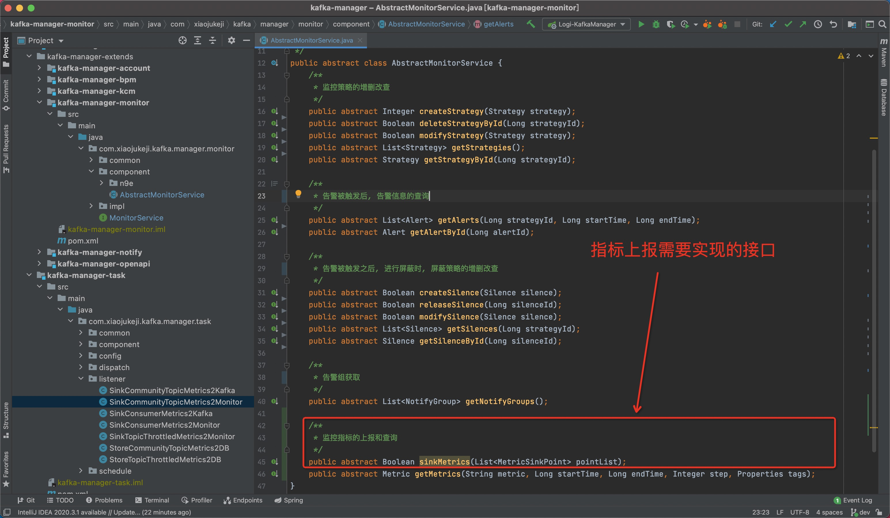
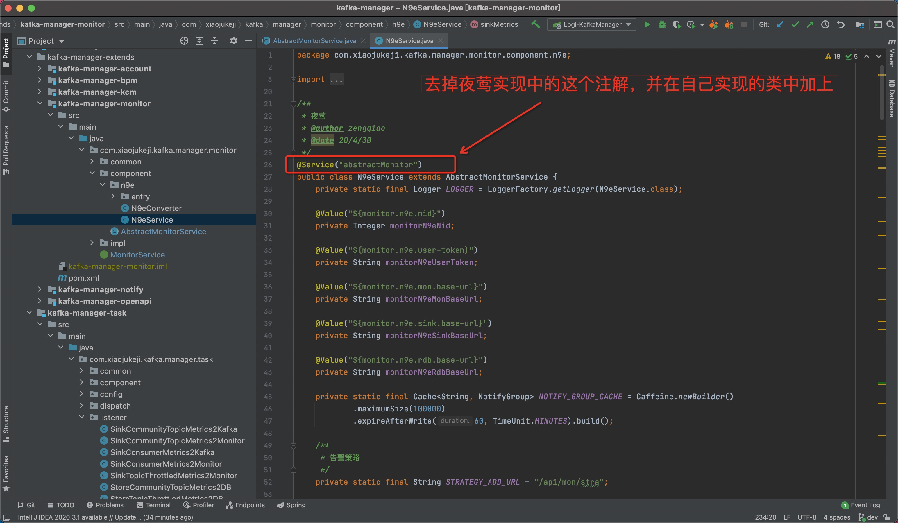
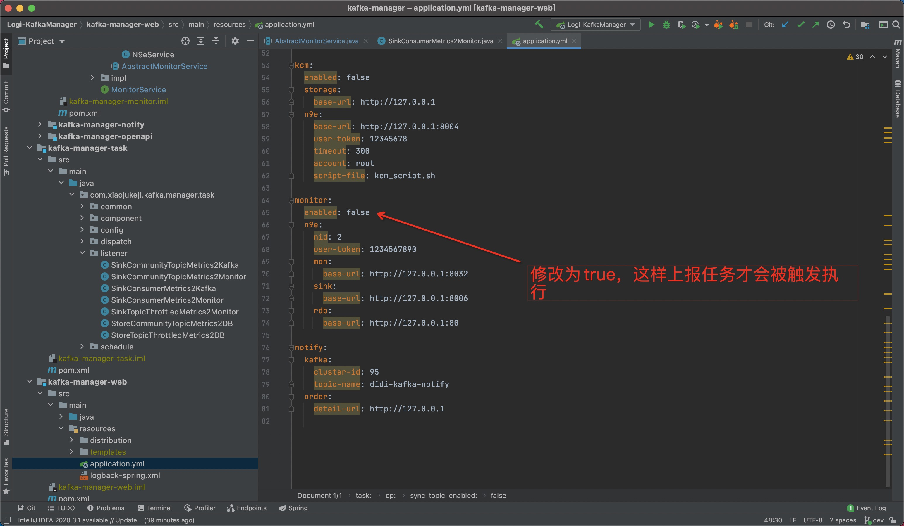
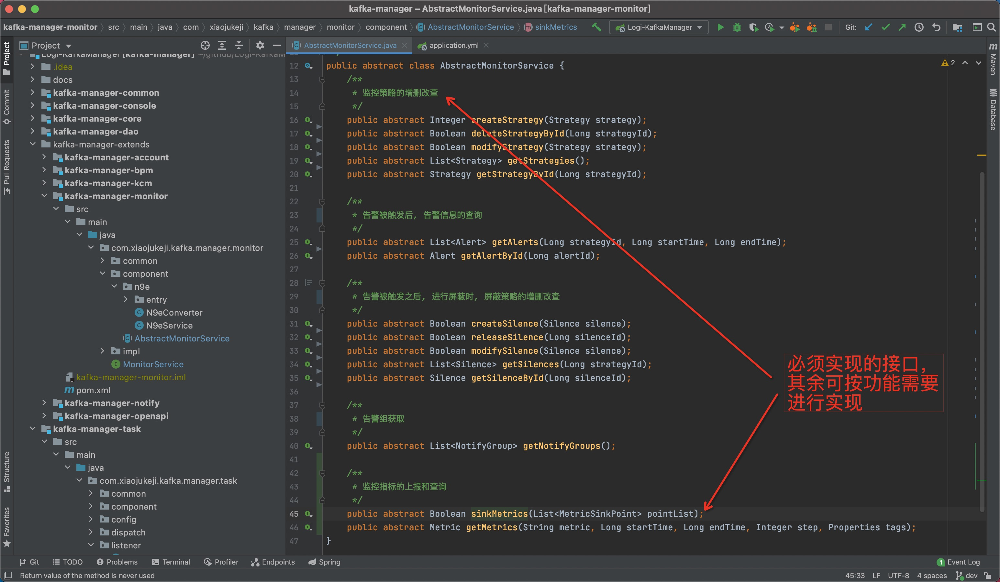

---

**一站式`Apache Kafka`集群指标监控与运维管控平台**

--- 

# 监控系统集成

- 监控系统默认与 [夜莺] (https://github.com/didi/nightingale) 进行集成；
- 对接自有的监控系统需要进行简单的二次开发，即实现部分监控告警模块的相关接口即可；
- 集成会有两块内容，一个是指标数据上报的集成，还有一个是监控告警规则的集成；

## 1、指标数据上报集成

仅完成这一步的集成之后，即可将监控数据上报到监控系统中，此时已能够在自己的监控系统进行监控告警规则的配置了。

**步骤一：实现指标上报的接口**

- 按照自己内部监控系统的数据格式要求，将数据进行组装成符合自己内部监控系统要求的数据进行上报，具体的可以参考夜莺集成的实现代码。
- 至于会上报哪些指标，可以查看有哪些地方调用了该接口。

**步骤二：相关配置修改**

**步骤三：开启上报任务**

## 2、监控告警规则集成

完成**1、指标数据上报集成**之后，即可在自己的监控系统进行监控告警规则的配置了。完成该步骤的集成之后，可以在`Logi-KafkaManager`中进行监控告警规则的增删改查等等。

大体上和**1、指标数据上报集成**一致，

**步骤一：实现相关接口**

实现完成步骤一之后，接下来的步骤和**1、指标数据上报集成**中的步骤二、步骤三一致，都需要进行相关配置的修改即可。

## 3、总结

简单介绍了一下监控告警的集成，嫌麻烦的同学可以仅做 **1、指标数据上报集成** 这一节的内容即可满足一定场景下的需求。

**集成过程中，有任何觉得文档没有说清楚的地方或者建议，欢迎入群交流，也欢迎贡献代码，觉得好也辛苦给个star。**
