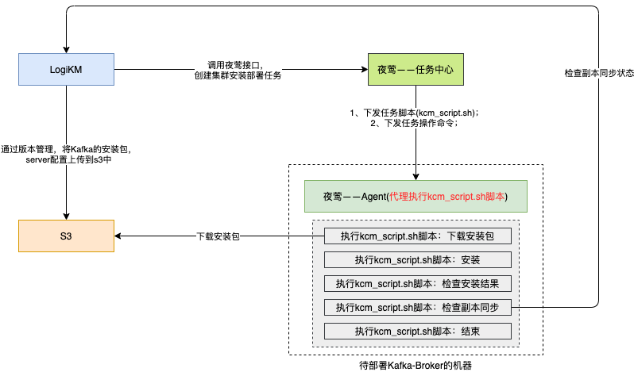

---


**一站式`Apache Kafka`集群指标监控与运维管控平台**

--- 

# 如何使用集群安装部署功能？

[TOC]

## 1、实现原理



- LogiKM上传安装包到S3服务；
- LogiKM调用夜莺-Job服务接口，创建执行[kcm_script.sh](https://github.com/didi/LogiKM/blob/master/kafka-manager-extends/kafka-manager-kcm/src/main/resources/kcm_script.sh)脚本的任务，kcm_script.sh脚本是安装部署Kafka集群的脚本；
- 夜莺将任务脚本下发到具体的机器上，通过夜莺Agent执行该脚本；
- kcm_script.sh脚本会进行Kafka-Broker的安装部署；


---

## 2、使用方式

### 2.1、第一步：修改配置

**配置application.yml文件**
```yaml
# 
kcm:
  enabled: false                      # 是否开启，将其修改为true
  s3:                                   # s3 存储服务
    endpoint: s3.didiyunapi.com
    access-key: 1234567890
    secret-key: 0987654321
    bucket: logi-kafka
  n9e:                                  # 夜莺
    base-url: http://127.0.0.1:8004     # 夜莺job服务地址
    user-token: 12345678                # 用户的token
    timeout: 300                        # 单台操作的超时时间
    account: root                       # 操作时使用的账号
    script-file: kcm_script.sh          # 脚本，已内置好，在源码的kcm模块内，此处配置无需修改
    logikm-url: http://127.0.0.1:8080   # logikm部署地址，部署时kcm_script.sh会调用logikm检查部署中的一些状态，这里只需要填写 http://IP:PORT 就可以了


account:
  jump-login:
    gateway-api: false            # 网关接口
    third-part-api: false         # 第三方接口，将其修改为true，即允许未登录情况下调用开放的第三方接口
```

### 2.2、第二步：检查服务

**检查s3服务**
- 测试 "运维管控-》集群运维-》版本管理" 页面的上传，查看等功能是否都正常。如果存在不正常，则需要查看s3的配置是否正确；
- 如果都没有问题，则上传Kafka的以.tgz结尾的安装包以及server.properties文件；
  
**检查夜莺Job服务**
- 创建一个job任务，机器选择需要安装Kafka集群的机器，然后执行的命令是echo "Hello LogiKM"，看能否被成功执行。如果不行，则需要检查夜莺的安装；
- 如果没有问题则表示夜莺和所需部署的机器之间的交互是没有问题的；

### 2.3、第三步：接入集群

在LogiKM的 “运维管控-》集群列表” 中接入需要安装部署的集群，**PS：此时是允许接入一个没有任何Broker的空的Kafka集群**，其中对的bootstrapServers配置搭建完成后的Kafka集群地址就可以了，而ZK地址必须和集群的server.properties中的ZK地址保持一致；

### 2.4、第四步：部署集群

- 打开LogiKM的 “运维管控-》集群运维-》集群任务” 页面，点击 “新建集群任务” 按钮；
- 选择集群、任务类型、包版本、server配置及填写主机列表，然后点击确认，即可在夜莺的Job服务中心中创建一个任务出来。**PS：如果创建失败，可以看一下日志我为什么创建失败**；
- 随后可以点击详情及状态对任务进行操作；

### 2.5、可能问题

#### 2.5.1、问题一：任务执行超时、失败等

进入夜莺Job服务中心，查看对应的任务的相关日志；

- 提示安装包下载失败，则需要查看对应的s3服务是否可以直接wget下载安装包，如果不可以则需要对kcm_script.sh脚本进行修改；
- 提示调用LogiKM失败，则可以使用postman手动测试一下kcm_script.sh脚本调用LogiKM的那个接口是否有问题，如果存在问题则进行相应的修改；PS：具体接口见kcm_script.sh脚本


## 3、备注说明

- 集群安装部署，仅安装部署Kafka-Broker，不安装Kafka的ZK服务；
- 安装部署中，有任何定制化的需求，例如修改安装的目录等，可以通过修改kcm_script.sh脚本实现；
- kcm_script.sh脚本位置：[kcm_script.sh](https://github.com/didi/LogiKM/blob/master/kafka-manager-extends/kafka-manager-kcm/src/main/resources/kcm_script.sh)；
