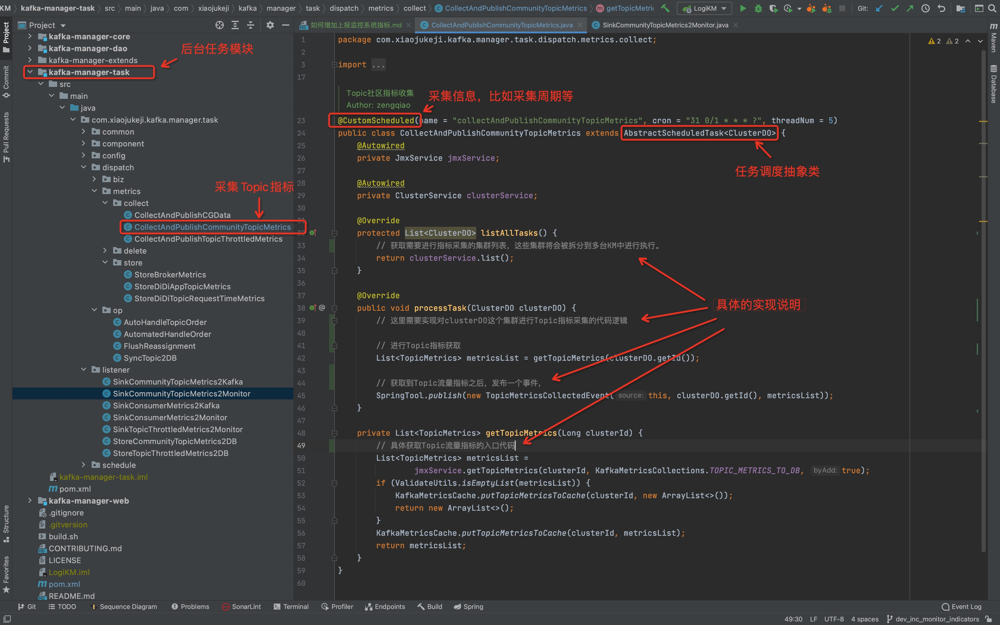
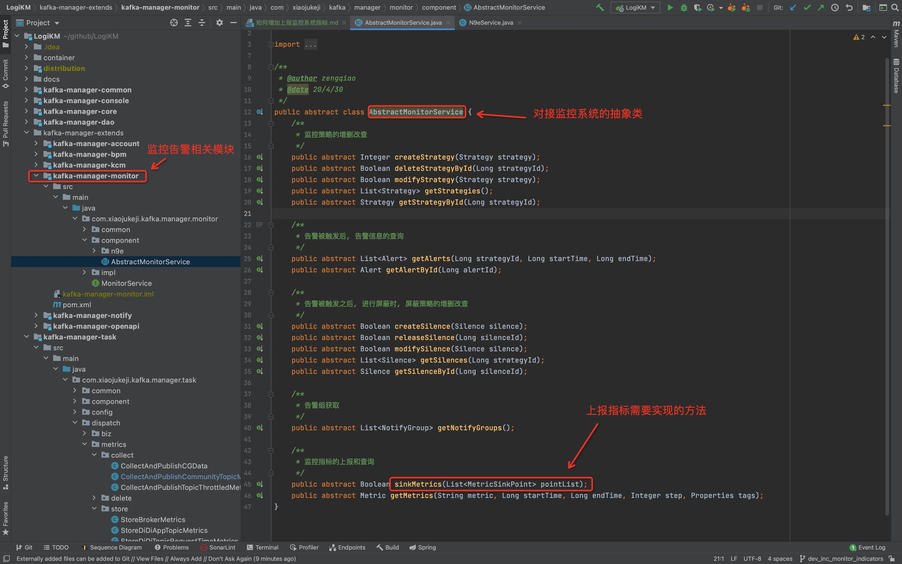

---

**一站式`Apache Kafka`集群指标监控与运维管控平台**

--- 

# 如何增加上报监控系统指标？

## 0、前言

LogiKM是 **一站式`Apache Kafka`集群指标监控与运维管控平台** ，当前会将消费Lag，Topic流量等指标上报到监控系统中，从而方便用户在监控系统中对这些指标配置监控告警规则，进而达到监控自身客户端是否正常的目的。

那么，如果我们想增加一个新的监控指标，应该如何做呢，比如我们想监控Broker的流量，监控Broker的存活信息，监控集群Controller个数等等。

在具体介绍之前，我们大家都知道，Kafka监控相关的信息，基本都存储于Broker、Jmx以及ZK中。当前LogiKM也已经具备从这三个地方获取数据的基本能力，因此基于LogiKM我们再获取其他指标，总体上还是非常方便的。

这里我们就以已经获取到的Topic流量信息为例，看LogiKM如何实现Topic指标的获取并上报的。

---

## 1、确定指标位置

基于对Kafka的了解，我们知道Topic流量信息这个指标是存储于Jmx中的，因此我们需要从Jmx中获取。大家如果对于自己所需要获取的指标存储在何处不太清楚的，可以加入我们维护的Kafka中文社区(README中有二维码)中今天沟通交流。

---

## 2、指标获取

Topic流量指标的获取详细见图中说明。

---

## 3、指标上报

上一步我们已经采集到Topic流量指标了，下一步就是将该指标上报到监控系统，这块只需要按照监控系统要求的格式，将数据上报即可。

LogiKM中有一个monitor模块，具体的如下图所示：

## 4、补充说明 

监控系统对接的相关内容见：

[监控系统集成](./monitor_system_integrate_with_self.md)

[监控系统集成例子——集成夜莺](./monitor_system_integrate_with_n9e.md)
