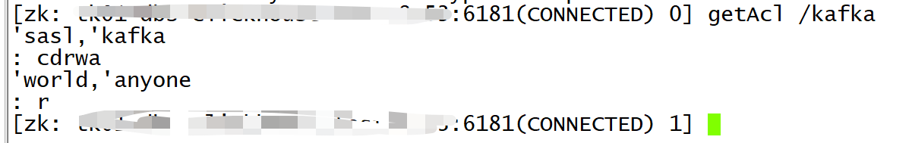
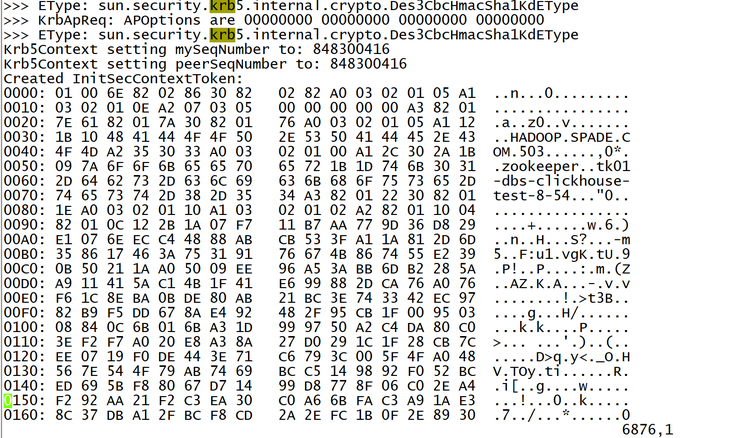

---

# 接入 ZK 带认证的 Kafka 集群

- [接入 ZK 带认证的 Kafka 集群](#接入-zk-带认证的-kafka-集群)
  - [1、简要说明](#1简要说明)
  - [2、支持 Digest-MD5 认证](#2支持-digest-md5-认证)
  - [3、支持 Kerberos 认证](#3支持-kerberos-认证)


## 1、简要说明

- 1、当前 KnowStreaming 暂无页面可以直接配置 ZK 的认证信息，但是 KnowStreaming 的后端预留了 MySQL 的字段用于存储 ZK 的认证信息，用户可通过将认证信息存储至该字段，从而达到支持接入 ZK 带认证的 Kafka 集群。
&nbsp;

- 2、该字段位于 MySQL 库 ks_km_physical_cluster 表中的 zk_properties 字段，该字段的格式是：
```json
{
    "openSecure": false,            # 是否开启认证，开启时配置为true
    "sessionTimeoutUnitMs": 15000,  # session超时时间
    "requestTimeoutUnitMs": 5000,   # request超时时间
    "otherProps": {                 # 其他配置，认证信息主要配置在该位置
        "zookeeper.sasl.clientconfig": "kafkaClusterZK1"    # 例子，
    }
}
```

- 3、实际生效的代码位置
```java
// 代码位置：https://github.com/didi/KnowStreaming/blob/master/km-persistence/src/main/java/com/xiaojukeji/know/streaming/km/persistence/kafka/KafkaAdminZKClient.java

kafkaZkClient = KafkaZkClient.apply(
    clusterPhy.getZookeeper(),
    zkConfig.getOpenSecure(),               // 是否开启认证，开启时配置为true
    zkConfig.getSessionTimeoutUnitMs(),     // session超时时间
    zkConfig.getRequestTimeoutUnitMs(),     // request超时时间
    5,      
    Time.SYSTEM,
    "KS-ZK-ClusterPhyId-" + clusterPhyId,
    "KS-ZK-SessionExpireListener-clusterPhyId-" + clusterPhyId,
    Option.apply("KS-ZK-ClusterPhyId-" + clusterPhyId),
    Option.apply(this.getZKConfig(clusterPhyId, zkConfig.getOtherProps())) // 其他配置，认证信息主要配置在该位置
);
```

- 4、SQL例子
```sql
update ks_km_physical_cluster set zk_properties='{ "openSecure": true, "otherProps": { "zookeeper.sasl.clientconfig": "kafkaClusterZK1" } }' where id=集群1的ID;
```


- 5、zk_properties 字段不能覆盖所有的场景，所以实际使用过程中还可能需要在此基础之上，进行其他的调整。比如，`Digest-MD5 认证` 和 `Kerberos 认证` 都还需要修改启动脚本等。后续看能否通过修改 ZK 客户端的源码，使得 ZK 认证的相关配置能和 Kafka 认证的配置一样方便。


---


## 2、支持 Digest-MD5 认证

1. 假设你有两个 Kafka 集群， 对应两个 ZK 集群；
2. 两个 ZK 集群的认证信息如下所示

```bash
# ZK1集群的认证信息，这里的 kafkaClusterZK1 可以是随意的名称，只需要和后续数据库的配置对应上即可。
kafkaClusterZK1 {
       org.apache.zookeeper.server.auth.DigestLoginModule required
       username="zk1"
       password="zk1-passwd";
};

# ZK2集群的认证信息，这里的 kafkaClusterZK2 可以是随意的名称，只需要和后续数据库的配置对应上即可。
kafkaClusterZK2 {
       org.apache.zookeeper.server.auth.DigestLoginModule required
       username="zk2"
       password="zk2-passwd";
};
```

3. 将这两个ZK集群的认证信息存储到 `/xxx/zk_client_jaas.conf` 文件中，文件中的内容如下所示：

```bash
kafkaClusterZK1 {
       org.apache.zookeeper.server.auth.DigestLoginModule required
       username="zk1"
       password="zk1-passwd";
};

kafkaClusterZK2 {
       org.apache.zookeeper.server.auth.DigestLoginModule required
       username="zk2"
       password="zk2-passwd";
};

```

4. 修改 KnowStreaming 的启动脚本

```bash
# `KnowStreaming/bin/startup.sh` 中的 47 行的 JAVA_OPT 中追加如下设置

-Djava.security.auth.login.config=/xxx/zk_client_jaas.conf
```

5. 修改 KnowStreaming 的表数据

```sql
# 这里的 kafkaClusterZK1 要和 /xxx/zk_client_jaas.conf 中的对应上
update ks_km_physical_cluster set zk_properties='{ "openSecure": true, "otherProps": { "zookeeper.sasl.clientconfig": "kafkaClusterZK1" } }' where id=集群1的ID;

update ks_km_physical_cluster set zk_properties='{ "openSecure": true, "otherProps": { "zookeeper.sasl.clientconfig": "kafkaClusterZK2" } }' where id=集群2的ID;
```

6. 重启 KnowStreaming 


---


## 3、支持 Kerberos 认证

**第一步：查看用户在ZK的ACL**

假设我们使用的用户是 `kafka` 这个用户。 

- 1、查看 server.properties 的配置的 zookeeper.connect 的地址；
- 2、使用 `zkCli.sh -serve zookeeper.connect的地址` 登录到ZK页面；
- 3、ZK页面上，执行命令 `getAcl /kafka` 查看 `kafka` 用户的权限；

此时，我们可以看到如下信息：


`kafka` 用户需要的权限是 `cdrwa`。如果用户没有 `cdrwa` 权限的话，需要创建用户并授权，授权命令为：`setAcl`


**第二步：创建Kerberos的keytab并修改 KnowStreaming 主机**

- 1、在 Kerberos 的域中创建 `kafka/_HOST` 的 `keytab`，并导出。例如：`kafka/dbs-kafka-test-8-53`；
- 2、导出 keytab 后上传到安装 KS 的机器的 `/etc/keytab` 下；
- 3、在 KS 机器上，执行 `kinit -kt zookeepe.keytab kafka/dbs-kafka-test-8-53`  看是否能进行 `Kerberos` 登录；
- 4、可以登录后，配置 `/opt/zookeeper.jaas` 文件，例子如下：
```bash
Client {
    com.sun.security.auth.module.Krb5LoginModule required
    useKeyTab=true
    storeKey=false
    serviceName="zookeeper"
    keyTab="/etc/keytab/zookeeper.keytab"
    principal="kafka/dbs-kafka-test-8-53@XXX.XXX.XXX";
};
```
- 5、需要配置 `KDC-Server` 对 `KnowStreaming` 的机器开通防火墙，并在KS的机器 `/etc/host/`  配置 `kdc-server` 的 `hostname`。并将 `krb5.conf` 导入到 `/etc` 下；


**第三步：修改 KnowStreaming 的配置**

- 1、修改数据库，开启ZK的认证
```sql
update ks_km_physical_cluster set zk_properties='{ "openSecure": true }' where id=集群1的ID;
```

- 2、在 `KnowStreaming/bin/startup.sh` 中的47行的JAVA_OPT中追加如下设置
```bash
-Dsun.security.krb5.debug=true -Djava.security.krb5.conf=/etc/krb5.conf -Djava.security.auth.login.config=/opt/zookeeper.jaas
```

- 3、重启KS集群后再 start.out 中看到如下信息，则证明Kerberos配置成功；




**第四步：补充说明**

- 1、多Kafka集群如果用的是一样的Kerberos域的话，只需在每个`ZK`中给`kafka`用户配置`crdwa`权限即可，这样集群初始化的时候`zkclient`是都可以认证；
- 2、多个Kerberos域暂时未适配；