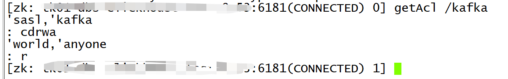
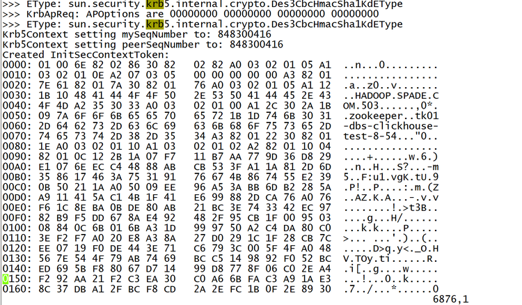

## 支持Kerberos认证的ZK


### 1、修改 KnowStreaming 代码

代码位置：`src/main/java/com/xiaojukeji/know/streaming/km/persistence/kafka/KafkaAdminZKClient.java`

将 `createZKClient` 的 `135行 的 false 改为 true


修改完后重新进行打包编译，打包编译见：[打包编译](https://github.com/didi/KnowStreaming/blob/master/docs/install_guide/%E6%BA%90%E7%A0%81%E7%BC%96%E8%AF%91%E6%89%93%E5%8C%85%E6%89%8B%E5%86%8C.md
)


### 2、查看用户在ZK的ACL

假设我们使用的用户是 `kafka` 这个用户。 

- 1、查看 server.properties 的配置的 zookeeper.connect 的地址；
- 2、使用 `zkCli.sh -serve zookeeper.connect的地址` 登录到ZK页面；
- 3、ZK页面上，执行命令 `getAcl /kafka` 查看 `kafka` 用户的权限；

此时，我们可以看到如下信息：


`kafka` 用户需要的权限是 `cdrwa`。如果用户没有 `cdrwa` 权限的话，需要创建用户并授权，授权命令为：`setAcl`


### 3、创建Kerberos的keytab并修改 KnowStreaming 主机

- 1、在 Kerberos 的域中创建 `kafka/_HOST` 的 `keytab`，并导出。例如：`kafka/dbs-kafka-test-8-53`；
- 2、导出 keytab 后上传到安装 KS 的机器的 `/etc/keytab` 下；
- 3、在 KS 机器上，执行 `kinit -kt zookeepe.keytab kafka/dbs-kafka-test-8-53`  看是否能进行 `Kerberos` 登录；
- 4、可以登录后，配置 `/opt/zookeeper.jaas` 文件，例子如下：
```sql
Client {
    com.sun.security.auth.module.Krb5LoginModule required
    useKeyTab=true
    storeKey=false
    serviceName="zookeeper"
    keyTab="/etc/keytab/zookeeper.keytab"
    principal="kafka/dbs-kafka-test-8-53@XXX.XXX.XXX";
};
```
- 5、需要配置 `KDC-Server` 对 `KnowStreaming` 的机器开通防火墙，并在KS的机器 `/etc/host/`  配置 `kdc-server` 的 `hostname`。并将 `krb5.conf` 导入到 `/etc` 下；


### 4、修改 KnowStreaming 的配置

- 1、在 `/usr/local/KnowStreaming/KnowStreaming/bin/startup.sh` 中的47行的JAVA_OPT中追加如下设置
```bash
-Dsun.security.krb5.debug=true -Djava.security.krb5.conf=/etc/krb5.conf -Djava.security.auth.login.config=/opt/zookeeper.jaas
```

- 2、重启KS集群后再 start.out 中看到如下信息，则证明Kerberos配置成功；




### 5、补充说明

- 1、多Kafka集群如果用的是一样的Kerberos域的话，只需在每个`ZK`中给`kafka`用户配置`crdwa`权限即可，这样集群初始化的时候`zkclient`是都可以认证；
- 2、当前需要修改代码重新打包才可以支持，后续考虑通过页面支持Kerberos认证的ZK接入；
- 3、多个Kerberos域暂时未适配；