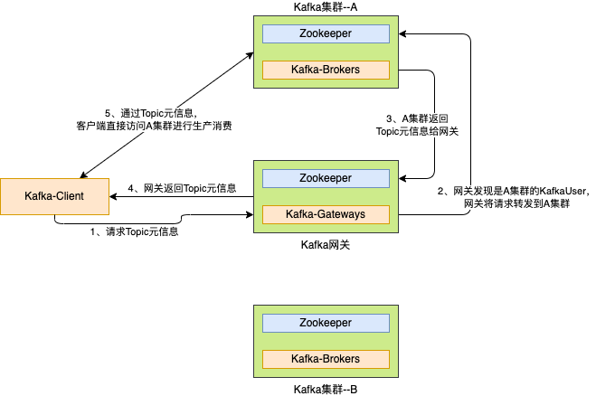
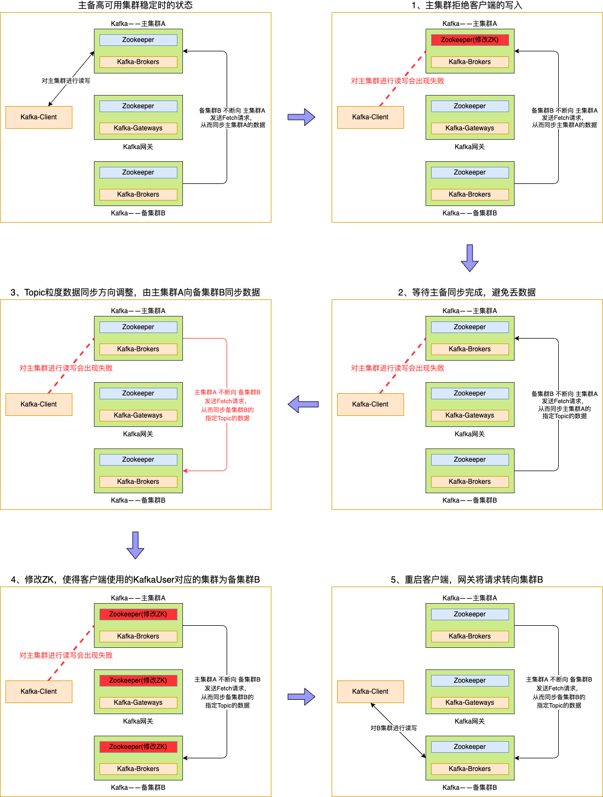

---


**一站式`Apache Kafka`集群指标监控与运维管控平台**

--- 

# Kafka主备切换流程简介

## 1、客户端读写流程

在介绍Kafka主备切换流程之前，我们先来了解一下客户端通过我们自研的网关的大致读写流程。




如上图所示，客户端读写流程大致为：
1. 客户端：向网关请求Topic元信息；
2. 网关：发现客户端使用的KafkaUser是A集群的KafkaUser，因此将Topic元信息请求转发到A集群；
3. A集群：收到网关的Topic元信息，处理并返回给网关；
4. 网关：将集群A返回的结果，返回给客户端；
5. 客户端：从Topic元信息中，获取到Topic实际位于集群A，然后客户端会连接集群A进行生产消费；

**备注：客户端为Kafka原生客户端，无任何定制。**

---

## 2、主备切换流程

介绍完基于网关的客户端读写流程之后，我们再来看一下主备高可用版的Kafka，需要如何进行主备切换。

### 2.1、大体流程



图有点多，总结起来就是：
1. 先阻止客户端数据的读写；
2. 等待主备数据同步完成；
3. 调整主备集群数据同步方向；
4. 调整配置，引导客户端到备集群进行读写；


### 2.2、详细操作

看完大体流程，我们再来看一下实际操作的命令。

```bash
1. 阻止用户生产和消费
bin/kafka-configs.sh --zookeeper ${主集群A的ZK地址} --entity-type users --entity-name ${客户端使用的kafkaUser} --add-config didi.ha.active.cluster=None --alter


2. 等待FetcherLag 和 Offset 同步
无需操作，仅需检查主备Topic的Offset是否一致了。


3. 取消备集群B向主集群A进行同步数据的配置
bin/kafka-configs.sh --zookeeper ${备集群B的ZK地址} --entity-type ha-topics --entity-name ${Topic名称} --delete-config didi.ha.remote.cluster --alter


4. 增加主集群A向备集群B进行同步数据的配置
bin/kafka-configs.sh --zookeeper ${主集群A的ZK地址} --entity-type ha-topics --entity-name ${Topic名称} --add-config didi.ha.remote.cluster=${备集群B的集群ID} --alter


5. 修改主集群A，备集群B，网关中，kafkaUser对应的集群，从而引导请求走向备集群
bin/kafka-configs.sh --zookeeper ${主集群A的ZK地址} --entity-type users --entity-name ${客户端使用的kafkaUser} --add-config didi.ha.active.cluster=${备集群B的集群ID} --alter

bin/kafka-configs.sh --zookeeper ${备集群B的ZK地址} --entity-type users --entity-name ${客户端使用的kafkaUser} --add-config didi.ha.active.cluster=${备集群B的集群ID} --alter

bin/kafka-configs.sh --zookeeper ${网关的ZK地址} --entity-type users --entity-name ${客户端使用的kafkaUser} --add-config didi.ha.active.cluster=${备集群B的集群ID} --alter
```

---

## 3、FAQ 

**问题一：使用中，有没有什么需要注意的地方？**

1. 主备切换是按照KafkaUser维度进行切换的，因此建议**不同服务之间，使用不同的KafkaUser**。这不仅有助于主备切换，也有助于做权限管控等。
2. 在建立主备关系的过程中，如果主Topic的数据量比较大，建议逐步建立主备关系，避免一次性建立太多主备关系的Topic导致主集群需要被同步大量数据从而出现压力。
&nbsp;

**问题二：消费客户端如果重启之后，会不会导致变成从最旧或者最新的数据开始消费？**

不会。主备集群，会相互同步__consumer_offsets这个Topic的数据，因此客户端在主集群的消费进度信息，也会被同步到备集群，客户端在备集群进行消费时，也会从上次提交在主集群Topic的位置开始消费。
&nbsp;

**问题三：如果是类似Flink任务，是自己维护消费进度的程序，在主备切换之后，会不会存在数据丢失或者重复消费的情况？**

如果Flink自己管理好了消费进度，那么就不会。因为主备集群之间的数据同步就和一个集群内的副本同步一样，备集群会将主集群Topic中的Offset信息等都同步过来，因此不会。
&nbsp;

**问题四：可否做到不重启客户端？**

即将开发完成的高可用版Kafka二期将具备该能力，敬请期待。
&nbsp;