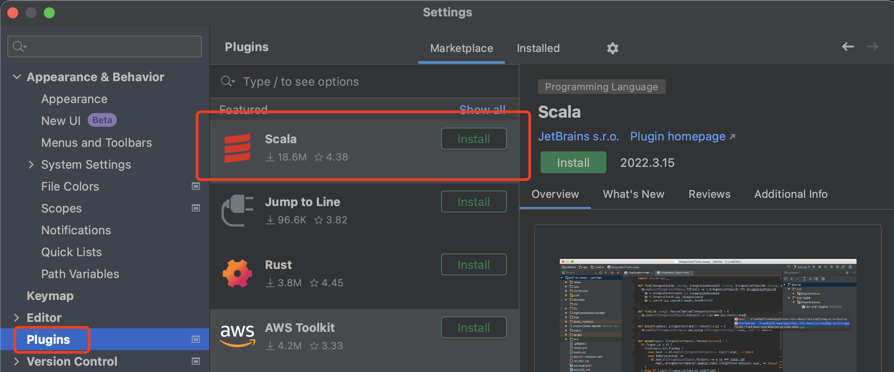
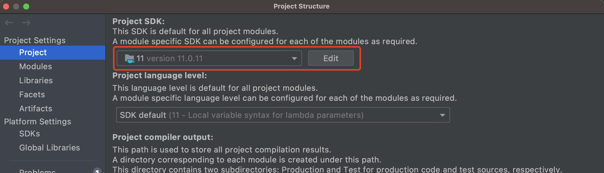
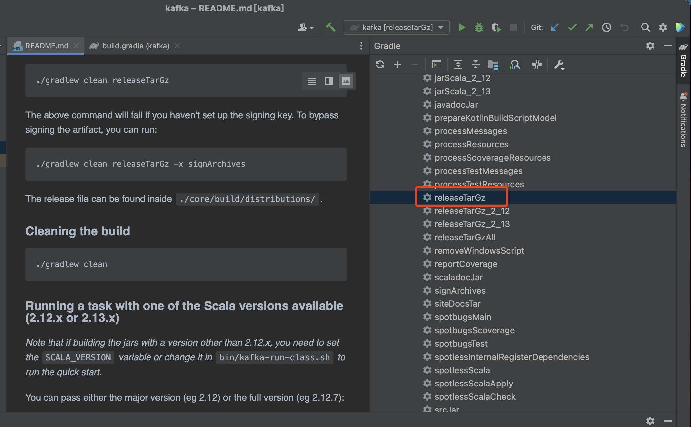
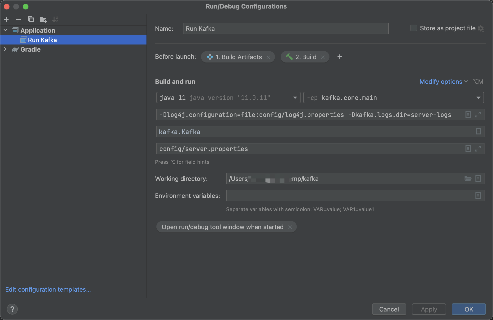
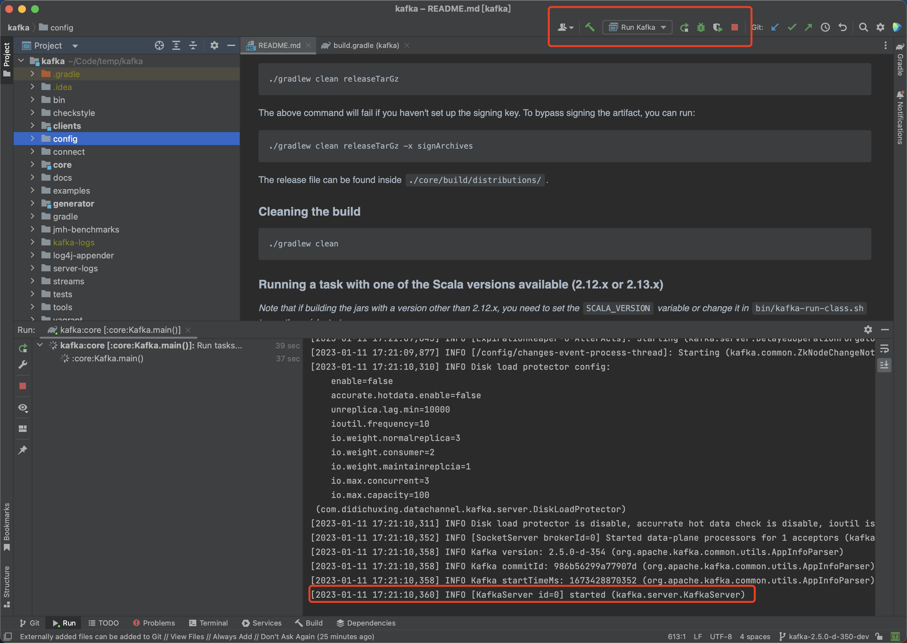

#### 环境要求

- Java11
- IDEA （示例以2022.3.1版本为准，其他版本可能存在差异）
- Gradle 5.6.2 （自动下载，无需提前准备）


#### 环境配置

##### 1. **下载源码**
```
$ git clone https://giturl/kafka.git
```

##### 2. **切换分支**
```
$ git checkout -b kafka-2.5.0-d-350-dev origin/kafka-2.5.0-d-350
```

##### 3. **生成IDEA项目文件**
```
$ cd kafka
$ ./gradlew idea
```
然后使用IDEA打开kafka.ipr文件

##### 4. **IDEA配置**

下载Scala插件 


Project Settings -> Project -> Project JDK改为Java11		

​		

##### 5. **生成消息协议文件**
```
./gradlew jar
或者
./gradlew clients:processMessages
```

> 至此已经可以正常在IDEA下查看Kafka源码了


##### 6. **编译Kafka Release包**
```
./gradlew clean releaseTarGz
```

或者IDEA上执行




#### 运行环境

##### 1. **修改配置文件**

**config/server.properties**

主要修改以下配置

```
broker.id=0   // Broker节点ID，可以保持默认
listeners=PLAINTEXT://:9092   // 监听地址，或者认证方式参考以下额外参数
log.dirs=kafka-logs    // 数据目录
zookeeper.connect=localhost:2181    // ZK地址


认证方式额外参数（根据实际情况调整）：
listeners=SASL_PLAINTEXT://:9093,PLAINTEXT://:9092
sasl.enabled.mechanisms=PLAIN
security.inter.broker.protocol=SASL_PLAINTEXT
sasl.mechanism.inter.broker.protocol=PLAIN

增强版Kafka额外配置参数：
cluster.id=0   // LogiKM中接入的集群ID
gateway.url=http://logikm-ip:8080/gateway   // LogiKM地址
```

##### 2. **修改IDEA运行配置**



> 记得Add VM options

```
VM options: -Dlog4j.configuration=file:config/log4j.properties -Dkafka.logs.dir=server-logs
Main class: kafka.Kafka
Program arguments: config/server.properties

如果是认证方式额外参数：
-Djava.security.auth.login.config=config/kafka_server_jaas.conf
```


##### 3. **运行Kafka**



