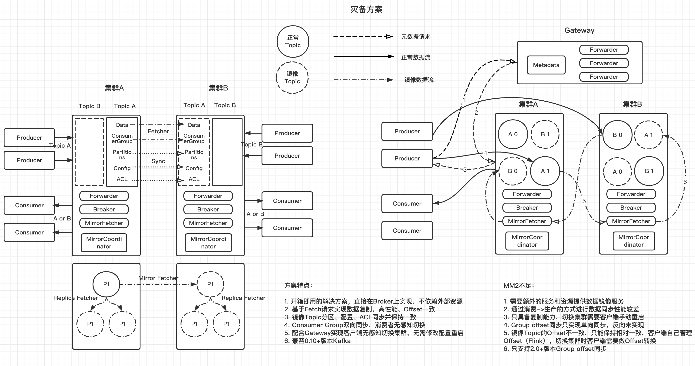
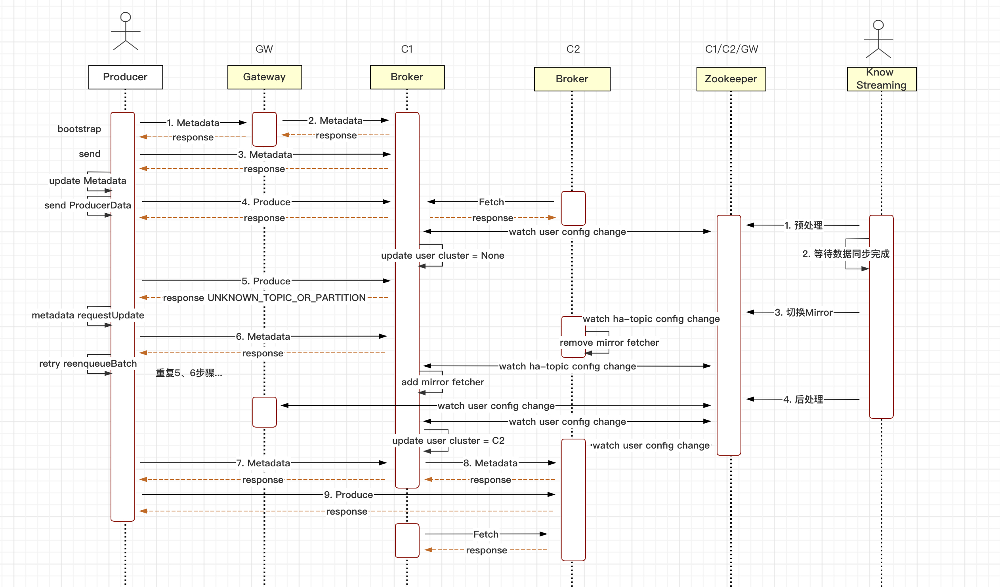
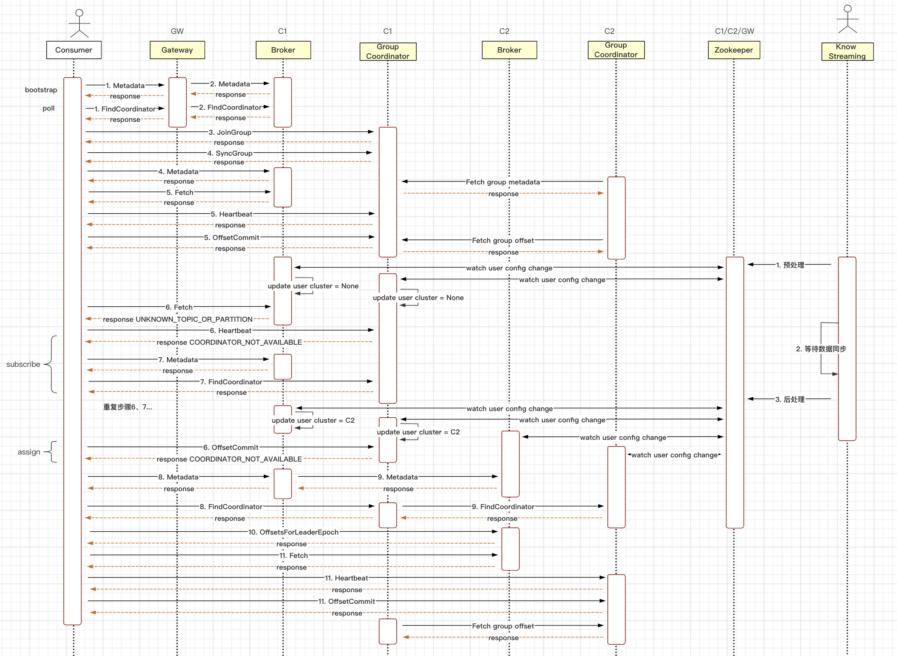
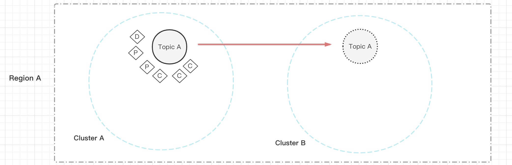
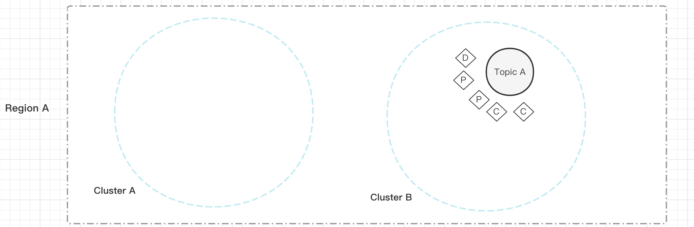
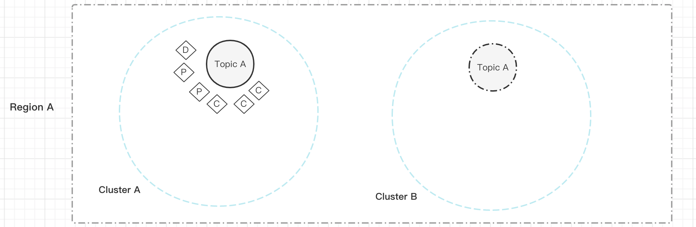
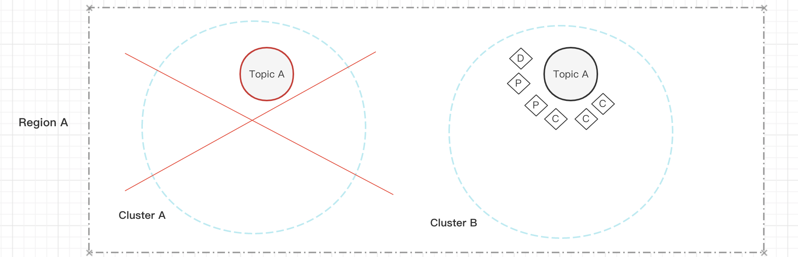
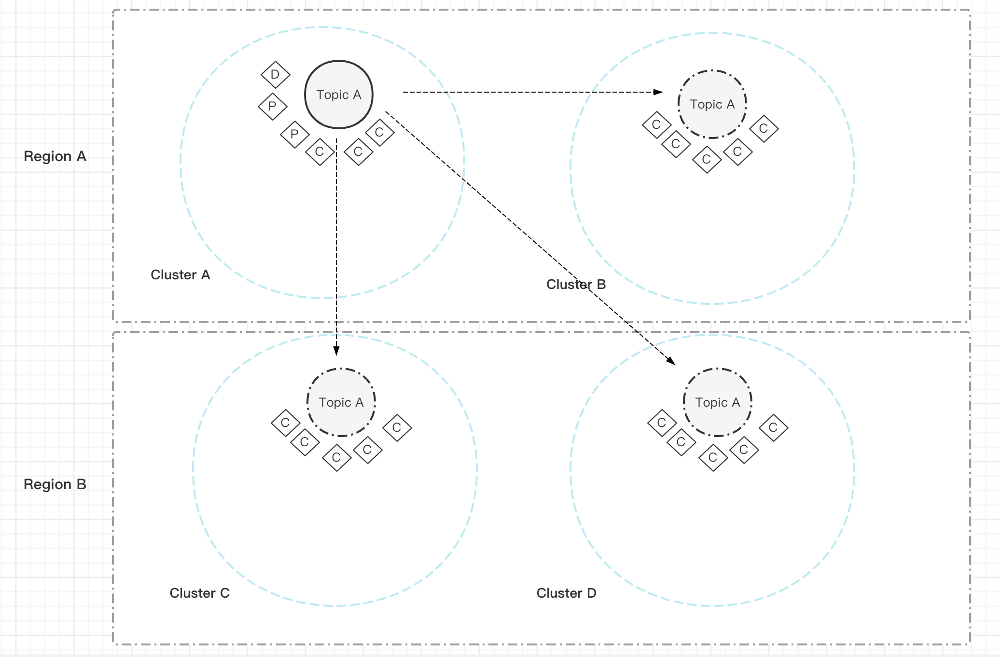

# Kafka引擎-DiDi Kafka HA方案

## 背景

- 多区域集群部署（跨Region），提供数据灾备能力，解决跨机房带宽、延迟问题，优先本地读写

- 同区域多集群部署（跨AZ），提供集群切换能力，切换对用户无感知，无需修改本地配置或者重启应用

- 消费者Offset同步，尽量减少集群切换时导致的数据重复消费

## 开源方案

​	MirrorMaker主要基于消费者→ 生产者模型实现，先由消费者将数据拉取下来拆包然后再由生产者封包发送到备份Topic，需要额外资源部署MM服务，在Kafka 2.4版本增加了MM2的实现，2.7版本增加Group offset同步，MM2和MM对比最大的改变是MM基于Topic维度进行同步，MM2基于分区维度进行同步，这样就可以实现保证消息Offset相对一致

## 滴滴方案

### 设计方案

​	整个方案同时具备**数据复制的能力**和**灾备切换的能力**

​	通过使用基于副本复制数据的Fetcher实现跨集群数据复制能力，能保证主备Topic数据和Offset完全一致，并且不依赖外部资源，数据复制链路简单高效。同时能够实现跨Kafka版本实现数据复制。

​	通过在服务端控制客户端元数据的方式实现灾备切换能力，配合Gateway使用在客户端不需要修改任何配置的情况下实现跨集群灾备切换，并保证在源集群未宕机的情况下客户端生产、消费数据不重不丢。

#### 数据复制能力

1.  Topic分为正常Topic和镜像Topic两种，镜像Topic和正常Topic保持完全一致，包括Topic名称、分区数、消息Offset、Leader epoch、配置
2.  镜像Topic只能由MirrorFetcher进行数据写入，外部生产者无法对镜像Topic写入数据
3.  镜像Topic的Follower和正常Topic的Follower功能完全一致
4.  镜像Topic的Leader既有正常Topic的Leader部分特性也有正常Topic的Follower的部分特性，镜像Topic的Leader相对于主Topic的Leader来说它是一个Follower，而相对于镜像Topic的Follower来说它又是一个Leader
5.  镜像Topic可以提供数据读取服务，可以降低主Topic流出带宽压力
6.  组件MirrorFetcher负责同步Topic数据，包括普通Topic和内部Topic \_\_consumer_offsets，\_\_consumer_offsets用于同步消费组的offset和metadata信息
7.  组件MirrorCoordinator负责管理MirrorFetcher线程，源集群Leader切换启动新任务、停止任务
8.  组件MirrorCoordinator负责同步Topic config、ACL、分区数量，主Topic分区扩容之后，备Topic分区会自动扩容，备Topic分区数\>=主Topic分区数

#### 灾备切换能力

1.  组件Forwarder负责将客户端请求转发，发生切时请求会转发到备集群中去

2.  组件Breaker负责阻断客户端请求，致使客户端进行元数据变更达到切换目的

**转发的请求：** Gateway、Broker会根据客户端标识转发以下请求

- API_VERSIONS

- METADATA

- FIND_COORDINATOR

- INIT_PRODUCER_ID

**阻断的请求：** Broker会根据客户端标识阻断以下请求

- PRODUCE

- FETCH

- OFFSET_COMMIT

- OFFSET_FETCH

- JOIN_GROUP

- HEARTBEAT

- OFFSET_FOR_LEADER_EPOCH

**生产者灾备流程图**

**消费者灾备流程图**

### 使用规范

1. 目前版本只能实现两个集群间互备，不能加入第三个集群

2. Topic高可用不适合用在事务、幂等场景

3. 保证AppID只在同一个集群中使用，如果AppID出现在多个集群中，只有最后一个集群中的Topic是可用的

4. 尽量保证AppID的权限范围最小，每个生产者或消费者实例组使用一个AppID最佳

5. 集群超级管理账号不能被用作高可用AppID

用户平台接入集群的超级管理员账号不能被配置为HA AppID，否则引发集群元数据无法访问问题

6. 主备集群中Topic \_\_consumer_offsets的分区数要相同

目前版本Group offset和Group metadata是通过MirrorFetcher实现同步，所以要保证两个集群的分区数相同

7. （建议） 生产者retries设置，防止切换过程中丢数

Kafka2.0版本以下需要手动设置，Kafka2.1+ retries默认值从0改为2147483647

8. （建议）消费者客户端避免使用版本2.5.0, 2.5.1, 2.6.0, 2.6.1, 2.7.0，建议使用2.6.2, 2.7.1, 2.8.0以上版本

以上客户端存在查找协调器BUG，导致客户端不再消费数据 [*KAFKA-10793*](https://issues.apache.org/jira/browse/KAFKA-10793)

9. （建议）建议在有条件的情况下保证各个集群的BrokerID唯一，尽量降低BrokerID重复

BrokerID唯一可以更优雅的进行集群灾备切换，不唯一也可以实现，不做强制限制

### 适用场景

#### Topic跨集群迁移

​	Topic保障等级变化、集群容量限制等因素导致Topic需要从一个集群迁移到另外一个集群上，DiDi Kafka HA方案可以在不需要用户配合的情况下随意在集群间迁移Topic

​	迁移中

​	迁移后

#### 集群迁移机房或者集群升级

​	由于业务调整或者机房调整需要将集群迁移到另外一个机房，目前一般会采用扩容节点再缩容的方式实现，往往我们在迁移集群的过程中会伴随着集群版本升级或者一些系统参数调整给迁移带来很大的风险。DiDi Kafka HA方案可以在两个独立的集群上实现Topic迁移不需要用户配合，同时可以跨版本迁移。迁移流程同上

​	集群升级，跨大版本集群升级风险比较大，升级节点对整个集群的稳定性都可能产生影响，一些系统配置调整也很难在集群滚动升级中实现，比如ControlPlane与DataPlane的拆分。DiDi Kafka HA方案可以实现部分Topic增量迁移降低整个升级过程中的风险。

####  跨集群Topic灾备

​	对于保障等级比较高的业务提供Topic跨集群容灾功能，当集群不稳定或者不可用时可以快速切换到备集群进行正常读写操作

​	正常运行

​	集群不可用时切换到备集群

####  Topic读写分离、就近读、负载均衡

​	对于一些热点Topic下游有过多消费者，一般流出带宽压力比较大，可以复制出多个副本Topic来降低这种压力。

复制出一个读Topic，降低主Topic读取压力

也可以通过跨区域复制Topic，降低专线带宽压力

