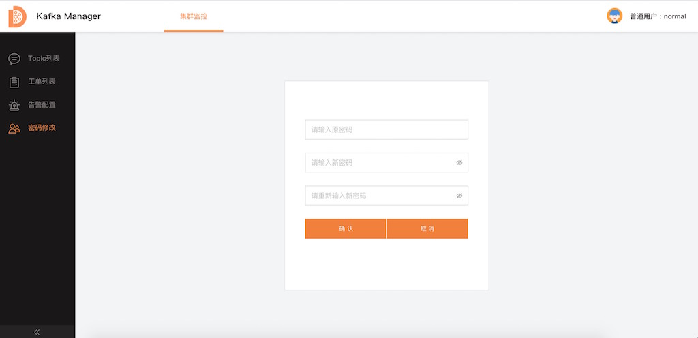
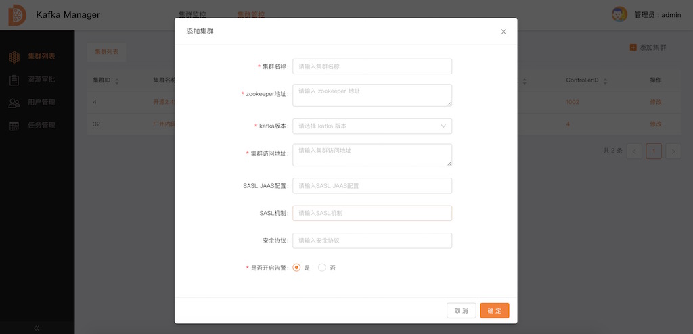
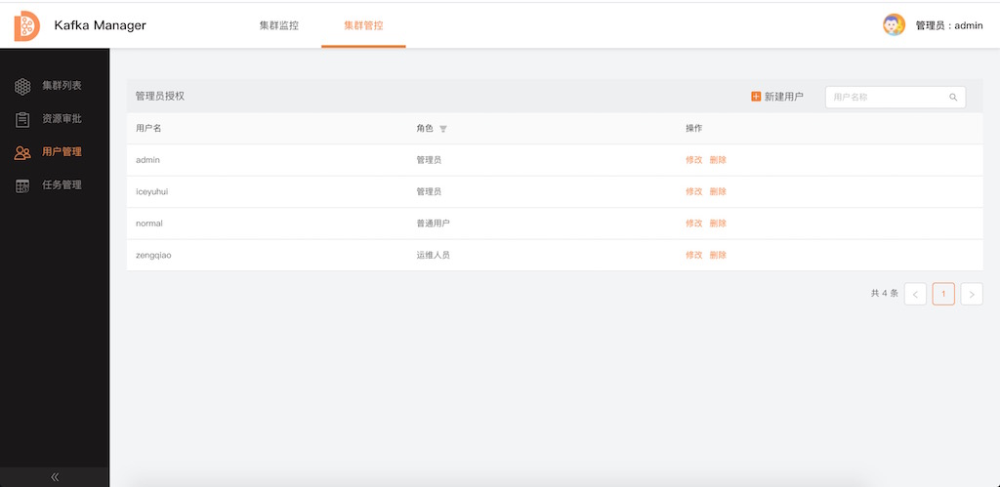

---

**一站式`Apache Kafka`集群指标监控与运维管控平台**

--- 

# kafka-manager 使用手册

管控平台主要有两种用户视角，分别为：

- 普通用户：站在使用Kafka的角度使用kafka-manager；
- 管理员：站在使用与管理Kafka的角度在使用kafka-manager；

下面我们将从这两个用户的维度说明平台的功能及使用。

---

## 1. 普通用户篇

### 1.1 帐号获取及登录

- 询问管理员让其提供普通用户的帐号；
- 输入帐号及密码，登录kafka-manager；

---

### 1.2 Topic申请
- 步骤一：点击"Topic申请"按钮申请Topic；
- 步骤二：填写申请信息；
- 步骤三：等待运维人员或管理员审批；

**Topic申请完成：**

--- 

### 1.3 Topic信息查看

普通用户可查看的信息包括：

- 集群Topic列表及我收藏的Topic列表；
- Topic基本信息(Topic创建及修改时间、Topic数据保存时间、Topic负责人等)；
- Topic分区信息；
- Topic消费组信息及消费组消费详情；
- Topic实时&历史流量信息；
- Topic数据采样；

**Topic详情信息界面：**

---

### 1.4 Topic运维

普通用户可进行的Topic运维的操作包括：
- 申请Topic扩容
- 重置消费偏移；

**Topic重置消费偏移界面：**

---

### 1.5 告警配置

kafka-manager告警配置中，仅支持Lag／BytesIn/BytesOut这三类告警，同时告警被触发后，告警消息会被发往指定的Topic(具体哪一个请联系管理员获取)。需要用户主动消费该告警Topic的数据或者统一由管理员将该数据接入外部通知系统，比如接入短信通知或电话通知等。

**告警规则配置界面：**

---

### 1.6 密码修改

**密码修改界面：**

---

## 2. 管理员篇

### 2.1 帐号获取及登录

- 默认的管理员帐号密码为`admin/admin`(详见数据库account表)；

---

### 2.2 添加集群

登录之后，就需要将我们搭建的Kafka集群添加到kafka-manager中。

**添加Kafka集群界面：**

--- 

### 2.3 监控指标

#### 2.3.1 集群维度指标

- 集群的基本信息；
- 集群历史及实时流量信息；
- 集群Topic信息；
- 集群Broker信息；
- 集群ConsumerGroup信息；
- 集群Region信息；
- 集群当前Controller及变更历史；

**集群维度监控指标界面：**

---

#### 2.3.2 Broker维度指标

- Broker基本信息；
- Broker历史与实时流量信息；
- Broker内Topic信息；
- Broker内分区信息；
- Broker关键指标(日志刷盘时间等)；
- Topic分析(Topic流量占比等)；

**`Broker`维度监控指标界面：**

---

#### 2.3.3 Topic维度指标

- 在普通用户的基础上，增加展示Topic的Broker信息；

图略

---

#### 2.3.4 其他维度指标

- 消费组消费哪些具体的Topic；

图略

---

### 2.4 集群运维管控

- Topic申请及扩容工单审批；
- Topic创建、删除、扩容及属性修改；
- Broker维度优先副本选举；
- 分区粒度迁移；
- 逻辑Region管理；

**资源审批界面：**

---

### 2.5 用户管理

- 对用户进行增删改查；

**用户管理界面：**

