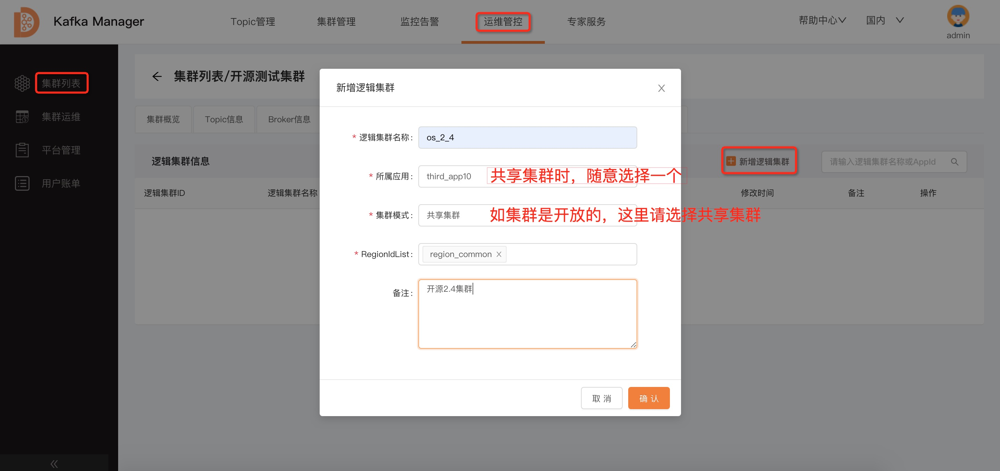

---

**一站式`Apache Kafka`集群指标监控与运维管控平台**

--- 

# 集群接入

集群的接入总共需要三个步骤，分别是：
1. 接入物理集群
2. 创建Region
3. 创建逻辑集群

备注：接入集群需要2、3两步是因为普通用户的视角下，看到的都是逻辑集群，如果没有2、3两步，那么普通用户看不到任何信息。

## 1、接入物理集群

如上图所示，填写集群信息，然后点击确定，即可完成集群的接入。因为考虑到分布式部署，添加集群之后，需要稍等**`1分钟`**才可以在界面上看到集群的详细信息。

## 2、创建Region

如上图所示，填写Region信息，然后点击确定，即可完成Region的创建。

备注：Region即为Broker的集合，可以按照业务需要，将Broker归类，从而创建相应的Region。

## 3、创建逻辑集群

如上图所示，填写逻辑集群信息，然后点击确定，即可完成逻辑集群的创建。