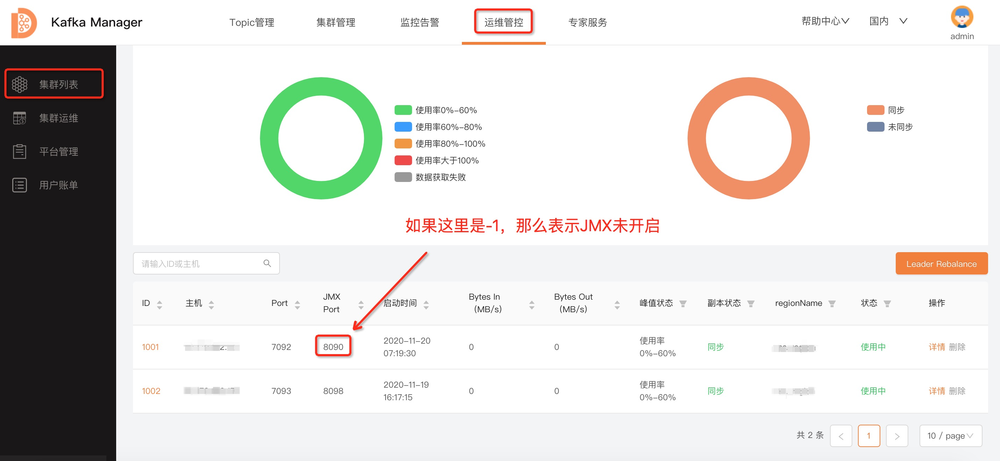

---

**一站式`Apache Kafka`集群指标监控与运维管控平台**

--- 

# FAQ

- 0、支持哪些Kafka版本？
- 1、Topic申请、新建监控告警等操作时没有可选择的集群？
- 2、逻辑集群 & Region的用途？
- 3、登录失败？
- 4、页面流量信息等无数据？
- 5、如何对接夜莺的监控告警功能？
- 6、如何使用`MySQL 8`？
- 7、`Jmx`连接失败如何解决？
- 8、`topic biz data not exist`错误及处理方式
- 9、进程启动后，如何查看API文档
- 10、如何创建告警组？
- 11、连接信息、耗时信息、磁盘信息为什么没有数据？
- 12、逻辑集群申请审批通过之后为什么看不到逻辑集群？
- 13、heartbeat表关联业务和使用场景是什么？
- 14、集群的删除，是否会真正的删除集群？
- 15、APP(应用)如何被使用起来？

---

### 0、支持哪些Kafka版本？

基本上只要所使用的Kafka还依赖于Zookeeper，那么该版本的主要功能基本上应该就是支持的。

---

### 1、Topic申请、新建监控告警等操作时没有可选择的集群？

缺少逻辑集群导致的，在Topic管理、监控告警、集群管理这三个Tab下面都是普通用户视角，普通用户看到的集群都是逻辑集群，因此在这三个Tab下进行操作时，都需要有逻辑集群。

逻辑集群的创建参看：

- [kafka-manager 接入集群](add_cluster/add_cluster.md) 手册，这里的Region和逻辑集群都必须添加。

---

### 2、逻辑集群 & Region的用途？

主要用途是进行大集群的管理 & 集群细节的屏蔽。

- 逻辑集群：通过逻辑集群概念，将集群Broker按业务进行归类，方便管理；
- Region：通过引入Region，同时Topic按Region纬度创建，减少Broker间的连接；

---

### 3、登录失败？

- 检查使用的MySQL版本，8.0等版本暂不支持，具体版本辛苦查看 README 。

---

### 4、页面流量信息等无数据？

- 1、检查`Broker JMX`是否正确开启。

如若还未开启，具体可百度一下看如何开启，或者参看：[Jmx连接配置&问题解决说明文档](../dev_guide/connect_jmx_failed.md)

- 2、`MySQL`的版本是否过高。

建议使用`MySQL 5.7`版本。

- 3、数据库时区问题。

检查MySQL的cluster表的gmt_modify字段，做一个update动作，看这个gmt_modify时间是否是当前时间，如果不是，那么就是时区问题了。时区不对问题具体可以搜索一下看如何解决。

---

### 5、如何对接夜莺的监控告警功能？

- 参看 [kafka-manager 对接夜莺监控](../dev_guide/monitor_system_integrate_with_n9e.md) 说明。

---

### 6、如何使用`MySQL 8`？

- 参看 [kafka-manager 使用`MySQL 8`](../dev_guide/use_mysql_8.md) 说明。

---

### 7、`Jmx`连接失败如何解决？

- 参看 [Jmx连接配置&问题解决](../dev_guide/connect_jmx_failed.md) 说明。

---

### 8、`topic biz data not exist`错误及处理方式

**错误原因**

在进行权限审批的时候，可能会出现这个错误，出现这个错误的原因是因为Topic相关的业务信息没有在DB中存储，或者更具体的说就是该Topic不属于任何应用导致的，只需要将这些无主的Topic挂在某个应用下面即可。

**解决方式**

可以在`运维管控->集群列表->Topic信息`下面，编辑申请权限的Topic，为Topic选择一个应用即可。

以上仅仅只是针对单个Topic的场景，如果你有非常多的Topic需要进行初始化的，那么此时可以在配置管理中增加一个配置，来定时的对无主的Topic进行同步，具体见：[动态配置管理 - 1、Topic定时同步任务](../dev_guide/dynamic_config_manager.md)

---

### 9、进程启动后，如何查看API文档

- 滴滴Logi-KafkaManager采用Swagger-API工具记录API文档。Swagger-API地址： [http://IP:PORT/swagger-ui.html#/](http://IP:PORT/swagger-ui.html#/)

### 10、如何创建告警组？

告警组的创建需要到Logi-KM对接的监控系统中创建，比如我们现在默认是对接了夜莺，那么告警组需要到夜莺中创建，如果没有安装夜莺，那么需要安装一下夜莺并进行对接。当然，这里也可以对接自己内部的监控系统，不过需要实现一些接口。

具体的文档可见：[监控功能对接夜莺](../dev_guide/monitor_system_integrate_with_n9e.md)、[监控功能对接其他系统](../dev_guide/monitor_system_integrate_with_self.md)

那么在夜莺中，如何创建告警组呢？
需要前往夜莺平台-用户资源中心-团队管理中新建团队。新建过团队之后再次回到Logi-KM中刷新页面就可以在该下拉框中选择告警接收组了。

### 11、连接信息、耗时信息、磁盘信息为什么没有数据？

这块需要结合滴滴内部的kafka-gateway一同使用才会有数据，滴滴kafka-gateway暂未开源。

### 12、逻辑集群申请审批通过之后为什么看不到逻辑集群？

逻辑集群的申请与审批仅仅只是一个工单流程，并不会去实际创建逻辑集群，逻辑集群的创建还需要手动去创建。

具体的操作可见：[kafka-manager 接入集群](add_cluster/add_cluster.md)。

### 13、heartbeat表关联业务和使用场景是什么？

做任务抢占用的。

KM支持HA的方式部署，那么部署多台的时候，就会出现每一台都可能去做指标收集的事情，这块就使用heartbeat表做KM的存活性判断，然后进行任务的抢占或者是均衡。

更多详细的内容，可以看一下源码中，heartbeat表在哪里被使用了。

### 14、集群的删除，是否会真正的删除集群？

Logi-KM的运维管控，集群列表中的集群删除，仅仅只是将该集群从Logi-KM中进行删除，并不会对真正的物理集群做什么操作。

### 15、APP(应用)如何被使用起来？

app在Logi-KM中可以近似理解为租户，或者是kafka里面的一个账号的概念。

界面中显示的app信息、权限信息等，在平台层面仅仅只是控制Topic或集群在平台上的可见性，如果使用的是社区版本的Kafka，那么实际上是不能真正的管控到客户端对Topic的生产和消费。

但是如果是使用的滴滴的Kafka-Gateway，那么是可以做到对客户端的生产和消费的权限管控。滴滴的Kafka-Gateway暂未开源，属于企业服务，具体的可以入群交流，群地址在README中。
