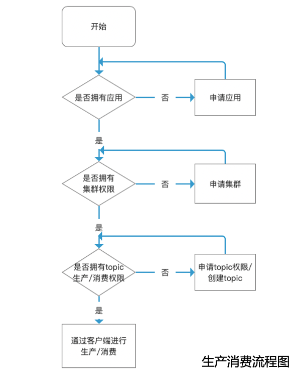

---

**一站式`Apache Kafka`集群指标监控与运维管控平台**

--- 

# 资源申请文档

## 主要名词解释

- 应用（App）：作为Kafka中的账户，使用AppID+password作为身份标识
- 集群：可使用平台提供的共享集群，也可为某一应用申请单独的集群
- Topic：可申请创建Topic或申请其他Topic的生产/消费权限。进行生产/消费时通过Topic+AppID进行身份鉴权  

## 应用申请
应用（App）作为Kafka中的账户，使用AppID+password作为身份标识。对Topic进行生产/消费时通过Topic+AppID进行身份鉴权。

用户申请应用，经由运维人员审批，审批通过后获得AppID和密钥

## 集群申请
可使用平台提供的共享集群，若对隔离性、稳定性、生产消费速率有更高的需求，可对某一应用申请单独的集群

## Topic申请
- 用户可根据已申请的应用创建Topic。创建后，应用负责人默认拥有该Topic的生产/消费权限和管理权限
- 也可申请其他Topic的生产、消费权限。经由Topic所属应用的负责人审批后，即可拥有相应权限。

