<link rel="stylesheet" type="text/css" href="auto-number-title.css" />

 **Kafka Manager 云平台用户使用手册** 

# 文档概述 #

本文档提供了滴滴出行-Kafka Manager云平台产品的入门操作指导和详细配置指导，希望通过本说明书为平台的使用者提供支持。

默认登陆密码: `admin/admin`

**文档版本**

01（2020-10-16）

第一次正式发布。

 **目录** 
<!-- TOC -->

- [文档概述](#文档概述)
- [功能介绍](#功能介绍)
    - [数据中心切换](#数据中心切换)
    - [访问帮助中心](#访问帮助中心)
    - [个人中心](#个人中心)
        - [工单查看-我的申请](#工单查看-我的申请)
        - [工单查看-我的审批](#工单查看-我的审批)
        - [账单管理](#账单管理)
        - [退出系统](#退出系统)
    - [Topic管理](#topic管理)
        - [我的Topic](#我的topic)
            - [查看活跃Topic列表](#查看活跃topic列表)
            - [申请新增Topic](#申请新增topic)
            - [申请Topic配额](#申请topic配额)
            - [申请Topic分区](#申请topic分区)
            - [申请Topic下线](#申请topic下线)
            - [编辑Topic](#编辑topic)
            - [查看Topic基本信息](#查看topic基本信息)
            - [采样](#采样)
            - [查看Topic状态图](#查看topic状态图)
            - [查看Topic与客户端的关联信息](#查看topic与客户端的关联信息)
            - [查看Topic消费组信息](#查看topic消费组信息)
            - [重置Topic的消费offset（偏移）](#重置topic的消费offset偏移)
            - [查看Topic分区信息](#查看topic分区信息)
            - [查看Topic的Broker信息](#查看topic的broker信息)
            - [查看Topic关联的应用信息](#查看topic关联的应用信息)
            - [查看Topic的账单信息](#查看topic的账单信息)
        - [查看broker的详细信息](#查看broker的详细信息)
            - [查看broker的基础及监控信息](#查看broker的基础及监控信息)
            - [查看broker的关联topic信息](#查看broker的关联topic信息)
            - [查看broker的磁盘信息](#查看broker的磁盘信息)
            - [查看broker的partition信息](#查看broker的partition信息)
            - [查看broker的Topic分析情况](#查看broker的topic分析情况)
            - [已过期Topic](#已过期topic)
        - [全部Topic](#全部topic)
            - [查看全部Topic列表](#查看全部topic列表)
            - [申请Topic权限](#申请topic权限)
            - [申请扩Topic的配额](#申请扩topic的配额)
        - [应用管理](#应用管理)
            - [申请应用](#申请应用)
            - [修改应用](#修改应用)
            - [申请下线应用](#申请下线应用)
            - [查看应用详情](#查看应用详情)
            - [取消应用对topic的权限](#取消应用对topic的权限)
    - [集群管理](#集群管理)
        - [我的集群](#我的集群)
            - [查看我的集群列表](#查看我的集群列表)
            - [申请集群](#申请集群)
            - [申请集群下线](#申请集群下线)
            - [集群扩缩容](#集群扩缩容)
            - [查看集群详情](#查看集群详情)
            - [查看集群topic列表](#查看集群topic列表)
            - [查看集群Broker列表](#查看集群broker列表)
            - [查看集群topic的限流情况](#查看集群topic的限流情况)
    - [监控告警](#监控告警)
        - [告警列表](#告警列表)
        - [新建告警规则](#新建告警规则)
        - [查看该条规则的历史告警](#查看该条规则的历史告警)
        - [告警规则屏蔽](#告警规则屏蔽)
    - [运维管控](#运维管控)
        - [集群列表](#集群列表)
            - [新增集群](#新增集群)
            - [修改集群](#修改集群)
            - [暂停/开始集群监控](#暂停开始集群监控)
            - [删除集群](#删除集群)
            - [查看集群详情](#查看集群详情-1)
                - [查看集群详情-集群概览](#查看集群详情-集群概览)
                - [查看集群详情-Topic信息](#查看集群详情-topic信息)
                - [查看集群详情-Broker信息](#查看集群详情-broker信息)
                - [查看集群详情-Broker信息-Leader Rebalance](#查看集群详情-broker信息-leader-rebalance)
                - [查看集群详情-Broker信息-Broker详情](#查看集群详情-broker信息-broker详情)
                - [查看集群详情-消费组信息](#查看集群详情-消费组信息)
                - [查看集群详情-Region信息](#查看集群详情-region信息)
                - [查看集群详情-新增Region](#查看集群详情-新增region)
                - [查看集群详情-编辑Region](#查看集群详情-编辑region)
                - [查看集群详情-删除Region](#查看集群详情-删除region)
        - [集群运维](#集群运维)
            - [迁移任务](#迁移任务)
            - [新建迁移任务](#新建迁移任务)
            - [迁移任务详情](#迁移任务详情)
            - [集群任务](#集群任务)
            - [新建集群任务](#新建集群任务)
            - [集群任务详情](#集群任务详情)
            - [版本管理](#版本管理)
            - [上传配置](#上传配置)
        - [平台管理](#平台管理)
            - [应用管理-查看应用列表](#应用管理-查看应用列表)
            - [查看应用详情](#查看应用详情-1)
            - [用户管理-用户列表](#用户管理-用户列表)
            - [用户管理-编辑用户](#用户管理-编辑用户)
            - [用户管理-添加用户](#用户管理-添加用户)
            - [配置管理-配置列表](#配置管理-配置列表)
            - [配置管理-编辑配置](#配置管理-编辑配置)
            - [配置管理-删除配置](#配置管理-删除配置)
        - [用户账单](#用户账单)
            - [个人账单](#个人账单)
    - [专家服务](#专家服务)
        - [Topic分区热点](#topic分区热点)
        - [数据迁移操作](#数据迁移操作)
            - [迁移任务](#迁移任务-1)
            - [Topic分区不足](#topic分区不足)
            - [Topic资源治理](#topic资源治理)
            - [Topic异常诊断](#topic异常诊断)

<!-- /TOC -->
# 功能介绍 #
## 数据中心切换 ##
用户可点击右上方数据中心切换入口，下拉选择需要访问的数据中心，点击完成切换。

目前可选择的有：国内

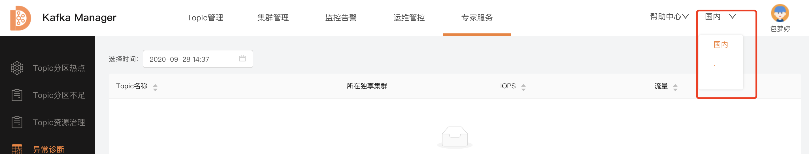

## 访问帮助中心 ##
用户可点击右上方帮助中心，在下拉框中，选择访问：产品介绍、QuickStart、常见问题、联系我们。

* 产品介绍：对平台各模块的功能做解释，并介绍相应操作。

* QuickStart：选择了部分重要的操作，以实例为例，介绍操作。如：发送、消费数据；申请App；创建Topic；申请集群权限。

* 常见问题：记录了对Kafka平台用户的答疑，可以在这里找到一些常见问题的解决方案。

* 联系我们：快捷进入Kafka用户群，可以找到Kafka平台的联系人。

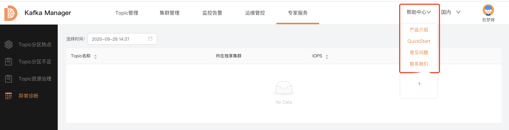
## 个人中心 ##
鼠标悬停导航栏右上方的头像，即可访问用户个人中心。

可以实现查看我的申请、我的审批、账单管理和退出系统的操作。

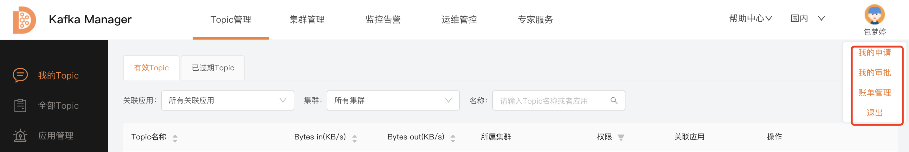
### 工单查看-我的申请 ###
可以查看到由当前用户申请的工单，可执行撤回、查看详情等操作。

**操作步骤**

步骤1：鼠标悬停导航栏右侧用户头像>“我的申请”。

步骤2：可以查看到，由当前用户发起申请的工单。工单的状态共有四种：待审批、已通过、已拒绝、已取消。

步骤3：点击对应的tab页，可快速查看：审批中、已通过、全部状态的工单。

步骤4：列表展示工单类型、工单ID、工单标题、申请原因、任务状态、操作。点击详情可以查看到工单详情，如由谁审批，当前进度等。

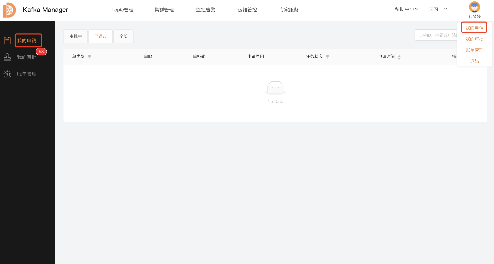

### 工单查看-我的审批 ###

可以查看到需要由当前用户审批的工单，并处理。

**操作步骤**

步骤1：鼠标悬停导航栏右侧用户头像>“我的审批”。

步骤2：可以查看到，需要由当前用户审批的工单。

步骤3：点击对应的tab页，可快速查看：审批中、已通过、全部状态的工单。

步骤4：列表展示工单类型、工单ID、工单标题、申请原因、任务状态、操作。

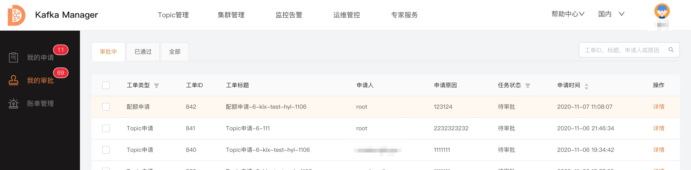

步骤5：点击详情，可以查看工单详情并进行操作。

审批操作有通过、驳回。

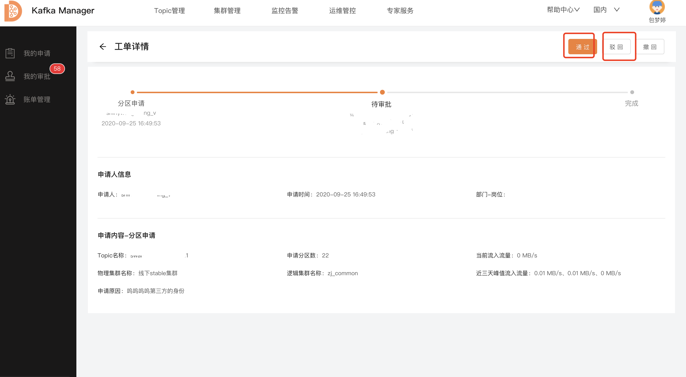

### 账单管理 ###

同时，“运维管控”模块也具备账单统筹查看的能力。可访问“运维管控”>"用户账单"。

**操作步骤**

步骤1：鼠标悬停导航栏右侧用户头像>“账单管理”。

步骤2：可以看到以列表和图表的形式展示的账单数据。

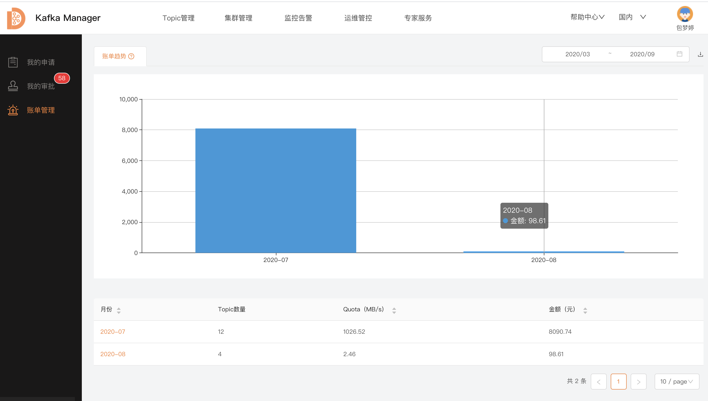

### 退出系统 ###

步骤1：鼠标悬停导航栏右侧用户头像>点击“退出”。

## Topic管理 ##

Topic管理面向普通用户，可提供Topic相关的各操作。

### 我的Topic ###
用户可以在“我的Topic”模块查看到其有权限的Topic列表。权限分为可管理、可发送、可消费。并且对于自己有权限的Topic，可以执行配额、分区申请；采样；重置消费offset等等操作（具体可见以下内容）
#### 查看活跃Topic列表 ####  

**操作步骤**

步骤1：点击“Topic管理”>“我的Topic”>"活跃Topic"。

步骤2：点击【关联应用】、【集群】下拉框，可以筛选想要查看目标应用或集群相关的Topic；在【名称】输入框中输入关键字，可以搜索目标Topic。

步骤3：列表展示“Topic名称”、“Bytes in”、“Bytes out”、"所属集群"、“权限”、“关联应用”、“操作”等参数。

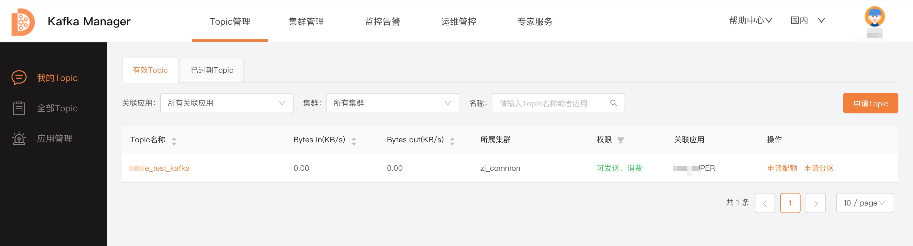

步骤4：部分属性支持表头排序和筛选。例如“权限”，点击筛选按钮，可以快速选择对应的权限。

#### 申请新增Topic ####

**操作步骤**

步骤1：点击“申请Topic”，进入申请Topic弹框。

步骤2：正确填写申请参数，提交申请工单。

Topic名称：允许数字、字母、下划线。

所属应用：选择该Topic属于哪个应用。

峰值流量：设置该Topic的流量上限值；运维人员也会根据该值分配Topic配额。
点击“Kafka计价方式”，可跳转查看费用说明。

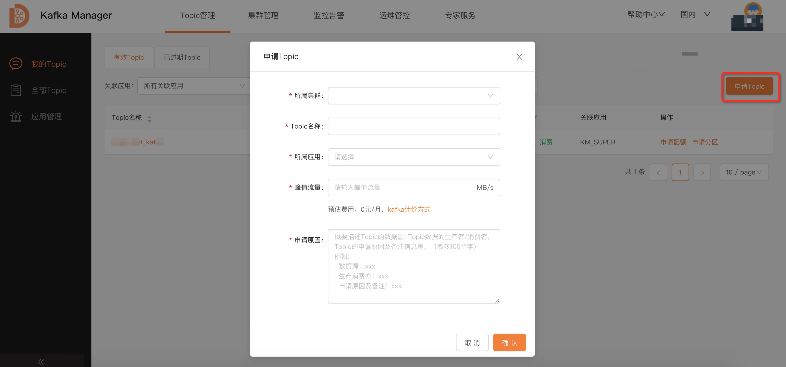

#### 申请Topic配额 ####

**操作步骤**

步骤1：找到对应Topic,点击“申请配额”，弹出申请配额弹框。

步骤2：正确填写申请参数，点击确认，提交申请工单。

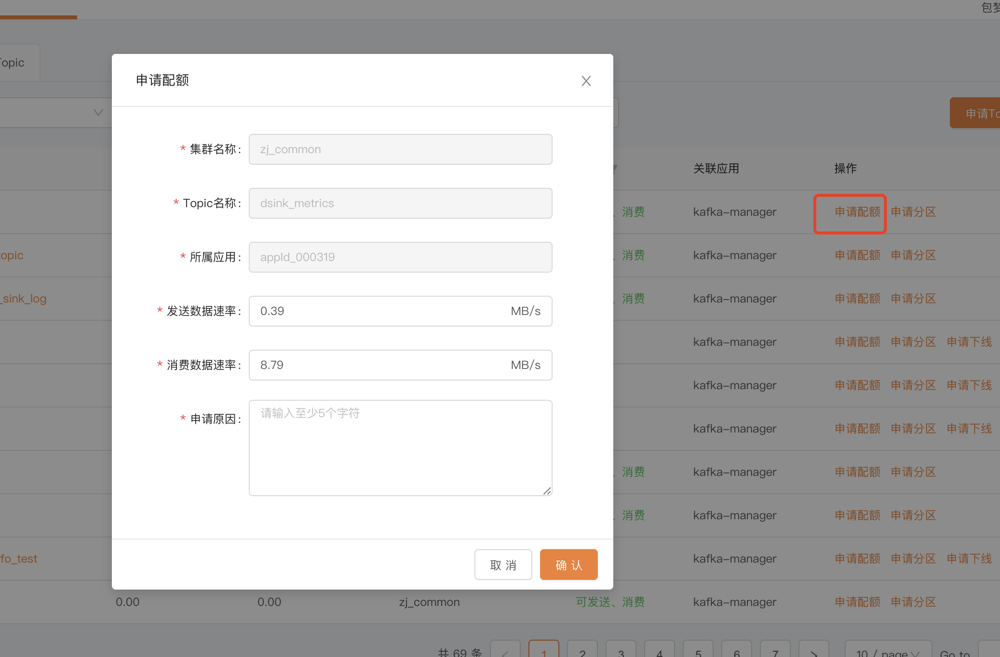

#### 申请Topic分区 ####

**操作步骤**

步骤1：找到对应Topic,点击“申请分区”，弹出申请分区弹框。

分区数：填写需要的分区数。请根据实际情况填写。

备注：填写申请理由。

注意：如果topic已被限流，则直接申请配额即可，无须申请分区。

步骤2：正确填写申请参数，点击确认，提交申请工单。

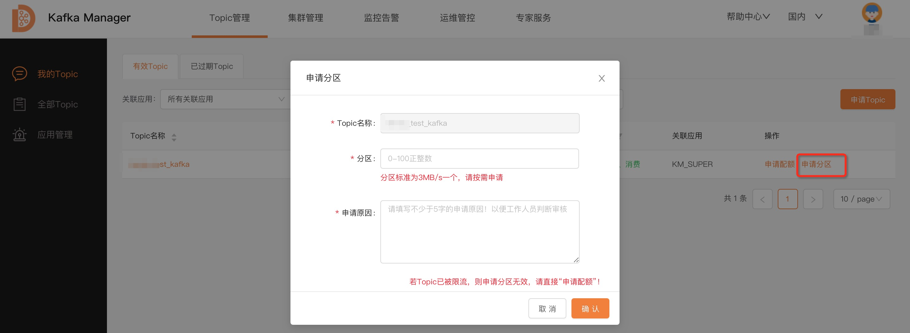

#### 申请Topic下线 ####

对于有管理权限的Topic，可以申请下线该Topic.

**操作步骤**

步骤1：找到对应Topic,点击“申请下线”，弹出申请分区弹框。

步骤2：如果连接信息不为空，则表示该Topic当前有客户端在使用；如果下线该Topic可能会影响相关业务。

必须先至客户端侧关闭，再下线Topic。

步骤3：正确填写申请参数，点击确认，提交下线申请工单。

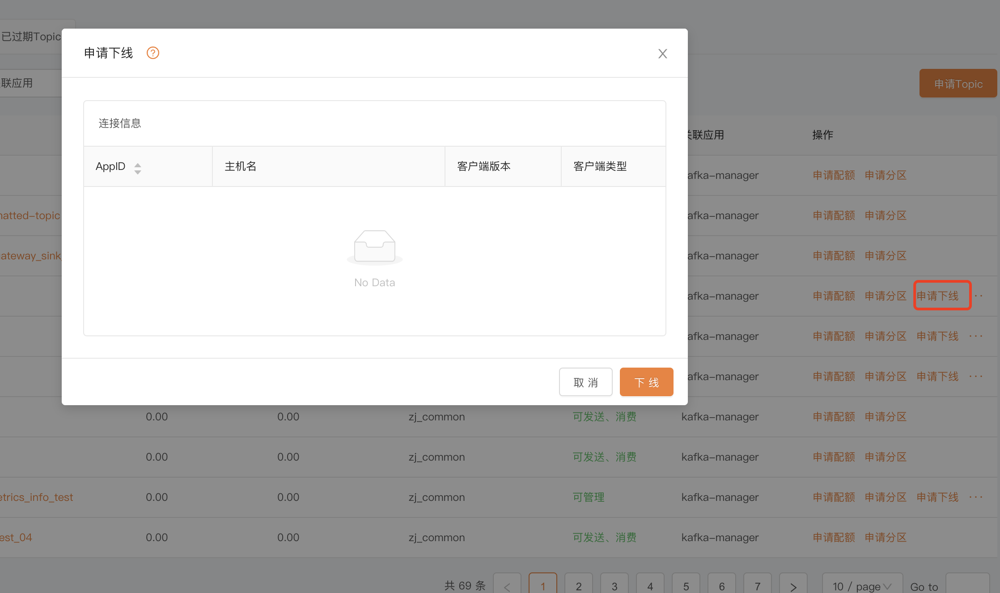

#### 编辑Topic ####

对于有管理权限的Topic，可以编辑该Topic.

**操作步骤**

步骤1：找到对应Topic,点击操作栏中“更多”>“编辑”，弹出编辑弹框。

步骤2：可以编辑备注内容，点击确认，完成编辑。

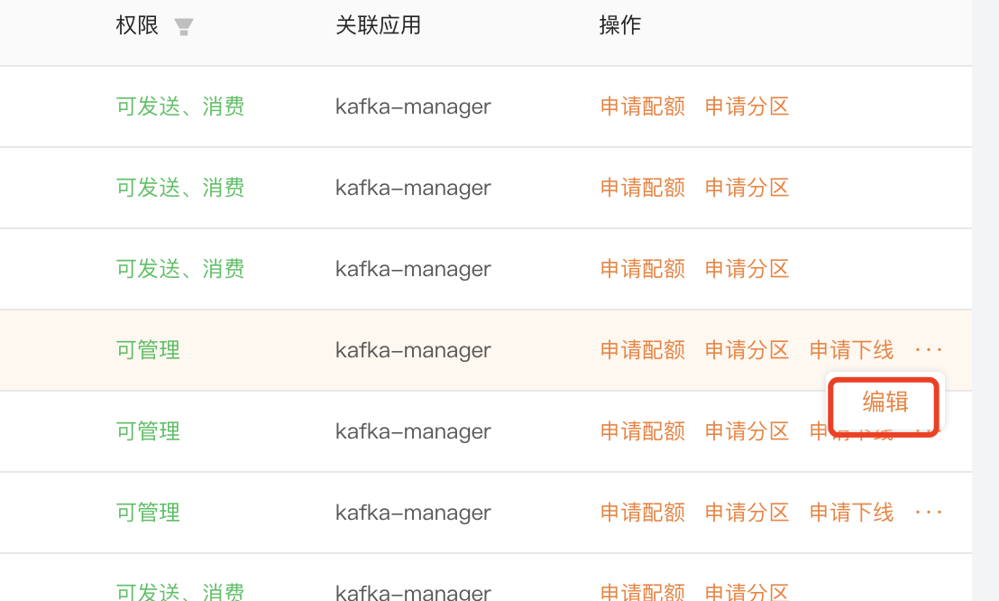

#### 查看Topic基本信息 ####

**操作步骤**

步骤1：点击Topic名称即跳转进入详情页，可查看该topic的详情。

步骤2：点击“基本信息”可查看当前Topic的基本信息。见下图。

**专业名词介绍**：

* 健康分：越高表明越健康，用户可以通过该指标评估该Topic所关联的broker的运行状况，是否有异常等。

* （物理）集群ID：Topic所关联等物理集群ID；当客户端使用该平台Topic时，可能需要知道集群ID。

* 服务地址（Bootstrap Severs）：Topic所关联等物理集群的服务地址。

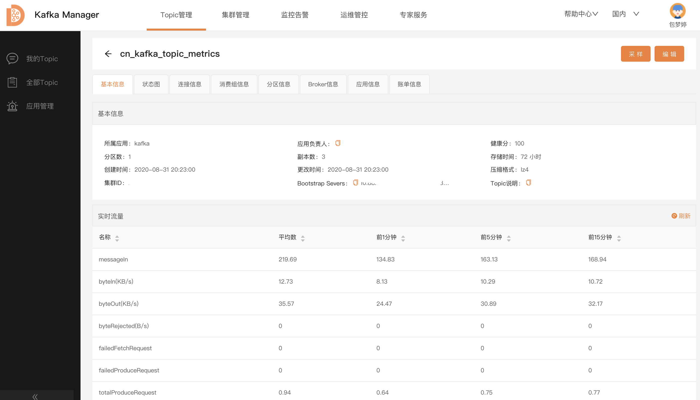

#### 采样 ####

**操作步骤**

步骤1：点击Topic名称即跳转进入详情页，可查看该topic的详情。

步骤2：点击【采样按钮】，可以通过采样了解该Topic的数据样例。

#### 查看Topic状态图 ####

**操作步骤**

步骤1：点击Topic名称即跳转进入详情页，可查看该topic的详情。

步骤2：点击“状态图”即可查看当前Topic的各指标图表。

步骤3：可查看历史流量和历史耗时信息相关的各指标。点击“指标说明”可跳转查看各指标的含义说明。

步骤4：支持下拉切换指标查看，并可自定义选择时间段。

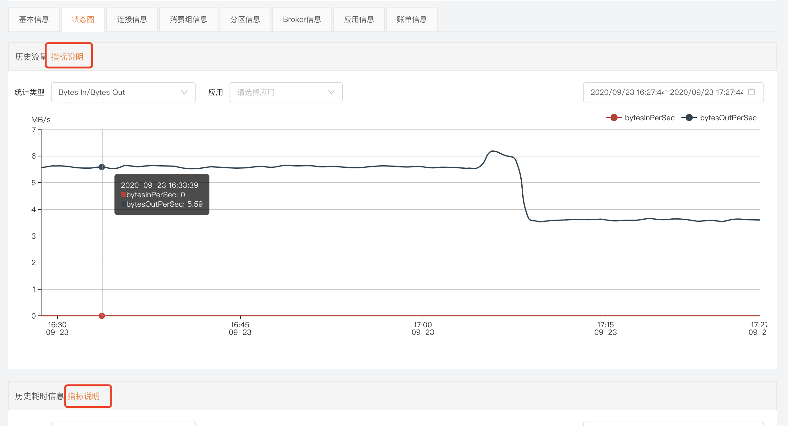

#### 查看Topic与客户端的关联信息 ####

**操作步骤**

步骤1：点击Topic名称即跳转进入详情页。

步骤2：点击“连接信息”即可查看当前Topic，与哪些客户端有关联。

步骤3：列表展示“AppID”-客户端使用的App、“主机名”-客户端运行的机器、“客户端版本”、“客户端类型”。部分字段支持表头筛选。

#### 查看Topic消费组信息 ####

消费组不需要申请，由系统自动生成。当客户端正常消费时，自动生成消费组。

**操作步骤**

步骤1：点击Topic名称即跳转进入详情页。

步骤2：点击“消费组信息”即可查看当前Topic有哪些消费组。列表展示“消费组名称”、“AppID”、“Location”（broker或zookeeper）。部分字段支持表头筛选。

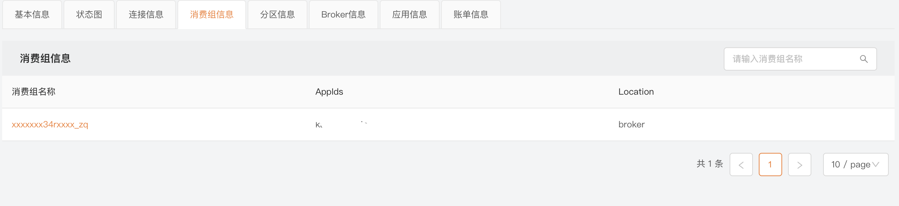

步骤3：点击消费组名称可查看该消费组的信息，如"Partition ID"、“Consumer ID”、“Consume Offsset”、“Partition Offsset”、“Lag”.

 **专业名词解释**

Lag：表示该消费客户端是否有堆积；等于 partition offset-consume offset。

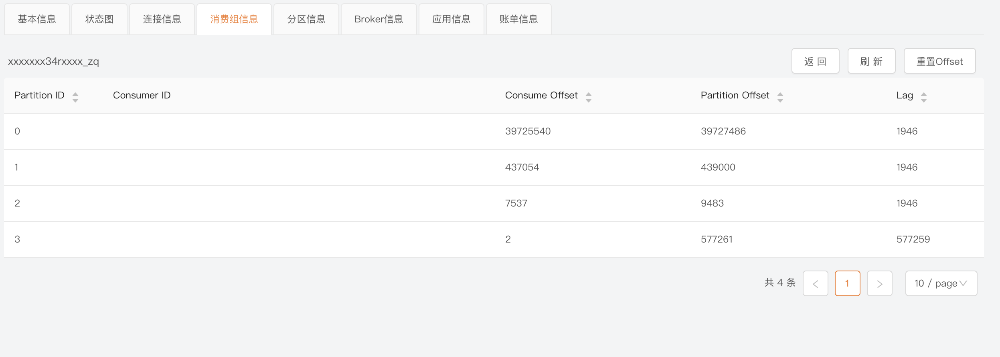

#### 重置Topic的消费offset（偏移） ####

**操作步骤**

步骤1：在上一步的基础上，点击【重置offset】按钮，出现重置消费offset（偏移）的弹框。

步骤2：需注意，重置消费offset之前，需要关闭消费客户端，并等待几分钟后再执行重置操作。否则会操作失败。

步骤3：可在弹框内选择重置到最新的offset，或某个时间的offset; 或重置至指定的分区伤的某个offset。点击重置，操作成功。

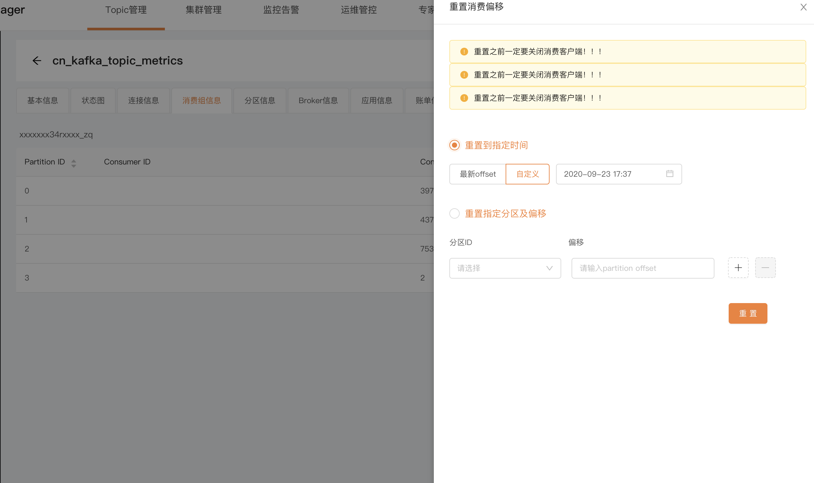

#### 查看Topic分区信息 ####

**操作步骤**

步骤1：点击Topic名称即跳转进入详情页。

步骤2：点击“分区信息”即可查看当前Topic各分区的信息。

步骤3：列表展示“分区ID”、“BeginingOffset”、“EndOffset”、“MsgNum”、“Leader Broker”、“LogSize”、“优选副本”、“AR”、“ISR”、“是否同步”。部分字段支持表头筛选。

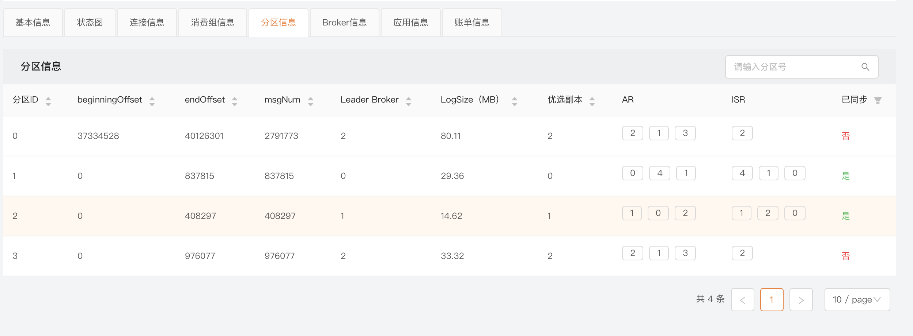

#### 查看Topic的Broker信息 ####

**操作步骤**

步骤1：点击Topic名称即跳转进入详情页。

步骤2：点击“Broker信息”即可查看当前Topic的broker信息。

步骤3：列表展示“BrokerID”、“Host”、“Leader个数”、“分区LeaderID”、“分区个数”、“分区ID”。部分字段支持表头筛选及排序。

#### 查看Topic关联的应用信息 ####

**操作步骤**

步骤1：点击Topic名称即跳转进入详情页。

步骤2：点击“应用信息”即可查看当前Topic的应用信息。

步骤3：列表展示“应用ID”、“应用名称”、“负责人”、“生产配额”、“分区个数”、“分区ID”。部分字段支持表头筛选及排序。

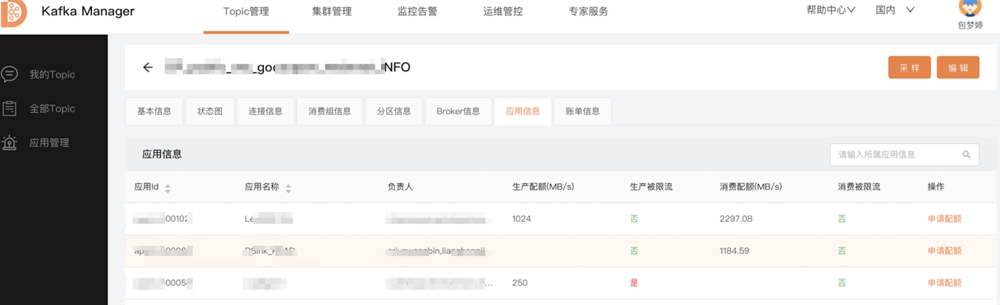

#### 查看Topic的账单信息 ####

**操作步骤**

步骤1：点击Topic名称即跳转进入详情页。

步骤2：点击“账单信息”即可查看当前Topic的账单信息，以图表的形式展示数据走向。

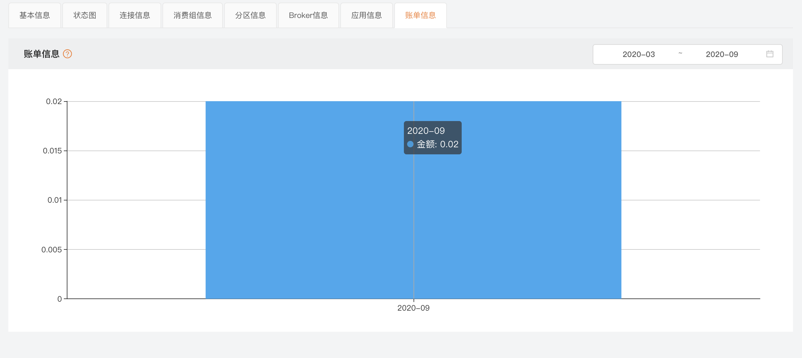

### 查看broker的详细信息 ###

#### 查看broker的基础及监控信息 ####
**操作步骤**

步骤1：在topic的详情页，点击BrokerID,即可看到Broker的详细信息。

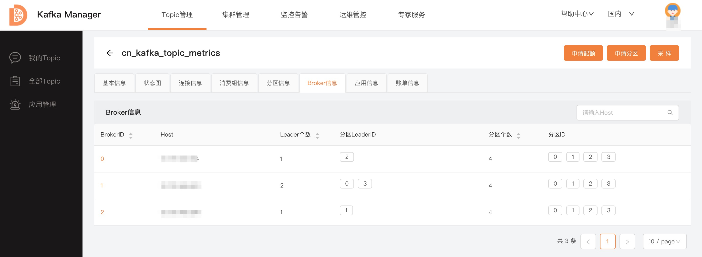

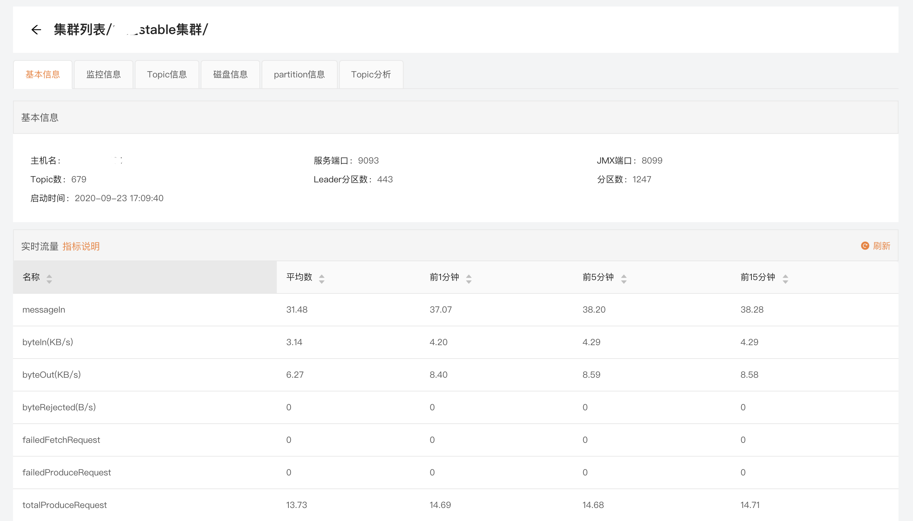

步骤2：点击“监控信息”即可查看broker的一些指标图表，以图表的形式展示数据走向。

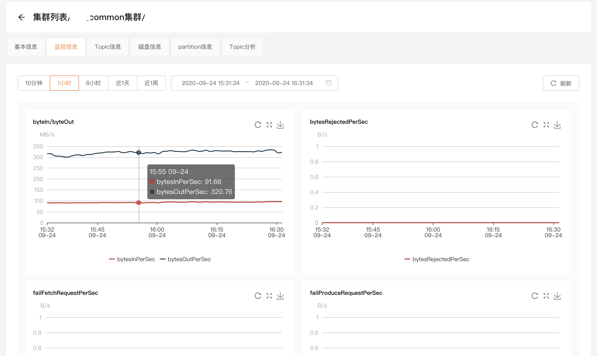

#### 查看broker的关联topic信息 ####
**操作步骤**

步骤1：在topic的详情页，点击BrokerID,即可看到Broker的详细信息。

步骤2：点击“Topic信息”即可查看与该broker相关的Topic列表。

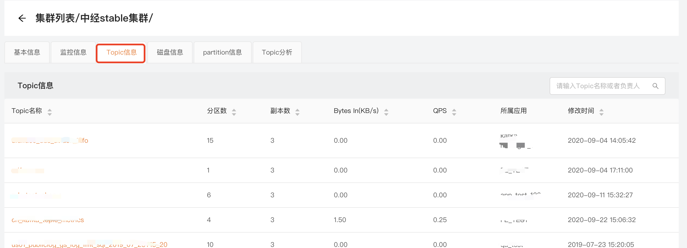

#### 查看broker的磁盘信息 ####
**操作步骤**

步骤1：在topic的详情页，点击BrokerID,即可看到Broker的详细信息。

步骤2：点击“磁盘信息”即可查看与该broker相关的磁盘列表。

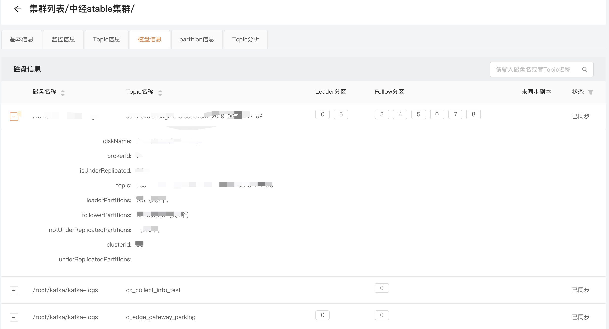

#### 查看broker的partition信息 ####
**操作步骤**

步骤1：在topic的详情页，点击BrokerID,即可看到Broker的详细信息。

步骤2：点击“partition信息”即可查看与该broker相关的partition列表。

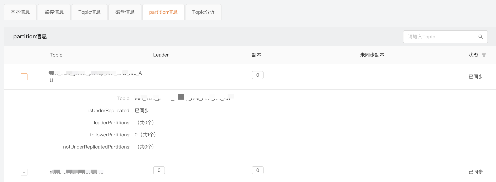

#### 查看broker的Topic分析情况 ####
**操作步骤**

步骤1：在topic的详情页，点击BrokerID,即可看到Broker的详细信息。

步骤2：点击“Topic分析”即可查看其使用的Topic情况。

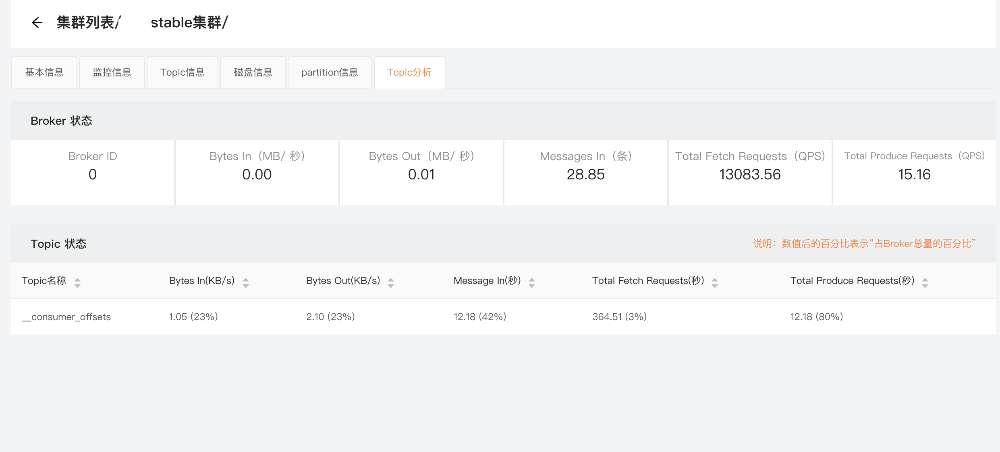

#### 已过期Topic ####
**操作步骤**

步骤1：在“我的topic”模块，点击“已过期Topic”可以查看到与自己相关、但已过期的Topic。

步骤2：可以通过筛选项，筛选目标Topic。

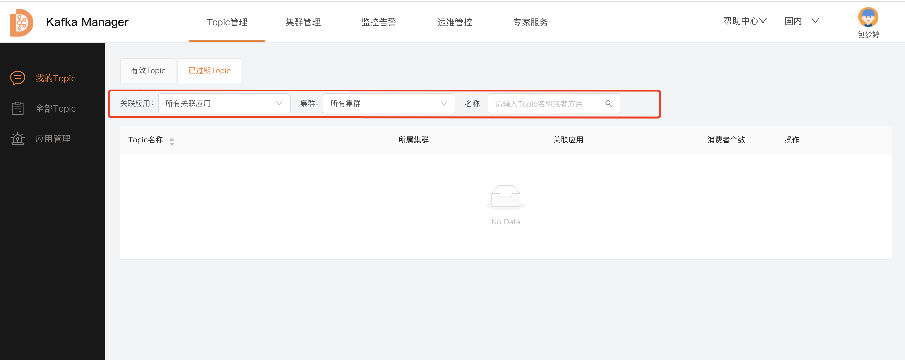

### 全部Topic ###
“全部Topic”模块以列表的形式展示所有的Topic，用户可以在这里申请目标Topic的相关权限。
#### 查看全部Topic列表 ####
**操作步骤**

步骤1：点击“Topic管理”>“全部Topic”. 列表展示全部Topic，“Topic名称”、“所属集群”、“Topic描述”、“负责人”。

步骤2：可以通过筛选项，筛选目标Topic。

步骤3：点击Topic名称，可进入详情页。详情内容与查看方式与“我的Topic”模块一致。

#### 申请Topic权限 ####
**操作步骤**

步骤1：点击“Topic管理”>“全部Topic”. 对于想申请/增加权限的Topic，点击“申请权限”，出现申请权限弹框。

步骤2：正确填写参数，选择需要申请权限的应用，并选择权限类型，点击确认提交工单。

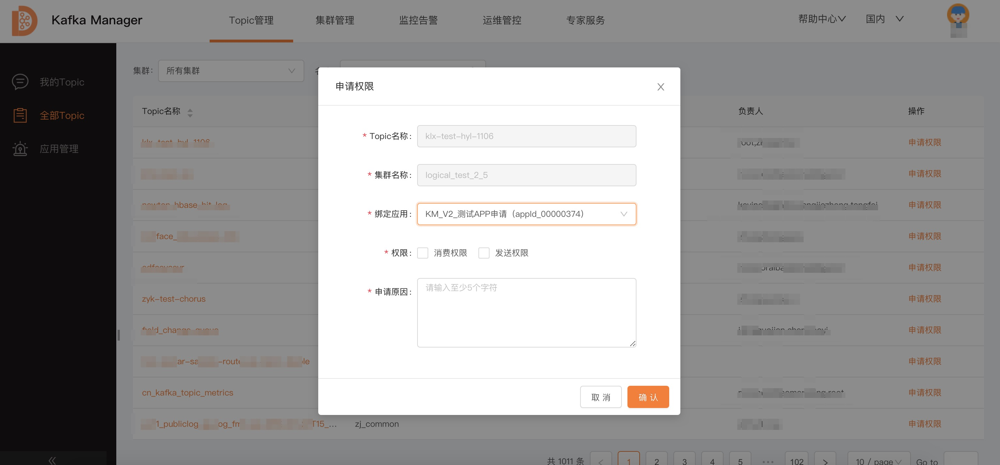

#### 申请扩Topic的配额 ####
**操作步骤**

步骤1：如果用户当前已有该topic的权限点击Topic名称，进入详情页。详情内容与查看方式与“我的Topic”模块一致。

步骤2：

### 应用管理 ###
应用管理可以查看到当前用户关联到应用列表。

**操作步骤**

步骤1：点击“Topic管理”>"应用管理"进入应用管理列表页。

步骤2：列表展示“APPID”、“应用名称”、“应用描述”、“负责人”、“操作”。

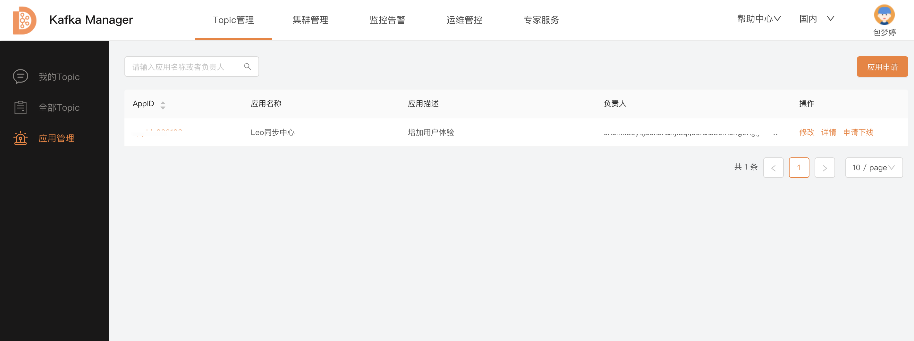

#### 申请应用 ####

平台的权限申请、扩分区等操作，均需要先用应用去申请操作的权限。如果用户没有应用，需要先绑定或申请应用。

**操作步骤**

步骤1：点击列表右上方的“申请应用”，打开应用申请弹框。

步骤2：需要填写应用名称、负责人（至少选择两人）、应用描述（阐述应用相关用途及申请原因）。填写完成后，点击确认提交申请。

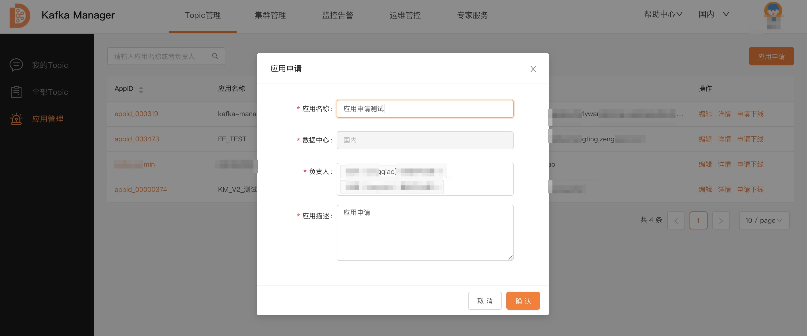

#### 修改应用 ####

**操作步骤**

步骤1：点击操作中的"修改"，打开修改弹窗。

步骤2：可以修改应用名称
负责人、应用描述。

步骤3：点击【确定】，操作成功。

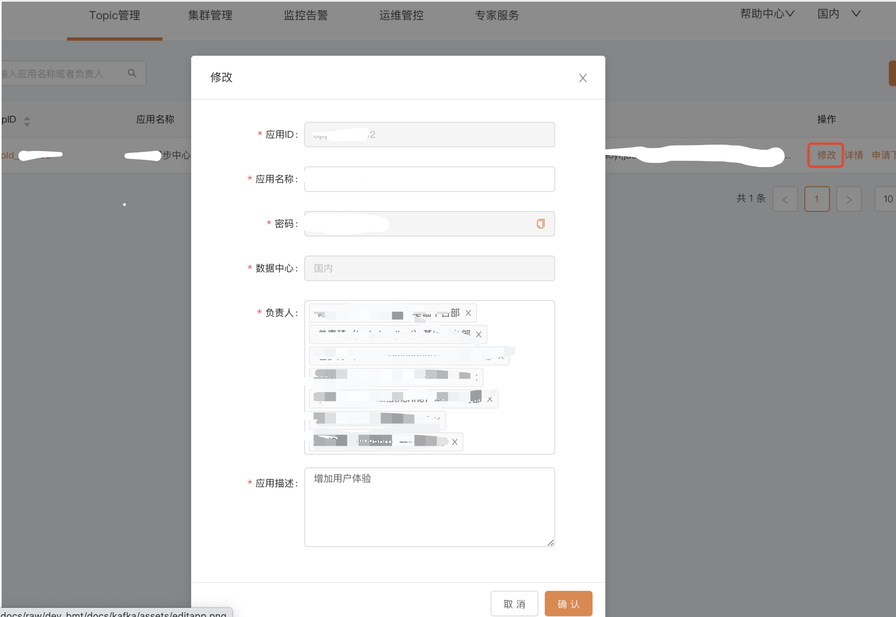

#### 申请下线应用 ####

**操作步骤**

步骤1：点击操作中的"申请下线"，打开下线弹窗。

步骤2：弹框内展示该app目前正在使用的的主机信息，需要先关闭对应主机的Kafka发送/消费客户端才能下线。

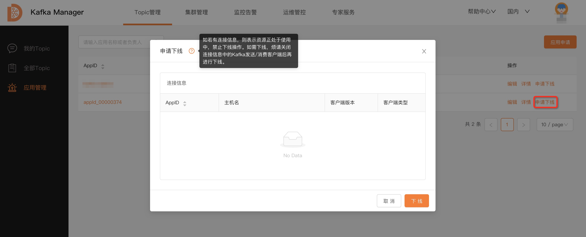

#### 查看应用详情 ####

**操作步骤**

步骤1：点击应用名称，可以查看应用详情。

步骤2：点击【创建的Topic】可以查看到该应用创建的Topic列表。

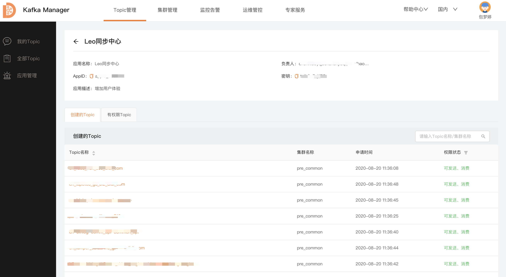

步骤3：点击【有权限的Topic】，可以查看该应用有权限的Topic列表。

#### 取消应用对topic的权限 ####

**操作步骤**

步骤1：点击【取消权限】，打开取消权限的弹框。

步骤2：选择想取消的权限，点击确认，可以取消应用与该topic的权限关系。

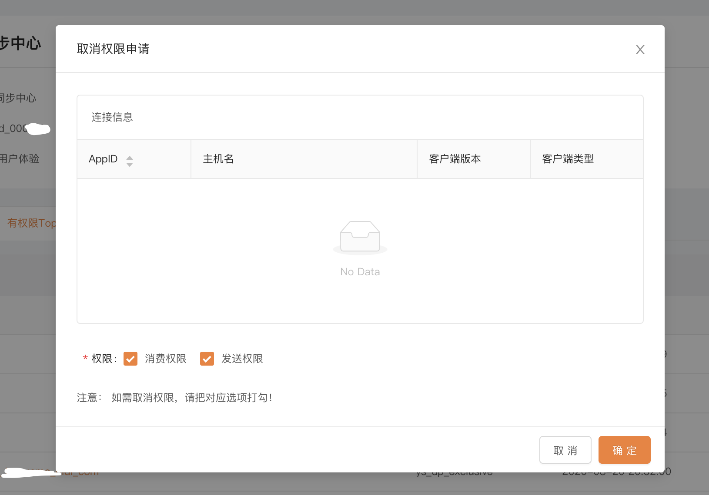

## 集群管理 ##
### 我的集群 ###
#### 查看我的集群列表 ####
**操作步骤**

步骤1：点击“集群管理”>"我的集群"，查看与我相关的集群列表。

步骤2：选择想取消的权限，点击确认，可以取消应用与该topic的权限关系。

#### 申请集群 ####
**操作步骤**

步骤1：点击“集群管理”>"我的集群">【申请集群】，打开申请集群弹框。

步骤2：数据中心：默认为当前所处的数据中心

所属应用：选择在哪个应用下创建集群。

集群类型：选择创建的集群为“独享”还是“独立”。

* 独享集群意味着， 您拥有一个集群中，部分broker的使用权限。

* 独立集群意味着，您独自拥有一个
  物理集群；

* 共享集群意味着，大家共用一个集群及其中broker。

峰值流量：选择峰值流量限制。并支持自定义输入。

申请原因：填写申请集群的原因，用途，稳定性要求等等。

步骤3：填写完成后，点击提交即可提交申请。

备注说明：集群创建后，还需在此基础上创建region、逻辑集群。具体操作可参照 [集群接入手册](https://github.com/didi/Logi-KafkaManager/blob/master/docs/user_guide/add_cluster/add_cluster.md)

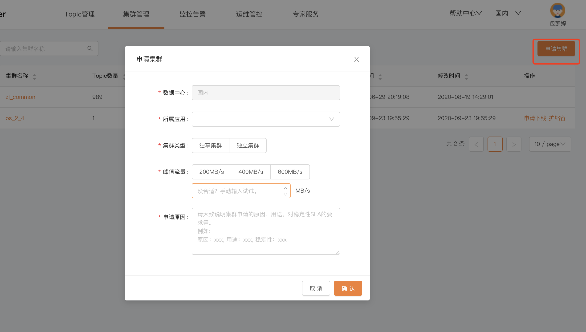

#### 申请集群下线 ####

对于自己独享的集群，可以申请下线。

**操作步骤**

步骤1：点击“集群管理”>"我的集群"，查看与我相关的集群列表。

步骤2：点击【申请下线】，打开申请下线弹框。

步骤2：弹框内展示是否有与该集群相关的活跃topic,如果有，则无法下线该集群。需要先下线相应topic。

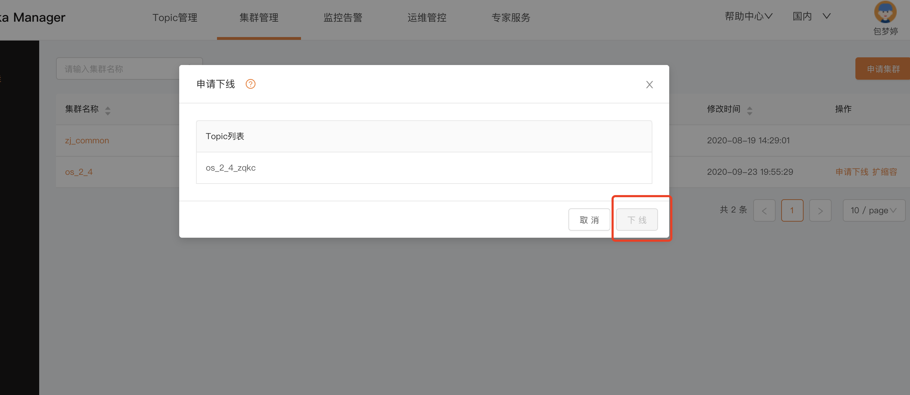

#### 集群扩缩容 ####

对于自己独享的集群，可以申请扩缩容。

**操作步骤**

步骤1：点击“集群管理”>"我的集群"，查看与我相关的集群列表。

步骤2：点击【扩缩容】，打开申请扩缩容的弹框。

步骤2：下拉选择申请类型：扩容，或缩容

申请原因：填写申请扩缩容的原因。

点击确认提交。

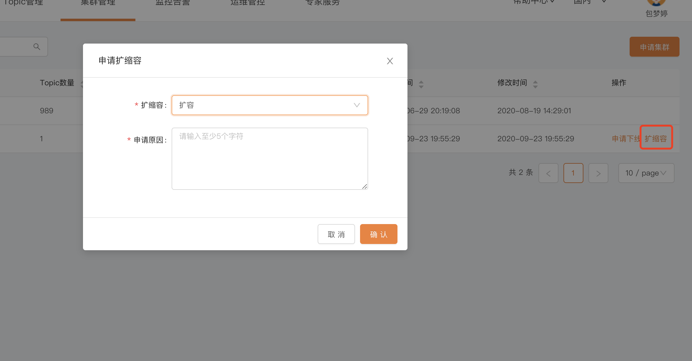

#### 查看集群详情 ####

**操作步骤**

步骤1：点击集群名称，进入集群详情页。

步骤2：查看集群的基本信息：集群名称、集群类型、集群名称：逻辑集群名、集群类型：逻辑集群类型, 0:共享集群, 1:独享集群, 2:独立集群 、接入时间、物理集群Id、Kafka版、Bootstrap Severs、Kafka版本：集群版本、Bootstrap Severs：集群服务地址。以及实时流量列表、历史流量图表。

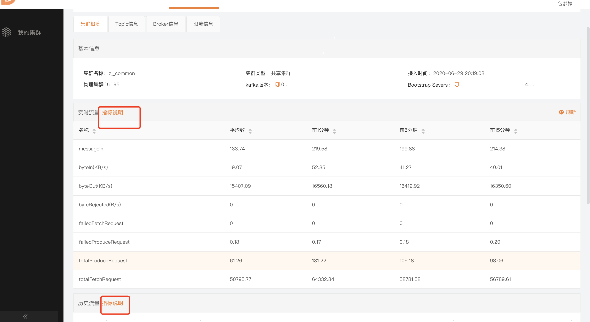

#### 查看集群topic列表 ####

**操作步骤**

步骤1：点击集群名称，进入集群详情页。

步骤2：点击“Topic信息”，查看集群相关的topic列表。展示Topic名称、QPS、Bytes In（KB/s）、所属应用、保存时间（h）、更新时间、Topic说明。

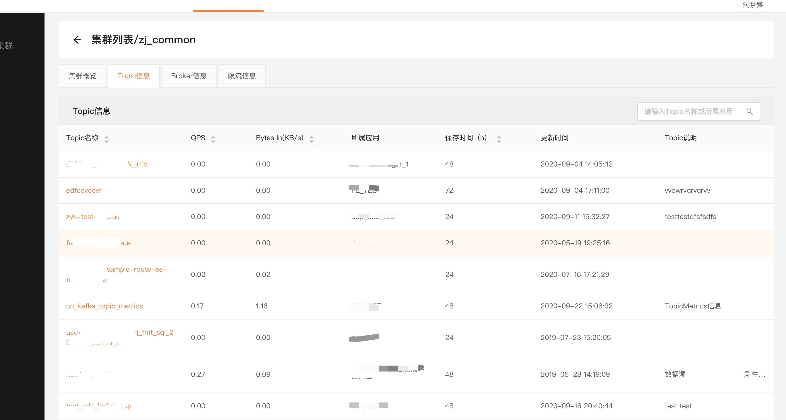

步骤3：点击Topic名称可跳转至Topic的详情页。

#### 查看集群Broker列表 ####

**操作步骤**

步骤1：点击集群名称，进入集群详情页。

步骤2：点击“Broker信息”，查看集群相关的Broker列表。展示ID、主机、Prot、JMX Port、启动时间、Byte In（MB/s）、Byte Out（MB/s）、副本状态、状态.

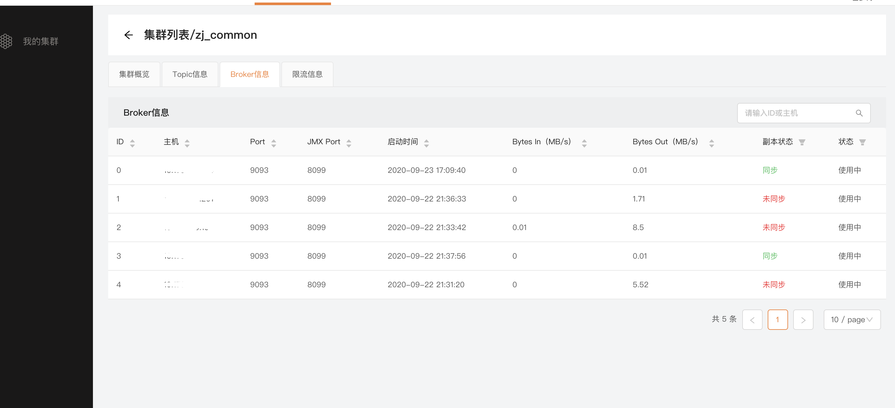

#### 查看集群topic的限流情况 ####

**操作步骤**

步骤1：点击集群名称，进入集群详情页。

步骤2：点击“限流信息”，展示Topic名称、应用ID、类型、Broker、类型：客户端类型[Produce|Fetch]、Broker：BrokerId列表。

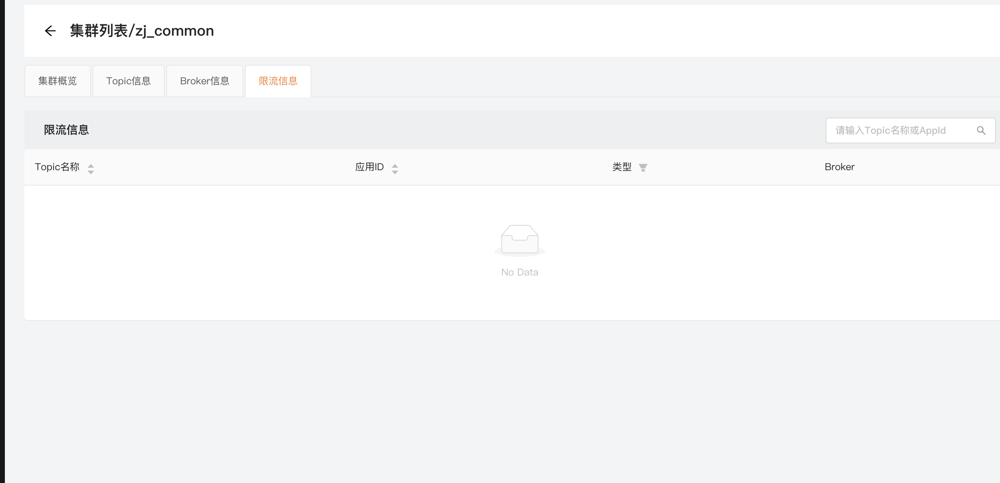

## 监控告警 ##
### 告警列表 ###

**操作步骤**

步骤1：以列表的形式展示每个告警规则的告警情况。告警名称、应用名称、操作人、创建时间、操作。
步骤2：可通过下拉筛选想查看的应用，或输入关键字匹配告警。

### 新建告警规则 ###

**操作步骤**

步骤1：点击“新建规则”，进入新建告警规则页面。
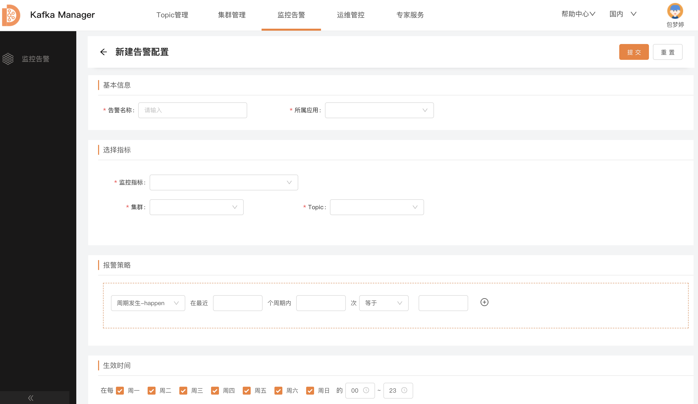
步骤2：填写告警基本信息：规则名称

选择指标：可以选择对部分集群、部分topic、部分消费组生效。

报警策略：可以选择周期、连续发生、同比变化率、突增突降值、突增突降率、求和等计算方式。

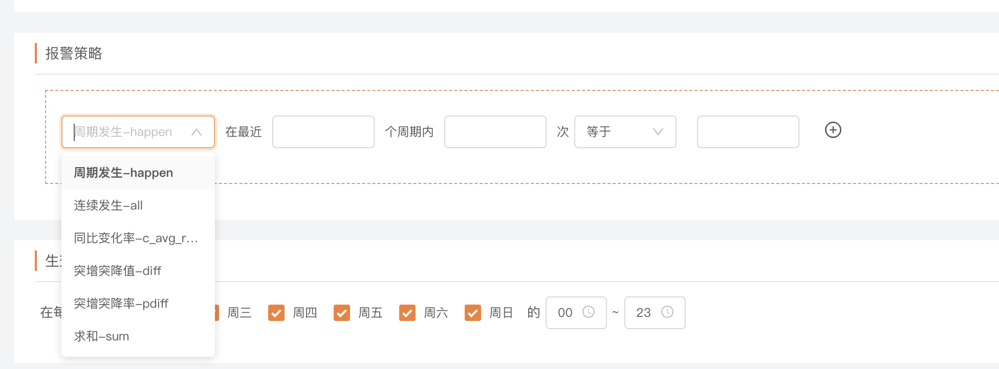

* 如以下图为例，表示在最近连续3个周期内，如有两次指标值大于等于阈值：90%，则触发告警。

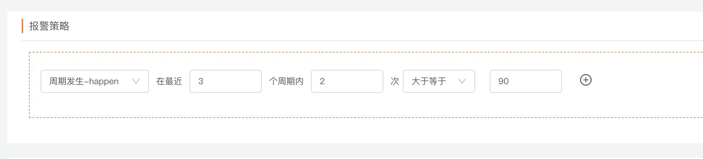

步骤3：生效时间：选择告警规则生效的时间段。

如下图，则表示在每周一至周日的凌晨-晚23点，如果产生了告警，都会进行上报。

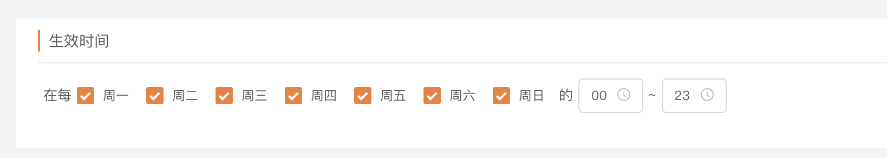

步骤4：配置发送信息：告警通知时间段。

选择指标：可以选择对部分集群、部分topic、部分消费组生效。

步骤5：配置发送信息：

报警级别：设置告警级别。

报警周期（分钟）：设置告警通知的周期。

周期内报警次数：设置在一个周期内，最多产生多少条告警。

报警接受组：设置报警通知的群组。

回调地址： 指对于该告警如果有相应处理措施，则可以通过回调该地址执行。

* 如下图，则表示本条规则的产生的告警为3级告警，以4分钟为一个周期进行通知，并且一个周期内，最多通知2次。通知对象为pborder群组内的联系人。

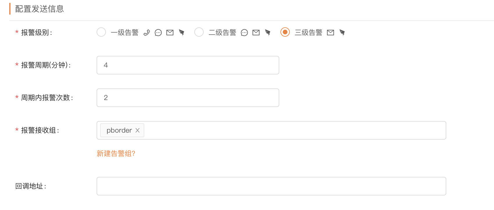

步骤6：点击【提交】，完成规则的设置。

### 查看该条规则的历史告警 ###

**操作步骤**

步骤1：点击规则名称，进入详情页。点击“告警历史”tab页。查看相关历史告警。

步骤2：列表展示监控名称、开始时间、结束时间、状态、监控级别。

步骤3：可通过点击快捷时间筛选，来选择查看近三天，或近一周的告警情况。

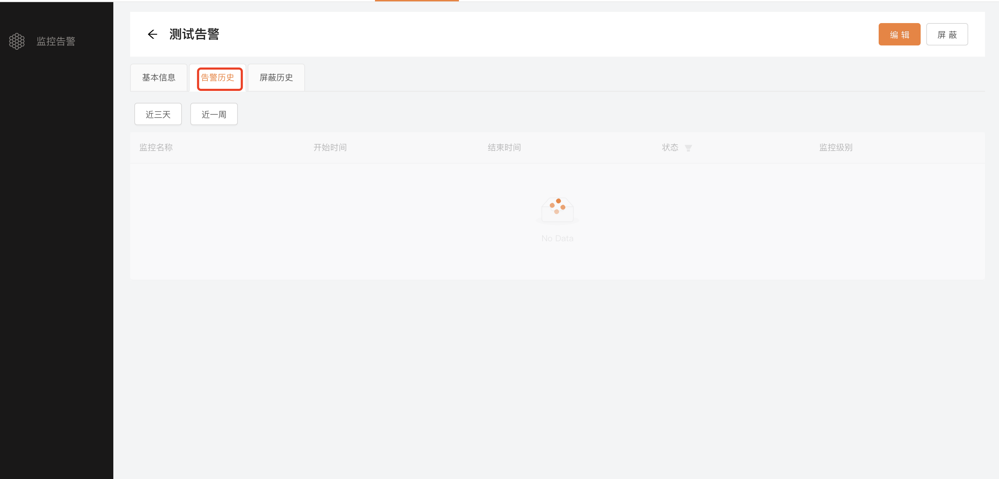

### 告警规则屏蔽 ###

**操作步骤**

步骤1：点击规则名称，进入详情页。点击“屏蔽历史”tab页，查看屏蔽历史。

步骤2：列表展示监控名称、开始时间、结束时间、备注、操作。

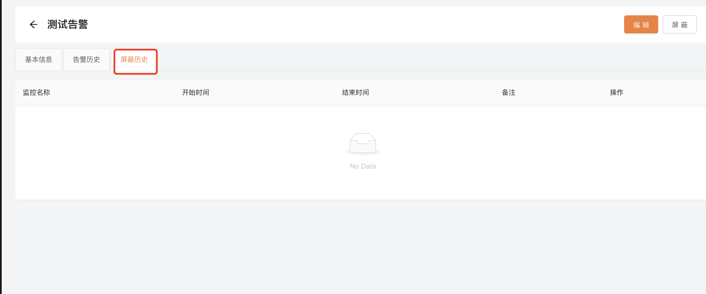

## 运维管控 ##
### 集群列表 ###
**操作步骤**

步骤1：点击"运维管控">“集群列表”，以列表的形式向运维侧人员展示集群信息。

步骤2：列表展示集群ID、集群名称、Topic数、Broker数、Consumer数、Region数、ControllerID、是否监控、操作。

步骤3：可通过列表左上方的搜索框，输入集群名称关键字，搜索对应的集群。

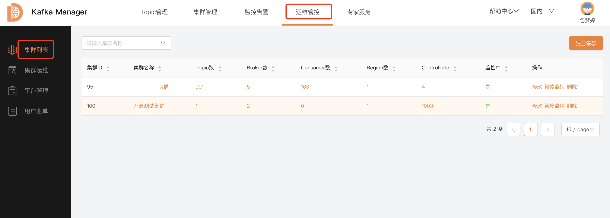

#### 新增集群 ####
**操作步骤**

步骤1：点击集群列表右上方的【注册集群】，打开集群申请弹框。

步骤2：集群名称：设置创建的集群名称。

Zookeeper地址：输入Zookeeper地址。

bootstrapServers地址：输入bootstrapServers地址。

数据中心：默认为当前登录的数据中心。

集群类型：设置集群的类型。可选择共享集群、独立集群、独享集群。**（各集群对应的含义可见2.1.2 申请集群）**。

安全协议：非必填，请输入安全协议。

步骤3：点击【确认】，提交申请单。

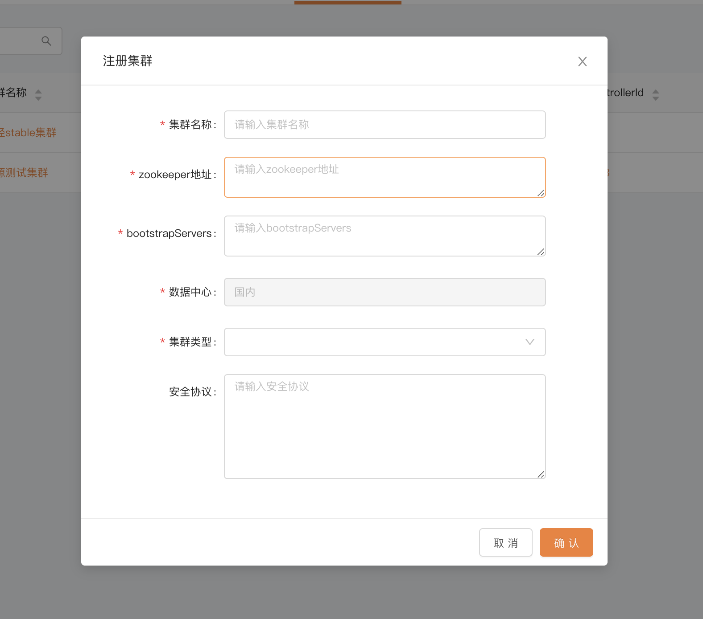

#### 修改集群 ####
**操作步骤**

步骤1：点击集群列表“操作”栏中【修改】，打开修改弹框。

步骤2：仅可修改集群类型和安全协议两项。

步骤3：点击【确认】，完成修改。

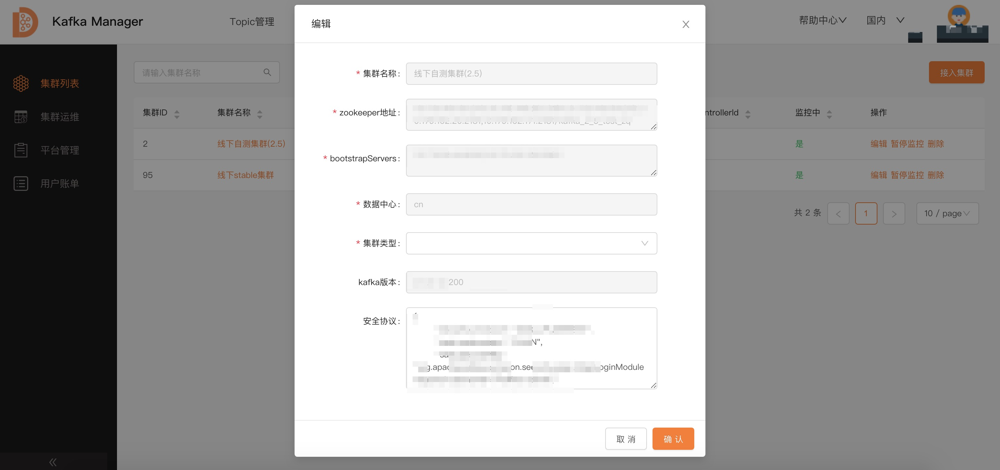

#### 暂停/开始集群监控 ####
**操作步骤**

步骤1：点击集群列表“操作”栏中【暂停监控】。

步骤2：在气泡确认框中点击确认，可暂停对该集群对监控。

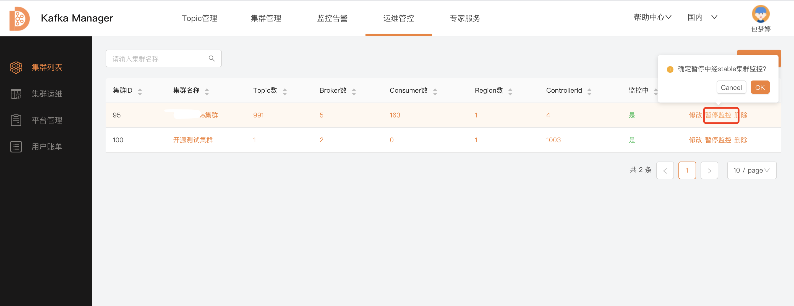

步骤3：当集群监控停止后，可以通过点击集群列表“操作”栏中【开始监控】，打开对集群的监控。

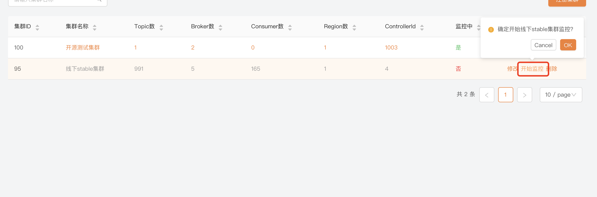

#### 删除集群 ####
**操作步骤**

步骤1：点击集群列表“操作”栏中【删除】。

步骤2：在二次确认弹框中，会显示该物理集群上是否有逻辑集群。如果有，则无法直接删除，需要先将逻辑集群删除后，再删除该物理集群。

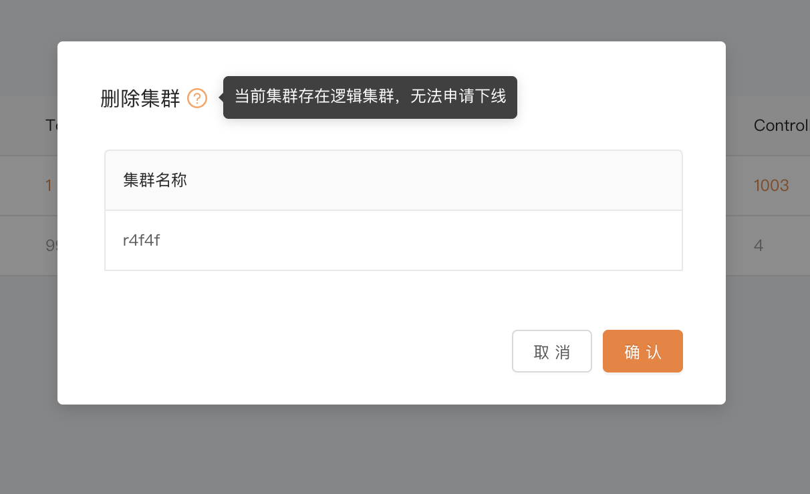

步骤3：在集群的详情页，选择“逻辑集群信息”tab页，删除逻辑集群。完成后即可进行物理集群删除操作。

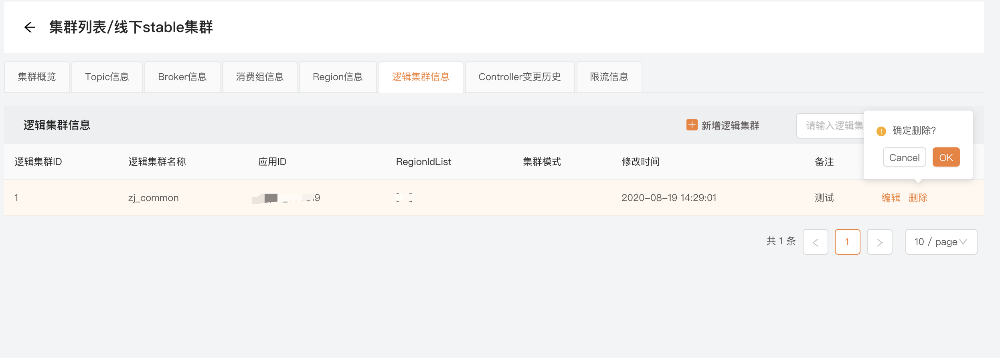

#### 查看集群详情 ####

集群详情包括：集群概览、Topic信息、Broker信息、消费组信息、Region信息、逻辑集群信息、Controller变更历史、限流信息。

##### 查看集群详情-集群概览 #####

**操作步骤**

步骤1：点击集群名称，进入详情页。

步骤2：点击“集群概览”，查看集群基本信息：集群名称、集群类型、接入时间、kafka版本、Bootstrap Severs、Zookeeper。

以及实时流量、历史流量数据的图表。

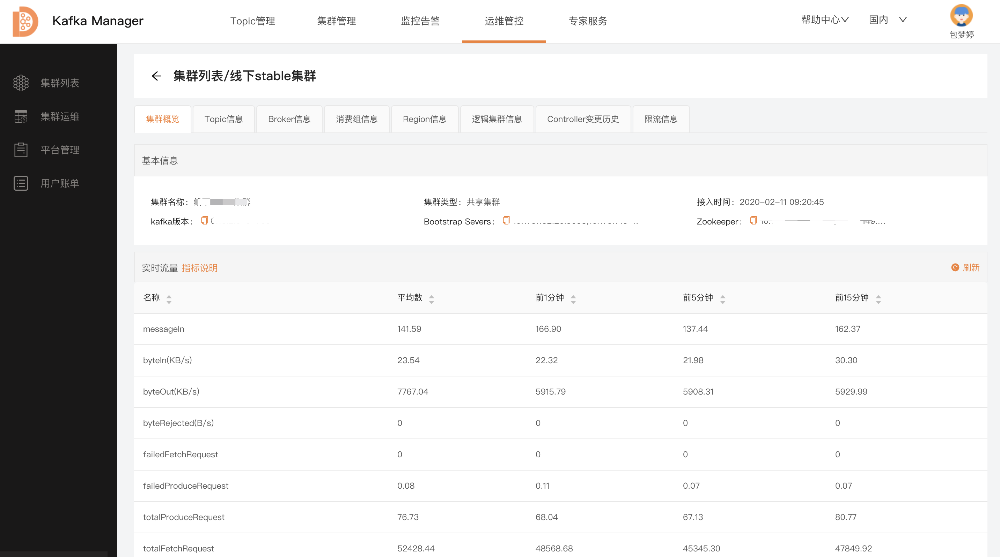

步骤3：点击【指标说明】可以查看所有指标的含义。

##### 查看集群详情-Topic信息 #####

**操作步骤**

步骤1：点击集群名称，进入详情页。

步骤2：点击“Topic信息”，查看Topic列表。并展示字段：Topic名称、QPS、Bytesin、所属应用、保存时间、更新时间、Topic说明、操作。

部分列支持表头排序或筛选。

步骤3：点击Topic名称可以查看该Topic详情；并可以对其进行编辑、扩分区、删除操作。

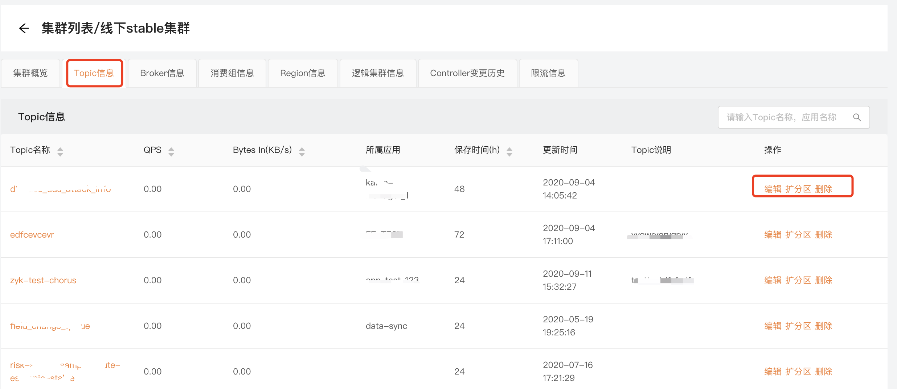

##### 查看集群详情-Broker信息 #####

**操作步骤**

步骤1：点击集群名称，进入详情页。

步骤2：点击“Broker信息”，显示各Broker峰值使用率情况，和副本同步的情况，以饼图的形式展示分布。

查看Broker列表。并展示字段：ID、主机、Port、JMX Port、启动时间、Bytes in、Bytes out、峰值状态、副本状态、regionName、状态、操作。
部分列支持表头排序或筛选。

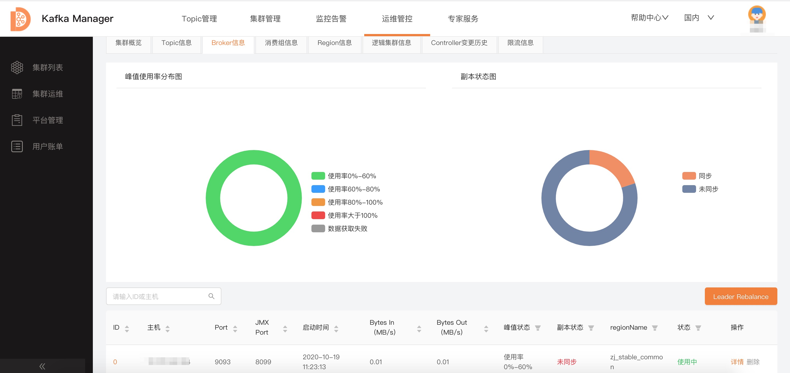

##### 查看集群详情-Broker信息-Leader Rebalance #####

**操作步骤**

步骤1：点击集群名称，进入详情页。

步骤2：在broker列表上方点击【Leader Rebalance】，打开弹框。

步骤3：集群名称默认为当前集群，下拉选择要执行的Broker。点击确认，完成操作。

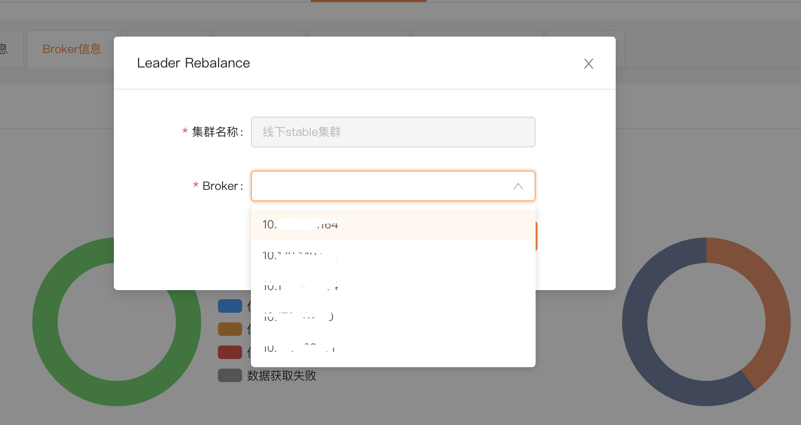

##### 查看集群详情-Broker信息-Broker详情 #####

**操作步骤**

步骤1：点击集群名称，进入详情页。点击Broker信息tab页。

步骤2：点击ID名称，可跳转至Broker详情页。

步骤3：可查看基本信息、监控信息、Topic信息、磁盘信息、partition信息、Topic分析。具体操作介绍可见“1.2 查看broker的详细信息”

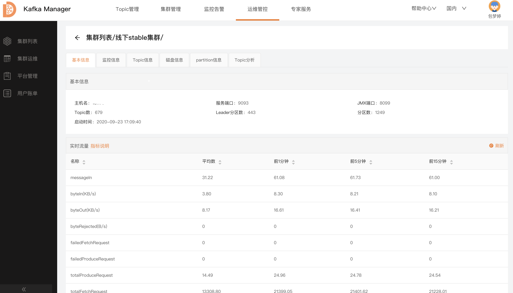

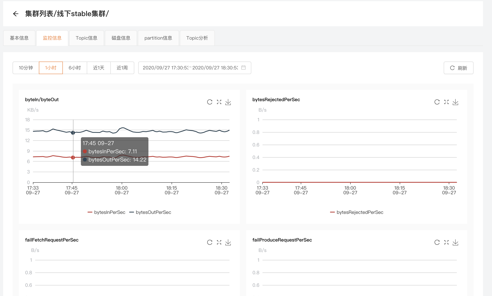

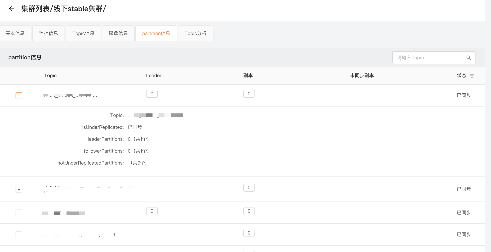

##### 查看集群详情-消费组信息 #####

**操作步骤**

步骤1：点击集群名称，进入详情页。

步骤2：点击“消费组信息”，查看消费组列表。

步骤3：可查看消费组名称、location、操作。点击详情，可查看消费的Topic有哪些。

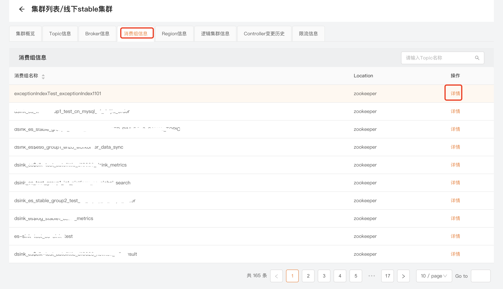

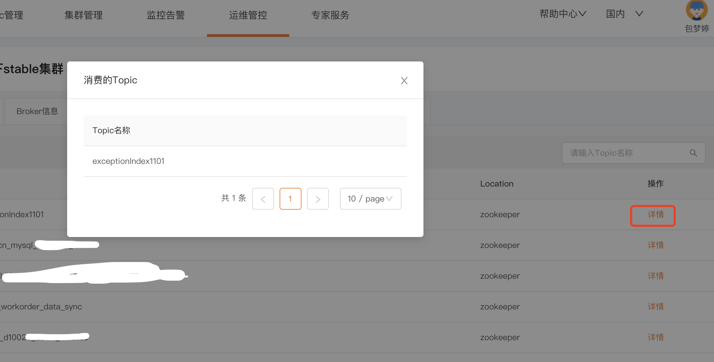

##### 查看集群详情-Region信息 #####

**操作步骤**

步骤1：点击集群名称，进入详情页。

步骤2：点击“Region信息”，查看Region列表。

步骤3：可查看regionID、region名称、BrokerIdList、location、预估容量、实际流量、预估流量、修改时间、状态、备注、操作。

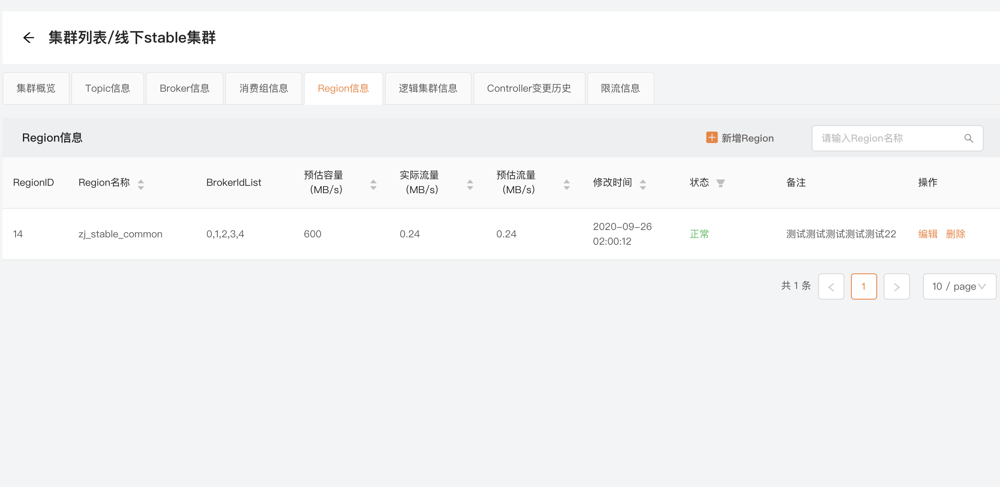

##### 查看集群详情-新增Region #####

**操作步骤**

步骤1：点击“新增Region”，打开新增region弹框。

步骤2：region名称：填写region名称。

集群名称：默认为当前集群名称。

Broker列表：选择broker。

状态：可选择正常、容量已满。

备注：可输入申请的原因。

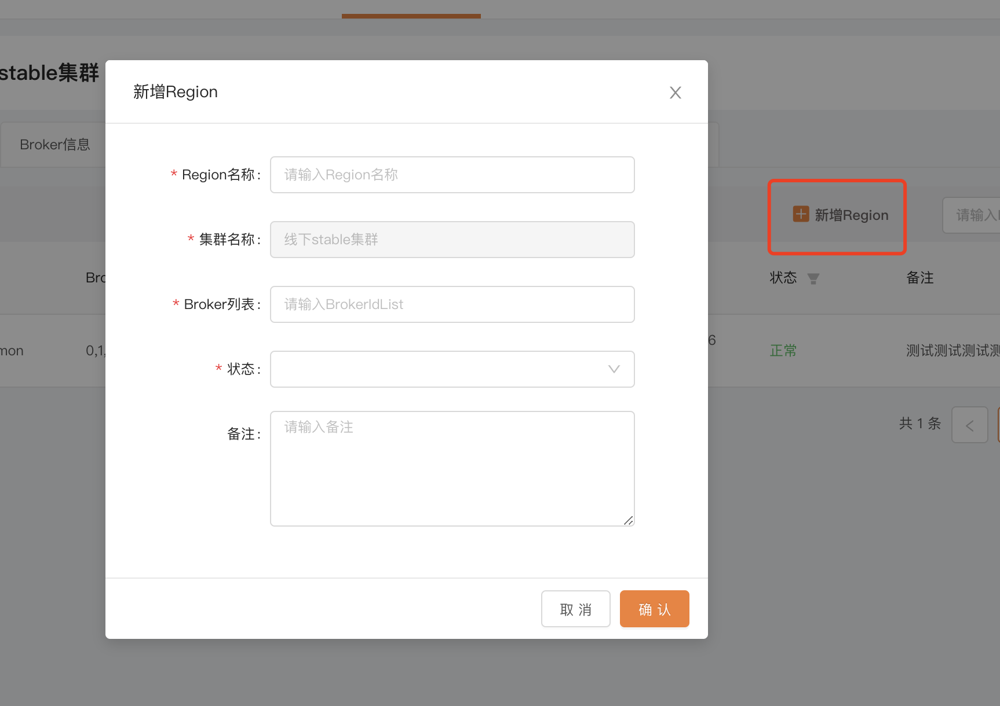

##### 查看集群详情-编辑Region #####

**操作步骤**

步骤1：点击操作栏中的“编辑”，打开编辑region弹框。

步骤2：可编辑region名称、Broker列表、状态、备注。

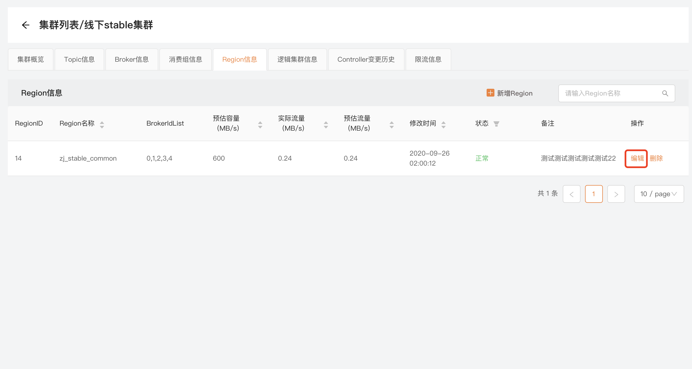

##### 查看集群详情-删除Region #####

**操作步骤**

步骤1：点击操作栏中的“删除”，出现二次确认气泡框。

步骤2：点击【确认】即可完成删除。

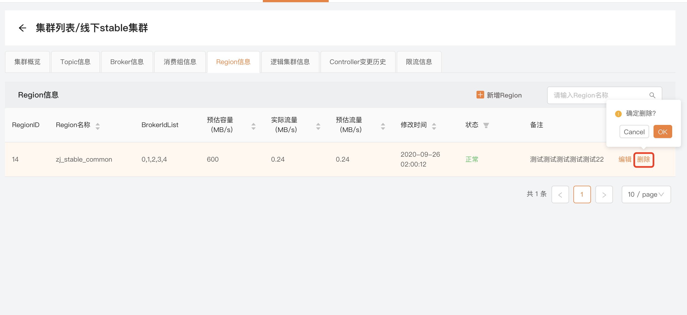

### 集群运维 ###
#### 迁移任务 ###

**操作步骤**

步骤1：点击“运维管控”>"集群运维">"迁移任务"，可查看迁移任务列表

步骤2：展示迁移任务名称、创建时间、创建人、Topic数量、任务状态、进度、操作

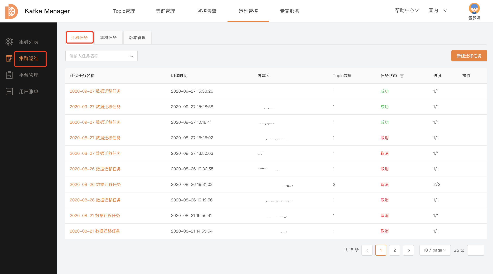

#### 新建迁移任务 ###

**操作步骤**

步骤1：点击“运维管控”>"集群运维">"迁移任务"，可查看迁移任务列表

步骤2：点击【新建迁移任务】打开新建任务的弹框。

集群名称：下拉选择目标集群。

Topic名称：选择目标集群上的topic。

类型：选择region或者broker。

分区ID：

计划开始时间：设置迁移的计划开始时间。

原本保存时间：默认24小时。

迁移保存时间：

等等。点击【确认】，完成任务的创建。
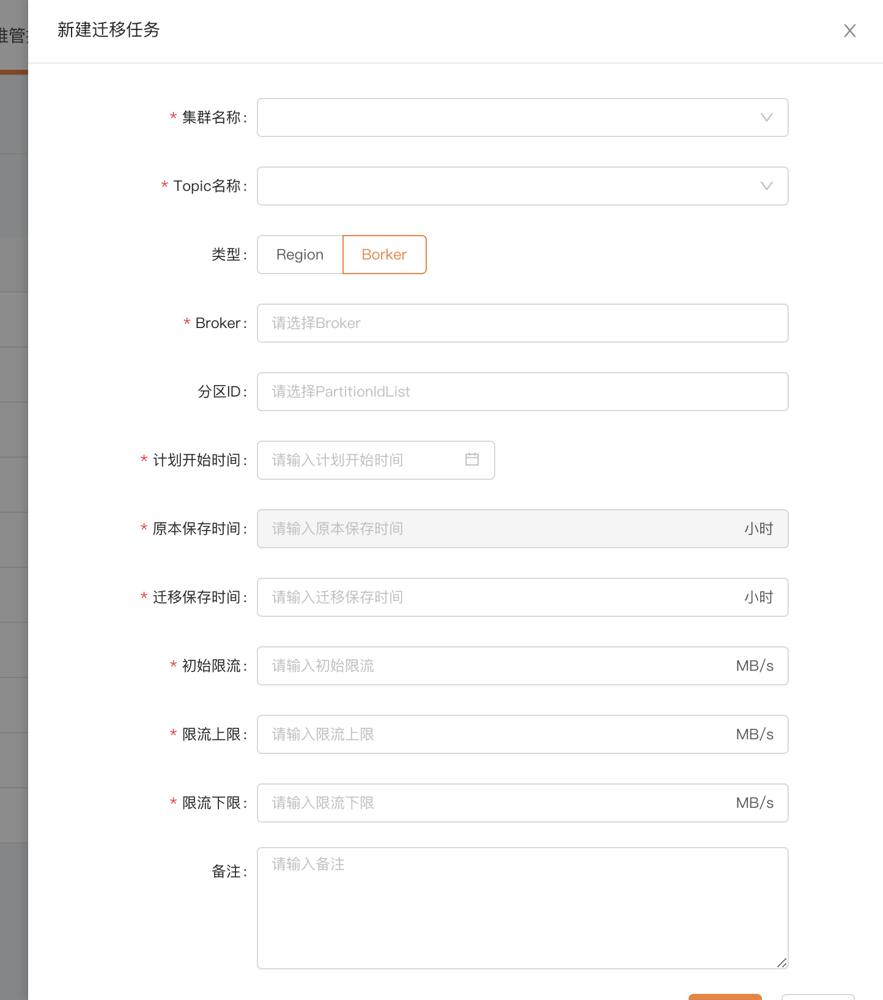

#### 迁移任务详情 ###

**操作步骤**

步骤1：点击任务名称，可查看任务详情。

步骤2：展示了任务名称、创建时间、创建人、计划开始时间、完成时间、任务说明。以及涉及topic列表。

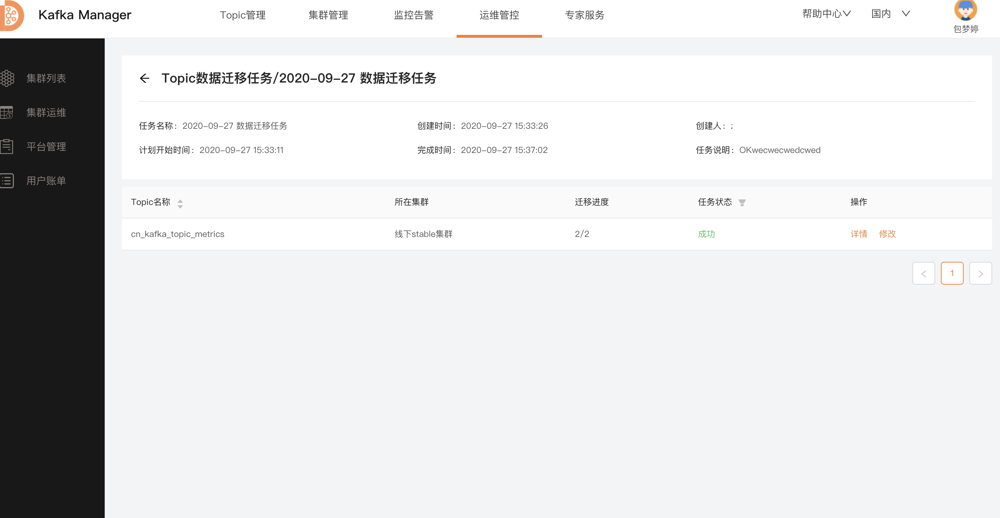

#### 集群任务 ###

**操作步骤**

步骤1：点击“运维管控”>"集群运维">"集群任务"，可查看集群任务列表

步骤2：展示迁移任务名称、创建时间、创建人、Topic数量、任务状态、进度、操作

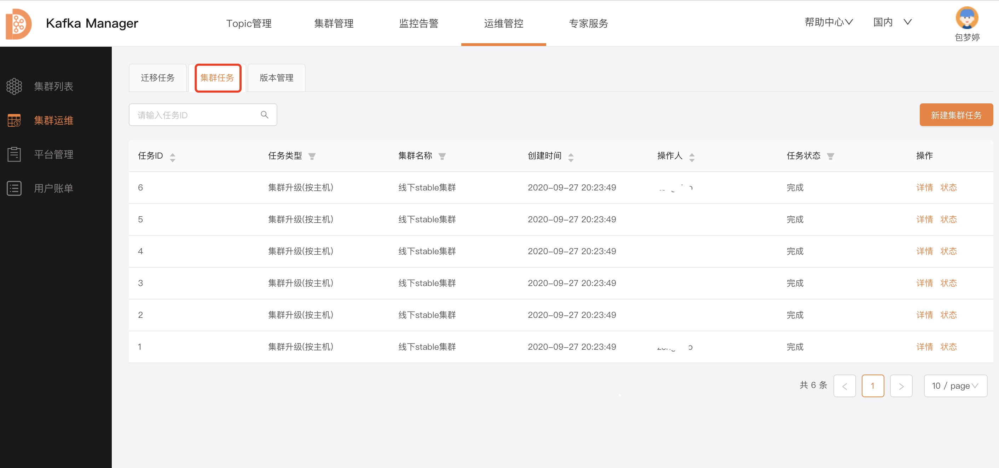

#### 新建集群任务 ###

**操作步骤**

步骤1：点击“运维管控”>"集群运维">"集群任务"，可查看迁移任务列表

步骤2：点击【新建集群任务】打开新建集群任务的弹框。

集群名称：下拉选择目标集群。

任务类型：选择集群升级（按角色）、集群升级（按主机）、集群部署、集群回滚、集群扩容。

包版本：选择操作的包版本。

server配置：下拉选择server配置。

等等（根据以上选择情况的不同，会有不同参数的选择）

主机列表：输入或粘贴主机列表，以回车键分割。

点击【确认】，完成任务的创建。
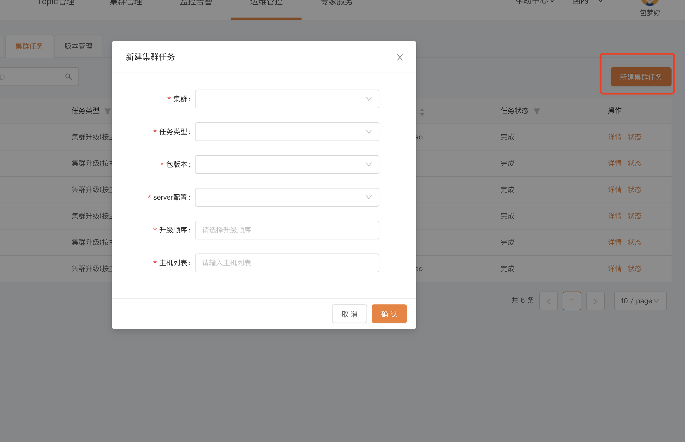

#### 集群任务详情 ###

**操作步骤**

步骤1：点击【详情】，可查看任务详情。

步骤2：展示了任务ID、集群ID、集群名称、创建时间、Kafka包、kafka包 MD5、操作人、server配置名、server配置 MD5。

以及升级主机列表、升级主机暂停点。

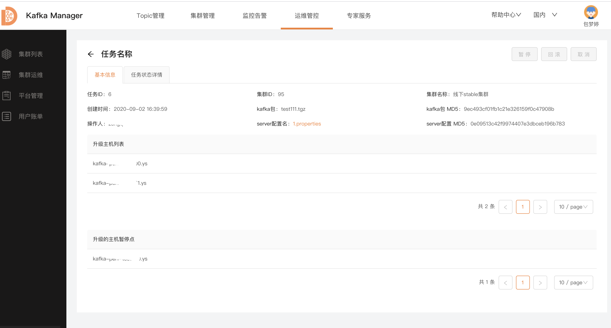

步骤3：点击【任务进度详情】tab,可切换查看任务进度详情。

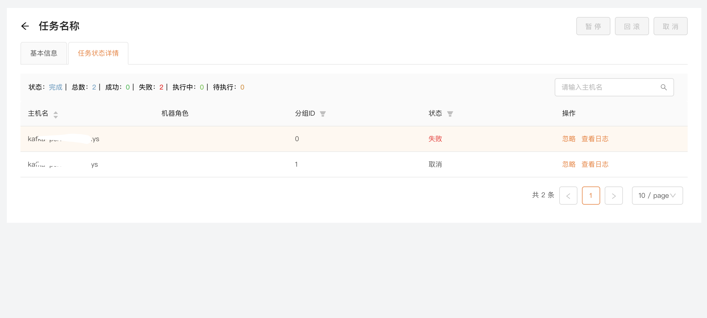

步骤4：点击列表内的【查看日志】,可查看该任务的详细日志。

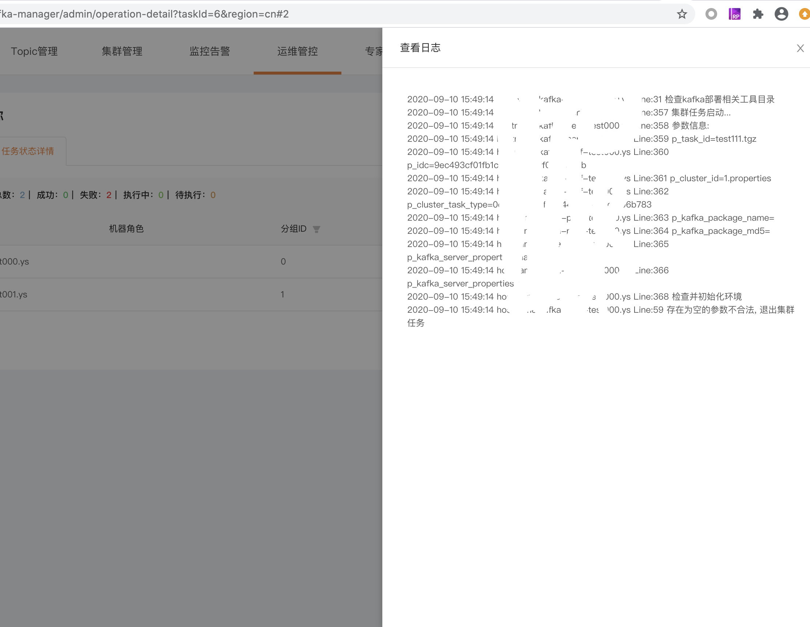

#### 版本管理 ###

**操作步骤**

步骤1：点击“运维管控”>"集群运维">"版本管理"，可查看当前的版本列表。

步骤2：展示ID、集群名称、配置类型、文件名称、MD5、更新时间、更新人、备注、操作。

步骤3：对于配置类文件，点击“文件名称”列，可以查看到该配置的详情。

 集群名称是 * 

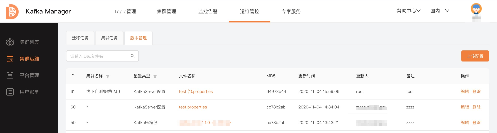

#### 上传配置 ###

**操作步骤**

步骤1：点击【上传配置】，打开上传配置弹框。

步骤2：文件类型：选择上传的文件为Kafka压缩包，或KafkaServer配置。

上传：选择需上传的文件。

备注：输入备注信息，如输入上传的原因等。

步骤3：点击【确认】，完成上传。

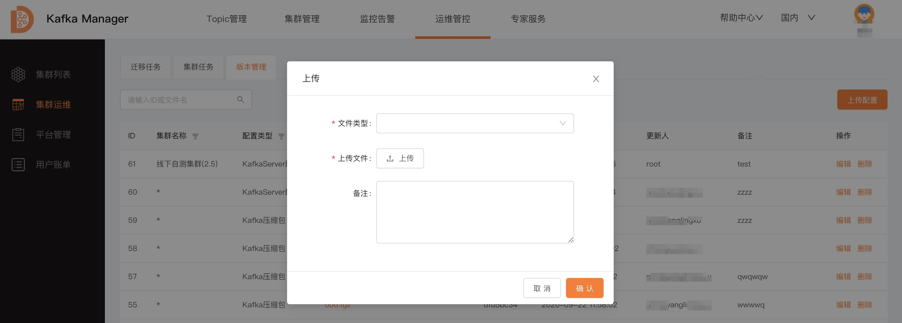
### 平台管理 ###

#### 应用管理-查看应用列表 ####
**操作步骤**

步骤1：点击"运维管控">"平台管理">"应用管理"。

步骤2：显示平台应用列表，展示AppID、应用名称、应用描述、负责人、操作（修改、详情查看、申请下线）。

#### 查看应用详情  ####
**操作步骤**

步骤1：点击"运维管控">"平台管理">"应用管理"。

步骤2：显示平台应用列表，点击AppID名称，进入App详情页。

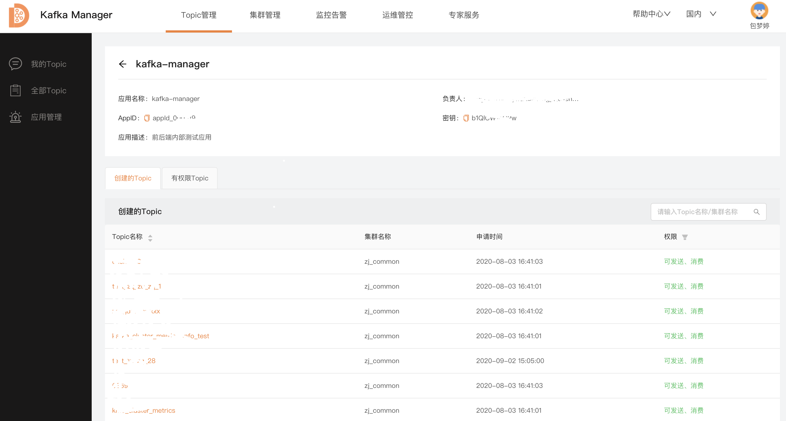
步骤3：点击【创建的Topic】可以查看到该应用创建的Topic列表。

步骤4：点击【有权限的Topic】，可以查看该应用有权限的Topic列表。

修改、申请下线等操作与用户侧-应用管理一致，可参见“1.4 应用管理”

#### 用户管理-用户列表 ####
**操作步骤**

步骤1：点击"运维管控">"平台管理">"用户管理"。

步骤2：显示平台用户列表，展示用户名、角色权限、操作（修改、删除）。

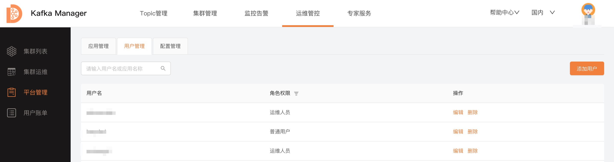

#### 用户管理-编辑用户 ####
**操作步骤**
步骤1：点击操作栏内的【修改】，打开修改弹窗。

步骤2：可以修改用户名、用户角色。

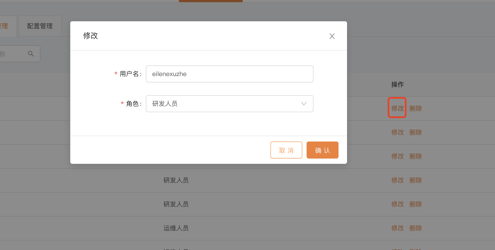

#### 用户管理-添加用户 ####
**操作步骤**
步骤1：点击列表上方的【添加用户】，打开添加用户弹框。

步骤2：输入用户名称、选择用户角色，即可添加用户。

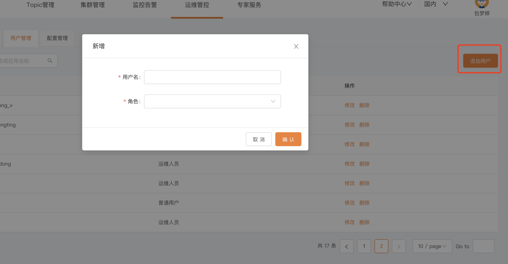

#### 配置管理-配置列表 ####
**操作步骤**
步骤1：点击"运维管控">"平台管理">"配置管理"。

步骤2：列表展示配置键、配置值、修改时间、描述信息、操作（修改、删除）。部分列支持表头筛选和排序。

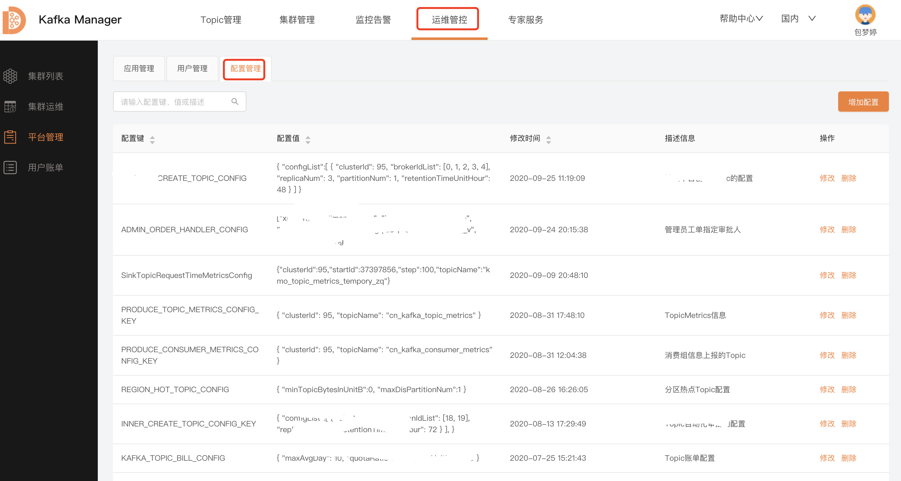

#### 配置管理-编辑配置 ####

**操作步骤**
步骤1：点击"运维管控">"平台管理">"配置管理"。

步骤2：点击列表操作栏中的【修改】按钮，打开修改弹框。可以修改配置键、配置值、备注信息。

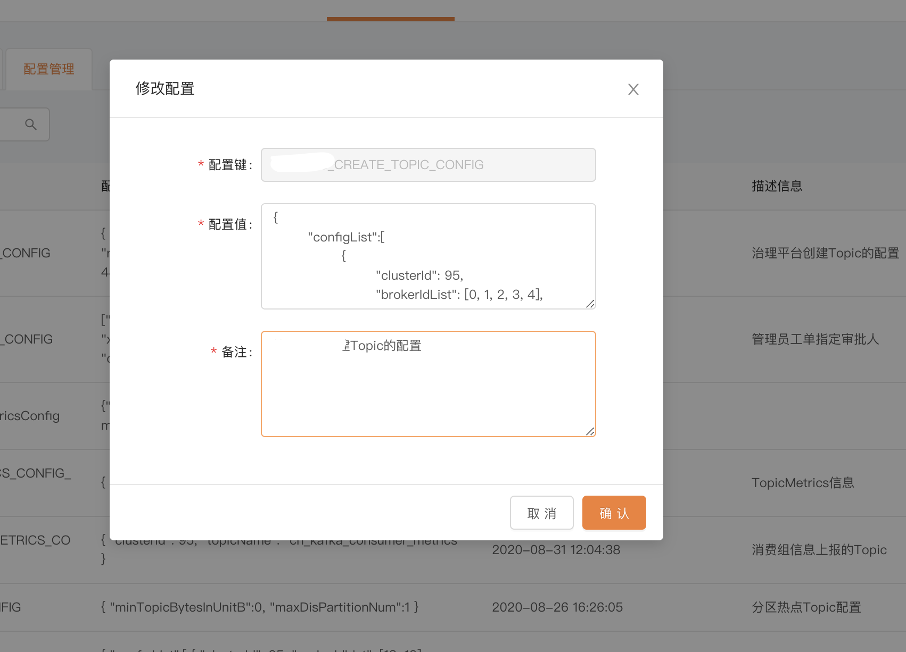

#### 配置管理-删除配置 ####

**操作步骤**
步骤1：点击"运维管控">"平台管理">"配置管理"。

步骤2：点击列表操作栏中的【修改】按钮，打开修改弹框。可以修改配置键、配置值、备注信息。

### 用户账单 ###

#### 个人账单 ####

**操作步骤**
步骤1：点击"运维管控">"账单管理">"个人账单"。

步骤2：展示个人账单列表，显示时间（精确到月）、用户名、Topic数量、时间、Quota、金额情况。

步骤3：可根据时间、用户名筛选查看账单。

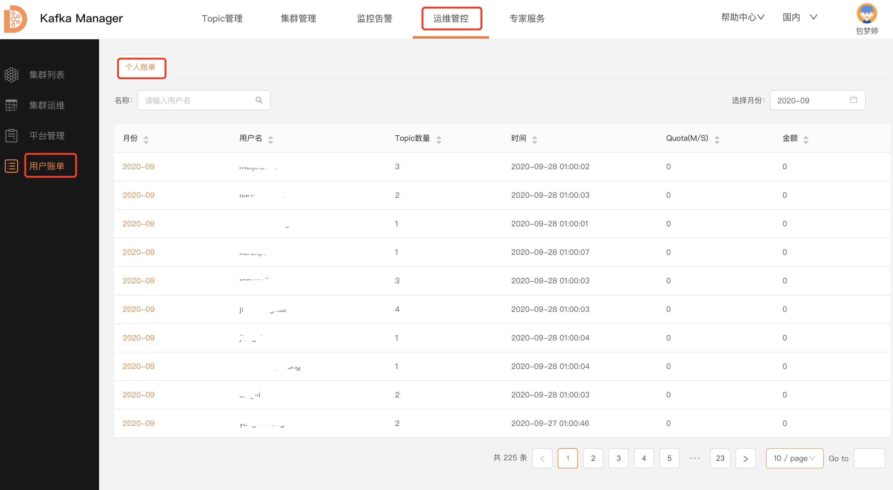

## 专家服务 ##

### Topic分区热点 ###

**操作步骤**
步骤1：点击"专家服务">"Topic分区热点">"分区热点Topic"。

步骤2：展示所有Topic列表，并可以根据物理集群、Topic名称进行筛选。

列表显示Topic名称、所在集群、分区热点状态（鼠标悬停可以查看具体的说明）、操作（数据迁移）。

### 数据迁移操作 ###

**操作步骤**
步骤1：点击"专家服务">"Topic分区热点">"分区热点Topic"。

步骤2：可选择单个topic、或批量选中多个topic进行数据迁移操作。如图。

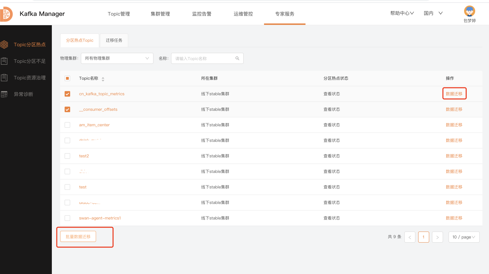

步骤2：点击【数据迁移】之后出现迁移任务填写抽屉式弹框，

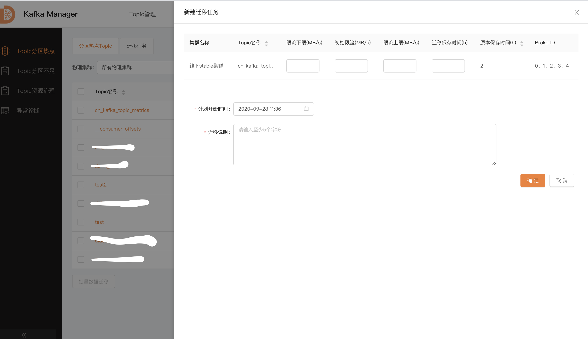

#### 迁移任务 ####

**操作步骤**
步骤1：点击"专家服务">"Topic分区热点">"迁移任务"。

步骤2：可查看迁移任务列表，展示迁移任务名称、创建时间、创建人、Topic数量、任务状态、进度、操作。

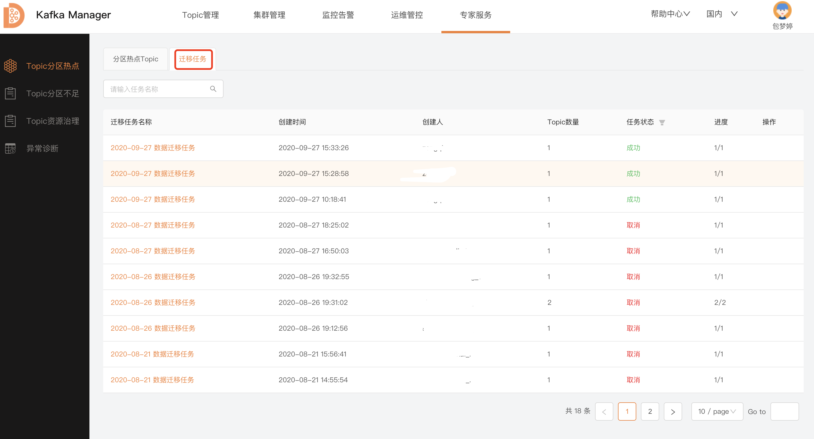

步骤2：点击任务名称可以查看到任务详情。

#### Topic分区不足 ####

**操作步骤**
步骤1：点击"专家服务">"Topic分区不足"

步骤2：可查看Topic名称，所在集群、分区个数、分区平均流量、近三天峰值流量、操作。

步骤3：可通过选择集群、Topic名称查找目标Topic。

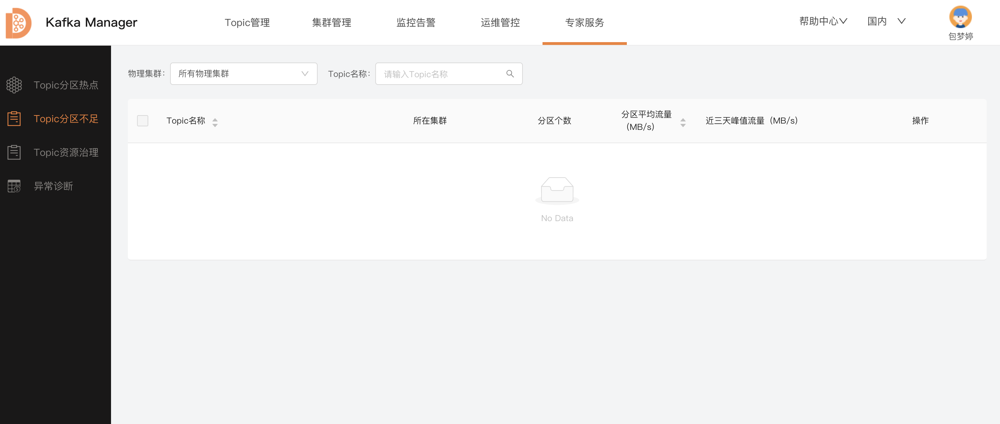

#### Topic资源治理 ####

**操作步骤**
步骤1：点击"专家服务">"Topic资源治理"

步骤2：可查看Topic名称，所在集群、过期天数、发送连接、消费连接、创建人、状态、操作（通知用户）。

步骤3：可通过选择集群、Topic名称查找目标Topic。

步骤4：点击通知用户可以通知用户该Topic已过期。

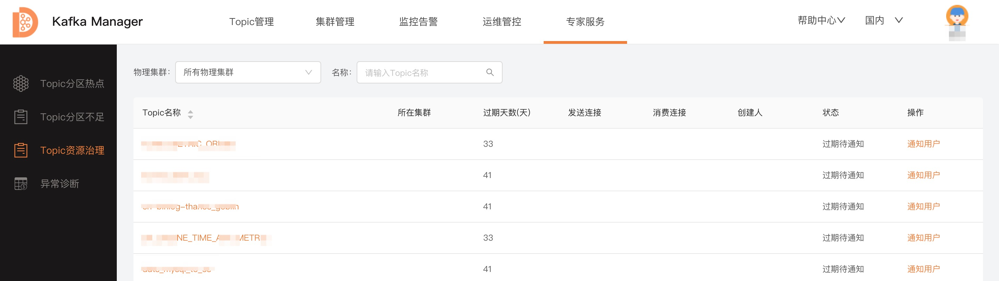

#### Topic异常诊断 ####

**操作步骤**
步骤1：点击"专家服务">"异常诊断"。

步骤2：可查看Topic名称，所在独享集群、IOPS、流量。

步骤3：可通过时间筛选，查看时间范围内的异常topic。

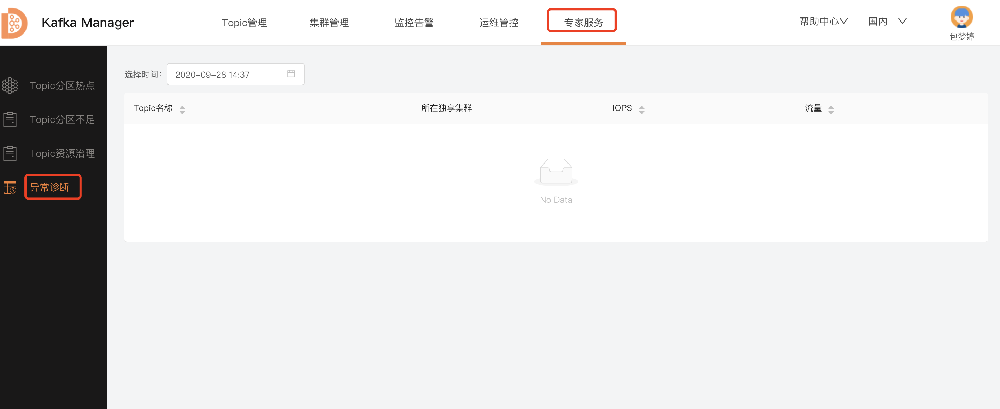

