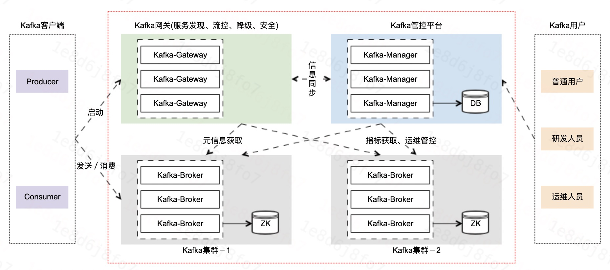

# `Logi-Kafka` 云平台－简介

[TOC]

## 1、产品架构

- 资源层：`Logi-Kafka` 云平台最底层是资源层，是MySQL、Zookeeper及一些容器和物理机；
- 引擎层：资源层之上是引擎层，这块主要是在社区`Kafka`基础上，增加了磁盘过载保护、指标埋点等40+优化改进后的`Kafka`消息队列服务；
- 网关层：引擎层再之上是网关层，网关层主要是对Kafka-Topic的消费与发送进行权限管控、流量管控。以及还有，客户端接入时的服务发现和降级等功能；
- 服务层：网关层再往上是服务层，基于滴滴内部Kafka平台的服务的经验沉淀，服务层具备Topic管理、集群管理等一套比较完善的监控及管控服务能力；
- 平台层：最顶层是平台层，基于服务层的能力及用户角色权限的管控，平台层面向不同用户分别展示了用户控制台、运维控制台及一些开放的接口。

## 2、模块功能

- Kafka集群(`Kafka-Brokers`)：在`Apache-Kafka`的基础上，增加磁盘过载保护、指标体系细化及性能优化等特性后的Kafka。
&nbsp;
- Kafka网关(`Kafka-Gateway`)：滴滴自研的具备服务发现、流量控制、服务降级及安全管控等能力的Kafka集群网关。备注：部分网关的能力被嵌入于`Kafka-Broker`中。
&nbsp;
- Kafka管控平台(`Kafka-Manager`)：滴滴自研的面向`Kafka`的普通用户、研发人员及运维人员的一站式`Kafka`集群监控 & 运维管控平台。

&nbsp;

介绍完云平台整体架构之后，我们再来大致介绍一下各模块的功能及他们之间的交互。

- Kafka集群(`Kafka-Brokers`)
1、承接`Kafka`客户端的发送及消费请求并进行处理。
**2、`Kafka`网关中的流控和安全的能力嵌入于其中。**
3、从`Kafka-Manager`定时同步权限和用户信息。
4、将`Topic`的连接信息`POST`到`Kafka-Manager`。
5、Kafka网关－服务发现模块会到`Kafka`集群同步元信息。
6、强依赖于`Zookeeper`。
&nbsp;
- Kafka网关(`Kafka-Gateway`) 之 服务发现
1、`Kafka`统一对外的服务地址。
2、`Kafka`客户端启动时，会首先请求服务发现，从而获取`Topic`的元信息。
3、从`Kafka-Manager`定时同步各个集群的实际服务地址和流控降级信息。
&nbsp;
- Kafka管控平台(`Kafka-Manager`)
1、用户管控平台。
2、服务发现和`Kafka`集群会定期进行集群实际服务地址、用户信息及权限信息进行同步。
3、从`Kafka`集群中获取集群元信息及指标信息。

## 3、总结

本节概要介绍了一下滴滴`Logi-Kafka`云平台产品的整体架构 以及 相关模块的大体功能及之间的相互交互关系。
