# `Kafka` 本地开发环境搭建

[TOC]

## 1、环境准备

本地开发环境搭建之前，需要准备好如下环境。

- JDK 11
- IDEA 2020.x
- Gradle 5.5.1
- Zookeeper

## 2、开发环境配置

环境准备好之后，我们便开始进行开发环境的配置。

**步骤一：打开工程，修改IDEA的配置**

修改Gradle配置
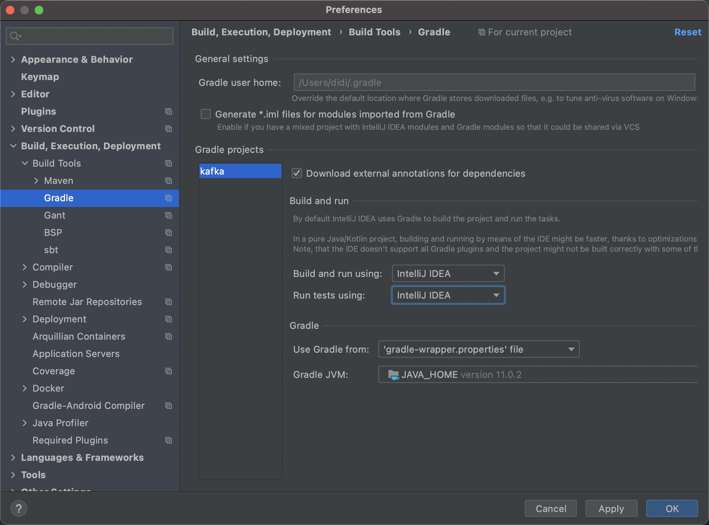

修改Java Compiler配置，如下图所示增加`--add-exports=java.base/sun.nio.ch=ALL-UNNAMED`
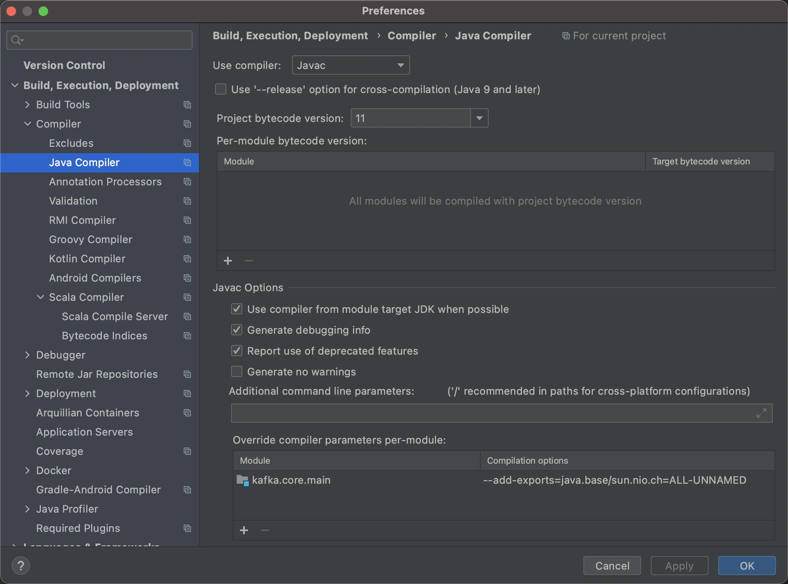

**步骤二：进行编译，生成消息协议文件**

```
./gradlew assemble
```

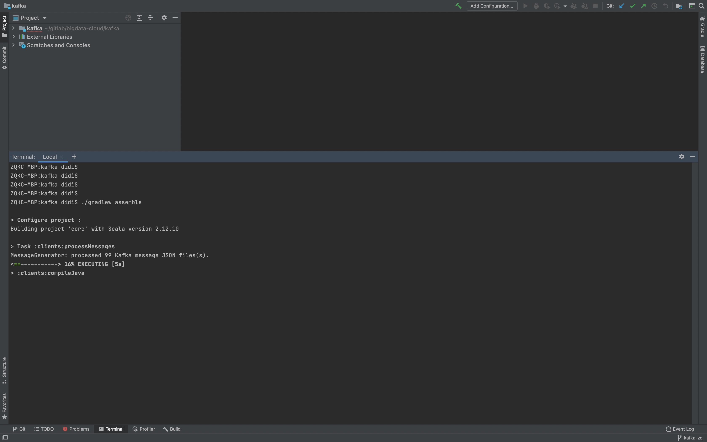

**步骤三：修改build.gradle文件**

修改`artifactory` 及 开启`1.8`的兼容

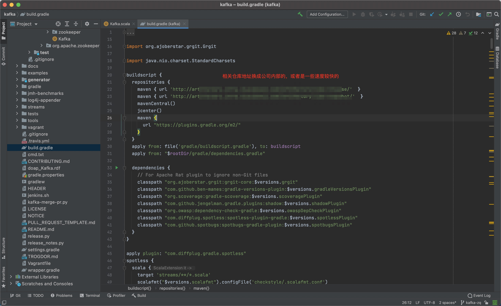


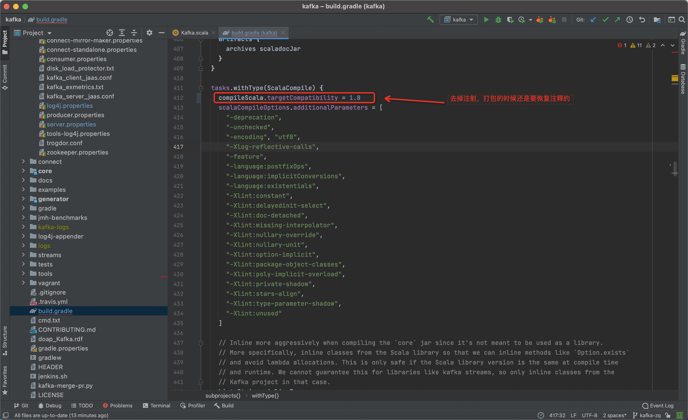

**步骤四：修改启动配置**

```java
// 部分看不清的补充说明

// VM配置
// 日志输出位置、log4j配置文件位置、认证文件的位置
-Dkafka.logs.dir=logs -Dlog4j.configuration=file:config/log4j.properties -Djava.security.auth.login.config=config/kafka_server_jaas.conf 

// 参数配置
config/server.properties
```

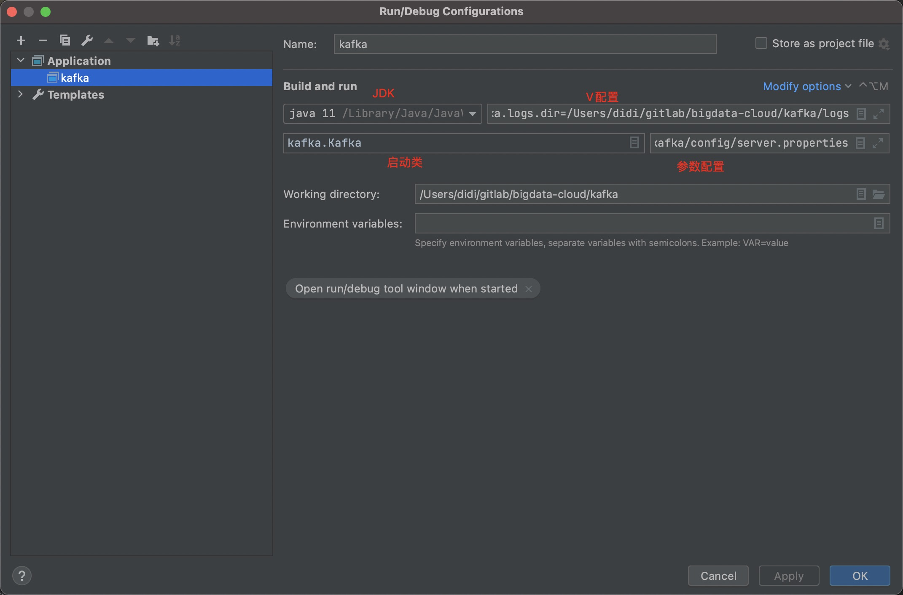

**步骤五：开始编译**

点击`IDEA`正上方绿色的类似锤子的按钮，开始进行编译。

编译中：


编译完成：
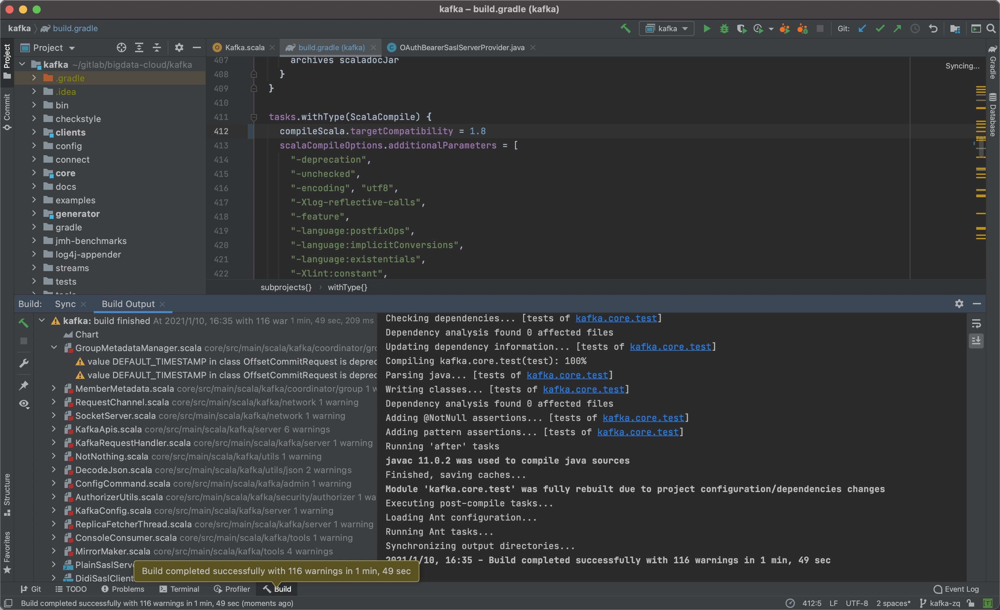

**步骤六：配置Kafka配置文件**
在步骤三中，我们设置了Kafka本地启动涉及到的`server.properties`和`log4j.properties`等文件，这里需要修改的主要是`server.properties`。

```java
// server.properties 中主要需要修改的配置
zookeeper.connect=xxxx
gateway.url=xxxx
cluster.id=xxxx

// 其他相关的配置可按需进行调整
```

server.properties配置
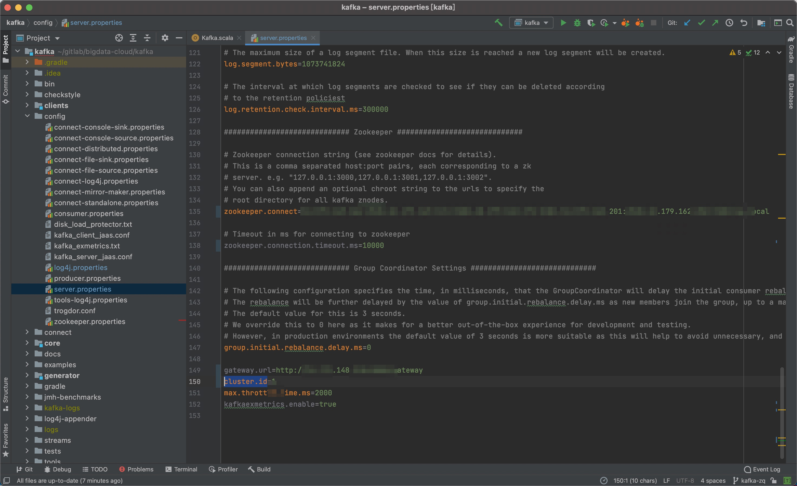

log4j.properties配置
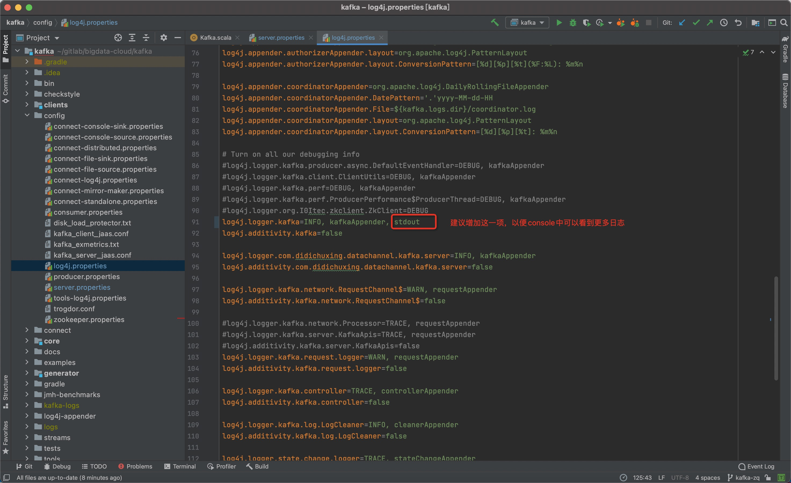

**步骤七：启动Kafka**

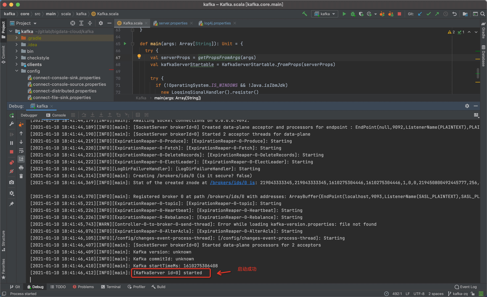


至此，Kafka本地开发环境便搭建完成了。


## 3、日常命令

```java
// 编译
./gradlew assemble

// 打包，打包完成之后会在core/build/distributions生成打包之后的.tgz文件
./gradlew clean releaseTarGz

// 更多具体的命令可以看2.5版本源码包里面的cmd.txt文件
```

## 4、Kafka 工程代码结构

主要代码在`clients`和`core`这两个地方。`clients`主要是Java客户端代码。`core`是Kafka服务端代码，也是最重要的代码。

本次主要介绍一下`core`模块，`clients`模块会在后续进行介绍。`core`模块主要有两部分代码，一部分是社区原生的代码，还有一部分是我们滴滴加入的一些代码。

### 4.1 Kafka-Core

这部分`core`模块里面主要是原生的`kafka scala`代码。

首先看一下图：
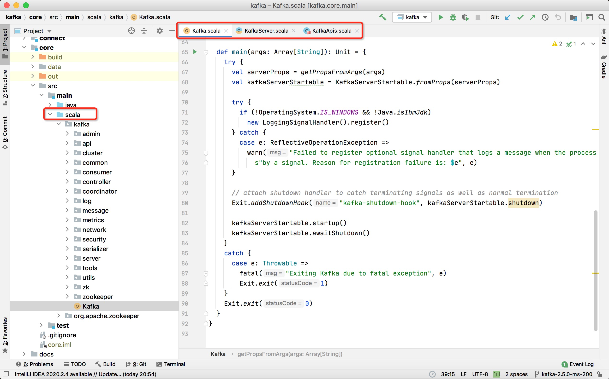

&nbsp;
模块的说明：

| 模块      |     说明 
| :-------- |:--------:|
| admin    | 管理员运维操作相关模块 
| api    | 该模块主要负责交互数据的组装，客户端与服务端交互数据编解码 
| cluster    | Cluster、broker等几个实体类 
| common    | 通用模块，主要是异常类和错误验证 
| contoroller    | Controller相关模块 
| coordinator    | 消费的Coordinator和事物的Coordinator 
| log    | Kafka文件存储模块 
| metrics    | 监控指标metrics模块 
| network    | 网络事件处理模块 
| security    | 安全模块 
| server    | 服务端主模块，业务请求处理入口 
| tools/utils    | 工具相关模块 
| zk/zookeeper    | ZK相关模块 

&nbsp;

### 4.2 Kafka-Core-DiDi

这部分`core`模块里面主要是我们滴滴扩展的`kafka java`代码。

首先看一下图：

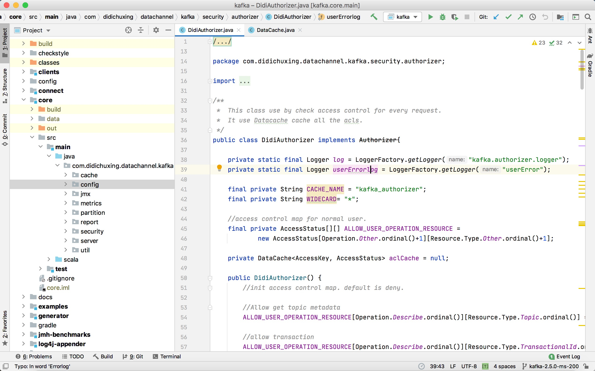

&nbsp;
模块的说明：

| 模块      |     说明 
| :-------- |:--------:|
| cache    | 缓存模块，主要缓存权限和用户信息并进行同步等 
| config    | 配置模块 
| jmx    | jmx相关模块 
| metrics    | 滴滴Kafka特有的指标 
| partition    | 旧版的分区禁用模块，代码基本废弃了 
| report    | 上报模块，主要上报Topic连接信息 
| security    | 安全管控模块 
| server    | 服务端能力增强模块，包括磁盘过载保护等 
| util    | 工具类 

## 5、环境搭建问题记录  
1. 启动程序报错：  
   Error:scalac: ‘jvm-11’ is not a valid choice for ‘-target’和scalac: bad option: ‘-target:jvm-11’  
   解决办法：  
   1. 项目的根目录下找到.idea文件夹  
   2. 找到文件夹中scala_compiler.xml文件
   3. 注释掉其中的<parameter value="-target:jvm-11"
   4. 最后重启IDEA即可
## 6、总结

本次介绍了Kafka本地开发环境的搭建以及Kafka相关模块的说明。有兴趣的同学可以尝试着搭建一套本地开发环境，方便后续的学习、日常的开发及问题的定位等。
