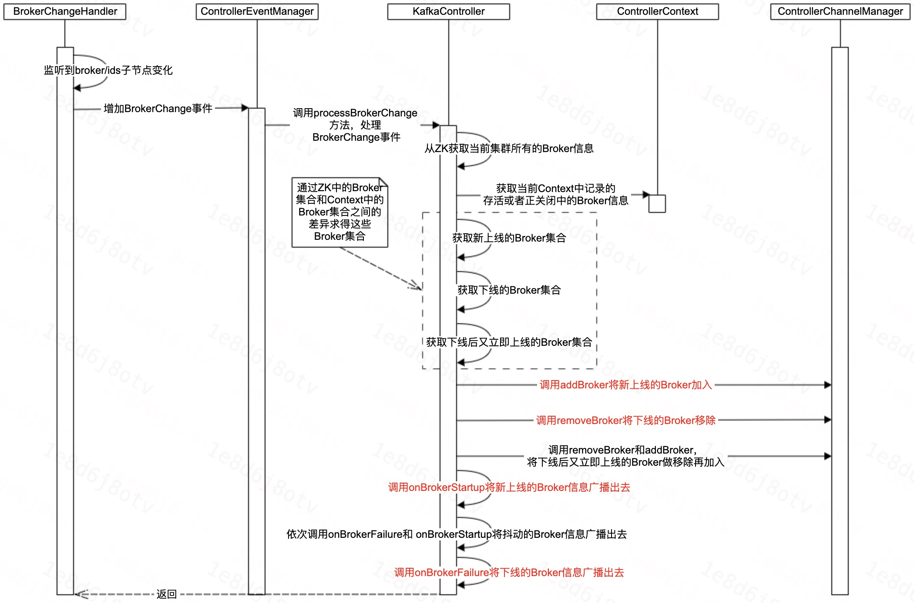
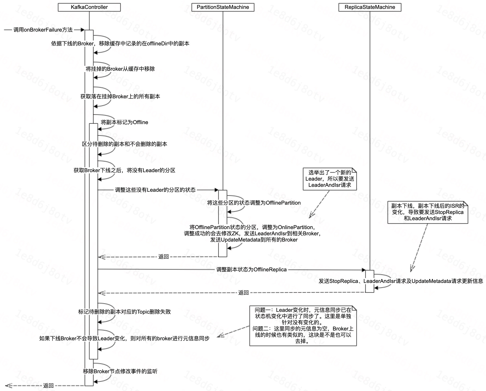
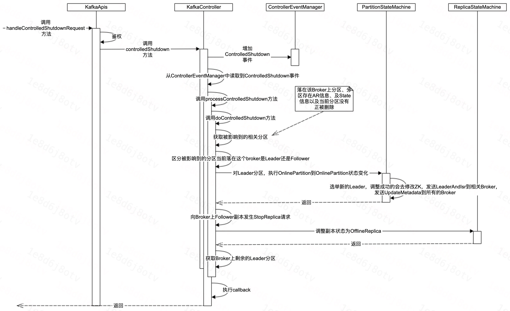

# Kafka控制器—处理Broker上下线

[TOC]

## 1、前言

Broker的上下线，除了Broker自身的启停之外呢，Controller还需要对Broker的上下线做元信息的同步等。

Controller在感知Broker上下线的过程中，主要做了：
1. 更新本地缓存的元信息；
2. 下线的关闭连接，新增的增加连接；
3. 调整下线副本的状态；
4. 调整需要重新选举Leader的分区；
5. 进行元信息的同步；

以上就是Controller做的相关事情，下面我们在细看一下具体的流程。


## 2、处理上下线

### 2.1、感知方式

1. Broker正常上线：Controller感知ZK节点的变化来感知到Broker的上线。
2. Broker正常下线：Broker主动发送ControlShutdown请求给Controller进行处理后再退出，退出后Controller感知到ZK节点变化后再次进行处理。
3. Broker异常下线：Controller感知ZK节点的变化来感知Broker的下线。

那么归结起来，处理上下线就两个流程，一个是通过ZK进行上下线的处理。还有一个是处理ControlShutdown请求来进行Broker下线的处理。


### 2.2、通过ZK感知Broker上下线

#### 2.2.1、大体流程




#### 2.2.2、AddBroker & RemoveBroker

这块流程非常的简单，这里就不画相关说明图了，我们直接来看一下代码。

**AddBroker**

```Java
  def addBroker(broker: Broker): Unit = {
    // be careful here. Maybe the startup() API has already started the request send thread
    brokerLock synchronized {
      if (!brokerStateInfo.contains(broker.id)) {
        addNewBroker(broker)
        startRequestSendThread(broker.id)
      }
    }
  }

  private def addNewBroker(broker: Broker): Unit = {
    // 日志及配置等

    // 创建NetworkClient
    val (networkClient, reconfigurableChannelBuilder) = {
      val channelBuilder = ChannelBuilders.clientChannelBuilder(。。。。。。)
      val reconfigurableChannelBuilder = channelBuilder match {。。。。。。。}
      val selector = new Selector(。。。。。。)
      val networkClient = new NetworkClient(。。。。。。)
      (networkClient, reconfigurableChannelBuilder)
    }
    val threadName = threadNamePrefix match {
      case None => s"Controller-${config.brokerId}-to-broker-${broker.id}-send-thread"
      case Some(name) => s"$name:Controller-${config.brokerId}-to-broker-${broker.id}-send-thread"
    }

    // metrics

    // 创建请求网络IO处理线程
    val requestThread = new RequestSendThread(config.brokerId, controllerContext, messageQueue, networkClient,
      brokerNode, config, time, requestRateAndQueueTimeMetrics, stateChangeLogger, threadName)
    requestThread.setDaemon(false)

    // metrics

    // 缓存创建的信息
    brokerStateInfo.put(broker.id, ControllerBrokerStateInfo(networkClient, brokerNode, messageQueue,
      requestThread, queueSizeGauge, requestRateAndQueueTimeMetrics, reconfigurableChannelBuilder))
  }
```

**RemoveBroker**

```Java
  def removeBroker(brokerId: Int): Unit = {
    brokerLock synchronized {
      removeExistingBroker(brokerStateInfo(brokerId))
    }
  }

  private def removeExistingBroker(brokerState: ControllerBrokerStateInfo): Unit = {
    try {
      // 关闭相关新建的对象
      brokerState.reconfigurableChannelBuilder.foreach(config.removeReconfigurable)
      brokerState.requestSendThread.shutdown()
      brokerState.networkClient.close()
      brokerState.messageQueue.clear()
      removeMetric(QueueSizeMetricName, brokerMetricTags(brokerState.brokerNode.id))
      removeMetric(RequestRateAndQueueTimeMetricName, brokerMetricTags(brokerState.brokerNode.id))
      brokerStateInfo.remove(brokerState.brokerNode.id)
    } catch {
      case e: Throwable => error("Error while removing broker by the controller", e)
    }
  }
```

#### 2.2.3、处理Broker上线(onBrokerStartup)

##### 2.2.3.1、大体流程


##### 2.2.3.2、相关代码

```Java
  private def onBrokerStartup(newBrokers: Seq[Int]): Unit = {
    info(s"New broker startup callback for ${newBrokers.mkString(",")}")
    newBrokers.foreach(controllerContext.replicasOnOfflineDirs.remove)
    val newBrokersSet = newBrokers.toSet
    val existingBrokers = controllerContext.liveOrShuttingDownBrokerIds -- newBrokers
    
    // 发送空的元信息到已存在的broker上
    sendUpdateMetadataRequest(existingBrokers.toSeq, Set.empty)
    
    // 发送完整的元信息到新增的Broker上
    sendUpdateMetadataRequest(newBrokers, controllerContext.partitionLeadershipInfo.keySet)

    // 或者到所有在新增Broker上的副本
    val allReplicasOnNewBrokers = controllerContext.replicasOnBrokers(newBrokersSet)
    
    // 变更副本状态
    replicaStateMachine.handleStateChanges(allReplicasOnNewBrokers.toSeq, OnlineReplica)
    
    // 变更分区状态
    partitionStateMachine.triggerOnlinePartitionStateChange()

    // 恢复迁移
    maybeResumeReassignments { (_, assignment) =>
      assignment.targetReplicas.exists(newBrokersSet.contains)
    }

    // 恢复删除
    val replicasForTopicsToBeDeleted = allReplicasOnNewBrokers.filter(p => topicDeletionManager.isTopicQueuedUpForDeletion(p.topic))
    if (replicasForTopicsToBeDeleted.nonEmpty) {
      // 日志
      topicDeletionManager.resumeDeletionForTopics(replicasForTopicsToBeDeleted.map(_.topic))
    }

    // 注册监听
    registerBrokerModificationsHandler(newBrokers)
  }
```

#### 2.2.4、处理Broker下线(onBrokerFailure)

##### 2.2.4.1、大体流程




##### 2.2.4.2、相关代码

```Java
  private def onBrokerFailure(deadBrokers: Seq[Int]): Unit = {
    info(s"Broker failure callback for ${deadBrokers.mkString(",")}")
    // 缓存中移除dead-broker

    // 获取到dead-broker上相关的副本
    val allReplicasOnDeadBrokers = controllerContext.replicasOnBrokers(deadBrokers.toSet)

    // 相关副本状态处理
    onReplicasBecomeOffline(allReplicasOnDeadBrokers)

    // 取消Broker节点被修改的事件的监听
    unregisterBrokerModificationsHandler(deadBrokers)
  }

  private def onReplicasBecomeOffline(newOfflineReplicas: Set[PartitionAndReplica]): Unit = {
    // 被影响的副本中，区分是要被删除的和不用被删除的
    val (newOfflineReplicasForDeletion, newOfflineReplicasNotForDeletion) =
      newOfflineReplicas.partition(p => topicDeletionManager.isTopicQueuedUpForDeletion(p.topic))

    // 获取broker下线后将无leader的分区
    val partitionsWithoutLeader = controllerContext.partitionLeadershipInfo.filter(partitionAndLeader =>
      !controllerContext.isReplicaOnline(partitionAndLeader._2.leaderAndIsr.leader, partitionAndLeader._1) &&
        !topicDeletionManager.isTopicQueuedUpForDeletion(partitionAndLeader._1.topic)).keySet

    // 无leader的分区进行状态切换，及leader选举
    partitionStateMachine.handleStateChanges(partitionsWithoutLeader.toSeq, OfflinePartition)
    partitionStateMachine.triggerOnlinePartitionStateChange()
    
    // 不删除的副本的状态切换
    replicaStateMachine.handleStateChanges(newOfflineReplicasNotForDeletion.toSeq, OfflineReplica)

    if (newOfflineReplicasForDeletion.nonEmpty) {
      // 需要删除的副本的Topic标记删除失败
      topicDeletionManager.failReplicaDeletion(newOfflineReplicasForDeletion)
    }

    // 如果没有leader变化的分区，则对所有broker进行空的元信息同步
    if (partitionsWithoutLeader.isEmpty) {
      sendUpdateMetadataRequest(controllerContext.liveOrShuttingDownBrokerIds.toSeq, Set.empty)
    }
  }
```


### 2.3、Broker主动下线——处理ControlShutdown请求

#### 2.3.1、大体流程



#### 2.3.2、相关代码

```Java
  // 逐层调用
  def handleControlledShutdownRequest(request: RequestChannel.Request): Unit = {
      //////
  }

  private def processControlledShutdown(id: Int, brokerEpoch: Long, controlledShutdownCallback: Try[Set[TopicPartition]] => Unit): Unit = {
      //////
  }

  // 执行下线请求的处理
  private def doControlledShutdown(id: Int, brokerEpoch: Long): Set[TopicPartition] = {
    if (!isActive) {
      throw new ControllerMovedException("Controller moved to another broker. Aborting controlled shutdown")
    }

    // epoch值异常，抛出异常。broker不存在，抛出异常等
    
    // 加入shuttingdown中
    controllerContext.shuttingDownBrokerIds.add(id)
    
    // 获取本次broker下线影响到的分区
    val partitionsToActOn = controllerContext.partitionsOnBroker(id).filter { partition =>
      controllerContext.partitionReplicaAssignment(partition).size > 1 &&
        controllerContext.partitionLeadershipInfo.contains(partition) &&
        !topicDeletionManager.isTopicQueuedUpForDeletion(partition.topic)
    }

    // 分区区分是leader分区还是follower分区
    val (partitionsLedByBroker, partitionsFollowedByBroker) = partitionsToActOn.partition { partition =>
      controllerContext.partitionLeadershipInfo(partition).leaderAndIsr.leader == id
    }

    // leader分区进行leader重新选举等
    partitionStateMachine.handleStateChanges(partitionsLedByBroker.toSeq, OnlinePartition, Some(ControlledShutdownPartitionLeaderElectionStrategy))
    try {
      brokerRequestBatch.newBatch()
      partitionsFollowedByBroker.foreach { partition =>
        brokerRequestBatch.addStopReplicaRequestForBrokers(Seq(id), partition, deletePartition = false)
      }
      brokerRequestBatch.sendRequestsToBrokers(epoch)
    } catch {
      case e: IllegalStateException =>
        handleIllegalState(e)
    }

    // Follower分区的副本，调整状态为OfflineReplica
    replicaStateMachine.handleStateChanges(partitionsFollowedByBroker.map(partition =>
      PartitionAndReplica(partition, id)).toSeq, OfflineReplica)

    def replicatedPartitionsBrokerLeads() = {
      // 获取获取落在broker上的leader分区
    }
    replicatedPartitionsBrokerLeads().toSet
  }
```

## 3、常见问题

### 3.1、元信息同步的范围

准守的基本原则：
1. Topic的Leader及Follower的信息没有变化时，基本上只需要发送UpdateMetadata请求，会发送到所有的Broker。
2. 如果Topic的Leader或Follower的信息发生变化了，则会对迁移到的相关Broker发送LeaderAndIsr请求以更新副本之间的同步状态。此外还会对整个集群的Broker发送UpdateMetadata请求，从而保证集群每个Broker上缓存的元信息是一致的。
3. 牵扯到副本的暂停副本同步的时候，会对相关的Broker发送StopReplica的请求。

此外呢，我们在代码中也可以看到，有时候还会发送空的UpdateMetadata请求到Broker。

这个的主要原因是：
UpdateMetadata请求，除了同步Topic元信息之外，还会同步集群的Broker信息。所以最后一个原则：
- 即使Topic都没有变化，但是Broker发生变化的时候，也会发送UpdateMetadata请求。


### 3.2、元信息同步性能

上述的操作的主流程上，除了和ZK可能存在部分的网络IO之外，不会存在和集群其他的Broker的直接的网络IO。

因此，基本上秒级或者更短的时间可处理完。


## 4、总结

本次分享了Broker上下线过程中，Controller需要做的事情，然后对常见的问题进行了讨论。以上就是本次分享的全部内容，谢谢大家。
