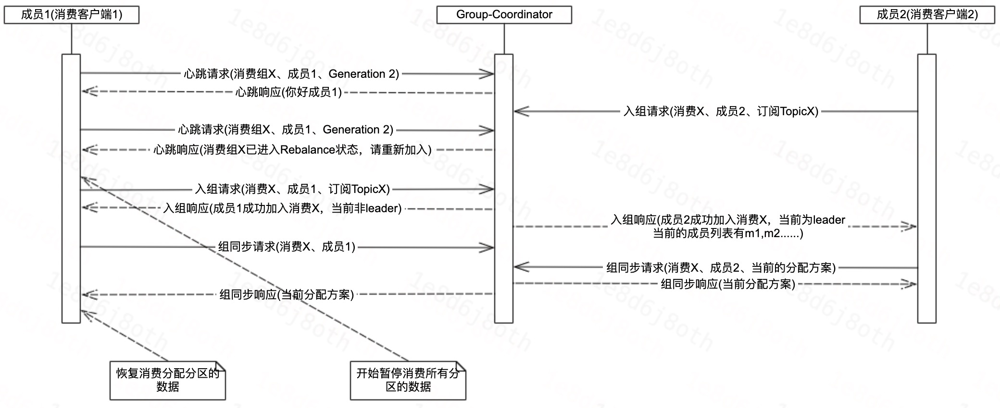
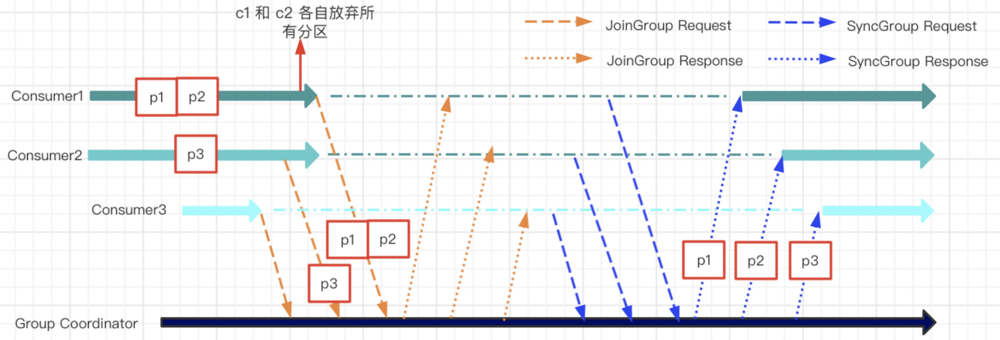
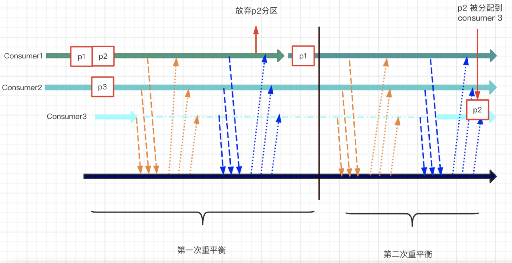

# KIP-415—增量Rebalance协议

[TOC]

## 1、背景

Kafka为了让消费数据这个过程在Kafka集群中尽可能的均衡，Kafka设计了消费客户端的Rebalance功能，Rebalance能够帮助Kafka客户端尽可能的实现负载均衡。

但是在Kafka 2.3版本之前，Rebalance各种分配策略基本都是基于Eager协议(包括RangeAssignor，RoundRobinAssignor等)，也就是大家熟悉的旧的Rebalance。旧的Rebalance一直以来都为人诟病，因为Rebalance过程会触发Stop The World(STW)，此时对应Topic的资源都会处于不可用的状态，小规模的集群还好，如果是大规模的集群，比如几百个节点的Consumer消费客户度等，那么重平衡就是一场灾难。

在2.x的时候，社区意识到需要对现有的Rebalance做出改变。所以在Kafka 2.3版本，首先在Kafka Connect应用了Cooperative协议，然后在Kafka 2.4版本时候的时候，在Kafka Consumer Client中也添加了该协议的支持。

本次分享，我们就来对这个特性进行一个简单的介绍。

## 2、增量Rebalance协议

### 2.1、Eager协议 与 Cooperative协议 的Rebalance过程

**Eager协议**



网上抄袭的美图：




**Cooperative协议**


网上抄袭的美图：



### 2.2、代码实现

客户端这块的代码实现上，整体和Eager协议差不多，仅仅只是在一些点做了一些改动，具体的见：

#### 2.2.1、JoinGroup前
```Java
    @Override
    protected void onJoinPrepare(int generation, String memberId) {
        // 相关日志等

        final Set<TopicPartition> revokedPartitions;
        if (generation == Generation.NO_GENERATION.generationId && memberId.equals(Generation.NO_GENERATION.memberId)) {
            // 。。。 错误的情况
        } else {
            switch (protocol) {
                case EAGER: 
                    // EAGER协议，放弃了所有的分区
                    revokedPartitions = new HashSet<>(subscriptions.assignedPartitions());
                    exception = invokePartitionsRevoked(revokedPartitions);

                    subscriptions.assignFromSubscribed(Collections.emptySet());

                    break;

                case COOPERATIVE:
                    // COOPERATIVE协议，仅放弃不在subscription中的分区
                    // 不被放弃的分区，还是处于一个可用的状态(FETCHING状态)
                    Set<TopicPartition> ownedPartitions = new HashSet<>(subscriptions.assignedPartitions());
                    revokedPartitions = ownedPartitions.stream()
                        .filter(tp -> !subscriptions.subscription().contains(tp.topic()))
                        .collect(Collectors.toSet());

                    if (!revokedPartitions.isEmpty()) {
                        exception = invokePartitionsRevoked(revokedPartitions);

                        ownedPartitions.removeAll(revokedPartitions);
                        subscriptions.assignFromSubscribed(ownedPartitions);
                    }

                    break;
            }
        }

        isLeader = false;
        subscriptions.resetGroupSubscription();

        if (exception != null) {
            throw new KafkaException("User rebalance callback throws an error", exception);
        }
    }
```


#### 2.2.2、SyncGroup前

SyncGroup之前，就是使用Cooperative协议的分配器，对分区进行分配。在2.5版本中，CooperativeStickyAssignor是支持Cooperative协议，具体的代码可以看CooperativeStickyAssignor这个类，这里就不展开介绍了。


#### 2.2.3、SyncGroup后

在一轮的Rebalance结束之后，最后会重新设置分配的状态。

```Java
    @Override
    protected void onJoinComplete(int generation,
                                  String memberId,
                                  String assignmentStrategy,
                                  ByteBuffer assignmentBuffer) {
        // 公共部分

        final AtomicReference<Exception> firstException = new AtomicReference<>(null);
        Set<TopicPartition> addedPartitions = new HashSet<>(assignedPartitions);
        addedPartitions.removeAll(ownedPartitions);

        if (protocol == RebalanceProtocol.COOPERATIVE) {// COOPERATIVE协议单独多处理的部分
            // revokedPartitions是需要放弃的分区，ownedPartitions是上一次拥有的分区，assignedPartitions是本次分配的分区
            Set<TopicPartition> revokedPartitions = new HashSet<>(ownedPartitions); 
            revokedPartitions.removeAll(assignedPartitions);

            log.info("Updating assignment with\n" +
                    "now assigned partitions: {}\n" +
                    "compare with previously owned partitions: {}\n" +
                    "newly added partitions: {}\n" +
                    "revoked partitions: {}\n",
                Utils.join(assignedPartitions, ", "),
                Utils.join(ownedPartitions, ", "),
                Utils.join(addedPartitions, ", "),
                Utils.join(revokedPartitions, ", ")
            );

            if (!revokedPartitions.isEmpty()) {
                // 如果存在需要放弃的分区，则触发re-join等
                firstException.compareAndSet(null, invokePartitionsRevoked(revokedPartitions));

                // if revoked any partitions, need to re-join the group afterwards
                log.debug("Need to revoke partitions {} and re-join the group", revokedPartitions);
                requestRejoin();
            }
        }

        // 其他公共调用
```


### 2.3、使用例子

在Kafka集群支持该协议的前提下，仅需在Kafka消费客户端的配置中加上这个配置即可。

```Java
props.put(ConsumerConfig.PARTITION_ASSIGNMENT_STRATEGY_CONFIG, Collections.singletonList(CooperativeStickyAssignor.class));
```


### 2.4、客户端日志

**客户端一**

```Java
// 第一轮：

// 仅有一个客户端时，所有的分区都分配给该客户端
2021-06-08 20:17:50.252 [main] INFO  o.a.k.c.consumer.internals.ConsumerCoordinator - [Consumer clientId=consumer-cg_logi_kafka_test_1-1, groupId=cg_logi_kafka_test_1] Finished assignment for group at generation 9: {consumer-cg_logi_kafka_test_1-1-56a695ad-68c2-4e09-88a2-759e3854e366=Assignment(partitions=[kmo_community-0, kmo_community-1, kmo_community-2])}

// 第一轮仅有一个客户端的时候，所有分区都分配该客户端
2021-06-08 20:17:50.288 [main] DEBUG o.a.k.c.consumer.internals.ConsumerCoordinator - [Consumer clientId=consumer-cg_logi_kafka_test_1-1, groupId=cg_logi_kafka_test_1] Executing onJoinComplete with generation 9 and memberId consumer-cg_logi_kafka_test_1-1-56a695ad-68c2-4e09-88a2-759e3854e366
2021-06-08 20:17:50.288 [main] INFO  o.a.k.c.consumer.internals.ConsumerCoordinator - [Consumer clientId=consumer-cg_logi_kafka_test_1-1, groupId=cg_logi_kafka_test_1] Updating assignment with
now assigned partitions: kmo_community-0, kmo_community-1, kmo_community-2
compare with previously owned partitions: 
newly added partitions: kmo_community-0, kmo_community-1, kmo_community-2
revoked partitions: 

// 第二轮：

// 存在两个客户端的时候，有一个分区没有分配给任何客户端
2021-06-08 20:18:26.431 [main] INFO  o.a.k.c.consumer.internals.ConsumerCoordinator - [Consumer clientId=consumer-cg_logi_kafka_test_1-1, groupId=cg_logi_kafka_test_1] Finished assignment for group at generation 10: {consumer-cg_logi_kafka_test_1-1-56a695ad-68c2-4e09-88a2-759e3854e366=Assignment(partitions=[kmo_community-1, kmo_community-2]), consumer-cg_logi_kafka_test_1-1-6ea3c93c-d878-4451-81f7-fc6c41d12963=Assignment(partitions=[])}

// 放弃了kmo_community-0分区，但是1，2分区继续保留消费
2021-06-08 20:18:26.465 [main] DEBUG o.a.k.c.consumer.internals.ConsumerCoordinator - [Consumer clientId=consumer-cg_logi_kafka_test_1-1, groupId=cg_logi_kafka_test_1] Executing onJoinComplete with generation 10 and memberId consumer-cg_logi_kafka_test_1-1-56a695ad-68c2-4e09-88a2-759e3854e366
2021-06-08 20:18:26.465 [main] INFO  o.a.k.c.consumer.internals.ConsumerCoordinator - [Consumer clientId=consumer-cg_logi_kafka_test_1-1, groupId=cg_logi_kafka_test_1] Updating assignment with
now assigned partitions: kmo_community-1, kmo_community-2
compare with previously owned partitions: kmo_community-0, kmo_community-1, kmo_community-2
newly added partitions: 
revoked partitions: kmo_community-0

// 第三轮：

// 存在两个客户端的时候，没有分配的客户端，重新非配给了新的消费客户端
2021-06-08 20:18:29.548 [main] INFO  o.a.k.c.consumer.internals.ConsumerCoordinator - [Consumer clientId=consumer-cg_logi_kafka_test_1-1, groupId=cg_logi_kafka_test_1] Finished assignment for group at generation 11: {consumer-cg_logi_kafka_test_1-1-56a695ad-68c2-4e09-88a2-759e3854e366=Assignment(partitions=[kmo_community-1, kmo_community-2]), consumer-cg_logi_kafka_test_1-1-6ea3c93c-d878-4451-81f7-fc6c41d12963=Assignment(partitions=[kmo_community-0])}

// 第三轮rebalance的时候，该客户端没有任何变化
2021-06-08 20:18:29.583 [main] INFO  o.a.k.c.consumer.internals.ConsumerCoordinator - [Consumer clientId=consumer-cg_logi_kafka_test_1-1, groupId=cg_logi_kafka_test_1] Updating assignment with
now assigned partitions: kmo_community-1, kmo_community-2
compare with previously owned partitions: kmo_community-1, kmo_community-2
newly added partitions: 
revoked partitions: 

```


**客户端二**

客户端二是在客户端一稳定运行之后上线的。

```Java

// 第二轮：

// 第二轮rebalance的时候，没有分配到任何分区
2021-06-08 20:18:26.467 [main] DEBUG o.a.k.c.consumer.internals.ConsumerCoordinator - [Consumer clientId=consumer-cg_logi_kafka_test_1-1, groupId=cg_logi_kafka_test_1] Executing onJoinComplete with generation 10 and memberId consumer-cg_logi_kafka_test_1-1-6ea3c93c-d878-4451-81f7-fc6c41d12963
2021-06-08 20:18:26.468 [main] INFO  o.a.k.c.consumer.internals.ConsumerCoordinator - [Consumer clientId=consumer-cg_logi_kafka_test_1-1, groupId=cg_logi_kafka_test_1] Updating assignment with
now assigned partitions: 
compare with previously owned partitions: 
newly added partitions: 
revoked partitions: 

// 第三轮：

// 第三轮rebalance的时候，分配到了kmo_community-0
2021-06-08 20:18:29.584 [main] DEBUG o.a.k.c.consumer.internals.ConsumerCoordinator - [Consumer clientId=consumer-cg_logi_kafka_test_1-1, groupId=cg_logi_kafka_test_1] Executing onJoinComplete with generation 11 and memberId consumer-cg_logi_kafka_test_1-1-6ea3c93c-d878-4451-81f7-fc6c41d12963
2021-06-08 20:18:29.584 [main] INFO  o.a.k.c.consumer.internals.ConsumerCoordinator - [Consumer clientId=consumer-cg_logi_kafka_test_1-1, groupId=cg_logi_kafka_test_1] Updating assignment with
now assigned partitions: kmo_community-0
compare with previously owned partitions: 
newly added partitions: kmo_community-0
revoked partitions: 
```


## 3、常见问题

### 3.1、为什么SyncGroup后，如果存在revokedPartitions分区的时候，还要进行Re-Join操作？

现在的做法：
- 在进行分配的时候，如果将分区X从客户端1夺走，但是并不会立即将其分配给客户端2。因此造成了在这一轮Rebalance结束之后呢，如果存在revokedPartitions，则就还需要进行一轮Rebalance。

那么为什么不修改成：
- 在进行分配的时候，如果将分区X从客户端1夺走，就立即将其分配给客户端2。这样的话，是不是在Rebalance结束之后，即便存在revokedPartitions，那么也不需要进行Rebalance了。

如果这样修改的话，可能存在的问题是，分区X在分配给了客户端2时，还在被客户端1使用，那么客户端得去处理分区X同时被客户端1和客户端2消费的情况，这种情况的正确处理**可能不是非常好处理**，因此没有采用这种方案。

采用增量Rebalance方式，同时串行化进行分区的放弃和分配，和Eager的Rebalance协议的大体处理流程基本一致，因此在实现相对比较简单，不需要去考虑前面提到的竞争问题，而且收益也还可以。


## 4、总结

本次分享简要介绍了一下KIP-429: Kafka Consumer Incremental Rebalance Protocol，功能还是非常的性感的，大家在使用增量Rebalance协议的方式进行消费的时候，有遇到什么问题也欢迎大家一起交流。


## 5、参考

[KIP-429: Kafka Consumer Incremental Rebalance Protocol](https://cwiki.apache.org/confluence/display/KAFKA/KIP-429%3A+Kafka+Consumer+Incremental+Rebalance+Protocol)
