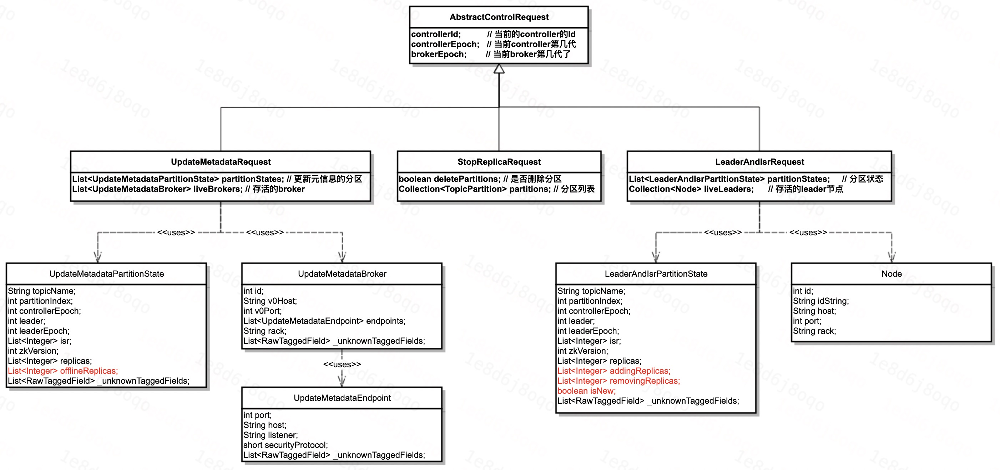
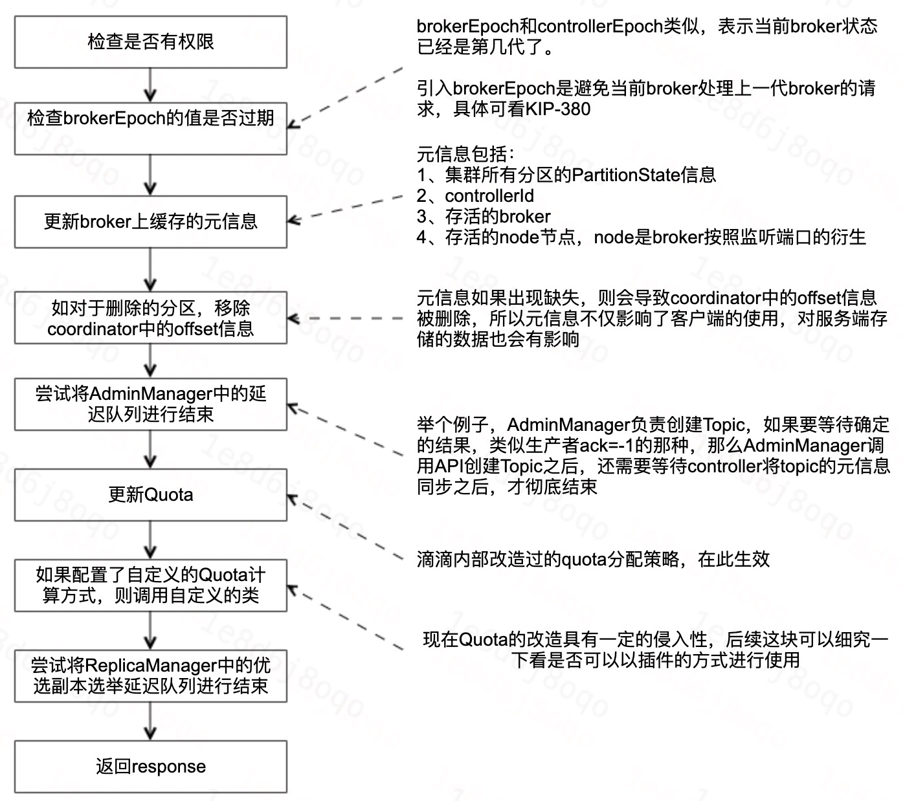
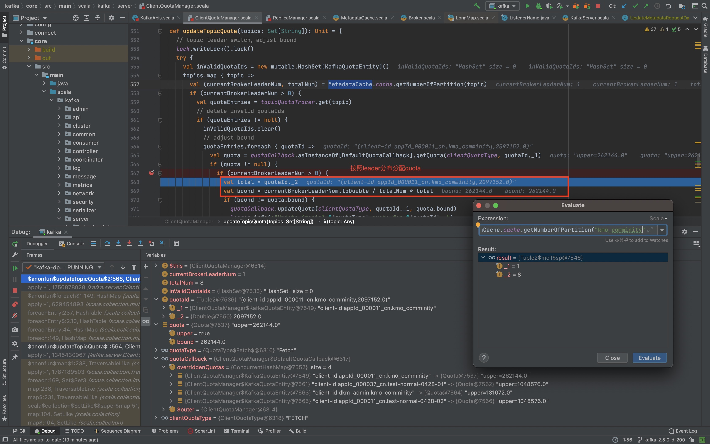
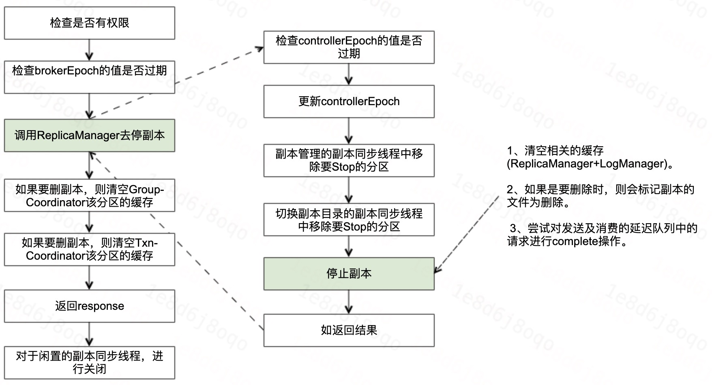
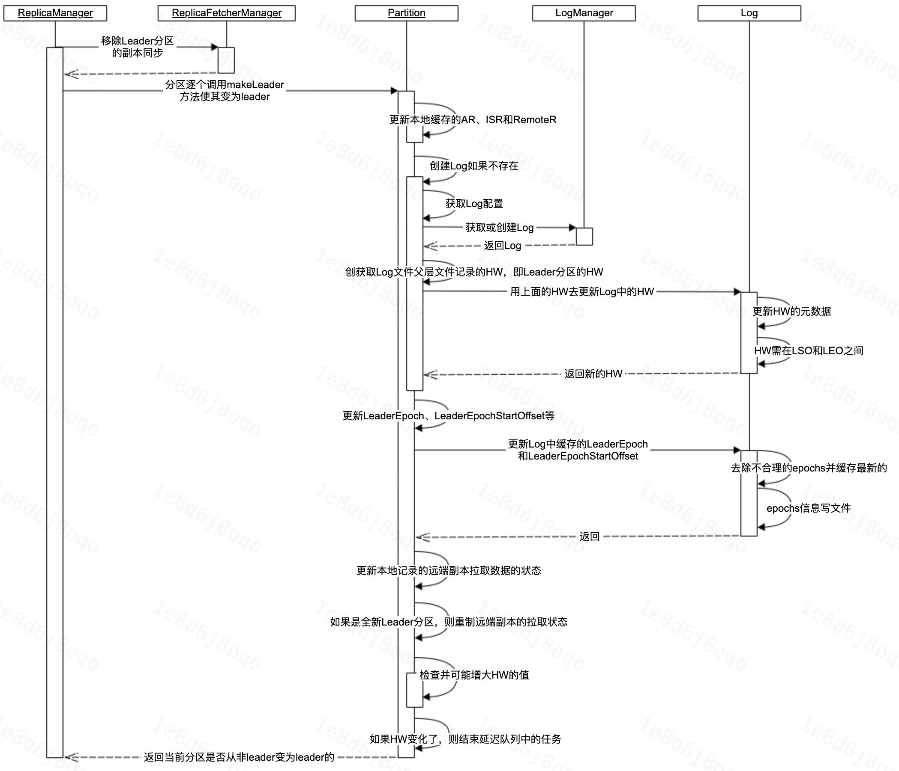
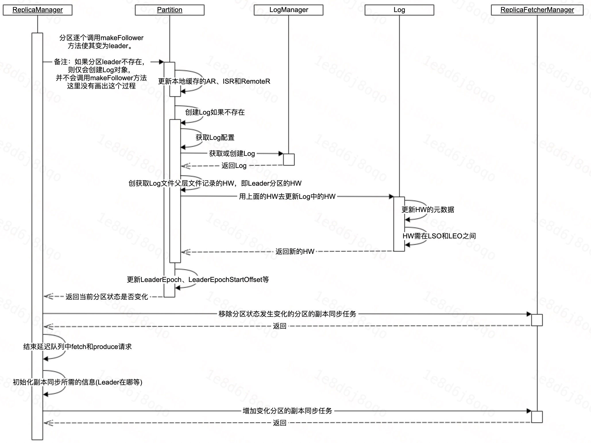

# Kafka Broker 元信息变化请求处理

[TOC]

## 1、前言

Kafka Controller 主要通过 LEADER_AND_ISR、STOP_REPLICA 和 UPDATE_METADATA 三类请求，进行元信息变化的通知。

因此，Kafka Broker 主要也是通过接收 Kafka Controller 发出来的这三个请求，来调整自身的状态。

本期分享主要介绍 Kafka Broker 如何处理这三类请求，以便后续在分享 Kafka Controller 的状态转变、Topic增删改查等专题的时候，对 Kafka Broker 所做的事情有更加清晰快速的认识。

## 2、实现概述

这三个请求对象，都是继承自 AbstractControlRequest ，具体请求类之间的关系如下图所示：



- AbstractControlRequest：三个字段用于告知controllerId，同时还有版本信息，确保只有最新的controller发出来的信息可以被处理。
&nbsp;

- UpdateMetadataRequest：同步集群元信息的请求，同步的信息包括分区信息和存活的broker信息。所有的Broker都会存储一份完整的集群元信息，因此客户端随便请求哪一台Broker都可以获取到Topic的元信息。
&nbsp;

- StopReplicaRequest：通知停副本同步的请求，此外还带有一个是否将副本删除的字段。一般Broker下线、Topic删除、Topic缩副本、Topic迁移等，Kafka Controller都会发送该请求。
&nbsp;

- LeaderAndIsrRequest：通知分区状态(Leader、AR、ISR等)的请求


**问题一：这里我们发现 UPDATE_METADATA 请求和 LEADER_AND_ISR 请求，他们请求的数据格式基本上是一致的，这块为什么要这么设计，为什么不设计成一个接口呢？**

**问题二：这里的Node、Broker还有EndPoint的区别是什么？**

---

## 3、UPDATE_METADATA

### 3.1、UPDATE_METADATA 功能概述

区分 METADATA 请求和 UPDATE_METADATA ，
- METADATA：大部分是客户端发起，请求获取Topic元信息的。
- UPDATE_METADATA：大部分是Controller发出来，对Broker上的元信息进行更新。


### 3.2、UPDATE_METADATA 大体流程




### 3.3、UPDATE_METADATA 代码详读

#### 3.3.1、存储的元信息

```scala
  // 在package kafka.server中的MetadataCache中，存储了如下信息：
  // 分区状态(UpdateMetadataPartitionState)
  // controllerId
  // 存活的broker信息
  // 存活的节点
  case class MetadataSnapshot(partitionStates: mutable.AnyRefMap[String, mutable.LongMap[UpdateMetadataPartitionState]],
                              controllerId: Option[Int],
                              aliveBrokers: mutable.LongMap[Broker],
                              aliveNodes: mutable.LongMap[collection.Map[ListenerName, Node]])
```

#### 3.3.2、Quota分配策略

按照Leader的分布，按Leader的比例数量分配Quota。因此存在的问题是，如果Topic的分区流量不均衡，那么可能当Topic的整体流量没有到限流值的是，就显示已经被限流了。



---

## 4、STOP_REPLICA

### 4.1、STOP_REPLICA 功能概述

正如名字一样，该请求的主要功能就是用于停Broker的副本的。

### 4.2、STOP_REPLICA 大体流程



## 5、LEADER_AND_ISR

### 5.1、LEADER_AND_ISR 功能概述

Leader_And_Isr请求的主要功能就是将分区的leader和follower切换的消息通知给broker，然后broker进行Leader和Follower的切换。


### 5.2、LEADER_AND_ISR 大体流程


### 5.3、makeLeader 详细说明




### 5.4、makeFollower 详细说明



---

## 6、日常问题

### 6.1、问题一：UPDATE_METADATA 和 LEADER_AND_ISR之间的区别？

从Kafka Broker的角度看，确实两个请求的数据基本是一样的，

### 6.2、问题二：这里的Node、Broker还有EndPoint的区别是什么？

