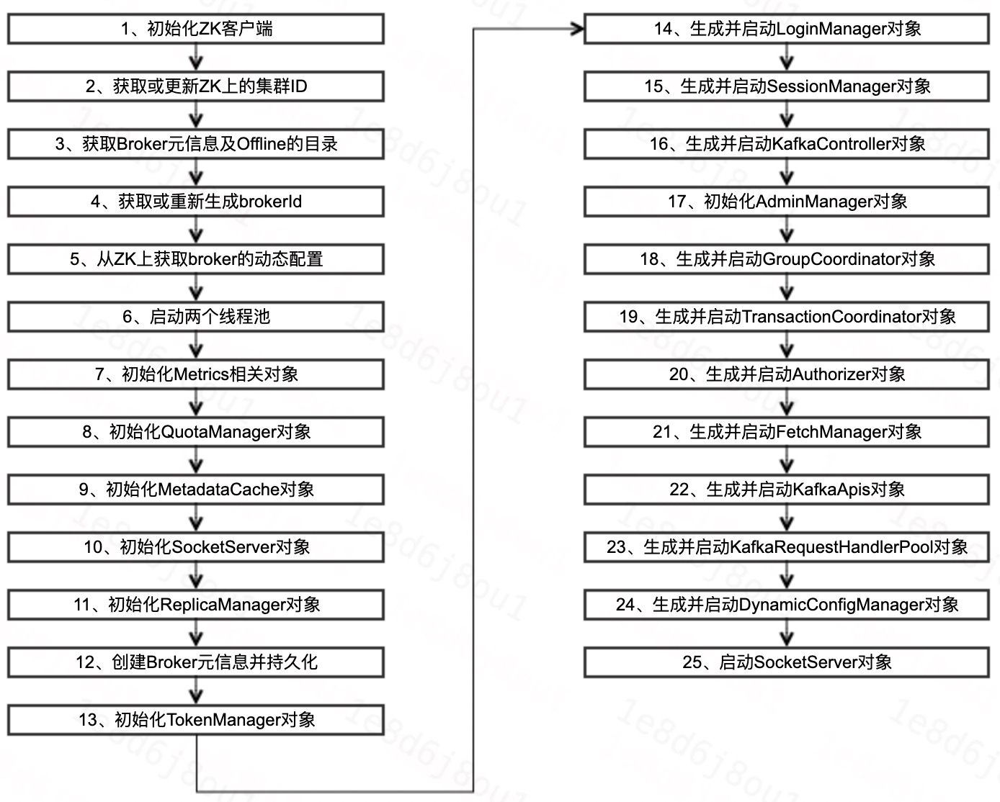

# Kafka服务端—Broker上线

[TOC]

## 1、前言


## 2、上线概述

### 2.1、上线流程




### 2.2、组件说明

|组件名称|用途|
|:----|:----|
|KafkaZkClient|自封装的ZK客户端，操作ZK节点及注册监听器等|
|LogManager|Log文件管理器，Kafka分区副本的数据存储于Log文件|
|MetadataCache|元信息缓存，每台Broker缓存的Kafka集群的元信息|
|SocketServer|Socket服务器，用于在网络层请求的接收与发送|
|ReplicaManager|副本管理器，管理分区副本之间的同步|
|KafkaController|Kafka控制器，控制Kafka元信息的同步等|
|GroupCoordinator|消费组协调器，协调消费客户端分区的分配及记录消费进度|
|TransactionCoordinator|事物协调器|
|KafkaApis|后台线程池，用于Kafka-Gateway及Kafka相关的后台任务|
|KafkaRequestHandlePool|工作线程池，在网络层收到请求后交由工作线程进行处理|


### 2.3、组件说明


## 3、相关组件详解

### 3.1、获取Broker元信息及Offline的目录

这块比较简单，获取Broker元信息及Offline的目录，就是去读取每个数据目录下面的meta.properties文件里面数据。

这块比较简单，具体读写元信息的过程可以看一下`BrokerMetadataCheckpoint`这个类。


```Java
// meta.properties文件里面数据的例子：
#
#Wed Jun 23 18:24:10 CST 2021
broker.id=1
version=0
cluster.id=4
```

## 4、常见问题


## 5、总结


