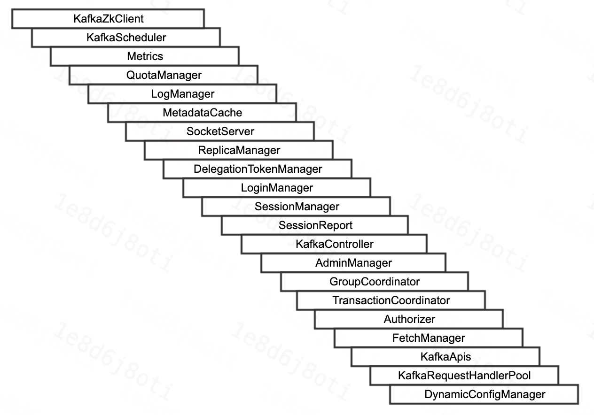

# Kafka服务端—Broker上线

[TOC]

## 1、前言

## 2、上线概述

### 2.1、上线流程

|组件名称|用途|
|:----|:----|
|KafkaZkClient|自封装的ZK客户端，操作ZK节点及注册监听器等|
|LogManager|Log文件管理器，Kafka分区副本的数据存储于Log文件|
|MetadataCache|元信息缓存，每台Broker缓存的Kafka集群的元信息|
|SocketServer|Socket服务器，用于在网络层请求的接收与发送|
|ReplicaManager|副本管理器，管理分区副本之间的同步|
|KafkaController|Kafka控制器，控制Kafka元信息的同步等|
|GroupCoordinator|消费组协调器，协调消费客户端分区的分配及记录消费进度|
|TransactionCoordinator|事物协调器|
|KafkaApis|后台线程池，用于Kafka-Gateway及Kafka相关的后台任务|
|KafkaRequestHandlePool|工作线程池，在网络层收到请求后交由工作线程进行处理|

## 3、上线流程

### 3.1、流程概述

## 5、常见问题

## 6、总结

