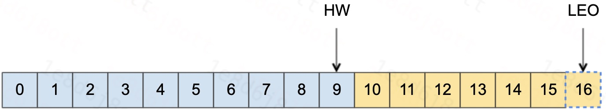
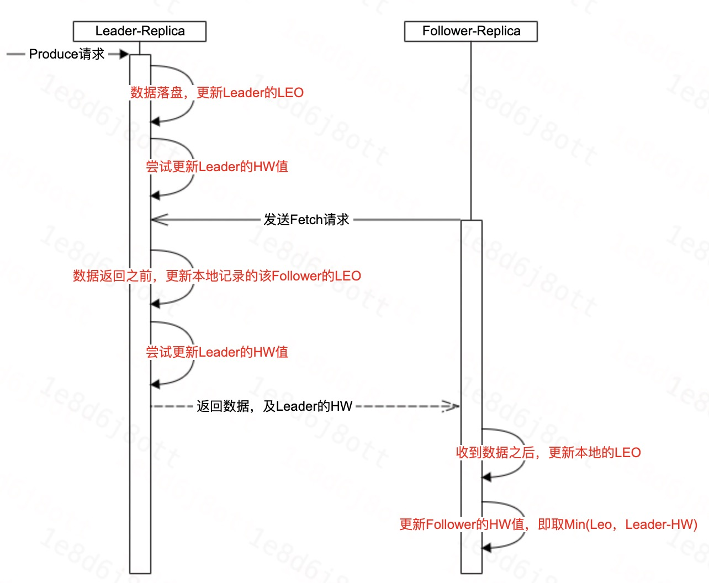
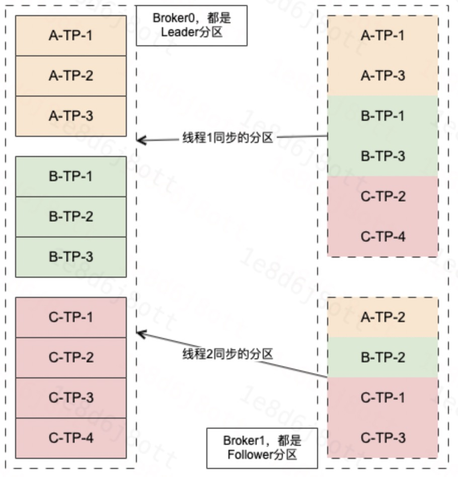
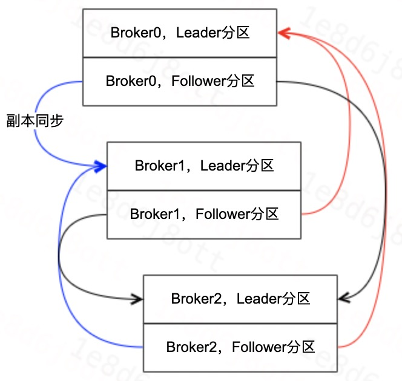
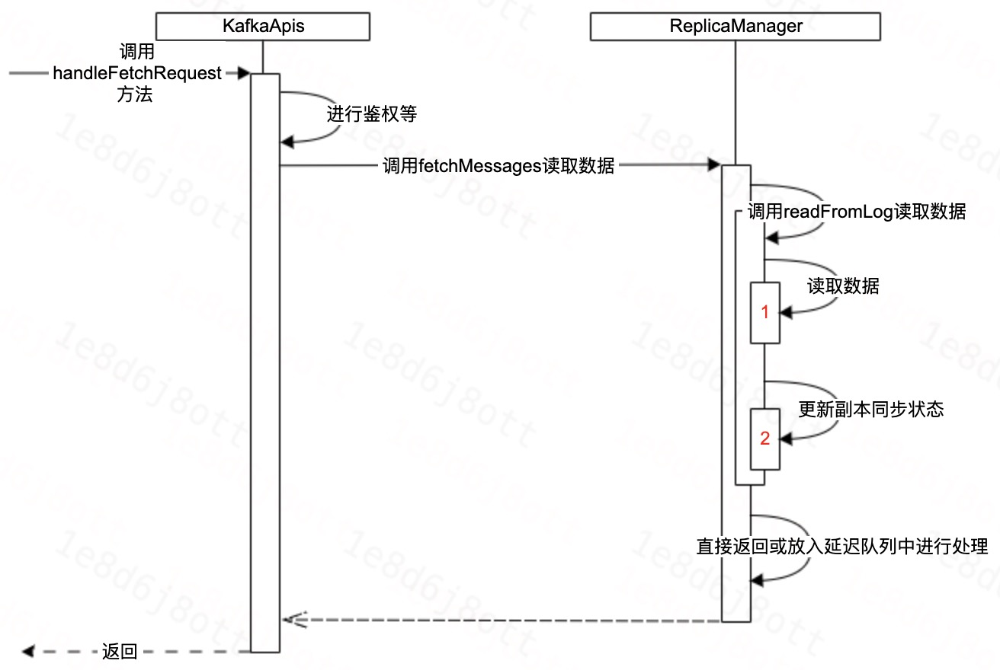
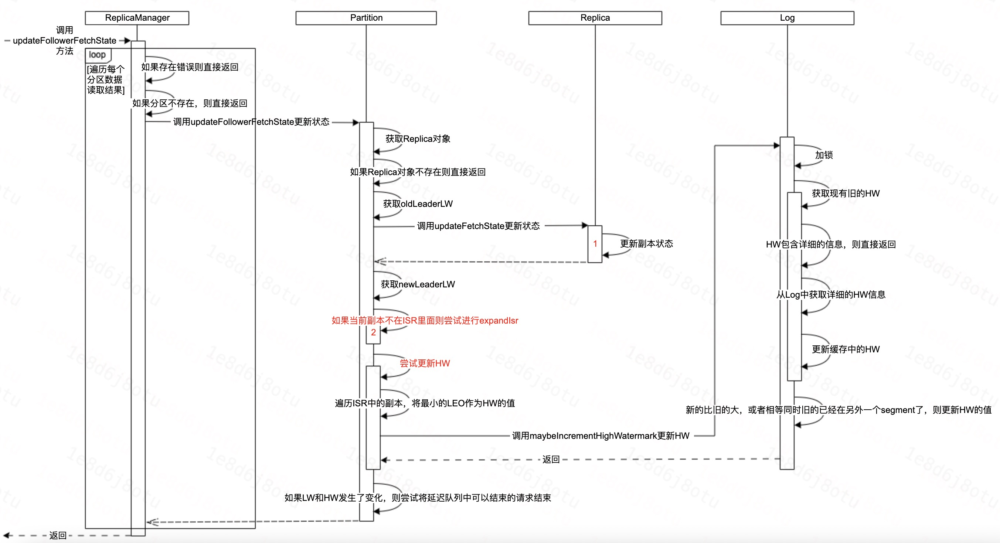
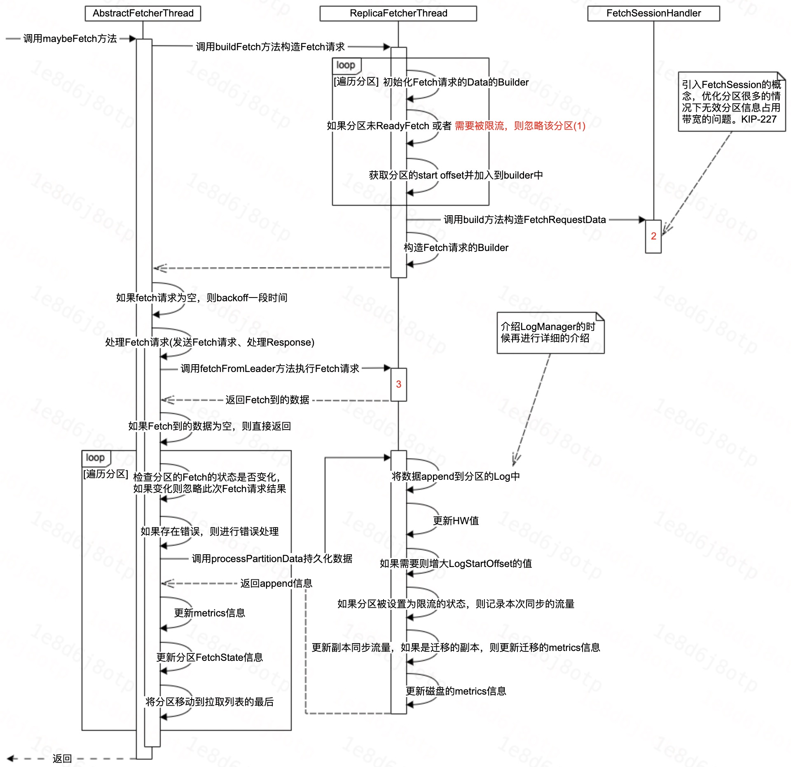
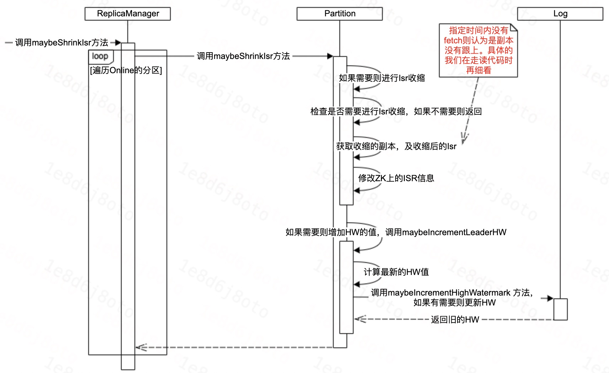
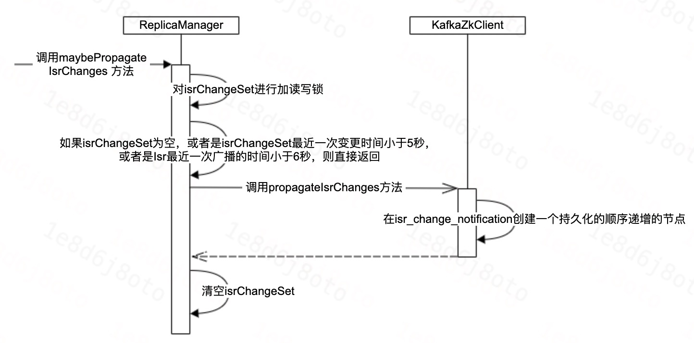

# Kafka服务端—副本管理—副本同步

[TOC]

## 1、前言


## 2、相关原理

### 2.1、基本概念

Kafka每个分区下可能有很多歌副本(Replica)用于实现冗余，从而进一步实现高可用。副本根据角色的不同，可以分为：
1. Leader副本：响应Clients端读写请求的副本；
2. Follower副本：被动的备份Leader副本中的数据，不能响应Clients端的写请求，读请求在高版本可以支持。
3. ISR副本：包含了Leader副本和所有与Leader副本保持同步的Follower副本。
4. AR副本：包含了Leader副本和所有的在线或者不在线的Follower副本，AR即分区正常情况下的所有副本。


每个Kafka副本对象都有两个重要的属性：LEO和HW，其中：
LEO：日志末端位移(Log End Offset)，记录了该副本底层日志(log)中下一条消息的位移值。注意是下一条消息。也就是说，如果LEO=10，那么表示该副本保存了10条消息，位移值范围是[0, 9]。
HW：位移的水位值(High Watermark)。对于同一个副本对象而言，其HW值不会大于LEO值。小于等于HW值的所有消息都被认为是“已备份”的。

具体的如图所示：



Kafka在副本


### 2.2、状态更新

在副本同步中，状态更新主要更新的是HW和LEO，本节主要介绍一下LEO和HW的更新逻辑。


这里需要首先言明的是，Kafka有两套Follower副本的LEO，
1. 一套LEO保存在Follower副本所在Broker的副本管理机中；   
2. 另一套LEO保存在Leader副本所在Broker的副本管理机中。即Leader副本机器上保存了所有的Follower副本的LEO。
 
那为什么要有两套呢？这是因为Kafka使用前者帮助Follower副本更新其HW值；而利用后者帮助Leader副本更新其HW。


大致的更新如图所示：




### 2.3、线程模型

副本同步的Fetch线程是按照(brokerId, fetchId)的维度创建的，因此每个线程内所要进行的副本同步的分区的Leader都是在同一个broker中。

**Broker之间的副本同步线程模型(1:1)**

单个Broker之间的连接数为2的情况下，可能的副本同步的分配线程数。



1. 单个Topic维度上，分区均匀的分布在副本同步线程上。
2. 整体上，可能存在线程分配的分区多少的问题。

&nbsp;

**Broker之间的副本同步线程模型(N:N)**

&nbsp;&nbsp;&nbsp;&nbsp;

1. Broker上存在两两副本同步的情况。
2. 每个副本同步的连接都如上图所示。


## 3、具体行为


### 3.1、Leader行为

在副本同步过程中，Leader侧主要做两件事情，分别是：
1. 维护Follower的副本同步状态。
2. 如果处于同步时，则尝试ExpandIsr。



#### 3.1.1、读取数据


#### 3.1.2、更新状态

**大体流程**



**主要代码**

```Java

```

### 3.2、Follower行为

Follower在副本同步，主要做两件事，分别是：
1. 如果需要，则对日志进行切断操作。
2. 如果需要，则对日志进行同步操作。

```Java
  override def doWork(): Unit = {
    val startTimeMs = Time.SYSTEM.milliseconds
    maybeTruncate() // 日志切断
    RequestChannel.setSession(Session.AdminSession)
    maybeFetch() // 日志拉取
    RequestChannel.cleanSession
    fetcherStats.totalTime.update(Time.SYSTEM.milliseconds - startTimeMs);
  }
```

#### 3.2.1、日志截断


#### 3.2.2、副本拉取

**大体流程**




**相关代码**

```Java
  // 尝试进行Fetch
  private def maybeFetch(): Unit = {
    val fetchRequestOpt = inLock(partitionMapLock) {
      // 构造Fetch请求的Builder，Builder里面包含本次将Fetch哪些分区的数据。
      // Fetch的分区会考虑是否被限流了，如果限流了，则本次Fetch忽略该分区。
      val ResultWithPartitions(fetchRequestOpt, partitionsWithError) = buildFetch(partitionStates.partitionStateMap.asScala)

      handlePartitionsWithErrors(partitionsWithError, "maybeFetch")
      if (fetchRequestOpt.isEmpty) {
        trace(s"There are no active partitions. Back off for $fetchBackOffMs ms before sending a fetch request")
        partitionMapCond.await(fetchBackOffMs, TimeUnit.MILLISECONDS)
      }
      fetchRequestOpt
    }
    fetchRequestOpt.foreach { case ReplicaFetch(sessionPartitions, fetchRequest) =>
      processFetchRequest(sessionPartitions, fetchRequest)
    }
  }

  // 处理Fetch请求，包括1、发送Fetch请求，2、处理Fetch请求的Response
  private def processFetchRequest(sessionPartitions: util.Map[TopicPartition, FetchRequest.PartitionData],
                                  fetchRequest: FetchRequest.Builder): Unit = {
    val partitionsWithError = mutable.Set[TopicPartition]()
    var responseData: Map[TopicPartition, FetchData] = Map.empty

    try {
      trace(s"Sending fetch request $fetchRequest")
      val startTimeMs = System.currentTimeMillis()
      // 发送fetch请求到leader，同时记录操作的耗时
      responseData = fetchFromLeader(fetchRequest)
      fetcherStats.requestTime.update(Time.SYSTEM.milliseconds - startTimeMs);
    } catch {
        // 错误日志及处理
    }
    fetcherStats.requestRate.mark()

    if (responseData.nonEmpty) { // 存在数据，则进行处理
      inLock(partitionMapLock) {
        responseData.foreach { case (topicPartition, partitionData) =>
          Option(partitionStates.stateValue(topicPartition)).foreach { currentFetchState =>
            val fetchPartitionData = sessionPartitions.get(topicPartition)
            if (fetchPartitionData != null && fetchPartitionData.fetchOffset == currentFetchState.fetchOffset && currentFetchState.isReadyForFetch) {
              // 存在fetchPartitionData，并且fetch的offset和需要的一致
              // 同时分区的状态是readyFetch的，则进行下面的处理
              // 否则本次fetch的数据会被丢弃
              val requestEpoch = if (fetchPartitionData.currentLeaderEpoch.isPresent) Some(fetchPartitionData.currentLeaderEpoch.get().toInt) else None
              partitionData.error match {
                case Errors.NONE =>
                  try {
                    // 数据落盘，并返回落盘的信息
                    val logAppendInfoOpt = processPartitionData(topicPartition, currentFetchState.fetchOffset,
                      partitionData)

                    logAppendInfoOpt.foreach { logAppendInfo =>
                      // 。。。。。。
                      // metrics信息中，更新lag值
                      fetcherLagStats.getAndMaybePut(topicPartition).lag = lag

                      // 更新其他信息，包括FetchState和metrics
                        val newFetchState = PartitionFetchState(nextOffset, Some(lag), currentFetchState.currentLeaderEpoch, state = Fetching)
                        partitionStates.updateAndMoveToEnd(topicPartition, newFetchState)
                        fetcherStats.byteRate.mark(validBytes)
                      }
                    }
                  } catch {
                      // 异常处理
                  }
                    // 错误处理
              }
            }
          }
        }
      }
    }

    if (partitionsWithError.nonEmpty) {
      // 对错误的分区进行统一处理
      handlePartitionsWithErrors(partitionsWithError, "processFetchRequest")
    }
  }
```


## 3、ISR扩缩

当Follower没有跟上Leader的时候，Leader会进行ISR的收缩。

ISR收缩在Broker这块主要分两步进行：
1. 检测出哪些分区的ISR需要进行收缩了，同时将收缩后的ISR信息写到ZK。
2. 将ISR收缩的事件注册到ZK，然后Controller通过ZK感知到ISR收缩了，从而进行ISR收缩的元信息的广播处理。

### 3.1、ISR收缩




### 3.2、ISR扩张


### 3.3、传播ISR收缩



### 3.3、相关代码


**后台检查ISR是否收缩及进行广播的线程**

```Java
  // ReplicaManager创建好了之后，会调用startup启动相关线程
  def startup(): Unit = {
    // 检查分区是否需要收缩ISR的线程，如果收缩了，则进行收缩。
    // follower将在 config.replicaLagTimeMaxMs 到 config.replicaLagTimeMaxMs * 1.5 的时间范围内被移出ISR中
    scheduler.schedule("isr-expiration", maybeShrinkIsr _, period = config.replicaLagTimeMaxMs / 2, unit = TimeUnit.MILLISECONDS)
    
    // Isr收缩之后的广播告知线程
    scheduler.schedule("isr-change-propagation", maybePropagateIsrChanges _, period = 2500L, unit = TimeUnit.MILLISECONDS)

    // 其他相关的处理线程 。。。。。。
  }
```

&nbsp;

**检查是否收缩**
```Java
  private def maybeShrinkIsr(): Unit = {
    trace("Evaluating ISR list of partitions to see which replicas can be removed from the ISR")

    // 仅对Online的分区进行判断
    allPartitions.keys.foreach { topicPartition =>
      nonOfflinePartition(topicPartition).foreach(_.maybeShrinkIsr())
    }
  }

  // 检查是否收缩
  def maybeShrinkIsr(): Unit = {
    val needsIsrUpdate = inReadLock(leaderIsrUpdateLock) {
      needsShrinkIsr() // 判断是否需要ShrinkIsr
    }
    val leaderHWIncremented = needsIsrUpdate && inWriteLock(leaderIsrUpdateLock) {
      leaderLogIfLocal match {
        case Some(leaderLog) =>
          val outOfSyncReplicaIds = getOutOfSyncReplicas(replicaLagTimeMaxMs) // 获取OSR的副本，这里的replicaLagTimeMaxMs默认是30秒
          if (outOfSyncReplicaIds.nonEmpty) {
            val newInSyncReplicaIds = inSyncReplicaIds -- outOfSyncReplicaIds
            // 如果有收缩，则打印收缩的日志

            // 更新ZK上的ISR信息
            shrinkIsr(newInSyncReplicaIds)

            // 如果HW需要增大，则对其进行增大
            maybeIncrementLeaderHW(leaderLog)
          } else {
            false
          }

        case None => false // do nothing if no longer leader
      }
    }

    // some delayed operations may be unblocked after HW changed
    if (leaderHWIncremented)
      tryCompleteDelayedRequests()
  }

  // Follower是否OSR的判断
  private def isFollowerOutOfSync(replicaId: Int,
                                  leaderEndOffset: Long,
                                  currentTimeMs: Long,
                                  maxLagMs: Long): Boolean = {
    val followerReplica = getReplicaOrException(replicaId)
    // follower的leo和leader的leo不一致，
    // 并且followerReplica的 lastCaughtUpTimeMs 在 maxLagMs 没有被更新了
    followerReplica.logEndOffset != leaderEndOffset &&
      (currentTimeMs - followerReplica.lastCaughtUpTimeMs) > maxLagMs
  }
```

&nbsp;

**检查是否广播**

```Java
  def maybePropagateIsrChanges(): Unit = {
    val now = System.currentTimeMillis()
    isrChangeSet synchronized {
      if (isrChangeSet.nonEmpty &&
        (lastIsrChangeMs.get() + ReplicaManager.IsrChangePropagationBlackOut < now ||
          lastIsrPropagationMs.get() + ReplicaManager.IsrChangePropagationInterval < now)) {
        // 注册ISR收缩的事件
        zkClient.propagateIsrChanges(isrChangeSet)
        isrChangeSet.clear()
        lastIsrPropagationMs.set(now)
      }
    }
  }

  // 在 /isr_change_notification 目录下面，创建一个以 isr_change_ 打头的，顺序递增的持久化的ZK节点
  // 节点内存储的是进行ISR搜索的topic-partiton
  def propagateIsrChanges(isrChangeSet: collection.Set[TopicPartition]): Unit = {
    val isrChangeNotificationPath: String = createSequentialPersistentPath(IsrChangeNotificationSequenceZNode.path(),
      IsrChangeNotificationSequenceZNode.encode(isrChangeSet))
    debug(s"Added $isrChangeNotificationPath for $isrChangeSet")
  }
```

&nbsp;

**_lastCaughtUpTimeMs更新策略**

```Java
  def updateFetchState(followerFetchOffsetMetadata: LogOffsetMetadata,
                       followerStartOffset: Long,
                       followerFetchTimeMs: Long,
                       leaderEndOffset: Long,
                       lastSentHighwatermark: Long): Unit = {
    if (followerFetchOffsetMetadata.messageOffset >= leaderEndOffset)
      // 如果fetch的offset大于leader的end offset，则直接取二者的最大值
      _lastCaughtUpTimeMs = math.max(_lastCaughtUpTimeMs, followerFetchTimeMs)
    else if (followerFetchOffsetMetadata.messageOffset >= lastFetchLeaderLogEndOffset)
      // 如果fetch的offset大于上一次leader的end offset，则表示本次拉取跟上了上一次的leader的end offset
      // 这里表示，如果leader数据增长的非常快，follower的fetch的进度处于：
      // 本次fetch的位置比上一次fetch时的leader的leo还小的状态，
      // 则_lastCaughtUpTimeMs将一直处于不能被更新的状态，从而最终导致ISR收缩。
      _lastCaughtUpTimeMs = math.max(_lastCaughtUpTimeMs, lastFetchTimeMs)

    _logStartOffset = followerStartOffset
    _logEndOffsetMetadata = followerFetchOffsetMetadata
    lastFetchLeaderLogEndOffset = leaderEndOffset
    lastFetchTimeMs = followerFetchTimeMs
    updateLastSentHighWatermark(lastSentHighwatermark)
    trace(s"Updated state of replica to $this")
  }
```


## 4、常见问题


### 4.1、副本同步的网络连接数

每个副本同步线程，都持有一个网络连接，因此我们只需要关注副本同步的线程数，就可以知道网络连接数了。

通常情况下，比如一个Region内如果有10台Broker，然后配置的副本同步的线程数为10，那么**任意一台**Broker的副本同步线程数就是 (10 - 1) * 10 = 90 个，网络连接数也是90。


### 4.2、如何避免分区饥饿

**Follower侧**

使用了LinkedHashMap存储分区及分区的状态。组装Fetch请求的数据的时候，按序逐个获取LinkedHashMap中的分区。

在收到Fetch请求的Response的数据之后，将分区移动到LinkedHashMap的最后面。

从而，整体上维护了一个类似队列的结构来进行分区数据的Fetch，上一次Fetch到的数据的会被移动到队列的最后面。


**Leader侧**


## 5、相关指标

|说明|ObjectName例子|
|:---|:---|
|查看具体某个分区进行副本同步时的Lag|kafka.server:type=FetcherLagMetrics,name=ConsumerLag,clientId=ReplicaFetcherThread-0-2,topic=__consumer_offsets,partition=1|
|某副本同步线程|kafka.server:type=FetcherStats,name=BytesPerSec,clientId=ReplicaFetcherThread-0-2,brokerHost=10.179.149.201,brokerPort=7093|


## 6、总结


