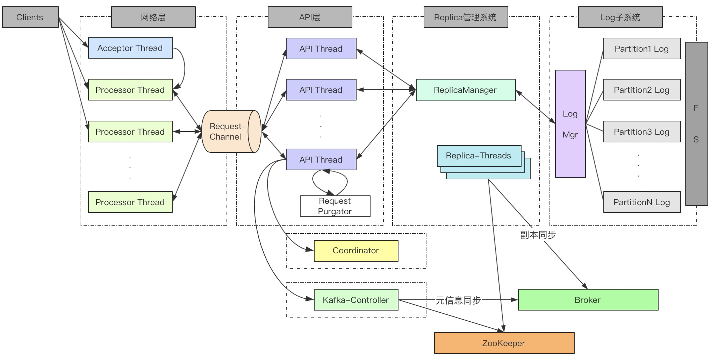
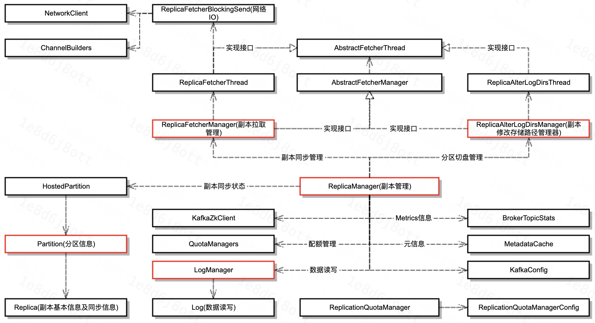

# Kafka服务端—副本管理—概述

[TOC]

## 1、前言

在具体的介绍副本管理模块之前，我们先来看一下Kafka服务端的架构：

副本管理处于API层和Log子系统之间，主要的功能是管理Broker上所有的副本。功能包括：
1. 副本操作，即处理API层的向副本追加数据的Produce请求、切换副本的Leader和Follower的LeaderAndIsr请求等。
2. 副本同步：Follower副本向远端的Leader副本进行数据同步，同时如果本地持有的是Leader副本的话，还管理着ISR信息等。

本次我们将对副本管理模块做概要介绍，后续我们还会针对其中的副本同步模块做深入的剖析。下面，正式开始副本模块的概要分享。

## 2、类图

首先，我们来看一下副本管理模块的类图：

1. ReplicaManager：副本管理，对外副本管理类；
2. LogManager：管理Log对象，然后通过Log对象实现对数据的读写。
3. ReplicaFetchManager：副本拉取管理，管理副本同步的线程，及在同步过程中的状态变化。
4. ReplicaAlterLogDirsManager：副本修改存储路径管理，管理修改路径后的副本同步线程及状态。
5. Partition：分区信息，管理AR信息等，此外还持有Replica对象用于管理Follower副本同步的状态。
6. ReplicaFetcherBlockingSend：网络IO模块。

## 3、功能

### 3.1、副本操作

在Kafka服务端对外的API请求中，除了一些Controller、Coordinator还有安全管控相关的API请求之外，其余剩下的基本都是和ReplicaManager相关的API接口。

这些请求都是通过ReplicaManager间接的去对Broker上的副本进行增删改查等动作。具体相关的API请求包括：

1. Produce-追加数据
2. Fetch-读取数据
3. ListOffsets-查询offset信息
4. LeaderAndIsr-切换副本为Leader或Follower
5. StopReplica-停止副本
6. UpdateMetadata-更新元信息
7. DeleteRecords-删除记录
8. OffsetForLeaderEpoch-获取Offset对应的LeaderEpoch信息
9. AlterReplicaLogDirs-修改副本Log的存储目录
10. DescribeLogDirs-查询Log所属目录信息
11. ElectLeaders-选举Leaders

每一类API请求都非常的复杂，而且牵扯到LogManager等模块，因此我们会对每一类请求的行为做单独的分享，这里就不再做更多介绍了。

虽然这里不会对每一类请求做详细的说明，但是这里也加一下相关请求的分享链接：

- [元信息变更请求详解(LeaderAndIsr、StopReplica、UpdateMetadata)](../Kafka服务端_元信息变更请求处理/Kafka服务端_元信息变更请求处理.md)

### 3.2、副本同步

副本管理模块除了对副本做一些CRUD等操作之外呢，还有一个比较重要的功能需要被单独拿出来，那就是副本同步。

Kafka分区下有可能有很多个副本用于实现冗余，从而进一步实现高可用，而多个副本之间的数据的一致性的管理就是依靠副本同步进行实现的。

具体的可以见如下这篇文章：

- [Kafka服务端_副本管理_副本同步](../Kafka服务端_副本管理_副本同步/Kafka服务端_副本管理_副本同步.md)

## 4、总结

本节仅概要介绍一下副本管理模块的功能，后续我们再针对副本操作和副本同步做详细的介绍，本次分享的内容到此结束，谢谢大家。

