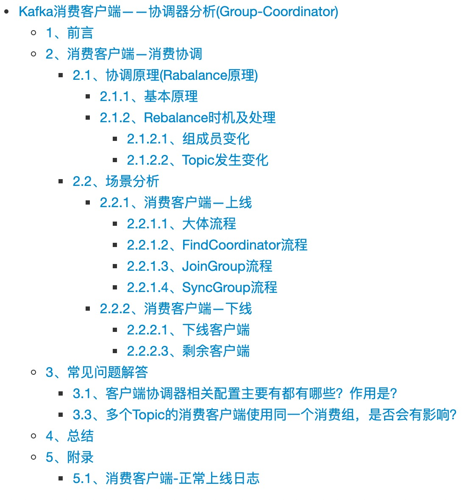
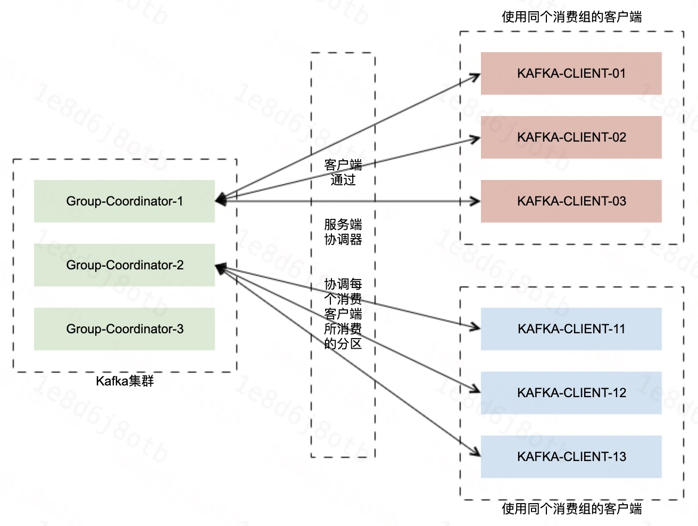
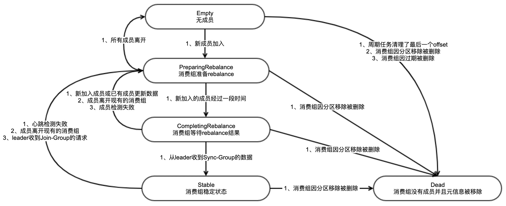
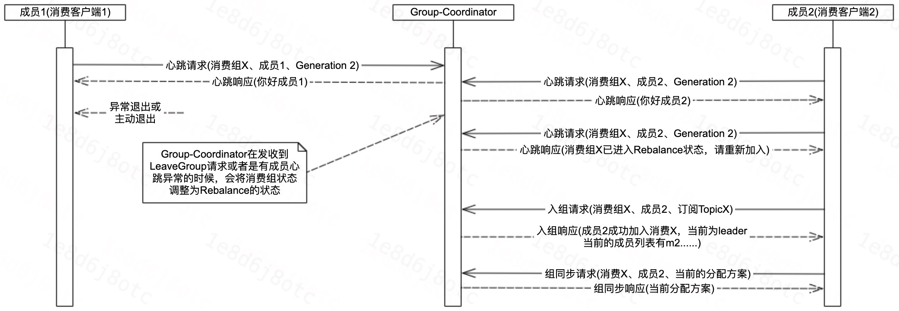
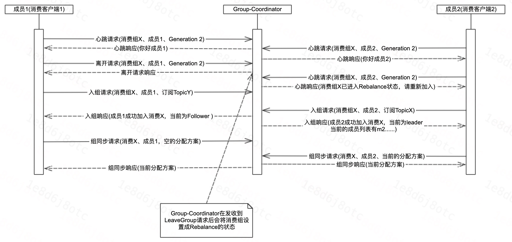
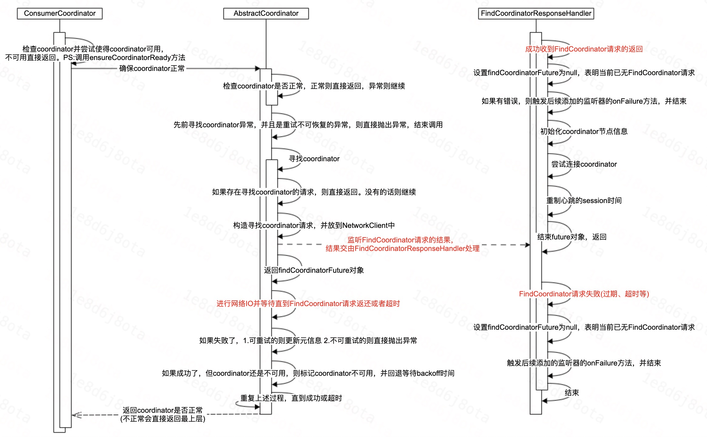
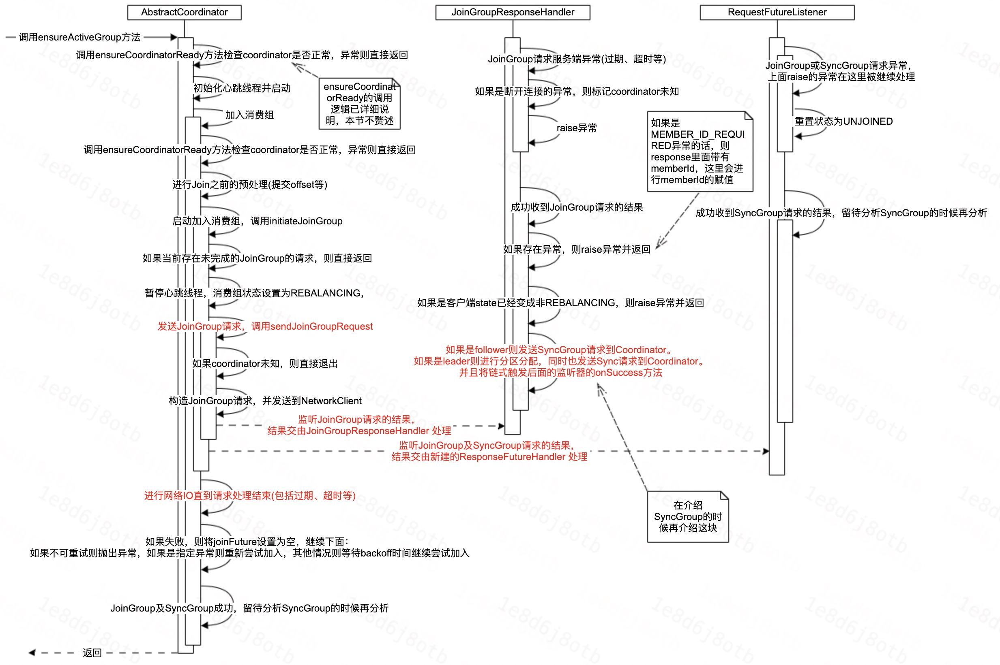
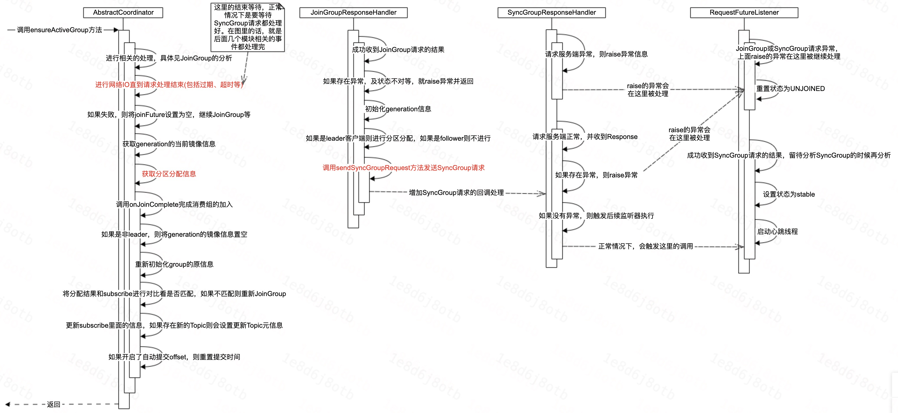
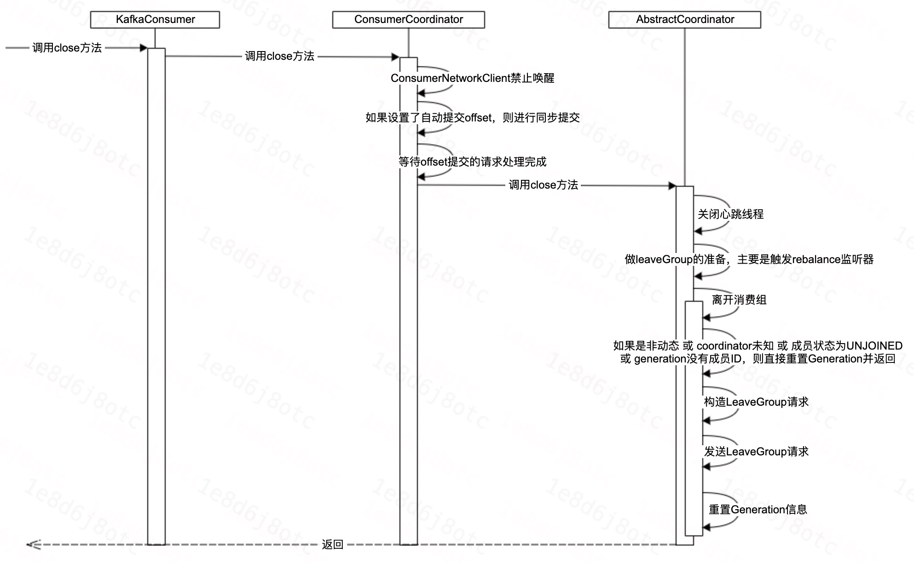

# Kafka消费客户端——协调器分析(Group-Coordinator)

<!-- [TOC] -->



## 1、前言

前面我们对Kafka消费客户端进行了整体的介绍，接下来我们将针对Kafka中的消费组协调器中的客户端侧进行详细的分析。

在细致介绍之前，先来看一下Kafka消费组协调器的功能。Kafka消费组协调器主要有两个功能，分别是：
1. 协调多个消费客户端之间的消费分区的分配；
2. 管理分区的消费进度；

因此，本节我们将对协调器如何对多个消费客户端进行协调进行分享。


## 2、消费客户端—消费协调

### 2.1、协调原理(Rabalance原理)


#### 2.1.1、基本原理

**1、基本原理**




**2、能力猜想**

基于上述的原理，我们现在思考一下，要做到上述的协调能力，客户端需要具备哪些能力？

- 1、客户端支持寻找到服务端的Coordinator；
- 2、客户端支持加入消费组；
- 3、客户端支持离开消费组；
- 4、客户端支持处理协调结果的能力；
- 5、客户端异常能被及时感知发现，及时将分配到的分区转移给其他客户端(性能)；

**3、协调请求协议**

完成了刚才的猜想之后，我们再来看一下客户端的实际实现。客户端主要实现了五类协议，具体如下：

1. FindCoordinator请求：消费客户端寻找消费组对应的Group-Coordinator；
2. JoinGroup请求：消费客户端请求加入消费组；
3. LeaveGroup请求：消费客户端主动告知Group-Coordinator我要离开消费组；
4. SyncGroup请求：leader消费客户端通过Group-Coordinator将分区分配方案告知其他的消费客户端；
5. Heartbeat请求：消费客户端定期给Group-Coordinator发送心跳来表明自己还活着；


**4、客户端状态**

```Java
    protected enum MemberState {
        UNJOINED,    // the client is not part of a group
        REBALANCING, // the client has begun rebalancing
        STABLE,      // the client has joined and is sending heartbeats
    }
```

**5、服务端消费组状态**



#### 2.1.2、Rebalance时机及处理

**Rebalance触发时机**


1. 组成员数发生变化；
   - 组成员增加(客户端上线)；
   - 组成员减少(客户端正常或异常下线)；
   - 组成员心跳异常(包括两次poll操作时间太久导致心跳认为客户端不正常)；
2. 订阅的Topic发生变化；
   - 更改订阅的Topic；
   - 订阅的Topic扩分区；

##### 2.1.2.1、组成员变化

**组成员增加**


**组成员减少**



##### 2.1.2.2、Topic发生变化

**更改订阅的Topic**



**Topic扩分区**

1. Kafka消费客户端在元信息更新时，会感知到Topic分区的变化；
2. 在进行poll数据的时候，发现这个变化之后，会重新发起JoinGroup的请求；


### 2.2、场景分析

本节主要结合实际的场景，详细的分析实际的处理过程及具体的源码实现。

#### 2.2.1、消费客户端—上线

在具体的看代码之前，我们先根据客户端的日志，看一下客户端加入消费组的过程。

##### 2.2.1.1、大体流程

**1. 寻找Coordinator(发送FindCoordinator请求)；**
**2. 开始申请加入消费组(发送JoinGroup请求)；**
**3. 进行分区分配并借助Coordinator同步结果(发送SyncGroup请求)；**
**4. 成功加入消费组，并开始心跳线程；**

&nbsp;

##### 2.2.1.2、FindCoordinator流程

**时序图**




**相关代码**

```Java
    protected synchronized boolean ensureCoordinatorReady(final Timer timer) {
        if (!coordinatorUnknown()) // 检查coordinator是否正常
            return true;

        do {
            // ...... 判断先前寻找coordinator异常并做处理 

            // 寻找coordinator
            final RequestFuture<Void> future = lookupCoordinator();
            client.poll(future, timer); // 真正的IO

            // 对寻找的结果进行处理
        } while (coordinatorUnknown() && timer.notExpired()); // 循环直到coordinator正常 或者 超时

        return !coordinatorUnknown();
    }

    protected synchronized RequestFuture<Void> lookupCoordinator() {
        if (findCoordinatorFuture == null) { // 当前已无处理中的find-coordinator请求
            // 寻找节点
            Node node = this.client.leastLoadedNode();
            if (node == null) {
                log.debug("No broker available to send FindCoordinator request");
                return RequestFuture.noBrokersAvailable();
            } else {
                findCoordinatorFuture = sendFindCoordinatorRequest(node); // 发送请求
                // 记录异常信息，留给上层处理
                findCoordinatorFuture.addListener(new RequestFutureListener<Void>() {
                    @Override
                    public void onSuccess(Void value) {} // do nothing
                    @Override
                    public void onFailure(RuntimeException e) {
                        findCoordinatorException = e; 
                    }
                });
            }
        }
        return findCoordinatorFuture;
    }

    // 构造FindCoordinator请求
    // 发送到NetworkNetworkClient
    // 增加回调的处理类
    private RequestFuture<Void> sendFindCoordinatorRequest(Node node) {
        
        log.debug("Sending FindCoordinator request to broker {}", node);
        FindCoordinatorRequest.Builder requestBuilder =
                new FindCoordinatorRequest.Builder(
                        new FindCoordinatorRequestData()
                            .setKeyType(CoordinatorType.GROUP.id())
                            .setKey(this.rebalanceConfig.groupId));
        return client.send(node, requestBuilder)
                .compose(new FindCoordinatorResponseHandler());
    }

```

##### 2.2.1.3、JoinGroup流程

**时序图**



**相关代码**

```Java
    // 确保消费组active，非active的话则会将其调整为active
    boolean ensureActiveGroup(final Timer timer) {
        if (!ensureCoordinatorReady(timer)) {
            // coordinator异常则直接退出
            return false;
        }

        startHeartbeatThreadIfNeeded(); // 启动心跳
        return joinGroupIfNeeded(timer); // 加入消费组
    }   

    // 加入消费组
    boolean joinGroupIfNeeded(final Timer timer) {
        while (rejoinNeededOrPending()) {
            if (!ensureCoordinatorReady(timer)) {
                // coordinator异常则直接退出
                return false;
            }

            if (needsJoinPrepare) {
                // Join之前如果需要预处理则进行预处理，commit-offset等
                needsJoinPrepare = false;
                onJoinPrepare(generation.generationId, generation.memberId);
            }

            // 开始加入消费组
            final RequestFuture<ByteBuffer> future = initiateJoinGroup();
            client.poll(future, timer); // 进行
            if (!future.isDone()) {
                // we ran out of time
                return false;
            }

            if (future.succeeded()) {
                // 此时基本已成功加入消费组了，这里我们在分析SyncGroup的时候再单独分析
            } else {
                final RuntimeException exception = future.exception();
                log.info("Join group failed with {}", exception.toString());
                resetJoinGroupFuture();
                if (exception instanceof UnknownMemberIdException || exception instanceof RebalanceInProgressException || exception instanceof IllegalGenerationException || exception instanceof MemberIdRequiredException)
                    // 这些异常都可通过重试解决，因此这里continue进行重试了
                    continue;
                else if (!future.isRetriable())
                    throw exception;

                timer.sleep(rebalanceConfig.retryBackoffMs);
            }
        }
        return true;
    }

    // 开始加入消费组
    private synchronized RequestFuture<ByteBuffer> initiateJoinGroup() {
        if (joinFuture == null) { // 没有JoinGroup的请求在处理中
            // 暂停心跳
            disableHeartbeatThread();

            // 设置状态、lastRebalanceStartMs。。。。。。
            state = MemberState.REBALANCING;

            // 发送JoinGroup请求
            joinFuture = sendJoinGroupRequest();
            joinFuture.addListener(new RequestFutureListener<ByteBuffer>() {
                @Override
                public void onSuccess(ByteBuffer value) {
                    // SyncGroup请求处理成功之后调用的，这块等待分享SyncGroup的时候单独介绍
                }

                @Override
                public void onFailure(RuntimeException e) {
                    // JoinGroup异常和SyncGroup异常的时候调用
                    synchronized (AbstractCoordinator.this) {
                        // 加入异常，后续会重新加入
                        recordRebalanceFailure();
                    }
                }
            });
        }
        return joinFuture;
    }

    // 发送JoinGroup请求
    RequestFuture<ByteBuffer> sendJoinGroupRequest() {
        if (coordinatorUnknown())
            return RequestFuture.coordinatorNotAvailable();

        // 构造JoinGrouo请求的builder
        log.info("(Re-)joining group");
        JoinGroupRequest.Builder requestBuilder = new JoinGroupRequest.Builder(......);

        log.debug("Sending JoinGroup ({}) to coordinator {}", requestBuilder, this.coordinator);

        // 将JoinGroup请求发送到NetworkClient，并增加处理完成后处理器
        return client.send(coordinator, requestBuilder, joinGroupTimeoutMs)
                .compose(new JoinGroupResponseHandler());
    }

    // JoinGroup请求Response的处理器
    private class JoinGroupResponseHandler extends CoordinatorResponseHandler<JoinGroupResponse, ByteBuffer> {
        @Override
        public void handle(JoinGroupResponse joinResponse, RequestFuture<ByteBuffer> future) {
            Errors error = joinResponse.error();
            if (error == Errors.NONE) { // response无异常
                if (isProtocolTypeInconsistent(joinResponse.data().protocolType())) {
                    // 协议不一致
                } else {
                    log.debug("Received successful JoinGroup response: {}", joinResponse);
                    sensors.joinSensor.record(response.requestLatencyMs());

                    synchronized (AbstractCoordinator.this) {
                        if (state != MemberState.REBALANCING) {
                            future.raise(new UnjoinedGroupException());
                        } else {
                            AbstractCoordinator.this.generation = new Generation(
                                joinResponse.data().generationId(),
                                joinResponse.data().memberId(), joinResponse.data().protocolName());
                            // 发送SyncGroup的请求，后续我们在SyncGroup的时候，再单独分析这块
                            if (joinResponse.isLeader()) {
                                // leader会对分区进行分配
                                onJoinLeader(joinResponse).chain(future);
                            } else {
                                onJoinFollower().chain(future);
                            }
                        }
                    }

                    // 注意这整块没有触发上层listenr的onSuccess的调用
                    // 这里是在通过chain(future)的调用，将onSuccess的触发交给了SyncGroup的Response处理类。
                }
            } 

            // 各种异常的处理，处理后会raise一个错误
            else if (error == Errors.COORDINATOR_LOAD_IN_PROGRESS) {
            } else if (error == Errors.UNKNOWN_MEMBER_ID) {
            } else if (error == Errors.COORDINATOR_NOT_AVAILABLE || error == Errors.NOT_COORDINATOR) {
            } else if (error == Errors.FENCED_INSTANCE_ID) {
            } else if (error == Errors.INCONSISTENT_GROUP_PROTOCOL || error == Errors.INVALID_SESSION_TIMEOUT || error == Errors.INVALID_GROUP_ID || error == Errors.GROUP_AUTHORIZATION_FAILED || error == Errors.GROUP_MAX_SIZE_REACHED) {
            } else if (error == Errors.UNSUPPORTED_VERSION) {
            } else if (error == Errors.MEMBER_ID_REQUIRED) {
            } else {
            }
        }
    }
```

##### 2.2.1.4、SyncGroup流程

**时序图**



**相关代码**

```Java
    // 如果收到的JoinGroupResponse表明当前客户端是leader，则进行分区分配并同步给coordinator
    private RequestFuture<ByteBuffer> onJoinLeader(JoinGroupResponse joinResponse) {
        try {
            // 对成员进行分配
            
            // 构造请求 。。。。。。

            log.debug("Sending leader SyncGroup to coordinator {} at generation {}: {}", this.coordinator, this.generation, requestBuilder);

            // 发送SyncGroup请求
            return sendSyncGroupRequest(requestBuilder);
        } catch (RuntimeException e) {
            return RequestFuture.failure(e);
        }
    }
    
    // 收到的JoinGroupResponse表明当前客户端是follower
    private RequestFuture<ByteBuffer> onJoinFollower() {
        // 发送空的分配数据
        return sendSyncGroupRequest(requestBuilder);
    }

    private RequestFuture<ByteBuffer> sendSyncGroupRequest(SyncGroupRequest.Builder requestBuilder) {
        if (coordinatorUnknown())
            return RequestFuture.coordinatorNotAvailable();
        // 发送SyncGroup请求并增加请求结果的处理器
        return client.send(coordinator, requestBuilder)
                .compose(new SyncGroupResponseHandler());
    }

    // SyncGroup请求的结果处理器
    private class SyncGroupResponseHandler extends CoordinatorResponseHandler<SyncGroupResponse, ByteBuffer> {
        @Override
        public void handle(SyncGroupResponse syncResponse,
                           RequestFuture<ByteBuffer> future) {
            Errors error = syncResponse.error();
            if (error == Errors.NONE) {
                if (isProtocolTypeInconsistent(syncResponse.data.protocolType())) {
                } else if (isProtocolNameInconsistent(syncResponse.data.protocolName())) {
                    // 存在异常，则raise异常
                } else {
                    log.debug("Received successful SyncGroup response: {}", syncResponse);
                    sensors.syncSensor.record(response.requestLatencyMs());
                    // 结束future，同时这里的分配策略存储在future中
                    future.complete(ByteBuffer.wrap(syncResponse.data.assignment()));
                }
            } else {
                // 存在异常的情况下，则标记需要进行rejoin
                requestRejoin();

                // raise异常
            }
        }
    }

    // SyncGroup处理完成之后，我们继续看上层
    boolean joinGroupIfNeeded(final Timer timer) {
        while (rejoinNeededOrPending()) {
            // 各种处理，JoinGroup中已经进行介绍，这里不再赘述

            final RequestFuture<ByteBuffer> future = initiateJoinGroup();

            client.poll(future, timer); // JoinGroup及SyncGroup的请求会阻塞在这个地方，等待超时或结束
            if (!future.isDone()) {
                // we ran out of time
                return false;
            }

            if (future.succeeded()) {
                // 
                // JoinGroup 及 SyncGroup 成功，已获取到分配策略，此时开始进行分配结果的处理
                //
                Generation generationSnapshot;
                synchronized (AbstractCoordinator.this) {
                    generationSnapshot = this.generation;
                }

                if (generationSnapshot != Generation.NO_GENERATION) {
                    // 获取分配策略
                    ByteBuffer memberAssignment = future.value().duplicate();

                    // 结束Join工作
                    onJoinComplete(generationSnapshot.generationId, generationSnapshot.memberId, generationSnapshot.protocolName, memberAssignment);

                    // 相关状态重置
                    resetJoinGroupFuture();
                    needsJoinPrepare = true;
                } else {
                    // 加入异常的处理
                }
            } else {
                // 加入异常的处理
            }
        }
        return true;
    }

    // 结束Join
    protected void onJoinComplete(int generation,
                                  String memberId,
                                  String assignmentStrategy,
                                  ByteBuffer assignmentBuffer) {
        log.debug("Executing onJoinComplete with generation {} and memberId {}", generation, memberId);

        // 进行一些检查及一些重新的初始化 。。。。。。

        // 反序列化分配策略
        Assignment assignment = ConsumerProtocol.deserializeAssignment(assignmentBuffer);

        Set<TopicPartition> assignedPartitions = new HashSet<>(assignment.partitions());

        // 分配的分区不match订阅的信息
        if (!subscriptions.checkAssignmentMatchedSubscription(assignedPartitions)) {
            requestRejoin(); //标记要重新join
            return;
        }

        if (protocol == RebalanceProtocol.COOPERATIVE) {
            // 新增的增量rebalance的协议，后续单独分析
        }

        // 更新信息，及标记新增Topic要元信息同步
        maybeUpdateJoinedSubscription(assignedPartitions);

        if (autoCommitEnabled)
            // 更新下次自动commit offset时间
            this.nextAutoCommitTimer.updateAndReset(autoCommitIntervalMs);

        // 其他
    }
```


#### 2.2.2、消费客户端—下线

##### 2.2.2.1、下线客户端

客户端下线分为正常下线和异常奔溃，异常奔溃的话就直接退出了，因此这里仅对正常下线的流程进行分析。

**正常下线时序图**



**正常下线代码**

```Java
    // 调用KafkaConsumer的close方法
    public void close(Duration timeout) {
        // 一些判断及加锁
        try {
            if (!closed) {
                // 关闭客户端
                close(timeout.toMillis(), false);
            }
        } finally {
            // ......
        }
    }

    private void close(long timeoutMs, boolean swallowException) {
        // 日志及信息记录
        try {
            if (coordinator != null)
                // 关闭coordinator
                coordinator.close(time.timer(Math.min(timeoutMs, requestTimeoutMs)));
        } catch (Throwable t) {
            firstException.compareAndSet(null, t);
            log.error("Failed to close coordinator", t);
        }
        // 关闭相关组件及异常处理 。。。。。。
    }

    // ConsumerCoordinator.close方法
    public void close(final Timer timer) {
        client.disableWakeups();
        try {
            maybeAutoCommitOffsetsSync(timer); // 提交offset
            while (pendingAsyncCommits.get() > 0 && timer.notExpired()) {
                ensureCoordinatorReady(timer);
                client.poll(timer);
                invokeCompletedOffsetCommitCallbacks();
            }
        } finally {
            // 调用AbstractCoordinator的close方法
            super.close(timer);
        }
    }

    // AbstractCoordinator.close方法
    protected void close(Timer timer) {
        try {
            closeHeartbeatThread(); // 关闭心跳线程
        } finally {
            synchronized (this) {
                if (rebalanceConfig.leaveGroupOnClose) {
                    // 离开消费组准备
                    onLeavePrepare(); 

                    // 离开消费组
                    maybeLeaveGroup("the consumer is being closed");
                }

                // 等待请求处理完成
            }
        }
    }

    public synchronized RequestFuture<Void> maybeLeaveGroup(String leaveReason) {
        RequestFuture<Void> future = null;
        if (isDynamicMember() && !coordinatorUnknown() &&
            state != MemberState.UNJOINED && generation.hasMemberId()) {
            // 构造LeaveGroup请求

            // 发送请求
            future = client.send(coordinator, request).compose(new LeaveGroupResponseHandler());
            client.pollNoWakeup();
        }
        resetGenerationOnLeaveGroup();
        return future;
    }
```


##### 2.2.2.3、剩余客户端

刚刚是分析了下线客户端的行为，那么剩余的客户端之间是如何感知其他客户端的下线的呢？

简单来说就是：
1. 某一客户端下线；
2. 服务端Group-Coordinator通过LeaveGroup请求或者是Heartbeat请求，发现某一客户端异常时，将消费组设置成Rebalance的状态；
3. 剩余客户端通过心跳线程，感知到当前消费组的状态是Rebalance的，则poll的时候，会重新进行JoinGroup、SyncGroup的过程；

poll的时候，JoinGroup、SyncGroup的处理流程我们在前面都已经进行了详细的分析，这里我们来看一下HeartBeat请求的响应的处理。

**Heartbeat请求的响应的处理**

```Java
    private class HeartbeatResponseHandler extends CoordinatorResponseHandler<HeartbeatResponse, Void> {
        private final Generation sentGeneration;

        private HeartbeatResponseHandler(final Generation generation) {
            this.sentGeneration = generation;
        }

        @Override
        public void handle(HeartbeatResponse heartbeatResponse, RequestFuture<Void> future) {
            sensors.heartbeatSensor.record(response.requestLatencyMs());
            Errors error = heartbeatResponse.error();
            if (error == Errors.NONE) {
                // 心跳无错误信息
                log.debug("Received successful Heartbeat response");
                future.complete(null);
            } else if (error == Errors.COORDINATOR_NOT_AVAILABLE || error == Errors.NOT_COORDINATOR) {
                // 服务端coordinator未知
                log.info("Attempt to heartbeat failed since coordinator {} is either not started or not valid",
                        coordinator());
                markCoordinatorUnknown();
                future.raise(error);
            } else if (error == Errors.REBALANCE_IN_PROGRESS) {
                // 正在进行rebalance中，这里会设置状态，即要求rejoin
                // 心跳就是通过这个异常来感知到其他客户端的上下线
                log.info("Attempt to heartbeat failed since group is rebalancing");
                requestRejoin();
                future.raise(error);
            } else if (error == Errors.ILLEGAL_GENERATION) {
                // generation信息异常，如果不是正在rebalance，则会进行重新join
                log.info("Attempt to heartbeat failed since generation {} is not current", sentGeneration.generationId);
                resetGenerationOnResponseError(ApiKeys.HEARTBEAT, error);
                future.raise(error);
            } else if (error == Errors.FENCED_INSTANCE_ID) {
                log.error("Received fatal exception: group.instance.id gets fenced");
                future.raise(error);
            } else if (error == Errors.UNKNOWN_MEMBER_ID) {
                log.info("Attempt to heartbeat failed for since member id {} is not valid.", sentGeneration.memberId);
                resetGenerationOnResponseError(ApiKeys.HEARTBEAT, error);
                future.raise(error);
            } else if (error == Errors.GROUP_AUTHORIZATION_FAILED) {
                future.raise(GroupAuthorizationException.forGroupId(rebalanceConfig.groupId));
            } else {
                future.raise(new KafkaException("Unexpected error in heartbeat response: " + error.message()));
            }
        }
    }
```

## 3、常见问题解答

### 3.1、客户端协调器相关配置主要有都有哪些？作用是？

消费组rebalance相关的配置主要有如下：

|配置|说明|默认值|说明|
|:----|:------|:------|:-------|
|`session.timeout.ms`|session超时时间|10000毫秒|心跳线程正常情况下，和coordinator允许的最大的没有交互时间。session超时时会标记coordinator为未知，从而重新开始FindCoordinator|
|`heartbeat.interval.ms`|心跳周期|3000毫秒|心跳周期，但是是非严格的周期。建议值是小于session.timeout.ms的三分之一|
|`retry.backoff.ms`|请求回退时间|100毫秒||
|`max.poll.interval.ms`|两次poll操作允许的最大间隔|300000毫秒|两次poll操作允许的最大时间，超过这个时间之后，心跳线程会向Coordinator发送LeaveGroup请求|

这里比较重要的是`max.poll.interval.ms`这个配置，我们在调用KafkaConsumer客户端的poll方法的时候，如果数据处理的时间太久，导致两次poll的时间超过了设置的300秒，那么将触发rebalance。


### 3.3、多个Topic的消费客户端使用同一个消费组，是否会有影响？

多个业务的客户端消费不同的Topic，但是使用了同一个消费组的时候，如果出现任意一个客户端上下线，都会引起整体的rebalance。

因此建议建议在做消费的时候，消费组尽量不要和其他业务重复。


## 4、总结

Kafka消费客户端之间的消费协调是通过FindCoordinator、JoinGroup、SyncGroup、LeaveGroup以及Heartbeat几个请求与服务端的Group-Coordinator进行配合，从而实现协调的。


## 5、附录

### 5.1、消费客户端-正常上线日志

```Java
// 往bootstrap.server的机器发送FindCoordinator请求
2021-06-02 17:09:24.407 [main] DEBUG o.a.k.c.consumer.internals.AbstractCoordinator - [Consumer clientId=consumer-cg_logi_kafka_test_1-1, groupId=cg_logi_kafka_test_1] Sending FindCoordinator request to broker 10.179.149.194:7093 (id: -3 rack: null)

// 寻找到消费组对应的Group-Coordinator
2021-06-02 17:09:25.086 [main] DEBUG o.a.k.c.consumer.internals.AbstractCoordinator - [Consumer clientId=consumer-cg_logi_kafka_test_1-1, groupId=cg_logi_kafka_test_1] Received FindCoordinator response ClientResponse(receivedTimeMs=1622624965085, latencyMs=427, disconnected=false, requestHeader=RequestHeader(apiKey=FIND_COORDINATOR, apiVersion=3, clientId=consumer-cg_logi_kafka_test_1-1, correlationId=0), responseBody=FindCoordinatorResponseData(throttleTimeMs=0, errorCode=0, errorMessage='NONE', nodeId=2, host='10.179.149.201', port=7093))

// 获取到消费组对应的Group-Coordinator
2021-06-02 17:09:25.087 [main] INFO  o.a.k.c.consumer.internals.AbstractCoordinator - [Consumer clientId=consumer-cg_logi_kafka_test_1-1, groupId=cg_logi_kafka_test_1] Discovered group coordinator 10.179.149.201:7093 (id: 2147483645 rack: null)

// 开始进行Join的准备
2021-06-02 17:09:25.090 [main] DEBUG o.a.k.c.consumer.internals.ConsumerCoordinator - [Consumer clientId=consumer-cg_logi_kafka_test_1-1, groupId=cg_logi_kafka_test_1] Executing onJoinPrepare with generation -1 and memberId 

// 启动心跳线程
2021-06-02 17:09:25.090 [kafka-coordinator-heartbeat-thread | cg_logi_kafka_test_1] DEBUG o.a.k.c.consumer.internals.AbstractCoordinator - [Consumer clientId=consumer-cg_logi_kafka_test_1-1, groupId=cg_logi_kafka_test_1] Heartbeat thread started

// 提交空的offset信息
2021-06-02 17:09:25.091 [main] DEBUG o.a.k.c.consumer.internals.ConsumerCoordinator - [Consumer clientId=consumer-cg_logi_kafka_test_1-1, groupId=cg_logi_kafka_test_1] Sending synchronous auto-commit of offsets {}

// 还没有启动好，这里将心跳线程设置成了disable，即不进行心跳
2021-06-02 17:09:25.091 [main] DEBUG o.a.k.c.consumer.internals.AbstractCoordinator - [Consumer clientId=consumer-cg_logi_kafka_test_1-1, groupId=cg_logi_kafka_test_1] Disabling heartbeat thread

// 开始进行JoinGroup
2021-06-02 17:09:25.091 [main] INFO  o.a.k.c.consumer.internals.AbstractCoordinator - [Consumer clientId=consumer-cg_logi_kafka_test_1-1, groupId=cg_logi_kafka_test_1] (Re-)joining group

// 加入消费组
2021-06-02 17:09:25.092 [main] DEBUG o.a.k.c.consumer.internals.ConsumerCoordinator - [Consumer clientId=consumer-cg_logi_kafka_test_1-1, groupId=cg_logi_kafka_test_1] Joining group with current subscription: [kmo_comminity]

// 发送JoinGroup请求
2021-06-02 17:09:25.093 [main] DEBUG o.a.k.c.consumer.internals.AbstractCoordinator - [Consumer clientId=consumer-cg_logi_kafka_test_1-1, groupId=cg_logi_kafka_test_1] Sending JoinGroup (JoinGroupRequestData(groupId='cg_logi_kafka_test_1', sessionTimeoutMs=10000, rebalanceTimeoutMs=300000, memberId='', groupInstanceId=null, protocolType='consumer', protocols=[JoinGroupRequestProtocol(name='range', metadata=[0, 1, 0, 0, 0, 1, 0, 13, 107, 109, 111, 95, 99, 111, 109, 109, 105, 110, 105, 116, 121, -1, -1, -1, -1, 0, 0, 0, 0])])) to coordinator 10.179.149.201:7093 (id: 2147483645 rack: null)

// JoinGroup请求失败，原因是没有成员ID，这里虽然失败了，但是Group-Coordinator会返回当前消费客户端的memberId(Group-Coordinator生成的)
2021-06-02 17:09:25.446 [main] INFO  o.a.k.c.consumer.internals.AbstractCoordinator - [Consumer clientId=consumer-cg_logi_kafka_test_1-1, groupId=cg_logi_kafka_test_1] Join group failed with org.apache.kafka.common.errors.MemberIdRequiredException: The group member needs to have a valid member id before actually entering a consumer group

// 心跳线程继续disable
2021-06-02 17:09:25.447 [main] DEBUG o.a.k.c.consumer.internals.AbstractCoordinator - [Consumer clientId=consumer-cg_logi_kafka_test_1-1, groupId=cg_logi_kafka_test_1] Disabling heartbeat thread

// 继续JoinGroup
2021-06-02 17:09:25.448 [main] INFO  o.a.k.c.consumer.internals.AbstractCoordinator - [Consumer clientId=consumer-cg_logi_kafka_test_1-1, groupId=cg_logi_kafka_test_1] (Re-)joining group

// 加入消费组
2021-06-02 17:09:25.448 [main] DEBUG o.a.k.c.consumer.internals.ConsumerCoordinator - [Consumer clientId=consumer-cg_logi_kafka_test_1-1, groupId=cg_logi_kafka_test_1] Joining group with current subscription: [kmo_comminity]

// 发送JoinGroup请求
2021-06-02 17:09:25.449 [main] DEBUG o.a.k.c.consumer.internals.AbstractCoordinator - [Consumer clientId=consumer-cg_logi_kafka_test_1-1, groupId=cg_logi_kafka_test_1] Sending JoinGroup (JoinGroupRequestData(groupId='cg_logi_kafka_test_1', sessionTimeoutMs=10000, rebalanceTimeoutMs=300000, memberId='consumer-cg_logi_kafka_test_1-1-e444cf99-2a47-494b-8d6a-aa061c12db1b', groupInstanceId=null, protocolType='consumer', protocols=[JoinGroupRequestProtocol(name='range', metadata=[0, 1, 0, 0, 0, 1, 0, 13, 107, 109, 111, 95, 99, 111, 109, 109, 105, 110, 105, 116, 121, -1, -1, -1, -1, 0, 0, 0, 0])])) to coordinator 10.179.149.201:7093 (id: 2147483645 rack: null)

// 成功发送JoinGroup请求，返回的当前消费组的信息，包括成员列表等
2021-06-02 17:09:28.501 [main] DEBUG o.a.k.c.consumer.internals.AbstractCoordinator - [Consumer clientId=consumer-cg_logi_kafka_test_1-1, groupId=cg_logi_kafka_test_1] Received successful JoinGroup response: JoinGroupResponseData(throttleTimeMs=0, errorCode=0, generationId=1, protocolType='consumer', protocolName='range', leader='consumer-cg_logi_kafka_test_1-1-e444cf99-2a47-494b-8d6a-aa061c12db1b', memberId='consumer-cg_logi_kafka_test_1-1-e444cf99-2a47-494b-8d6a-aa061c12db1b', members=[JoinGroupResponseMember(memberId='consumer-cg_logi_kafka_test_1-1-e444cf99-2a47-494b-8d6a-aa061c12db1b', groupInstanceId=null, metadata=[0, 1, 0, 0, 0, 1, 0, 13, 107, 109, 111, 95, 99, 111, 109, 109, 105, 110, 105, 116, 121, -1, -1, -1, -1, 0, 0, 0, 0])])


2021-06-02 17:09:28.502 [main] DEBUG o.a.k.c.consumer.internals.ConsumerCoordinator - [Consumer clientId=consumer-cg_logi_kafka_test_1-1, groupId=cg_logi_kafka_test_1] Performing assignment using strategy range with subscriptions {consumer-cg_logi_kafka_test_1-1-e444cf99-2a47-494b-8d6a-aa061c12db1b=org.apache.kafka.clients.consumer.ConsumerPartitionAssignor$Subscription@56ace400}


2021-06-02 17:09:28.503 [main] INFO  o.a.k.c.consumer.internals.ConsumerCoordinator - [Consumer clientId=consumer-cg_logi_kafka_test_1-1, groupId=cg_logi_kafka_test_1] Finished assignment for group at generation 1: {consumer-cg_logi_kafka_test_1-1-e444cf99-2a47-494b-8d6a-aa061c12db1b=Assignment(partitions=[kmo_comminity-0, kmo_comminity-1, kmo_comminity-2])}

// 发送SyncGroup请求，因为是leader消费组，所以还会带上分区分配的结果
2021-06-02 17:09:28.504 [main] DEBUG o.a.k.c.consumer.internals.AbstractCoordinator - [Consumer clientId=consumer-cg_logi_kafka_test_1-1, groupId=cg_logi_kafka_test_1] Sending leader SyncGroup to coordinator 10.179.149.201:7093 (id: 2147483645 rack: null) at generation Generation{generationId=1, memberId='consumer-cg_logi_kafka_test_1-1-e444cf99-2a47-494b-8d6a-aa061c12db1b', protocol='range'}: SyncGroupRequestData(groupId='cg_logi_kafka_test_1', generationId=1, memberId='consumer-cg_logi_kafka_test_1-1-e444cf99-2a47-494b-8d6a-aa061c12db1b', groupInstanceId=null, protocolType='consumer', protocolName='range', assignments=[SyncGroupRequestAssignment(memberId='consumer-cg_logi_kafka_test_1-1-e444cf99-2a47-494b-8d6a-aa061c12db1b', assignment=[0, 1, 0, 0, 0, 1, 0, 13, 107, 109, 111, 95, 99, 111, 109, 109, 105, 110, 105, 116, 121, 0, 0, 0, 3, 0, 0, 0, 0, 0, 0, 0, 1, 0, 0, 0, 2, -1, -1, -1, -1])])

// 收到SyncGroup的结果
2021-06-02 17:09:28.555 [main] DEBUG o.a.k.c.consumer.internals.AbstractCoordinator - [Consumer clientId=consumer-cg_logi_kafka_test_1-1, groupId=cg_logi_kafka_test_1] Received successful SyncGroup response: org.apache.kafka.common.requests.SyncGroupResponse@4b3c354a

// 成功加入消费组
2021-06-02 17:09:28.555 [main] INFO  o.a.k.c.consumer.internals.AbstractCoordinator - [Consumer clientId=consumer-cg_logi_kafka_test_1-1, groupId=cg_logi_kafka_test_1] Successfully joined group with generation 1

// enable心跳线程
2021-06-02 17:09:28.555 [main] DEBUG o.a.k.c.consumer.internals.AbstractCoordinator - [Consumer clientId=consumer-cg_logi_kafka_test_1-1, groupId=cg_logi_kafka_test_1] Enabling heartbeat thread


2021-06-02 17:09:28.556 [main] DEBUG o.a.k.c.consumer.internals.ConsumerCoordinator - [Consumer clientId=consumer-cg_logi_kafka_test_1-1, groupId=cg_logi_kafka_test_1] Executing onJoinComplete with generation 1 and memberId consumer-cg_logi_kafka_test_1-1-e444cf99-2a47-494b-8d6a-aa061c12db1b


2021-06-02 17:09:28.559 [main] INFO  o.a.k.c.consumer.internals.ConsumerCoordinator - [Consumer clientId=consumer-cg_logi_kafka_test_1-1, groupId=cg_logi_kafka_test_1] Adding newly assigned partitions: kmo_comminity-0, kmo_comminity-1, kmo_comminity-2


// ...... 提交offset相关日志

// 心跳线程发送心跳信息到Group-Coordinator
2021-06-02 17:09:31.555 [kafka-coordinator-heartbeat-thread | cg_logi_kafka_test_1] DEBUG o.a.k.c.consumer.internals.AbstractCoordinator - [Consumer clientId=consumer-cg_logi_kafka_test_1-1, groupId=cg_logi_kafka_test_1] Sending Heartbeat request with generation 1 and member id consumer-cg_logi_kafka_test_1-1-e444cf99-2a47-494b-8d6a-aa061c12db1b to coordinator 10.179.149.201:7093 (id: 2147483645 rack: null)

// 获取到心跳response
2021-06-02 17:09:31.671 [main] DEBUG o.a.k.c.consumer.internals.AbstractCoordinator - [Consumer clientId=consumer-cg_logi_kafka_test_1-1, groupId=cg_logi_kafka_test_1] Received successful Heartbeat response
```