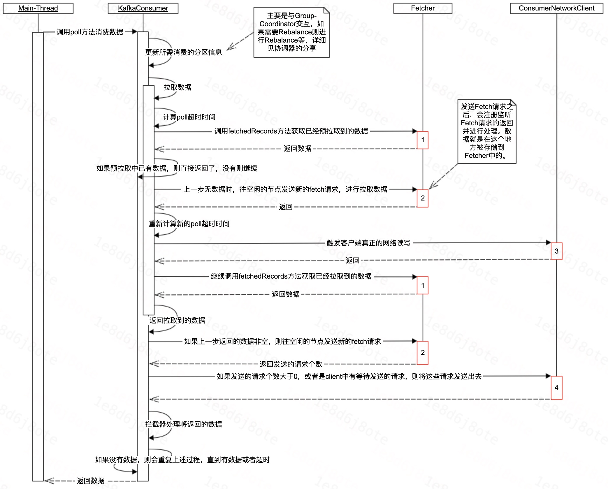
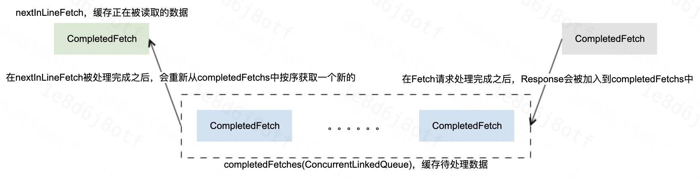
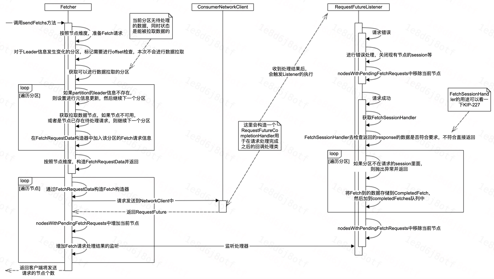

# Kafka消费客户端—数据拉取

[TOC]

## 1、前言

本节给大家分享一下Kafka消费客户端消费数据的过程。

备注：本次仅介绍数据拉取的过程，不会介绍数据拉取过程中Rebalance相关的过程。

## 2、数据拉取

数据拉取大致分为三步：
1. 从预先拉取好的缓冲中读取数据；
2. 发送Fetch请求；

### 2.1、缓存数据读取

从缓存读取数据，大概有如下几个过程：
1. 从缓存中读取；

#### 2.1.1、缓存结构

#### 2.1.2、数据读取

### 2.2、发送Fetch请求

### 2.3、

## 3、偏移(Offset)管理

### 3.1、初始值

### 3.2、周期提交

