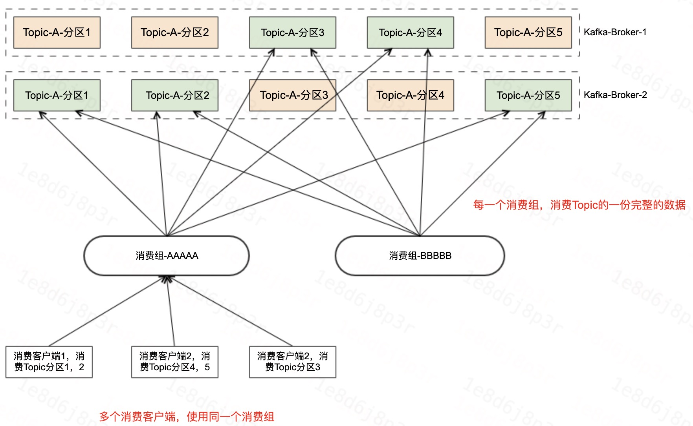
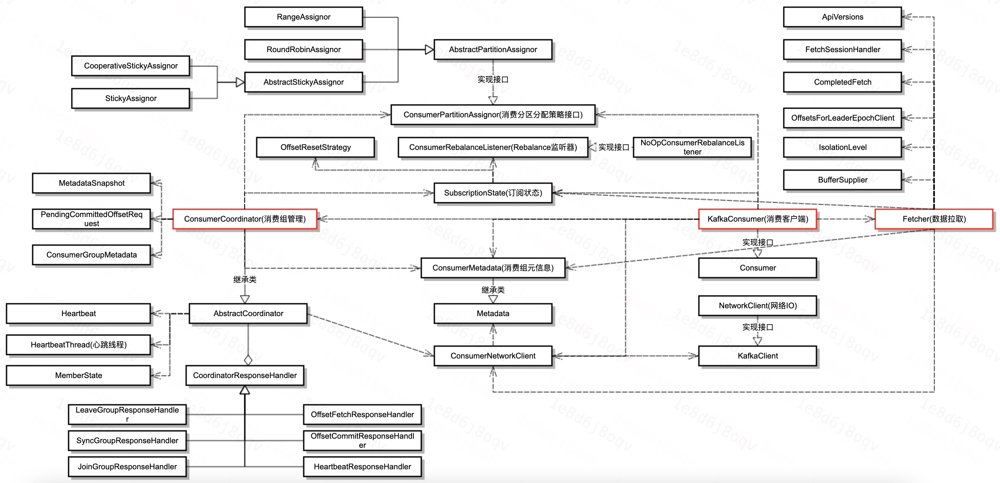
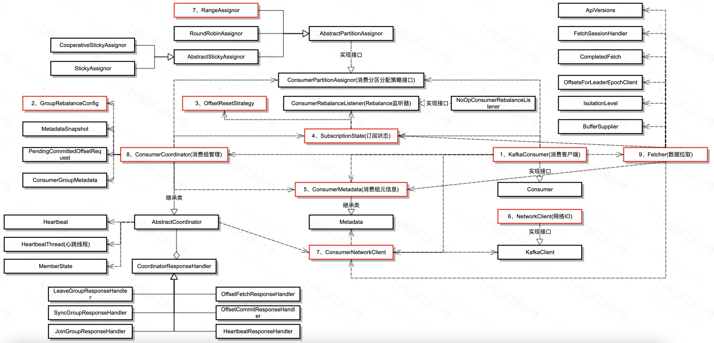
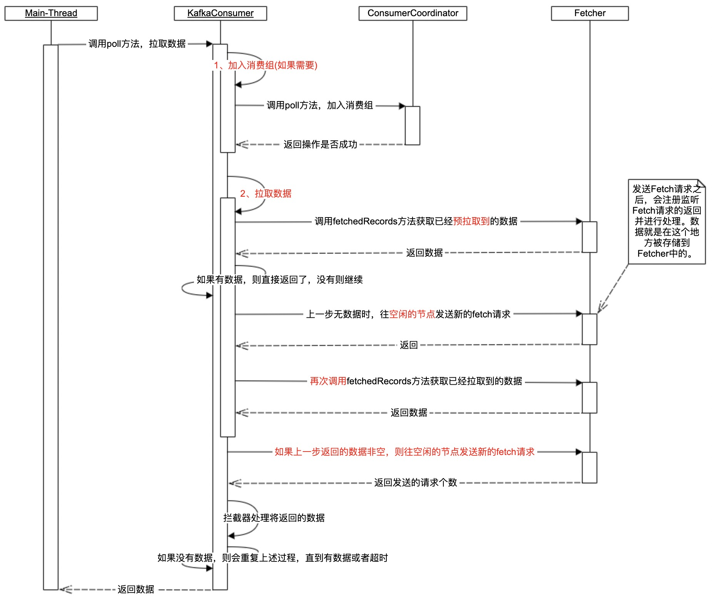
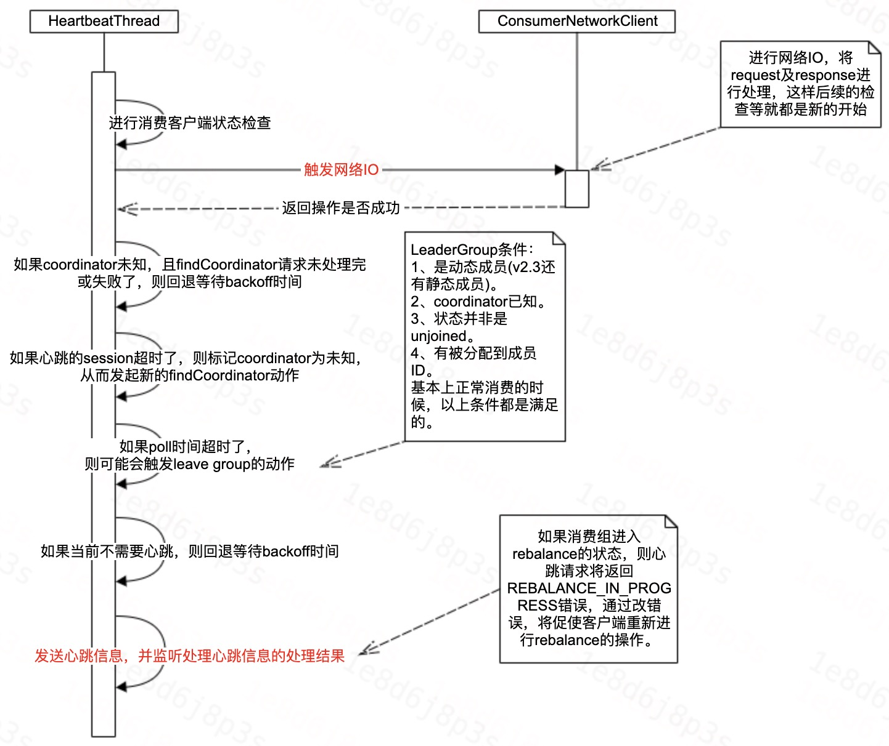

# Kafka消费客户端——整体概述

[TOC]

## 1、前言

本节，我们将对Kafka消费者客户端，做一个整体上的概要介绍，在介绍的时候，会按照如下顺序进行：
1. 消费客户端简单的例子；
2. 消费客户端-消费模型
3. 消费客户端类图；
4. 消费客户端的线程模型及线程处理流程；
5. 总结

## 2、消费客户端-例子

```java
import org.apache.kafka.clients.consumer.ConsumerRecord;
import org.apache.kafka.clients.consumer.ConsumerRecords;
import org.apache.kafka.clients.consumer.KafkaConsumer;

import java.time.Duration;
import java.util.Arrays;
import java.util.Properties;

public class SimpleConsumer {
    private static String topicName = "kafka_topic";
    private static String group = "kafka_consumer_group";

    public static void main(String[] args) {
        Properties props = new Properties();
        props.put("bootstrap.servers", "192.168.0.1:9092,192.168.0.2:9092,192.168.0.3:9092"); // Kafka服务地址
        props.put("group.id", group);
        props.put("auto.offset.reset", "earliest");   //earliest/latest消息消费起始位置，earliest代表消费历史数据，latest代表消费最新的数据
        props.put("enable.auto.commit", "true");      // 自动commit
        props.put("auto.commit.interval.ms", "1000"); // 自动commit的间隔

        //根据实际场景选择序列化类
        props.put("key.deserializer", "org.apache.kafka.common.serialization.StringDeserializer");
        props.put("value.deserializer", "org.apache.kafka.common.serialization.StringDeserializer");

        KafkaConsumer<String, String> consumer = new KafkaConsumer<>(props);
        consumer.subscribe(Arrays.asList(topicName)); // 可消费多个Topic, 组成一个List

        while (true) {
            try {
                ConsumerRecords<String, String> records = consumer.poll(Duration.ofSeconds(10));
                for (ConsumerRecord<String, String> record : records) {
                    System.out.println("offset = " + record.offset() + ", key = " + record.key() + ", value = " + record.value());
                }
            }catch (Throwable e){
                //TODO 输出你的异常
            }
        }
    }
}
```

## 3、消费客户端-消费模型



- 每一个消费组，消费Topic的一份完整的数据。
- 多个客户端，使用同一个消费组，消费Topic的数据。每个客户端消费部分Topic的分区。


## 4、消费客户端-类图

介绍完Kafka消费客户端的例子，我们再来看一下消费客户端的类图。



消费客户端主要分为三块内容，分别是：
- KafkaConsumer：消费客户端，是对外的Kafka消费客户端类；
- Fetch：进行数据拉取；
- ConsumerCoordinator：消费协调器，管理消费状态，协调多个消费者等；

简单说，就是用户用KafkaConsumer进行消费，而KafkaConsumer则通过ConsumerCoordinator对多个消费客户端消费的分区进行协调，然后还通过Fetch进行数据的拉取。

其实上面还有一些其他比较重要的类，这里也简单的介绍一下：
- ConsumerPartitionAssigner：消费分区分配策略的接口，下面有几个具体的实现策略。
- ConsumerMetadata：消费元信息，继承Metadata类，里面存储着集群的元信息。
- ConsumerNetworkClient：包含NetworkClient属性，主要进行请求的IO。
- AbstractCoordinator：协调器抽象类，里面包含了心跳、Rebalance时的各种请求的处理类等。


## 5、消费客户端-线程模型

介绍完Kafka消费客户端的类图之后，本节将从消费客户端的线程模型入手，对Kafka的消费客户端进行分享。

在具体分享之后，先介绍一下Kafka消费客户端的两种消费方式：
- assign方式消费：指定分区的方式消费，不具备分区扩容的感知能力，如果需要则需要自己去感知。
- subscribe方式消费：借助Group-Coordinator去管理多个消费客户端之间的分区分配策略，消费客户端的变化可以自动的触发分区的重分配。

相较于subscribe方式的消费，assign的消费方式比较简单，所以本次分享主要介绍subscribe的消费方式。以subscribe方式消费的时候，Kafka消费客户端主要有两个线程，分别是主线程和心跳线程。
- 主线程：除心跳线程做的事情之外的所有事情，包括消费相关的请求收发，处理Rebalance状态等。
- 心跳线程：和Group-Coordinator保持心跳的线程。

下面，我们正式开始分享这块的内容。


### 5.1、消费客户端-主线程

主线程这块主要介绍两部分，第一部分是初始化，然后第二部分是循环的进行数据拉取。下面我们先看一下初始化过程。

#### 5.1.1、初始化流程

备注：类图中的红色框表示初始化过程中，一些具有代表性的组件的初始化过程。其中，红色框前面的数字代表了初始化的顺序。



#### 5.1.2、数据获取

备注：其中红色的框部分，我们后续会进行细致的讲解。




### 5.2、消费客户端-心跳线程

消费客户端除了主线程进行数据的拉取之外呢，还会有一个心跳线程维持和Group-Coordinator的心跳。



## 6、总结

本次分享了Kafka消费客户端的大体内容，包括主线程初始化、主线程数据拉取及心跳线程的处理流程，接下来我们会继续针对Kafka消费时的具体数据拉取过程、客户端协调器的处理流程等进行详细的分析。

谢谢大家。
