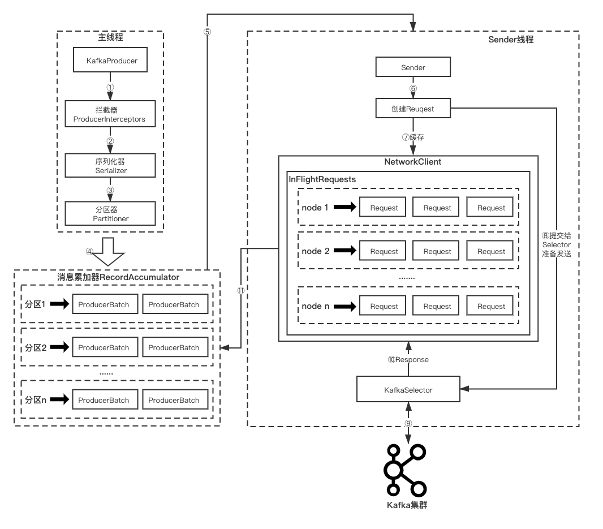

# KafkaProducer
<!-- TOC -->

- [KafkaProducer](#kafkaproducer)
  - [1、前言](#1前言)

<!-- /TOC -->


## 1、前言

本次分享，将会基于Kafka 2.5 社区版本简单介绍下生产者的设计架构与消息发送流程。
后续我们会出专项的 `Kafka源码剖析与实战结合案` 的 文章 & 视频，敬请期待...

开始分享前，我们先来看一个简单的生产者客户端的代码示例:
```java
public class ProducerTest {
    private static String topicName;
    private static int msgNum;
         
    public static void main(String[] args) {
        Properties props = new Properties(); 
        props.put("bootstrap.servers", "xxx.xxx.xxx.xxx:9092");
        props.put("key.serializer", "org.apache.kafka.common.serialization.StringSerializer");
        props.put("value.serializer", "org.apache.kafka.common.serialization.StringSerializer");
        props.put("compression.type", "lz4"); 
        props.put("linger.ms", 500 );
        props.put("batch.size", 100000 );
        props.put("max.in.flight.requests.per.connection", 1 );
        topicName = "test";
        msgNum = *; // 发送的消息数
        Producer<String, String> producer = new KafkaProducer<>(props);
        for (int i = 0; i < msgNum; i++) {
            String msg = i + " This is prodecer test.";
            producer.send(new ProducerRecord<String, String>(topicName, msg));
        }
        producer.close();
    }
}

```
上面的示例，我们实例化了一个无key的 `ProducerRecord` 的消息对象，然后实例化了一个 `KafkaProducer` 对象通过调用 `send` 方法来进行消息发送的.

我们看下生产者KafkaProducer消息发送的架构设计:



我们首先来了解下 `KafkaProducer` 设计的线程模型.

生产者客户端的线程主要包括 `主线程` 和 `Sender线程`.

`主线程` 不会去发送消息，只会把消息缓存到消息累加器中，核心逻辑都在 `KafkaProducer.send` 方法里.

主要逻辑:

1、消息首先需要经过生产者拦截器链的处理。生产者拦截器链即生产者拦截器实现类的有序集合，由生产者客户端参数 `{interceptor.classes}` 来指定。生产者拦截器的作用是用来在消息发送前做一些准备工作，比如按某个规则过滤不符合要求的消息、修改消息的内容等，也可以用来在发送回调逻辑前做一些定制化需求，比如统计类工作。自定义实现 `org.apache.kafka.clients.producer.ProducerInterceptor` 接口即可
对应上面流程图的步骤①

2、获取元信息缓存中获取要发送的Topic的信息，如果未获取到，则会立马唤醒 `Sender线程` 去拉取更新元信息.

3、对消息的 `key` 和 `value` 进行序列化。`key` 和 `value` 对应的序列化器分别由生产者参数 `{key.serializer}` 和 `{value.serializer}` 来指定，自定义实现 `org.apache.kafka.common.serialization.Serializer` 接口即可.
对应上面流程图的步骤②

4、计算消息要发往的分区号.如果生产者发送时指定了要发往的分区，则直接用该分区号; 如果未指定，则按生产者配置的 `分区器` 进行计算处理(未配置会用Kafka默认的 `DefaultParitioner` 分区器处理). 分区器由生产者参数 `{partitioner.class}` 来指定，自定义实现 `org.apache.kafka.clients.producer.Partitioner` 接口即可.
对应上面流程图的步骤③

5、将要发送的消息追加到消息累加器中.
对应上面流程图的步骤④

6、有条件地唤醒 `Sender线程`.

`send(ProducerRecord<K, V> record)` 方法代码执行时序图:


`Sender线程`:

```java
/**
 * The background thread that handles the sending of produce requests to the Kafka cluster. This thread makes metadata
 * requests to renew its view of the cluster and then sends produce requests to the appropriate nodes.
 *
 * 用来处理生产者消息发送请求到Kafka集群的守护线程. 该守护线程会发起请求来更新集群元数据信息然后来发送生产者的请求到合适的broker节点.
 */
public class Sender implements Runnable {
  // ...
}
```

通过官方拟定的注释，可以清楚地知道 `Sender线程` 主要做的两件事:

1、发起集群元信息更新请求，更新集群元数据信息.

2、对生产者的消息发送请求进行处理，选出合适的broker节点并发往.

`Sender` 是一个实现 `Runnable` 的线程类，所以大家在阅读源码的时候，可以直接去看它的run方法的执行逻辑.

`Sender线程`对消息的处理步骤:

1、从消息累加器中抽取消息.
对应上面流程图的步骤⑤

2、经过一系列地处理封装成 `ClientRequest` 类型的请求.
对应上面流程图的步骤⑥

3、然后交由给 `NetworkClient.send` 将消息发送请求进行缓存，并调用 `Selecotr.send` 添加到待发送请求队列中，等待被轮询执行.
对应上面流程图的步骤⑦

4、调用 `NetworkClient.poll`，最终调用 `Selecotr.poll` 进行实际的网络I/O处理.
对应上面流程图的步骤⑧

`消息累加器 ---- RecordAccumulator`: 

消息累加器的作用:

来缓存消息，方便 `Sender` 线程可以批量发送，进而减少网络传输的资源消耗来提升性能.

消息累加器中维护了 `主题分区(TopicPartition)` 与 `存放主题消息批次(ProducerBatch)的双端队列` 的映射关系，`主线程` 追加到消息累加器中的消息会按照 `主题分区` 维度进行"聚堆"，添加到对应的双端队列尾部的 `ProducerBatch` 批次中.

消息累加器中用到了Kafka自实现的缓冲池 `BufferPool` ，用来实现对 `java.nio.ByteBuffer` 的复用，来对消息批次进行内存上的创建和释放.

缓冲池的大小决定了消息累加器可以缓存消息的大小. 这个大小由生产者客户端参数 `{buffer.memory}`来指定。如果生产者客户端需要向很多分区发送消息，适当调大该参数可以增加整体的吞吐量。

`网络模型-KafkaSelector`
Kafka定义的 `Selector` 是Kafka对于java原生的Selector的功能增强，用于满足Kafka的具体需求，来进行真正的网络I/O传输。核心是利用 `NetworkSend`、`NetworkReceive` 与 `KafkaChannel` 这些Kafka定义的模型，完成I/O读写操作。归根结底，使用 `nio` 的`Channel` 与 `ByteBuffer` 交互完成更底层的读写操作。

Kafka服务端处理发送请求后会将响应通过网络I/O传输返回到 `KafkaSelector`，对应上面流程图的步骤⑨.

`KafkaSelector` 再将响应交给 `NetworkClient` 进行处理，对应上面流程图的步骤⑩.

`NetworkClient` 对响应进行处理后，将成功发送的消息批次在消息累加器中进行清除，未发送成功的进行是否可重试判断， 对应上面流程图的步骤⑪
