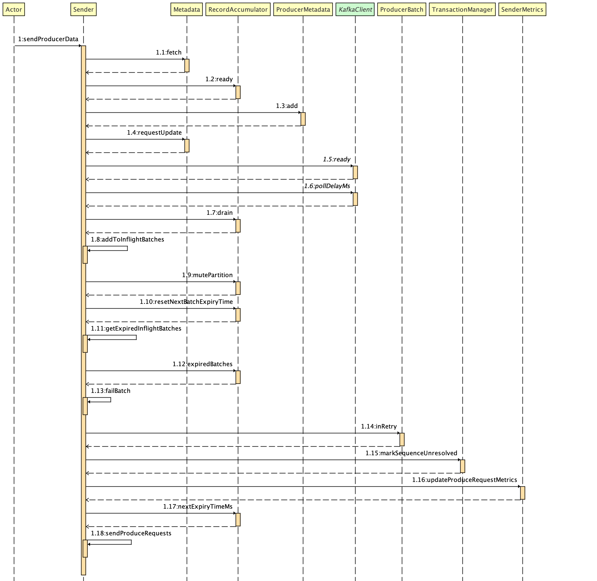
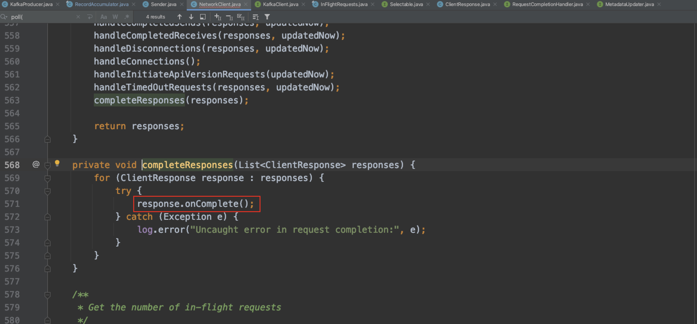
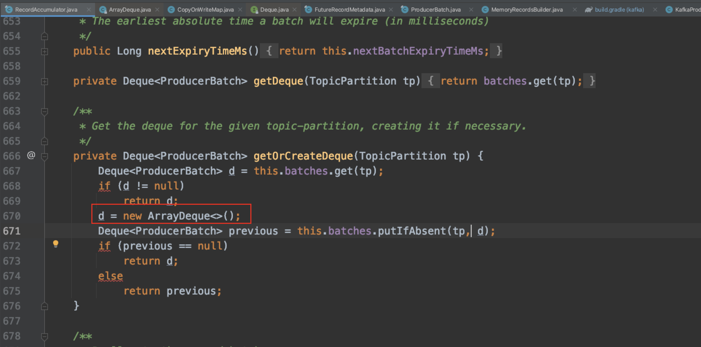
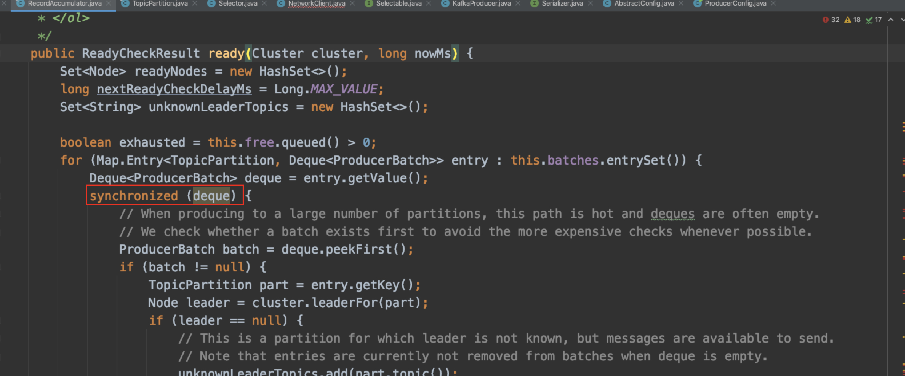
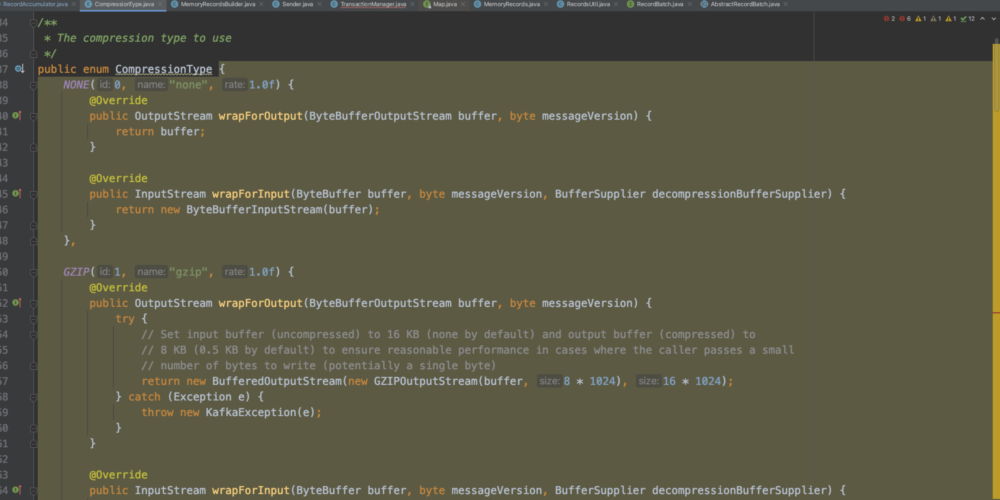
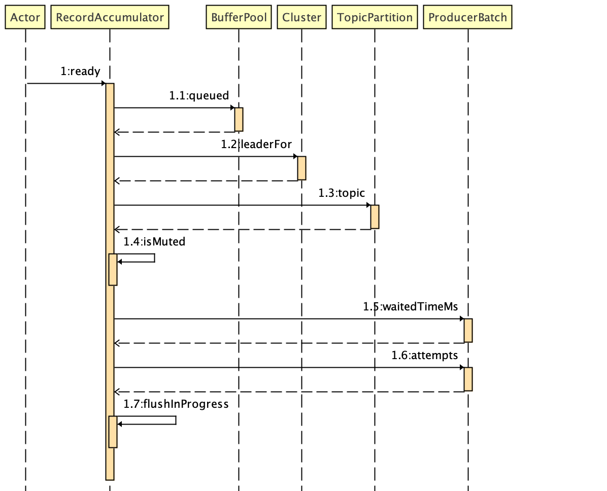
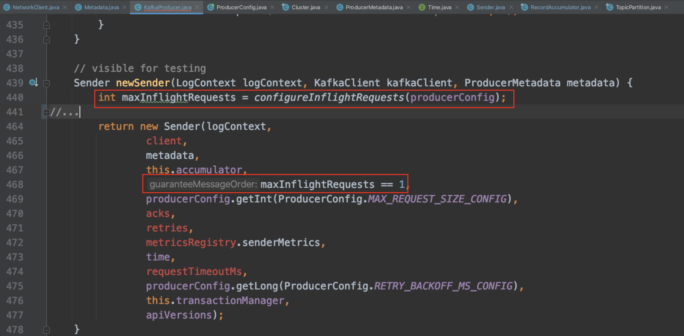

# KafkaProducer
<!-- TOC -->

- [KafkaProducer](#kafkaproducer)
  - [1、前言](#1前言)
  - [2、线程模型](#2线程模型)
    - [2.1、主线程](#21主线程)
    - [2.2、Sender线程](#22sender线程)
  - [3、数据流转](#3数据流转)
    - [3.1、消息累加器](#31消息累加器)
      - [3.1.1 成员变量介绍](#311-成员变量介绍)
      - [3.1.2 主线程与消息累加器的消息数据流转](#312-主线程与消息累加器的消息数据流转)
      - [3.1.3 Sender线程与消息累加器的消息数据流转](#313-sender线程与消息累加器的消息数据流转)
    - [3.2、网络模型-KafkaSelector](#32网络模型-kafkaselector)
  - [4、元数据更新](#4元数据更新)
  - [5、日常问题](#5日常问题)
  - [6、总结](#6总结)

<!-- /TOC -->


## 1、前言

本次分享，将会基于Kafka 2.5 版本的源码，围绕生产者客户端的线程模型、数据流转、元信息更新、日常问题这四个方面和大家一起学习、讨论Kafka.

开始分享前，我们先来看一个简单的生产者客户端的代码示例:
```java
public class ProducerTest {
    private static String topicName;
    private static int msgNum;
         
    public static void main(String[] args) {
        Properties props = new Properties(); 
        props.put("bootstrap.servers", "xxx.xxx.xxx.xxx:9092");
        props.put("key.serializer", "org.apache.kafka.common.serialization.StringSerializer");
        props.put("value.serializer", "org.apache.kafka.common.serialization.StringSerializer");
        props.put("compression.type", "lz4"); 
        props.put("linger.ms", 500 );
        props.put("batch.size", 100000 );
        props.put("max.in.flight.requests.per.connection", 1 );
        topicName = "test";
        msgNum = *; // 发送的消息数
        Producer<String, String> producer = new KafkaProducer<>(props);
        for (int i = 0; i < msgNum; i++) {
            String msg = i + " This is prodecer test.";
            producer.send(new ProducerRecord<String, String>(topicName, msg));
        }
        producer.close();
    }
}

```
上面的示例，我们实例化了一个无key的 `ProducerRecord` 的消息对象，然后实例化了一个 `KafkaProducer` 对象来进行消息发送的.
那么消息是怎么从客户端发往服务端的呢？

先附上一张生产者消息发送流程图，后面的内容会根据该流程图展开分析.


我们首先来了解下 `KafkaProducer` 设计的线程模型.

## 2、线程模型

生产者客户端的线程主要包括 `主线程` 和 `Sender线程`.

### 2.1、主线程

我们首先看下 `KafkaProducer` 比较重要的成员变量，以及该类的构造器方法.

PS: 为了便于源码分析，后续所有出现源码的地方，非核心探讨的代码将被略去(标记为 `// ...`).

```java
    /** 生产者的唯一标识 */
    private final String clientId;
    /** 分区选择器，根据一定的策略，将消息路由到合适的分区 */
    private final Partitioner partitioner;
    /** 消息的最大长度，这个长度包含了消息头、序列化后的 key 和序列化后的 value 的长度 */
    private final int maxRequestSize;
    /** 单个Producer,异步待发送消息的内存总大小 */
    private final long totalMemorySize;
    /** 元数据信息 */
    private final ProducerMetadata metadata;
    /** 消息累加器，用于收集并缓存消息，等待 Sender 线程发送 */
    private final RecordAccumulator accumulator;
    /** 发送消息的 Sender 任务，实现了 Runnable 接口，在 ioThread 线程中执行 */
    private final Sender sender;
    /** 执行 Sender 任务发送消息的线程，称为 [Sender 线程] */
    private final Thread ioThread;
    /** 压缩算法，可选项有 none、gzip、snappy、lz4、zstd. */
    private final CompressionType compressionType;
    /** 消息 key 的序列化器 */
    private final Serializer<K> keySerializer;
    /** 消息 value 的序列化器 */
    private final Serializer<V> valueSerializer;
    /** 生产者客户端配置对象 */
    private final ProducerConfig producerConfig;
    /** 等待更新 Kafka 集群元数据的最大时长或者发送buffer满，发送阻塞的时间 */
    private final long maxBlockTimeMs;
    /** 生产者拦截器链 */
    private final ProducerInterceptors<K, V> interceptors;
    /** 事务管理器 */
    private final TransactionManager transactionManager;

    KafkaProducer(Map<String, Object> configs,
                  Serializer<K> keySerializer,
                  Serializer<V> valueSerializer,
                  ProducerMetadata metadata,
                  KafkaClient kafkaClient,
                  ProducerInterceptors<K, V> interceptors,
                  Time time) {
        // ...
        try {
            // ...
            /** 调用方法 newSender() 来初始化成员变量 sender */
            this.sender = newSender(logContext, kafkaClient, this.metadata);
            String ioThreadName = NETWORK_THREAD_PREFIX + " | " + clientId;
            this.ioThread = new KafkaThread(ioThreadName, this.sender, true);
            /** 启动Sender线程 */
            this.ioThread.start();
            // ...
        } catch (Throwable t) {
            // call close methods if internal objects are already constructed this is to prevent resource leak. see KAFKA-2121
            close(Duration.ofMillis(0), true);
            // now propagate the exception
            throw new KafkaException("Failed to construct kafka producer", t);
        }
    }

```

我们可以发现在生产者 `主线程` 里实例化 `KafkaProducer` 对象时，会同时启动一个 `Sender线程`，那么这个 `Sender线程` 是用来干什么的呢？我们先留个疑问，先从生产者主线程调用 `send` 方法发送消息开始看起.

```java
    @Override
    public Future<RecordMetadata> send(ProducerRecord<K, V> record) {
        return send(record, null);
    }
```

我们的示例代码里调用的是接收一个 `ProducerRecord` 类型参数的send方法，该方法会调用重载的send(ProducerRecord<K, V> record, Callback callback)方法，callback为null表明无需在消息发送成功后进行回调函数调用处理.

```java
    @Override
    public Future<RecordMetadata> send(ProducerRecord<K, V> record, Callback callback) {
        // intercept the record, which can be potentially modified; this method does not throw exceptions
        ProducerRecord<K, V> interceptedRecord = this.interceptors.onSend(record);
        return doSend(interceptedRecord, callback);
    }
```

通过该方法，我们可以得知，生产者发送的消息首先需要经过生产者拦截器链的处理。生产者拦截器链即生产者拦截器实现类的有序集合，由生产者客户端参数 `{interceptor.classes}` 来指定。
生产者拦截器的作用是用来在消息发送前做一些准备工作，比如按某个规则过滤不符合要求的消息、修改消息的内容等，也可以用来在发送回调逻辑前做一些定制化需求，比如统计类工作。
自定义实现 `org.apache.kafka.clients.producer.ProducerInterceptor` 接口即可。

继续往下看，接下来会调用私有方法 `doSend(ProducerRecord<K, V> record, Callback callback)`

```java

    /**
     * Implementation of asynchronously send a record to a topic.
     */
    private Future<RecordMetadata> doSend(ProducerRecord<K, V> record, Callback callback) {
        TopicPartition tp = null;
        try {
            throwIfProducerClosed();
            // first make sure the metadata for the topic is available
            long nowMs = time.milliseconds();
            ClusterAndWaitTime clusterAndWaitTime;
            try {
                /** 获取要发送的topic相关的集群元数据信息 */
                clusterAndWaitTime = waitOnMetadata(record.topic(), record.partition(), nowMs, maxBlockTimeMs);
            } catch (KafkaException e) {
                if (metadata.isClosed())
                    throw new KafkaException("Producer closed while send in progress", e);
                throw e;
            }
            nowMs += clusterAndWaitTime.waitedOnMetadataMs;
            long remainingWaitMs = Math.max(0, maxBlockTimeMs - clusterAndWaitTime.waitedOnMetadataMs);
            Cluster cluster = clusterAndWaitTime.cluster;
            byte[] serializedKey;
            try {
                /** 对消息的 key 序列化 */
                serializedKey = keySerializer.serialize(record.topic(), record.headers(), record.key());
            } catch (ClassCastException cce) {
                throw new SerializationException("Can't convert key of class " + record.key().getClass().getName() +
                        " to class " + producerConfig.getClass(ProducerConfig.KEY_SERIALIZER_CLASS_CONFIG).getName() +
                        " specified in key.serializer", cce);
            }
            byte[] serializedValue;
            try {
                /** 对消息的 value 序列化 */
                serializedValue = valueSerializer.serialize(record.topic(), record.headers(), record.value());
            } catch (ClassCastException cce) {
                throw new SerializationException("Can't convert value of class " + record.value().getClass().getName() +
                        " to class " + producerConfig.getClass(ProducerConfig.VALUE_SERIALIZER_CLASS_CONFIG).getName() +
                        " specified in value.serializer", cce);
            }
            
            /** 确定消息发往的分区 */
            int partition = partition(record, serializedKey, serializedValue, cluster);

            // ...

            /** 将该主题分区的消息追加到消息累加器中. */
            RecordAccumulator.RecordAppendResult result = accumulator.append(tp, timestamp, serializedKey,
                    serializedValue, headers, interceptCallback, remainingWaitMs, true, nowMs);

            // ...
            
            /** 消息累加器中该主题分区的消息批次满了 或者 构建了新的消息批次，唤醒sender */
            if (result.batchIsFull || result.newBatchCreated) {
                log.trace("Waking up the sender since topic {} partition {} is either full or getting a new batch", record.topic(), partition);
                this.sender.wakeup();
            }
            return result.future;
            // handling exceptions and record the errors;
            // for API exceptions return them in the future,
            // for other exceptions throw directly
        } catch (xxx e) {
            // ... 一些细粒度的异常处理.
        } catch (Exception e) {
            // we notify interceptor about all exceptions, since onSend is called before anything else in this method
            this.interceptors.onSendError(record, tp, e);
            throw e;
        }
    }

```

`doSend` 方法的逻辑执行步骤:

1、调用私有方法 `waitOnMetadata` 来获取集群元数据信息，该方法的具体分析会在后面的 `元数据更新` 章节中阐述。

2、对消息的 `key` 和 `value` 进行序列化。`key` 和 `value` 对应的序列化器分别由生产者参数 `{key.serializer}` 和 `{value.serializer}` 来指定，自定义实现 `org.apache.kafka.common.serialization.Serializer` 接口即可。

3、调用私有方法 `partition` 按照指定的分区器来计算消息要发往的分区，分区器由生产者参数 `{partitioner.class}` 来指定，自定义实现 `org.apache.kafka.clients.producer.Partitioner` 接口即可。

4、调用消息累加器 `RecordAccumulator` 的 `append` 方法，将要发送的消息追加到消息累加器中。消息累加器 `RecordAccumulator` 的具体分析将会在 `数据流转` 章节中阐述。

5、有条件地调用 `sender.wakeup()` 来唤醒 `Sender线程`。

至此，我们对生产者主线程从构建消息对象 `ProducerRecord` 到调用 `send` 方法发送消息的过程进行一个总结:

创建消息 -> 生产者拦截器 -> 序列化器 -> 分区器 -> 消息累加器 -> 唤醒Sender线程

在上面的阐述中，多次提到了 `Sender`，接下来我们就通过 `Sender.java` 来分析下它.

### 2.2、Sender线程

我们首先看下 `Sender` 类的注释:

```java
/**
 * The background thread that handles the sending of produce requests to the Kafka cluster. This thread makes metadata
 * requests to renew its view of the cluster and then sends produce requests to the appropriate nodes.
 *
 * 用来处理生产者消息发送请求到Kafka集群的守护线程. 该守护线程会发起请求来更新集群元数据信息然后来发送生产者的请求到合适的broker节点.
 */
public class Sender implements Runnable {
  // ...
}
```

通过官方拟定的注释，可以清楚地知道 `Sender线程` 主要做的两件事:

1、发起集群元信息更新请求，更新集群元数据信息.

2、对生产者的消息发送请求进行处理，选出合适的broker节点并发往.

`Sender` 是一个实现 `Runnable` 的线程类，所以直接来看它的run方法，是怎样的执行逻辑.

```java
    /**
     * The main run loop for the sender thread
     */
    public void run() {
        log.debug("Starting Kafka producer I/O thread.");

        // main loop, runs until close is called
        while (running) {
            try {
                runOnce();
            } catch (Exception e) {
                log.error("Uncaught error in kafka producer I/O thread: ", e);
            }
        }

        // ...
    }
```

`run` 方法里会一直循环调用执行 `runOnce` 方法直到生产者客户端调用了 `close` 方法. 所以核心的处理逻辑都在runOnce方法，我们顺着看下该方法.

为了便于分析，我们直接从非事务的消息发送逻辑来看. 代码执行时序图如下所示:


`sendProducerData` - 准备发送的数据请求.
  
`client.poll` - 把准备好的消息请求真正地发送出去.

再来看下 `sendProducerData` 方法，直接来看该方法的代码执行时序图:



`sendProduceRequests` 方法代码执行时序图:


核心的逻辑处理步骤说明:

1、从 `metadata` 获取kafka集群的元数据

2、调用消息累加器的 `ready` 方法，获取累加器中 `已达到发送条件` 的 `消息批次` 所属 主题分区的 `leader副本` 所在的 `node节点` 、存在无leader副本的主题信息等封装在 `ReadyCheckResult` 中并返回.

3、如果 `ReadyCheckResult` 中的 `unknownLeaderTopics` 有值，即消息累加器中存在无leader分区的主题分区，那么则需要强制更新集群元数据.

4、遍历 `readyNodes`，检查 `KafkaClient` 对该 `node` 是否符合 `网络I/O` 的条件，不符合的从集合中删除.

5、调用消息累加器的 `drain` 方法把待发送的消息按 `node` 进行分组，返回 `Map<Integer, List<ProducerBatch>>`.

6、把待发送的 `batch` 添加到 `Sender` 的 `inFlightBatches` 中，`inFlightBatches` 的类型是 `Map<TopicPartition, List<ProducerBatch>>`，由此可见是按照主题分区来存储的.

7、获取所有过期的 `batch`，遍历做过期处理.

8、调用 `sendProduceRequests` 方法，将待发送的 `ProducerBatch` 封装成为 `ClientRequest`，调用 `NetworkClient` 的 `send` 方法，先将请求缓存到 `inFlightRequests`，最终调用 `Selector` 的 `send` 方法，将请求添加到发送队列中.注意到这里还没有进行真正地发送.

接下来再看下`client.poll`，这里的 `client` 是实例化的 `NetworkClient`类(可从 `KafkaProducer` 里实例化 `Sender` 对象调用的 `newSender` 方法里看出)。
所以我们直接看 `NetworkClient.poll` 方法:

```java
    /**
     * Do actual reads and writes to sockets.
     * 对sockets 执行实际的 读/写 操作
     */
    @Override
    public List<ClientResponse> poll(long timeout, long now) {
        // ...
        
        /** 调用了元信息更新器的maybeUpdate方法，这里先留个标记 ⭐️ */
        long metadataTimeout = metadataUpdater.maybeUpdate(now);
        try {
            /** 这里会阻塞 */
            this.selector.poll(Utils.min(timeout, metadataTimeout, defaultRequestTimeoutMs));
        } catch (IOException e) {
            log.error("Unexpected error during I/O", e);
        }

        /** 请求返回的响应处理 */
        long updatedNow = this.time.milliseconds();
        List<ClientResponse> responses = new ArrayList<>();
        handleCompletedSends(responses, updatedNow); // 处理已经完成的发送请求，如果是那些不需要 response 的 request 的话，这里直接调用 request.completed()，标志着这个 request 发送处理完成
        handleCompletedReceives(responses, updatedNow); // 处理从 Server 端接收的 Receive，metadata 更新就是在这里处理的
        handleDisconnections(responses, updatedNow); // 处理连接失败的连接,重新请求 metadata
        handleConnections();
        handleInitiateApiVersionRequests(updatedNow); 
        handleTimedOutRequests(responses, updatedNow); // 处理超时的连接，关闭该连接，并刷新 Metadata
        completeResponses(responses); // 触发生产者指定的回调函数的执行

        return responses;
    }
```

`client.poll` 方法主要做的事情有:

1、调用 `Selector` 的 `poll()` 方法 触发网络I/O，把消息真正地发送出去.

2、对消息发送，消息接收、断开连接、API版本，超时等结果进行收集.

3、依次对结果进行唤醒，此时会将响应结果设置到 `KafkaProducer` 的 `send` 方法返回的凭证中，从而唤醒发送客户端，完成一次完整的消息发送流程.

至此，我们总结下 `Sender` 线程发送消息的过程:

1、把按照主题分区分堆的消息批次最终转化为以 `node` 节点(broker)区分的一组 `ClientRequest`.

2、调用 `NetWorkClient` 的 `send` 方法，做好发送 `ClientRequest` 的准备.

3、全部就绪后调用 `NetWorkClient` 的 `poll` 方法，触发网络I/O，把消息真正发送出去.

4、对消息发送，消息接收、断开连接、API版本，超时等结果进行收集.

5、依次对结果进行唤醒，此时会将响应结果设置到 `KafkaProducer.send` 方法返回的凭证中，从而唤醒发送客户端，完成一次完整的消息发送流程.

如果生产者客户端调用 `send` 方法时，指定了回调函数 `callback` 参数，那么在步骤5会通知回调函数完成发送并执行回调函数.




分析到这里，读者应该大致清楚了生产者发送的消息数据是怎样流转的，章节3会深入消息数据在消息累加器中的流转。

## 3、数据流转

生产者发送消息数据流转过程:

1、消息数据 `ProducerRecord` 首先在 `生产者主线程` 中被构建

2、然后通过调用 `KafkaProducer.send` 方法，被追加到 `消息累加器` 中

3、再由 `守护线程Sender` 从 `消息累加器` 中取消息并封装成 `ClientRequest`

4、再由 `KafkaSelector` 进行实际地网络传输请求到 `broker服务端`

可见消息累加器 `RecordAccumulator` 在生产者消息发送过程中扮演了非常重要的角色，那这个消息累加器是什么呢？有什么用呢？

### 3.1、消息累加器
干什么的？-> 来缓存消息，方便 `Sender` 线程可以批量发送，进而减少网络传输的资源消耗来提升性能.

减少网络IO、磁盘IO提升吞吐量这种思想，在很多主流中间件中都有体现，比如 `redis` 的pipeline、DB的批量SQL操作.

#### 3.1.1 成员变量介绍

我们看下消息累加器源码中定义的成员变量:

```java
/**
 * This class acts as a queue that accumulates records into {@link MemoryRecords}
 * instances to be sent to the server.
 * <p>
 * The accumulator uses a bounded amount of memory and append calls will block when that memory is exhausted, unless
 * this behavior is explicitly disabled.
 */
public final class RecordAccumulator {

    private final Logger log;
    private volatile boolean closed;
    private final AtomicInteger flushesInProgress;
    private final AtomicInteger appendsInProgress;
    private final int batchSize; // 客户端配置的参数{batch.size}
    private final CompressionType compression; // 客户端配置的参数{compression.type}
    private final int lingerMs; // 客户端配置的参数{linger.ms}
    private final long retryBackoffMs; // 客户端配置的参数{retry.backoff.ms}
    private final int deliveryTimeoutMs;
    private final BufferPool free; // 实现消息内存的创建和释放
    private final Time time;
    private final ApiVersions apiVersions;
    private final ConcurrentMap<TopicPartition, Deque<ProducerBatch>> batches; // 主题分区 与 双端队列<消息批次>的映射
    private final IncompleteBatches incomplete;
    // The following variables are only accessed by the sender thread, so we don't need to protect them.
    private final Map<TopicPartition, Long> muted;
    private int drainIndex;
    private final TransactionManager transactionManager;
    private long nextBatchExpiryTimeMs = Long.MAX_VALUE; 
    
    // ...
}
```

可以看到这里定义了一个 `BufferPool` 类型的 `free` 变量，`BufferPool` 是Kafka自实现的缓冲池，用来实现对 `java.nio.ByteBuffer` 的复用，来对消息进行内存上的创建和释放.`BufferPool` 只管理特定大小的 `ByteBuffer`，这个特定大小由客户端参数 `{batch.size}` 来指定。

缓冲池的大小决定了消息累加器中缓存消息的大小。

那么这个缓冲池的大小谁来决定？ -> 生产者客户端参数 `{buffer.memory}`。如果生产者客户端需要向很多分区发送消息，适当调大该参数可以增加整体的吞吐量。

`batches` 变量缓存了 `主题分区` 与 `主题消息批次`的映射关系，主题消息批次存放在一个双端队列Deque中，这里用到了Deque（双端队列）数据结构.

消息累加器选用的是ArrayDeque实现类，非线程安全的，所以我们在源码中可以看到，在对Deque对象做处理时，都进行了加锁操作，来保证 `KafkaProducer` 的线程安全.






#### 3.1.2 主线程与消息累加器的消息数据流转

`生产者主线程` 调用 `RecordAccumulator.append`，将消息追加到消息累加器，我们来看下 `append` 方法。

```java
    /**
     * Add a record to the accumulator, return the append result
     * <p>
     * The append result will contain the future metadata, and flag for whether the appended batch is full or a new batch is created
     * <p>
     * ...
    */
    public RecordAppendResult append(TopicPartition tp,
                                     long timestamp,
                                     byte[] key,
                                     byte[] value,
                                     Header[] headers,
                                     Callback callback,
                                     long maxTimeToBlock,
                                     boolean abortOnNewBatch,
                                     long nowMs) throws InterruptedException {
        // We keep track of the number of appending thread to make sure we do not miss batches in
        // abortIncompleteBatches().
        appendsInProgress.incrementAndGet();
        ByteBuffer buffer = null;
        if (headers == null) headers = Record.EMPTY_HEADERS;
        try {
            Deque<ProducerBatch> dq = getOrCreateDeque(tp);
            synchronized (dq) {
                if (closed)
                    throw new KafkaException("Producer closed while send in progress");
                RecordAppendResult appendResult = tryAppend(timestamp, key, value, headers, callback, dq, nowMs);
                if (appendResult != null)
                    return appendResult;
            }

            // ...            

            byte maxUsableMagic = apiVersions.maxUsableProduceMagic();
            int size = Math.max(this.batchSize, AbstractRecords.estimateSizeInBytesUpperBound(maxUsableMagic, compression, key, value, headers));
            log.trace("Allocating a new {} byte message buffer for topic {} partition {}", size, tp.topic(), tp.partition());
            buffer = free.allocate(size, maxTimeToBlock);

            // Update the current time in case the buffer allocation blocked above.
            nowMs = time.milliseconds();
            synchronized (dq) {
                // Need to check if producer is closed again after grabbing the dequeue lock.
                if (closed)
                    throw new KafkaException("Producer closed while send in progress");
                RecordAppendResult appendResult = tryAppend(timestamp, key, value, headers, callback, dq, nowMs);
                if (appendResult != null) {
                    // Somebody else found us a batch, return the one we waited for! Hopefully this doesn't happen often...
                    return appendResult;
                }
                
                MemoryRecordsBuilder recordsBuilder = recordsBuilder(buffer, maxUsableMagic);
                ProducerBatch batch = new ProducerBatch(tp, recordsBuilder, nowMs);
                FutureRecordMetadata future = Objects.requireNonNull(batch.tryAppend(timestamp, key, value, headers,
                        callback, nowMs));
                dq.addLast(batch);
                incomplete.add(batch);

                // Don't deallocate this buffer in the finally block as it's being used in the record batch
                buffer = null;
                return new RecordAppendResult(future, dq.size() > 1 || batch.isFull(), true, false);
            }
        } finally {
            if (buffer != null)
                free.deallocate(buffer);
            appendsInProgress.decrementAndGet();
        }
    }
```

`append` 方法代码执行时序图:


`append` 方法的主要逻辑步骤:

1、`AtomicInteger.incrementAndGet` 通过原子操作，把追加消息的线程计数器+1.

2、调用私有方法 `getOrCreateDeque` 拿到对应 `TopicPartition` 的批次队列 `Deque<ProducerBatch>`，如果未获取到则新创建.

3在同步代码块中执行

3、调用私有方法 `tryAppend`，进行第一次尝试添加消息到批次里，成功则直接返回

4、预估size大小，从BufferPool申请分配缓冲区(说明步骤3失败了)

5-8在同步代码块中执行

5、再次调用私有方法 `tryAppend`，进行第二次尝试添加消息到批次里

6、步骤5如果成功则直接返回，如果失败则创建新的批次 `ProducerBatch`

7、调用 `ProducerBatch.tryAppend`，对消息进行追加

8、释放缓冲区空间

9、finally块里再次执行释放缓冲区空间，确保释放，并通过原子操作把追加消息的线程计数器-1(与一开始进行+1形成闭环).

`append` 方法在线程安全的设计上采用细粒度锁来实现:

1、没有用方法锁，通过使用 `ConcurrentHashMap` 保证线程安全的同时提升并发度，每一个 `TopicPartition` 对应的的批次都可以并发操作.

2、进行了分段加同步代码块锁，把能并发执行的 `申请缓冲区` 部分分离出来，这个设计可以看出在性能上考虑的很极致，只在必需的地方加锁.

上面的分析，我们也得知了消息是追加到批次队列 `Deque` 的尾部的.

我们知道Kafka高吞吐的特性是离不开消息压缩这个利器的.通过少量的cpu消耗来减少磁盘和网络传输的io. 那么消息发送到 `broker` 前，消息是在哪里压缩的呢？

没错，也是在消息累加器中完成的.这里涉及到生产者客户端参数 `{compression.type}` ，该参数用来指定消息压缩方式.

支持的压缩方式有: `"none"不压缩`、`"gzip"`、`"snappy"`、`"lz4"`、`"zstd"`.

那么消息在消息累加器中是如何进行压缩的呢？我们可以顺着源码倒着看，来捋一下这个过程.

首先看下 `CompressionType` 枚举类




该类中抽象方法 `wrapForOutput()` 就是用指定压缩方式来压缩数据的.每个压缩方式枚举中都实现了各自的该压缩方法.

那我们看下该方法是在哪里被调用的


可以看到是在 `MemoryRecordsBuilder` 的构造器里调用的.

这里清楚了后，我们再回到消息累加器的 `append` 方法，寻找蛛丝马迹.


可以看到这里会构建一个 `MemoryRecordsBuilder` 的变量 `recordsBuilder`，答案找到了，没错就是这里，初始化该变量的时候，将消息按配置的 `{compression.type}` 进行了压缩.

#### 3.1.3 Sender线程与消息累加器的消息数据流转

在上面 `Sender` 线程的介绍中，该守护线程会从消息累加器中取出消息数据进行请求发送，它调用了消息累加器的 `ready()` 和 `drain()` 方法，下面我们就来分别分析下这两个方法.

`Sender` 线程从消息累加器中取消息批次是从 `Deque的头部` 取的. 

`ready()`:

我们看下 `ready()` 方法的源码:

```java

    /**
     * Get a list of nodes whose partitions are ready to be sent, and the earliest time at which any non-sendable
     * partition will be ready; Also return the flag for whether there are any unknown leaders for the accumulated
     * partition batches.
     * ...
     */
    public ReadyCheckResult ready(Cluster cluster, long nowMs) {
        Set<Node> readyNodes = new HashSet<>();
        long nextReadyCheckDelayMs = Long.MAX_VALUE;
        Set<String> unknownLeaderTopics = new HashSet<>();

        /** 是否有线程在阻塞等待BufferPool释放空间 */
        boolean exhausted = this.free.queued() > 0;
        for (Map.Entry<TopicPartition, Deque<ProducerBatch>> entry : this.batches.entrySet()) {
            Deque<ProducerBatch> deque = entry.getValue();
            synchronized (deque) {
                // When producing to a large number of partitions, this path is hot and deques are often empty.
                // We check whether a batch exists first to avoid the more expensive checks whenever possible.
                ProducerBatch batch = deque.peekFirst();
                if (batch != null) {
                    TopicPartition part = entry.getKey();
                    Node leader = cluster.leaderFor(part);
                    if (leader == null) {
                        // This is a partition for which leader is not known, but messages are available to send.
                        // Note that entries are currently not removed from batches when deque is empty.
                        unknownLeaderTopics.add(part.topic());
                    } else if (!readyNodes.contains(leader) && !isMuted(part, nowMs)) {
                        long waitedTimeMs = batch.waitedTimeMs(nowMs);
                        boolean backingOff = batch.attempts() > 0 && waitedTimeMs < retryBackoffMs;
                        long timeToWaitMs = backingOff ? retryBackoffMs : lingerMs;
                        boolean full = deque.size() > 1 || batch.isFull();
                        boolean expired = waitedTimeMs >= timeToWaitMs;
                        /** 是否可发送  满足一个即可. 满了 || 超时了 || 有线程阻塞bufferpool释放空间 || producer关闭了 || producer调用了flush() */
                        boolean sendable = full || expired || exhausted || closed || flushInProgress();

                        /** 该消息批次符合可发送条件，将leader node加入到readyNodes集合 */
                        if (sendable && !backingOff) {
                            readyNodes.add(leader);
                        } else {
                            long timeLeftMs = Math.max(timeToWaitMs - waitedTimeMs, 0);
                            // Note that this results in a conservative estimate since an un-sendable partition may have
                            // a leader that will later be found to have sendable data. However, this is good enough
                            // since we'll just wake up and then sleep again for the remaining time.
                            nextReadyCheckDelayMs = Math.min(timeLeftMs, nextReadyCheckDelayMs);
                        }
                    }
                }
            }
        }
        return new ReadyCheckResult(readyNodes, nextReadyCheckDelayMs, unknownLeaderTopics);
    }

```

`ready` 方法代码执行时序图:



重要步骤:

1、遍历消息累加器中的所有消息批次 `batches` 变量，从消息批次队列头部取出消息批次.

2、调用 `Cluster.leaderFor`方法，从集群元信息中获取该主题分区的 `leader副本` 所在的broker节点.

3、如果该主题分区无主，则将该 `Topic` 加入到 `无主Topic集合` 中，有则继续判断是否该主题分区所对应的消息批次是否符合发送条件.

4、封装 `准备好发送的node节点集合`、`下次准备就绪检查的时间`、`无主Topic集合`，返回.

总结 `ready()` 方法的作用: 就是筛选出集群中可以进行发送的 `node`. 

可发送的判定: 如果 `TopicPartition` 对应的 `ProducerBatch` 满足可发送条件，就把 `TopicPartition` 对应的 `leader` 所在的 `node` 选出来.

`drain()`:
我们看下 `drain()` 方法的源码:

```java

    /**
     * Drain all the data for the given nodes and collate them into a list of batches that will fit within the specified
     * size on a per-node basis. This method attempts to avoid choosing the same topic-node over and over.
     * 将可发送请求的所有node上的消息批次，按node进行分组.
     * 
     */
    public Map<Integer, List<ProducerBatch>> drain(Cluster cluster, Set<Node> nodes, int maxSize, long now) {
        if (nodes.isEmpty())
            return Collections.emptyMap();

        Map<Integer, List<ProducerBatch>> batches = new HashMap<>();
        for (Node node : nodes) {
            List<ProducerBatch> ready = drainBatchesForOneNode(cluster, node, maxSize, now);
            batches.put(node.id(), ready);
        }
        return batches;
    }

```

`drain` 方法会遍历可发送请求的node集合，调用 `drainBatchesForOneNode`方法，获取该 `node` 上所有要发送的消息批次，并按 `node` 进行分组，封装到 `Map`中返回。
所以我们顺着看下 `drainBatchesForOneNode` 方法.

```java

    private List<ProducerBatch> drainBatchesForOneNode(Cluster cluster, Node node, int maxSize, long now) {
        int size = 0;
        /** 获取该node上所有的分区 */
        List<PartitionInfo> parts = cluster.partitionsForNode(node.id());
        List<ProducerBatch> ready = new ArrayList<>();
        /* to make starvation less likely this loop doesn't start at 0 */
        int start = drainIndex = drainIndex % parts.size();
        do {
            PartitionInfo part = parts.get(drainIndex);
            TopicPartition tp = new TopicPartition(part.topic(), part.partition());
            this.drainIndex = (this.drainIndex + 1) % parts.size();

            // Only proceed if the partition has no in-flight batches.
            if (isMuted(tp, now))
                continue;

            Deque<ProducerBatch> deque = getDeque(tp);
            if (deque == null)
                continue;

            synchronized (deque) {
                // invariant: !isMuted(tp,now) && deque != null
                ProducerBatch first = deque.peekFirst();
                if (first == null)
                    continue;

                // first != null
                boolean backoff = first.attempts() > 0 && first.waitedTimeMs(now) < retryBackoffMs;
                // Only drain the batch if it is not during backoff period.
                if (backoff)
                    continue;

                if (size + first.estimatedSizeInBytes() > maxSize && !ready.isEmpty()) {
                    // there is a rare case that a single batch size is larger than the request size due to
                    // compression; in this case we will still eventually send this batch in a single request
                    break;
                } else {
                    if (shouldStopDrainBatchesForPartition(first, tp))
                        break;

                    boolean isTransactional = transactionManager != null && transactionManager.isTransactional();
                    ProducerIdAndEpoch producerIdAndEpoch =
                        transactionManager != null ? transactionManager.producerIdAndEpoch() : null;
                    ProducerBatch batch = deque.pollFirst();
                    if (producerIdAndEpoch != null && !batch.hasSequence()) {
                        // If the batch already has an assigned sequence, then we should not change the producer id and
                        // sequence number, since this may introduce duplicates. In particular, the previous attempt
                        // may actually have been accepted, and if we change the producer id and sequence here, this
                        // attempt will also be accepted, causing a duplicate.
                        //
                        // Additionally, we update the next sequence number bound for the partition, and also have
                        // the transaction manager track the batch so as to ensure that sequence ordering is maintained
                        // even if we receive out of order responses.
                        batch.setProducerState(producerIdAndEpoch, transactionManager.sequenceNumber(batch.topicPartition), isTransactional);
                        transactionManager.incrementSequenceNumber(batch.topicPartition, batch.recordCount);
                        log.debug("Assigned producerId {} and producerEpoch {} to batch with base sequence " +
                                "{} being sent to partition {}", producerIdAndEpoch.producerId,
                            producerIdAndEpoch.epoch, batch.baseSequence(), tp);

                        transactionManager.addInFlightBatch(batch);
                    }
                    batch.close();
                    size += batch.records().sizeInBytes();
                    ready.add(batch);

                    batch.drained(now);
                }
            }
        } while (start != drainIndex);
        return ready;
    }

```

总结 `drain()` 方法的作用: 

用来遍历可发送请求的 `node`，然后再遍历在这个 `node` 上的所有 `TopicPartition`，如果 `TopicPartition` 对应的 `deque` 有数据，将会被选择出来，直到超过一个请求的最大size `{max.request.size}` 为止，也就是说即使 `ProduceBatch` 没有达到可发送条件，但为了保证每个 `request` 尽快多地发送数据，提高发送效率，这个 `ProducerBatch` 依然会被提前选出来并进行发送.

### 3.2、网络模型-KafkaSelector
Kafka定义的 `Selector` 是Kafka对于java原生的Selector的功能增强，用于满足Kafka的具体需求。核心是利用 `NetworkSend`、`NetworkReceive` 与 `KafkaChannel` 这些Kafka定义的模型，完成I/O读写操作。归根结底，使用 `nio` 的`Channel` 与 `ByteBuffer` 交互完成更底层的读写操作。本次不做过多赘述，相关源码在 `org.apache.kafka.common.network` 包下，有兴趣的童鞋可以前往阅读。

通过前面的介绍，相信大家对生产者客户端要发送的消息是怎么流转到服务端 `broker` 的，有了一个大概的了解，我们加上 `服务端` 再来回顾下大致的过程:

step1: 主线程由 `KafkaProducer` 创建消息

step2: 拦截器 -> 分区器 -> 序列化器 -> 消息累加器

step3: `Sender` 线程从消息累加器中读取消息，发往 `broker` 服务端.

那到了服务端之后的数据流转是什么样的呢？
以Producer端配置的 `acks` 参数为"-1"或"all"为例: 

step4: 消息分区的 `leader` 副本将消息写入本地log(数据盘).

step5: 消息分区的 `follower` 副本从 `leader` 副本pull消息同步写入到对应的本地log后向 `leader` 发送ack.

step6: `leader` 收到所有 `ISR` 中的 `replica` 的 ACK 后，向 producer 发送 ACK.

至此一个保证消息不丢失的最高可靠性过程就完成了，当然强高可靠付出的代价就是吞吐量的降低，所以一般来说，Producer采用默认值"1"即可，`leader` 副本将消息成功写入本地log后就返回响应给Producer，是消息可靠性和吞吐量之间的折中方案。

## 4、元数据更新

元数据更新是一个标准的 `I/O` 通信过程，`主线程` 等待信息获取，`Sender线程` 进行网络I/O通信获取，并更新到metadata当中.

触发元数据更新的时机:

1、`生产者主线程` 获取 `Topic` 分区信息元数据的时候发现没有，就会立马唤醒 `Sender线程` 去拉取更新元数据

2、`Sender线程` 检查已经准备好的消息批次的时候，发现存在无主Topic会去拉取更新元数据(上面分析的 `Sender` 的 `sendProducerData` 方法的核心 `步骤3` 说明)

3、距离上次更新元数据已经过了 `{metadata.max.age.ms}` ms，这个时候就会去拉取更新元数据，该参数配置默认是5分钟

4、`broker` 响应发送消息结果里面带着异常 `InvalidMetadataException`，也就是元数据异常

对上面的更新时机，我们可以进行元数据更新策略的归类:

1. 强制更新. 上面的更新时机 1、2、4 

2. 周期性更新. 上面的更新时机 3

我们通过 `Producer` 发送消息的核心方法 `doSend()` 来分析一个元数据更新 从请求发起 到 实际更新 的完整过程(对应上面的 `更新时机1`):

上面分析主线程时提到的 `waitOnMetadata()` 方法，我们来看下该方法:

```java

    /**
     * Wait for cluster metadata including partitions for the given topic to be available.
     * ...
     */
    private ClusterAndWaitTime waitOnMetadata(String topic, Integer partition, long nowMs, long maxWaitMs) throws InterruptedException {
        // add topic to metadata topic list if it is not there already and reset expiry
        /** 从元信息缓存中获取集群元信息 */
        Cluster cluster = metadata.fetch();

        if (cluster.invalidTopics().contains(topic))
            throw new InvalidTopicException(topic);

        /** 将topic添加到元信息的topics集合中，如果是新的topic则再添加到newTopics Set中，并设置元信息更新标记*/
        metadata.add(topic, nowMs);

        /** 获取Topic的分区数量 */
        Integer partitionsCount = cluster.partitionCountForTopic(topic);
        // Return cached metadata if we have it, and if the record's partition is either undefined
        // or within the known partition range
        /** 分区数量获取到 且 (生产者发送未指定分区 或者 指定的分区号在该Topic的分区编号范围内)，封装集群元信息并返回 */
        if (partitionsCount != null && (partition == null || partition < partitionsCount))
            return new ClusterAndWaitTime(cluster, 0);

        /** 执行到这里，表明集群元信息中没有该Topic的分区信息 或者 生产者指定发送的分区号不在上面获取到的该Topic的分区数量范围内 */
        /** 说明集群元信息不是最新的了，需要进行发起请求更新元信息 */
        /** remainingWaitMs 表示等待元信息更新剩余时间，一开始赋值成生产者设置的{metadata.max.age.ms}值 */
        long remainingWaitMs = maxWaitMs;
        /** 已经执行的时间 */
        long elapsed = 0;
        // Issue metadata requests until we have metadata for the topic and the requested partition,
        // or until maxWaitTimeMs is exceeded. This is necessary in case the metadata
        // is stale and the number of partitions for this topic has increased in the meantime.
        do {
            if (partition != null) {
                log.trace("Requesting metadata update for partition {} of topic {}.", partition, topic);
            } else {
                log.trace("Requesting metadata update for topic {}.", topic);
            }
            metadata.add(topic, nowMs + elapsed);
            /** 获取元信息当前的更新版本号 */
            int version = metadata.requestUpdateForTopic(topic);
            /** 唤醒Sender线程，进行更新元信息请求的发送并更新元信息 */
            sender.wakeup();
            try {
                /** 阻塞 {remainingWaitMs} 的时间，直到元信息的当前更新版本号(元信息被更新了) > 上一个当前更新版本值(也就是version) */
                metadata.awaitUpdate(version, remainingWaitMs);
            } catch (TimeoutException ex) {
                // Rethrow with original maxWaitMs to prevent logging exception with remainingWaitMs
                throw new TimeoutException(
                        String.format("Topic %s not present in metadata after %d ms.",
                                topic, maxWaitMs));
            }
            /** 从元信息中再次获取集群元信息 */
            cluster = metadata.fetch();
            /** 已经执行的时间 = 当前时间 - waitOnMetadata被调用的时间 */
            elapsed = time.milliseconds() - nowMs;
            /** 如果已经执行的时间超过了最大等待时间，则抛TimeoutException. */
            if (elapsed >= maxWaitMs) {
                /** 这里异常信息根据partitionsCount是否获取到进行区分 */
                throw new TimeoutException(partitionsCount == null ?
                        String.format("Topic %s not present in metadata after %d ms.",
                                topic, maxWaitMs) :
                        String.format("Partition %d of topic %s with partition count %d is not present in metadata after %d ms.",
                                partition, topic, partitionsCount, maxWaitMs));
            }
            metadata.maybeThrowExceptionForTopic(topic);
            /** 剩余等待时间更新，剩余等待时间 = 最大等待时间 - 已经执行时间 */
            remainingWaitMs = maxWaitMs - elapsed;
            /** 到这里，说明已经更新了集群元信息，再次从集群元信息中获取该Topic的信息 */
            partitionsCount = cluster.partitionCountForTopic(topic);
            /** 如果还是没有获取到，则继续遍历，再次发起请求更新元信息 */
        } while (partitionsCount == null || (partition != null && partition >= partitionsCount));

        return new ClusterAndWaitTime(cluster, elapsed);
    }

```

`waitOnMetadata` 的作用:

从元信息缓存中获取Topic的信息，如果有直接返回。如果没有或者不符合，唤醒 `Sender线程` 发起元信息更新请求，然后阻塞等待元信息更新，直到在最新的元信息中获取到该Topic的信息直接返回或者在指定等待时间内仍未获取到，抛出 `TimeoutException` 中断循环.这里设计成同步阻塞是因为信息随时可能会发生变化，我们获得的集群信息一定要是最新的，所以异步更新没有任何意义，只能采取主动等待更新.

通过上面的分析，结束阻塞等待更新的条件是元信息 `metadata` 的当前更新版本值 `updateVersion(new)` 是要比执行阻塞前获取到的 `updateVersoin(old)` 版本值要大，才会认为元信息更新成功了，结束阻塞，执行后续的逻辑.

那么这里的 `updateVersion` 的值是怎么更新的呢？在阻塞方法调用前，该线程调用了 `sender.wakeup()` 来唤醒了Sender线程，所以我们顺藤摸瓜，答案必然藏在了 `Sender` 线程里.

还记得前面对 `Sender` 的分析中我们留下的标记么？是的，在 `NetworkClient.poll` 方法里，在执行 `selector.poll` 前会调用 `metadataUpdater.maybeUpdate`.

```java

    @Override
    public List<ClientResponse> poll(long timeout, long now) {
        // ...

        long metadataTimeout = metadataUpdater.maybeUpdate(now);
        try {
            // 这里会阻塞
            this.selector.poll(Utils.min(timeout, metadataTimeout, defaultRequestTimeoutMs));
        } catch (IOException e) {
            log.error("Unexpected error during I/O", e);
        }
        
        // ...
        handleCompletedReceives(responses, updatedNow); // 处理从 Server 端接收的 Receive，metadata 更新就是在这里处理的
        // ... 
    }

```

我们先来看下该方法的注释: 

```java

    /**
     * Starts a cluster metadata update if needed and possible. Returns the time until the metadata update (which would
     * be 0 if an update has been started as a result of this call).
     *
     * If the implementation relies on `NetworkClient` to send requests, `handleSuccessfulResponse` will be
     * invoked after the metadata response is received.
     *
     * The semantics of `needed` and `possible` are implementation-dependent and may take into account a number of
     * factors like node availability, how long since the last metadata update, etc.
     */
    long maybeUpdate(long now);

```

该方法的作用: 发起更新集群元信息请求.

顺着看接口实现:

```java

    public long maybeUpdate(long now) {
        // ...
        // Beware that the behavior of this method and the computation of timeouts for poll() are
        // highly dependent on the behavior of leastLoadedNode.
        /** 找出负载最小的节点，来处理更新下元数据请求. */
        Node node = leastLoadedNode(now);
        if (node == null) {
          log.debug("Give up sending metadata request since no node is available");
          return reconnectBackoffMs;
        }
        
        /** 主要的逻辑处理在这个私有方法 */
        return maybeUpdate(now, node);
    }

```

```java

    /**
    * Add a metadata request to the list of sends if we can make one
    */
    private long maybeUpdate(long now, Node node) {
      String nodeConnectionId = node.idString();

      if (canSendRequest(nodeConnectionId, now)) {
        Metadata.MetadataRequestAndVersion requestAndVersion = metadata.newMetadataRequestAndVersion(now);
        MetadataRequest.Builder metadataRequest = requestAndVersion.requestBuilder;
        log.debug("Sending metadata request {} to node {}", metadataRequest, node);

        /** 就是这里，进行了元信息更新请求的发送 */
        sendInternalMetadataRequest(metadataRequest, nodeConnectionId, now);
                
        inProgress = new InProgressData(requestAndVersion.requestVersion, requestAndVersion.isPartialUpdate);
        return defaultRequestTimeoutMs;
      }
            // ...
    }

```

```java

    void sendInternalMetadataRequest(MetadataRequest.Builder builder, String nodeConnectionId, long now) {
        ClientRequest clientRequest = newClientRequest(nodeConnectionId, builder, now, true);
        /** 看到doSend，熟悉的配方，熟悉的味道 */
        doSend(clientRequest, true, now);
    }

```

至此，元信息更新请求是怎么发出去的，就清楚了，请求发送出去后，就是接收响应并进行处理了，元信息更新响应的处理在 `handleCompletedReceives` 方法

```java

    /**
     * Handle any completed receives and update the response list with the responses received.
     *
     * @param responses The list of responses to update
     * @param now The current time
     */
    private void handleCompletedReceives(List<ClientResponse> responses, long now) {
        for (NetworkReceive receive : this.selector.completedReceives()) {
            String source = receive.source();
            InFlightRequest req = inFlightRequests.completeNext(source);
            Struct responseStruct = parseStructMaybeUpdateThrottleTimeMetrics(receive.payload(), req.header,
                throttleTimeSensor, now);
            if (log.isTraceEnabled()) {
                log.trace("Completed receive from node {} for {} with correlation id {}, received {}", req.destination,
                    req.header.apiKey(), req.header.correlationId(), responseStruct);
            }
            // If the received response includes a throttle delay, throttle the connection.
            AbstractResponse body = AbstractResponse.
                    parseResponse(req.header.apiKey(), responseStruct, req.header.apiVersion());
            maybeThrottle(body, req.header.apiVersion(), req.destination, now);
            /** MetadataResponse就是元信息相关请求的响应，顺着看metadataUpdater.handleSuccessfulResponse */
            if (req.isInternalRequest && body instanceof MetadataResponse)
                metadataUpdater.handleSuccessfulResponse(req.header, now, (MetadataResponse) body);
            else if (req.isInternalRequest && body instanceof ApiVersionsResponse)
                handleApiVersionsResponse(responses, req, now, (ApiVersionsResponse) body);
            else
                responses.add(req.completed(body, now));
        }
    }

```

```java

    @Override
    public void handleSuccessfulResponse(RequestHeader requestHeader, long now, MetadataResponse response) {
        // ...    
        if (response.brokers().isEmpty()) {
          log.trace("Ignoring empty metadata response with correlation id {}.", requestHeader.correlationId());
          this.metadata.failedUpdate(now);
        } else {
          /** 对元信息进行更新 */
          this.metadata.update(inProgress.requestVersion, response, inProgress.isPartialUpdate, now);
        }

        inProgress = null;
    }

```

```java

    /**
     * Updates the cluster metadata. If topic expiry is enabled, expiry time
     * is set for topics if required and expired topics are removed from the metadata.
     *
     * @param requestVersion The request version corresponding to the update response, as provided by
     *     {@link #newMetadataRequestAndVersion()}.
     * @param response metadata response received from the broker
     * @param isPartialUpdate whether the metadata request was for a subset of the active topics
     * @param nowMs current time in milliseconds
     */
    public synchronized void update(int requestVersion, MetadataResponse response, boolean isPartialUpdate, long nowMs) {
        Objects.requireNonNull(response, "Metadata response cannot be null");
        if (isClosed())
            throw new IllegalStateException("Update requested after metadata close");

        this.needPartialUpdate = requestVersion < this.requestVersion;
        this.lastRefreshMs = nowMs;
        /** 当前更新版本值+1，这里执行后，在waitOnMetadata方法中的阻塞等待更新逻辑里不断尝试获取updateVersion就会拿到更新后的值，就会判定更新完成中断阻塞了 */
        this.updateVersion += 1;
        if (!isPartialUpdate) {
            this.needFullUpdate = false;
            this.lastSuccessfulRefreshMs = nowMs;
        }

        String previousClusterId = cache.clusterResource().clusterId();

        this.cache = handleMetadataResponse(response, isPartialUpdate, nowMs);

        Cluster cluster = cache.cluster();
        maybeSetMetadataError(cluster);

        this.lastSeenLeaderEpochs.keySet().removeIf(tp -> !retainTopic(tp.topic(), false, nowMs));

        String newClusterId = cache.clusterResource().clusterId();
        if (!Objects.equals(previousClusterId, newClusterId)) {
            log.info("Cluster ID: {}", newClusterId);
        }
        clusterResourceListeners.onUpdate(cache.clusterResource());

        log.debug("Updated cluster metadata updateVersion {} to {}", this.updateVersion, this.cache);
    }

```

至此请求更新元数据整个过程结束.


## 5、日常问题
1、消息压缩方式参数 `{compression.type}` 配置成哪个比较好？

lz4，在平衡存储与cpu使用率后推荐使用lz4压缩方式.

2、如何保证 `单Partition` 消息的顺序性？

参数 `{max.in.flight.requests.per.connection}` 配置成 1, 但同时会造成在`broker` 响应之前，Producer无法再向该 `broker` 发送数据，并发度最低.

那么为什么该参数配置成 1 可以保证消息顺序呢？我们来看源码分析下.


我们看下 `Sender` 类的成员变量 `guaranteeMessageOrder` - 该标记标识是否要保证消息到broker的顺序性.

如果被设置成 true，会将 `drain()` 得到的待发送的消息批次所对应的 `TopicPartition` 通过调用 `accumulator.mutePartition()` 添加到 消息累加器的 `muted` 集合中.

那么这个 `muted` 集合的作用是什么呢？ ---- 在该集合中的 `TopicPartition` 还有未发送完成(已返回响应)的 `ProducerBatch`.

在上面消息累加器的 `ready()`、`drain()`两个方法的分析中，我们看到对 `TopicPartition` 进行处理的时候，都会调用 `isMuted()` 来判断该 `TopicPartition` 是否在 `muted` 集合中，在的话，对该 `TopicPartition` 不做任何处理，直接跳过，来保证只有一个发送请求来处理该 `TopicPartition` 的消息批次，保证了该主题消息发往 `单Partition` 的顺序性.

当消息发送完成后，在响应处理里，会通过调用 `accumulator.unmutePartition()` 将 `TopicPartition` 从 `muted` 集合中移除，表明该 `TopicPartition` 已经没有未发送完成的消息批次了.

我们结合现实生活中坐飞机的例子，再来看下这个过程.

航班 - 网络请求传输通道(channel)

乘客 - `TopicPartition`

起飞 - 请求已就绪，准备发送(已无法下机.)

飞行中 - 请求在发送中

落地 - 发送请求完成

飞行模式 - `muted`

开启飞行模式 - `mutePartition`

关闭飞行模式 - `unmutePartition`

航班起飞时，乘客需要开启飞行模式(调用 `mutePartition` 加入到 `muted`)，失联让其他人无法联系(不能被其他发送线程进行操作)

航班飞行途中(消息批次所在的请求在发送过程中)

航班成功落地后(消息发送完成，已返回response)，就可以关闭飞行模式(调用 `unmutePartition`，从 `muted` 中移除)，重新恢复与外界的联系(其他发送线程可以对该 `TopicPartition` 进行操作了).

现在我们清楚了，只要 `guaranteeMessageOrder` 这个变量被设置为 `true` 就可以保证消息发往 `broker` 的顺序性，往回追溯 `KafkaProducer` 在实例化 `Sender` 对象的时候，是怎么初始化该变量的？




至此，分析完毕.

3、未指定目标分区发送消息，消息的分区分配策略是怎样的？可以自定义实现分区分配策略么？

第一个问题: 
分区器接口 `Partitioner` 抽象的 `partition()` 方法，用来计算分区号，返回值为主题的分区号.
Kafka默认的分区器 `DefaultParitioner` 会根据构建消息时设置的key这个字段来计算消息要分配的分区.

源码参见 `DefaultParitioner.partition`


如果 `key` 为null(未指定)，会调用 `StickyPartitionCache.partition()` .
该类维护了一个Map<Topic, Partition>的本地cache.
如果主题有缓存分区，使用缓存分区，没有的话，则随机选择.
随机选择: 

(1)、如果无可用分区，从所有分区里随机选择一个分区

(2)、只有一个可用分区，直接选用该分区

(3)、多个可用分区，随机取一个不等于当前分区的可用分区


如果 `key` 不为null，会对key采用 `MurmurHash2` 算法进行哈希，然后对分区数取模来计算出分区号，拥有相同 `key` 的消息会被写入到同一个分区.


第二个问题: 
可以，自定义实现 `org.apache.kafka.clients.producer.Partioner` 接口，然后生产者客户端通过参数 `{partitioner.class}` 配置来显示指定自定义实现的分区器类即可.可以根据自身业务的需求灵活实现分配分区的计算方式.

4、生产者拦截器可以用来做什么？

可以用来在消息发送前做一些准备工作，比如按某个规则过滤不符合要求的消息、修改消息的内容等.

可以用来在发送回调逻辑前做一些定制化需求，比如统计.

5、Topic分区数量怎么来定？

在创建 `Topic` 的时候可以指定 `Partiton` 数量，也可以在创建完后手动修改。但 `Partiton` 数量只能增加不能减少(有传闻社区未来可能会增加减少 `Partiton` 的支持)。但是中途增加 `Partiton` 会导致各个 `Partiton` 之间数据量不均衡，需要运维去做Topic迁移来重新维持各分区的均衡.所以在创建的时候就分配一个合理的分区数是很有必要的.

一般建议选择 `Broker Num * Consumer Num`，这样平均每个 `Consumer` 会同时读取 `Broker Num` 数目个 `Partition`，这些 `Partition` 压力可以平摊到每台 `Broker` 上。这里的 `Consumer Num` 指得是一个消费组下的消费者（线程、进程）数量.

6、生产者客户端配置参数众多，哪些是必填的？哪些是比较重要的？

第一个问题: KafkaProducer中有3个参数是必填的，分别是 `{booststrap.servers}`、`{key.serializer}`、`{value.serializer}`
可以在源码 `ProducerConfig.java` 和 `KafkaProducer.java` 里看出，有兴趣的同学可以自己看下为什么这三个参数必填.

第二个问题: 其实要说参数的重要性，其实哪个都挺重要，要相信Kafka工程师们当初设计这些参数时的考虑.不过好在除了上面说的3个必填参数，其余参数都有默认值，一般来说，我们不对其他参数进行额外配置，也不会影响我们的使用.但是了解这些参数可以让我们更合理地使用生产者客户端，提升程序的性能、可用性。
本期不做过多赘述，大家有兴趣可以自己看下源码，源码中对每个参数都有详细的doc说明.(英文水平需要过硬。机翻结果读起来很不顺，还可能造成理解错误...英语水平一般的，建议结合相关高分Blog、文章对比进行理解.)


## 6、总结

本次分享大致介绍了`KafkaProducer`的线程模型、数据流转、元数据更新，以及与生产者客户端相关的FAQ，穿插了些源码截图，鉴于本人水平与时间有限，KafkaProducer的深度、复杂度远比我分享的要深、要复杂，大家有兴趣、有耐心的话，可以clone下源码进行学习.

谢谢大家。
