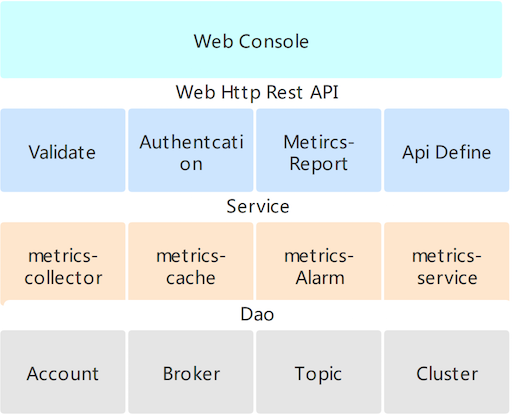
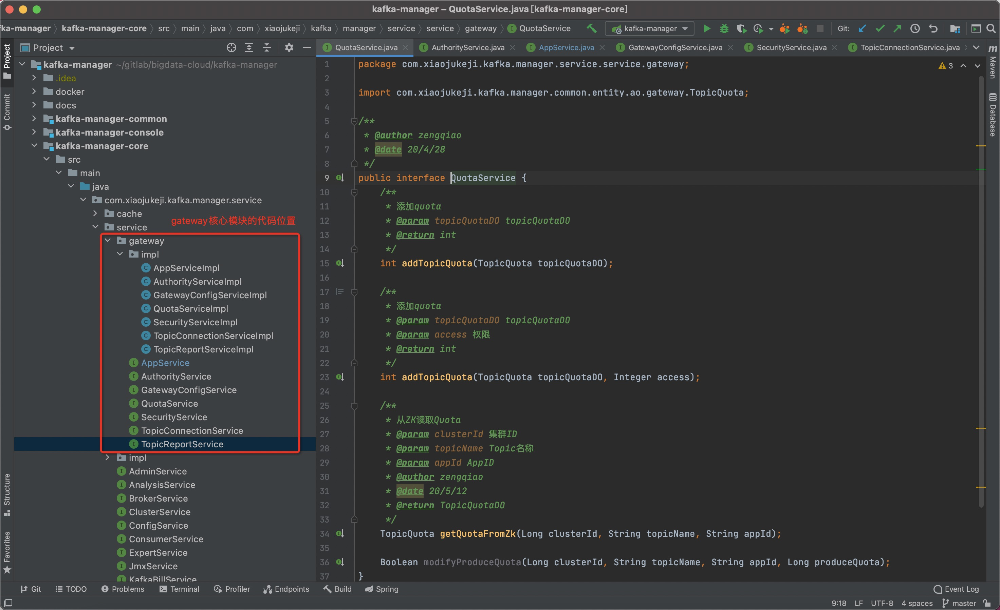
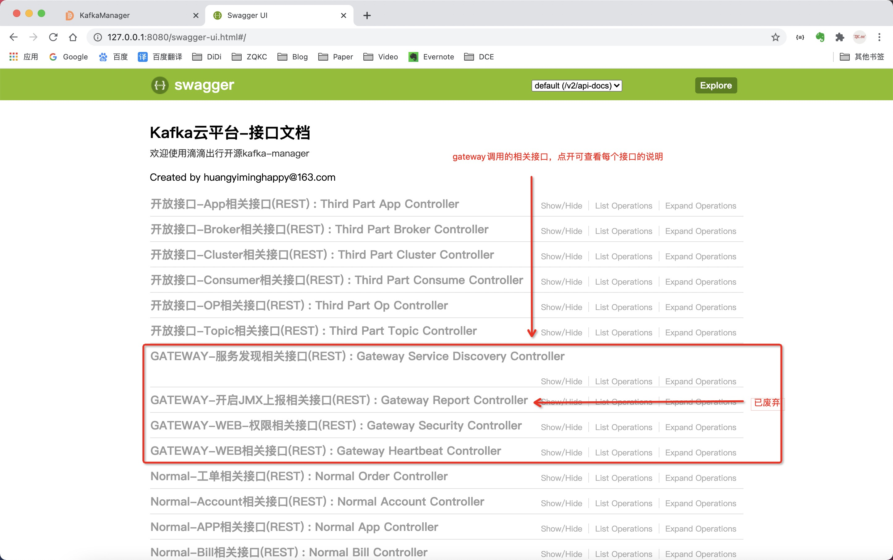
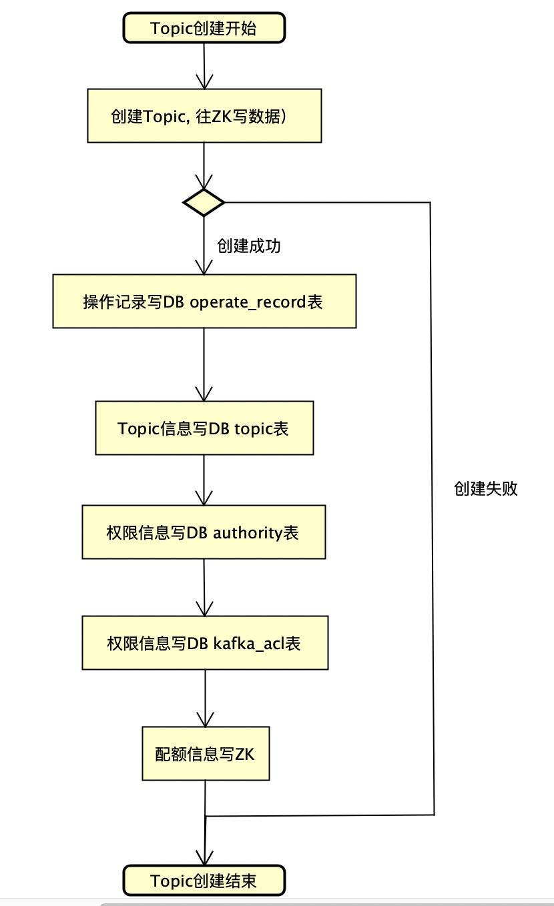
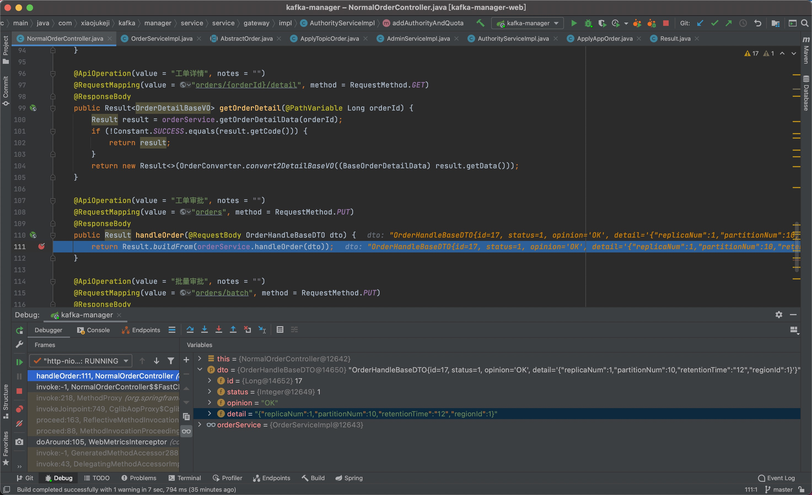
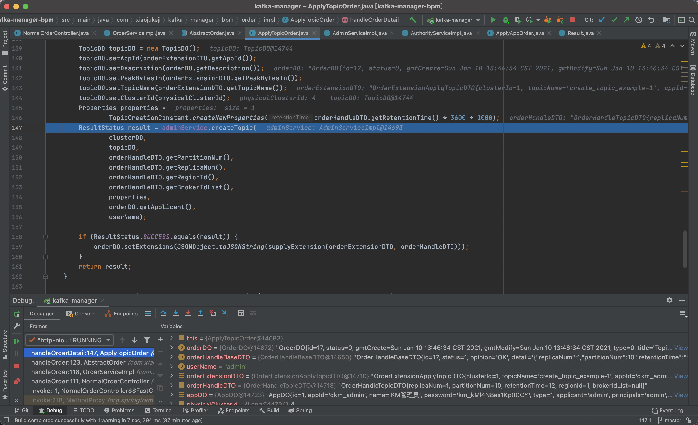
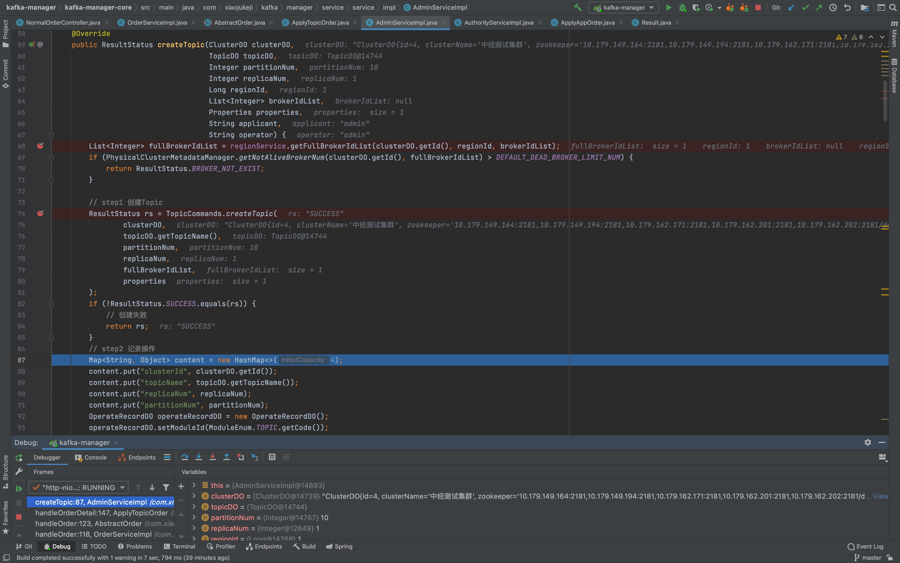

# Logi-KafkaManager 中的 Kafka-Gateway 模块介绍

[TOC]

## 1、前言

在介绍`Kafka-Manager`中`Kafka-Gateway`相关模块之前，我们来先看几个问题以加深对本次分享内容的理解。

**问题一：滴滴`Kafka-Gateway`的能力是什么？**

滴滴`Kafka-Gateway`的主要能力有以下三点：

1. 应用 + Topic + 发送or消费 粒度的鉴权能力；
2. 应用 + Topic + 发送or消费 粒度的流控能力；
3. 服务发现以及服务发现本身具备的多维度的服务降级能力；

**问题二：滴滴`Kafka-Gateway`是怎么实现的？**

这个问题比较大，嘴皮子说说主要就是怎么对每个请求做鉴权及流控，然后另外一点是权限及流控元信息的存储。

1. 每个请求的鉴权及流控的实现是被嵌入于`Kafka-Broker`中实现。
2. 权限及流控的元信息分别被存储于`MySQL`及`Zookeeper`中。

**问题三：上面两个问题和我们今天分享的内容有什么关系？**

`Logi-KafkaManager`本身除了会作为一个一站式的监控&运维管控平台之外，还会作为`Kafka-Gateway`里的应用及权限的存储地，`Kafka-Gateway`会定时通过接口从`Kafka-Manager`同步应用及权限信息。

此外，刚刚说到`Logi-KafkaManager`本身也是一站式的监控&运维管控平台，因此`Kafka-Manager`也会对存储于`ZK`中的流控信息进行操作。

下面我们正式开始详细的介绍`Logi-KafkaManager`中`Kafka-Gateway`相关能力的具体实现。

## 2、Logi-KafkaManager 概要介绍

在具体介绍`Logi-KafkaManager` 之 `Kafka-Gateway`之前，我们先看一下`Kafka-Manager`的架构及整体模块的介绍，以便加深对其中的`Kafka-Gateway`模块的实现的理解。

### 2.1、整体架构

### 2.2、模块介绍

| 模块    | 说明 | 详细说明
| :-------- |:--------:| :--------:|
| kafka-manager-console    | 前端模块 | KM前端相关的代码
| kafka-manager-common    | 公共模块 | 存放公共内容，包括实体类、工具类等等
| kafka-manager-core    | 核心模块 | KM的核心模块，存放最基本及最重要的功能，比如Topic的增删改查等
| kafka-manager-dao    | DAO层 | 主要是操作MySQL的相关类
| kafka-manager-extends    | 扩展模块 | 非核心模块，可依据实际需要进行扩展
| kafka-manager-account    | 扩展模块-登录及用户账号模块 | 默认基于MySQL实现，也可以基于自己公司内部的员工系统及登录系统进行扩展实现
| kafka-manager-bpm    | 扩展模块-工单流程模块 | 默认基于MySQL实现，也可以基于自己公司内部的流程中心进行扩展实现
| kafka-manager-kcm    | 扩展模块-Kafka集群升级部署管理模块 | 默认对接夜莺，也可以单独对接自己公司内部的相关系统
| kafka-manager-monitor    | 扩展模块-监控告警模块 | 监控告警模块默认对接夜莺，可以单独对接自己内部的监控系统
| kafka-manager-notify    | 扩展模块-通知模块 | 基本无默认实现，可以对接自己公司内部的通知系统或者邮件系统
| kafka-manager-openapi    | 扩展模块-开放接口 | 相关的开放接口涉及到的服务层都存放在这个地方
| kafka-manager-task    | 任务模块 | 基于MySQL实现的任务均衡及抢占式执行模块，该模块主要是对集群的指标进行搜集
| kafka-manager-web    | Controller层 | 接收外部请求及进行相关控制

## 3、Kafka-Gateway 详细介绍

KM的代码整体上都还是比较简单的，因此这块就详细介绍一下相关代码的位置。以及我们结合代码，以DEBUG的方式，跟踪几个例子，具体细节部分可以看代码。

### 3.1、代码结构说明

Kafka-Gateway调用的相关API接口

&nbsp;

Kafka-Gateway核心模块的代码位置

&nbsp;

API接口大全-Swagger接口

&nbsp;
每个API接口的用途在swagger地址及代码中都做了说明，这块有问题的，或者觉得哪里不够清晰的，可以随时交流。

### 3.2、数据库表说明

创建数据库表，及表与表每个字段的说明，在kafka-manager源码的`docs/install_guide/create_mysql_table.sql`文件中做了概要说明。这里再补充说明一下gateway相关的表及功能。

| 表   | 功能说明 | 详细说明
| :-------- |:--------:| :--------:|
| app   | KM使用的应用表 | app表数据是给KM查询使用的，里面包含一些业务信息，包括应用的负责人是谁等
| kafka_user   | KG使用的应用表 | kafka_user表的数据是提供给Kafka-Gateway查询使用的。与app表的数据基本一致，设计两个表的原因是做数据的隔离，避免app表的脏数据影响了KG
| authority    | KM使用的权限表 | 权限值存储最终的权限，即记录最终权限值
| kafka_acl    | KG使用的权限表 | 存储每一次的权限操作点，即增量记录
| gateway_config    | gateway相关配置表 | 主要提供给服务发现使用
| topic_connections    | Topic连接信息表 | kafka-broker将连接信息上报给kafka-manager之后，存储在该表中
| topic_report    | 废弃，忽略该功能 | 已废弃

### 3.3、样例演示——增加Topic

我们以在我们平台申请及创建一个Topic为例子，讲解整个代码的运行过程。

首先看一下创建Topic的整体流程：

**创建Topic的整体流程**

然后我们再结合代码，看一下创建的具体过程

**步骤一：页面审批Topic申请工单**

**步骤二：接口收到Topic审批请求**

所有的工单处理，入口都在这个地方。

**步骤三：开始创建Topic**

**步骤四：创建Topic**

**步骤五：增加权限与配额**

## 4、总结

介绍了一下`Logi-KafkaManager` 中的 `Kafka-Gateway` 模块的功能以及相关代码的位置，并以DEBUG方式跟踪查看了一下`Topic`创建的详细流程。

剩余的比如权限的增加、应用的增加等流程，大家有兴趣的也可以跟踪一下，以加深对整体代码的理解。

