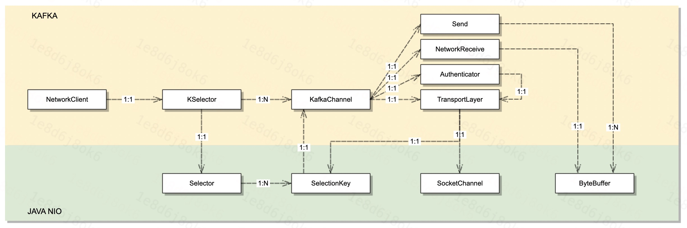
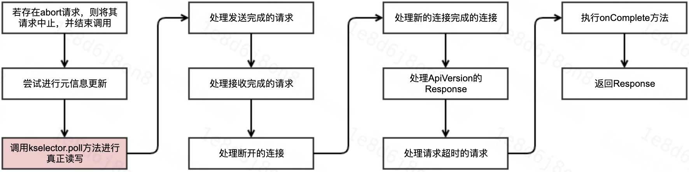
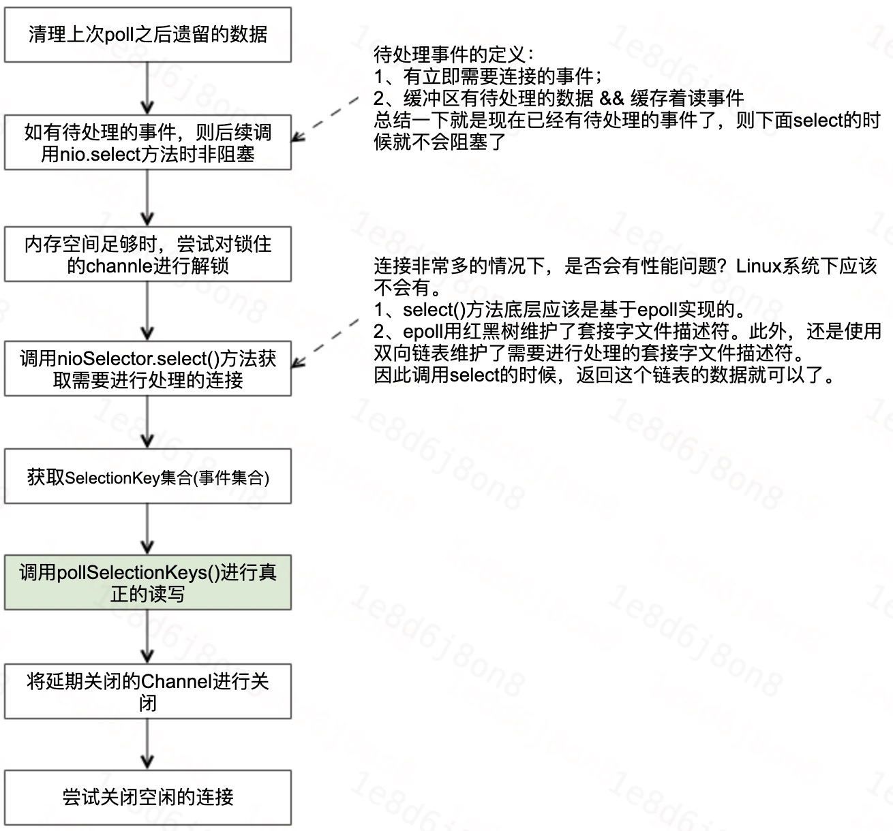
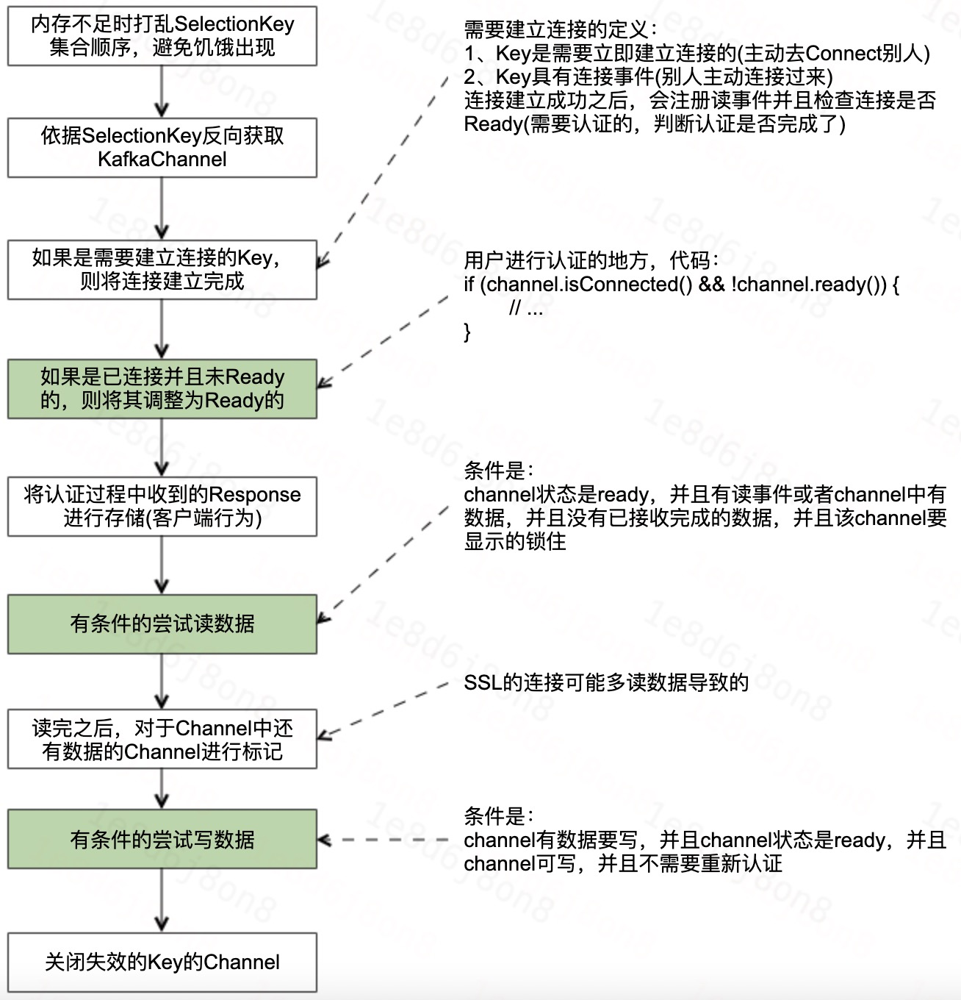
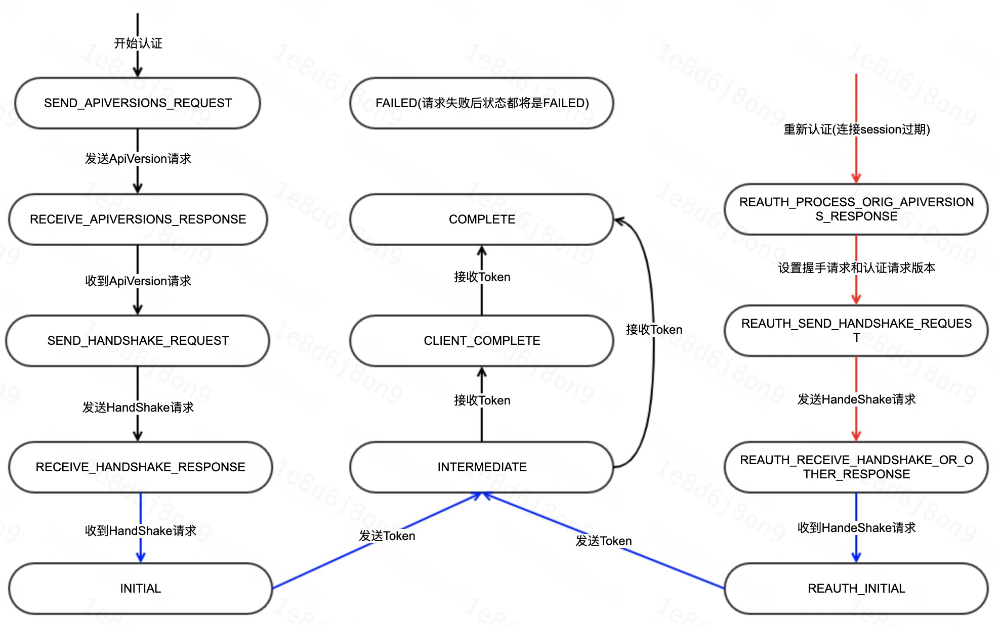

# Logi-KafkaClient 网络层讲解

[TOC]

## 1、前言

本次分享主要介绍Kafka客户端网络层相关的内容。包括：
1. 客户端网络层的读写过程；
2. 客户端SASL的认证过程；

## 2、整体架构

客户端网络层比较简单，没有复杂的模型，这里我们就看一下网络层的类图。



&nbsp;

1. NetWorkClient：顾名思义，这是Kafka网络IO对外暴露的客户端。网络IO操作都是通过它来对外暴露方法调用，实际上它是通过Kafka的KSelector来实现。
&nbsp;
1. KSelector：此类名称也是Selector，为了区分NIO的selector，故称之为KSelector。他拥有NIO selector的引用，此外他维护了所有的KafkaChannel。
&nbsp;
3. KafkaChannel：对应NIO中Channel的概念，它通过TransportLayer间接持有SocketChannel和SelectionKey这两个NIO中的核心对象。另外他还维护了发送和接收的数据对象：Send实现及NetWorkReceive。另外，请注意唯一一个从下往上的箭头，KafkaChannel还会把自己attach到自己对应的SelectionKey中。这样可以通过SelectionKey方便取到对应KafkaChannel。
&nbsp;
1. TransportLayer：这个类实现传输层功能，而传输是通过NIO实现，所以他持有SocketChannel和Selector这两个nio的核心对象。他所做的事情就是通过这两个对象实现网络IO。
&nbsp;
5. Send，这是一个接口，有多个实现，目的就是封装要发送的数据，底层是NIO的ByteBuffer。
&nbsp;
6. NetWorkReceive：接收数据的对象，底层是NIO的ByteBuffer。

---

## 3、收发请求过程

**大体流程**

- 首先调用`NetworkClient.send()`方法，将请求缓存到KafkaChannel中。
- 最后调用`NetworkClient.poll()`方法，读取Response数据以及将当前Request请求发送出去等。

---

### 3.1、NetworkClient.send()详细流程

```java
    // 调用NetworkClient.doSend方法
    private void doSend(ClientRequest clientRequest, boolean isInternalRequest, long now) {
        ensureActive();
        String nodeId = clientRequest.destination();
        if (!isInternalRequest) {
            // 信任内部请求(ApiVersion请求 和 Metadata请求)，外部请求则进行校验节点是否能继续send
            if (!canSendRequest(nodeId, now))
                throw new IllegalStateException("Attempt to send a request to node " + nodeId + " which is not ready.");
        }
        AbstractRequest.Builder<?> builder = clientRequest.requestBuilder();
        try {
            // 获取该节点，对该请求，最新的，可用的版本信息
            NodeApiVersions versionInfo = apiVersions.get(nodeId);
            // ...

            // 调用doSend将请求存储到channel中
            doSend(clientRequest, isInternalRequest, now, builder.build(version));
        } catch (UnsupportedVersionException unsupportedVersionException) {
            // 消息协议不支持异常
        }
    }

    // 调用NetworkClient.doSend方法
    private void doSend(ClientRequest clientRequest, boolean isInternalRequest, long now, AbstractRequest request) {
        String destination = clientRequest.destination();
        RequestHeader header = clientRequest.makeHeader(request.version()); // 构造请求头
        if (log.isDebugEnabled()) {
            // ... debug日志
        }
        Send send = request.toSend(destination, header);
        InFlightRequest inFlightRequest = new InFlightRequest(clientRequest, header, isInternalRequest, request, send, now);
        this.inFlightRequests.add(inFlightRequest); // 放到inflight request队列中
        selector.send(send); // 放到kafka channel中
    }

    // kselector.send方法
    public void send(Send send) {
        String connectionId = send.destination();
        KafkaChannel channel = openOrClosingChannelOrFail(connectionId);
        if (closingChannels.containsKey(connectionId)) {
            // ensure notification via `disconnected`, leave channel in the state in which closing was triggered
            this.failedSends.add(connectionId);
        } else {
            try {
                channel.setSend(send);
            } catch (Exception e) {
                // 异常处理
            }
        }
    }

    // 调用KafkaChannel.setSend方法
    public void setSend(Send send) {
        if (this.send != null)
            throw new IllegalStateException("Attempt to begin a send operation with prior send operation still in progress, connection id is " + id);
        this.send = send;
        this.transportLayer.addInterestOps(SelectionKey.OP_WRITE);
    }
```

---

### 3.2、NetworkClient.poll()流程

#### 3.2.1、大体流程

- 调用kselector.poll方法进行真正的读写，这一步我们后续重点展开说；
- 执行onComplete方法，这一步是Kafka用户在写客户端代码的时候写的回调方法，如果用户在这里写一个非常耗费时间的方法，那么将影响poll的整个性能，或者说是影响生产者的性能。

&nbsp;



#### 3.2.2、KSelector.poll()方法详解



#### 3.2.3、KSelector.pollSelectionKeys()方法详解



### 3.3、安全认证过程

这里仅介绍SASL的认证过程，SSL的认证方式，代码位置一样，大家有兴趣的可以自己去看一下源码。

#### 3.3.1、认证过程入口

```scala
    // 使用transportLayer进行握手(handshake)，以及使用配置的认证器进行认证
    public void prepare() throws AuthenticationException, IOException {
        boolean authenticating = false;
        try {
            if (!transportLayer.ready())
                transportLayer.handshake(); // 客户端ssl的认证方式，将会在这里就进行了认证
            if (transportLayer.ready() && !authenticator.complete()) {
                authenticating = true;
                authenticator.authenticate(); // 客户端sasl的认证方式，将在这里进行认证
            }
        } catch (AuthenticationException e) {
            // ......
        }
        if (ready()) {
            ++successfulAuthentications;
            state = ChannelState.READY;
        }
    }
```

#### 3.3.2、SASL认证过程

备注说明：
1. 具体所在的类是：org.apache.kafka.common.security.authenticator.SaslClientAuthenticator类。
2. 这里的状态都是等待状态，即等待一个事件的到来，然后转变成等待下一个事件的到来。
3. 用红色和蓝色线段所连接的状态，是表示上下两个状态之间的转变是一步完成的。黑色线段所连接的状态表示的是可能需要一个服务端的响应之后状态才能走到下一步。
4. 最后多个“接收Token”和使用的Kafka的Sasl请求的版本有关系，有些版本是需要等待服务端返回一个响应之后才能变成COMPLETE，中间就是CLIENT_COMPLETE的状态。
5. 整个认证过程就是状态的依次转换，直至COMPLETE或者FAILED。



---

## 4、结合日志

### 4.1、认证成功

```log
// Kafka客户端配置
2021-04-09 10:41:12.032 [main] INFO  org.apache.kafka.clients.producer.ProducerConfig - ProducerConfig values: 
	acks = 1
	batch.size = 65536
	bootstrap.servers = [10.179.149.201:7093]
	// .. Kafka客户端配置

主线程日志

2021-04-09 10:41:12.418 [main] INFO  o.a.k.common.security.authenticator.AbstractLogin - Successfully logged in.
2021-04-09 10:41:12.473 [kafka-producer-network-thread | producer-1] DEBUG org.apache.kafka.clients.producer.internals.Sender - [Producer clientId=producer-1] Starting Kafka producer I/O thread.
2021-04-09 10:41:12.479 [kafka-producer-network-thread | producer-1] DEBUG org.apache.kafka.clients.NetworkClient - [Producer clientId=producer-1] Initialize connection to node 10.179.149.201:7093 (id: -1 rack: null) for sending metadata request
2021-04-09 10:41:12.481 [main] INFO  org.apache.kafka.common.utils.AppInfoParser - Kafka version: 2.5.0
2021-04-09 10:41:12.482 [main] INFO  org.apache.kafka.common.utils.AppInfoParser - Kafka commitId: 66563e712b0b9f84
2021-04-09 10:41:12.482 [main] INFO  org.apache.kafka.common.utils.AppInfoParser - Kafka startTimeMs: 1617936072473
2021-04-09 10:41:12.482 [kafka-producer-network-thread | producer-1] DEBUG org.apache.kafka.clients.NetworkClient - [Producer clientId=producer-1] Initiating connection to node 10.179.149.201:7093 (id: -1 rack: null) using address /10.179.149.201
2021-04-09 10:41:12.485 [main] DEBUG org.apache.kafka.clients.producer.KafkaProducer - [Producer clientId=producer-1] Kafka producer started

安全认证过程及状态的转换

2021-04-09 10:41:12.533 [kafka-producer-network-thread | producer-1] DEBUG o.a.k.c.s.authenticator.SaslClientAuthenticator - [Producer clientId=producer-1] Set SASL client state to SEND_APIVERSIONS_REQUEST
2021-04-09 10:41:12.536 [kafka-producer-network-thread | producer-1] DEBUG o.a.k.c.s.authenticator.SaslClientAuthenticator - [Producer clientId=producer-1] Creating SaslClient: client=null;service=kafka;serviceHostname=10.179.149.201;mechs=[PLAIN]
2021-04-09 10:41:12.562 [kafka-producer-network-thread | producer-1] DEBUG org.apache.kafka.common.network.Selector - [Producer clientId=producer-1] Created socket with SO_RCVBUF = 32832, SO_SNDBUF = 131328, SO_TIMEOUT = 0 to node -1
2021-04-09 10:41:12.959 [kafka-producer-network-thread | producer-1] DEBUG o.a.k.c.s.authenticator.SaslClientAuthenticator - [Producer clientId=producer-1] Set SASL client state to RECEIVE_APIVERSIONS_RESPONSE
2021-04-09 10:41:12.960 [kafka-producer-network-thread | producer-1] DEBUG org.apache.kafka.clients.NetworkClient - [Producer clientId=producer-1] Completed connection to node -1. Fetching API versions.
2021-04-09 10:41:13.013 [kafka-producer-network-thread | producer-1] DEBUG o.a.k.c.s.authenticator.SaslClientAuthenticator - [Producer clientId=producer-1] Set SASL client state to SEND_HANDSHAKE_REQUEST
2021-04-09 10:41:13.014 [kafka-producer-network-thread | producer-1] DEBUG o.a.k.c.s.authenticator.SaslClientAuthenticator - [Producer clientId=producer-1] Set SASL client state to RECEIVE_HANDSHAKE_RESPONSE
2021-04-09 10:41:13.060 [kafka-producer-network-thread | producer-1] DEBUG o.a.k.c.s.authenticator.SaslClientAuthenticator - [Producer clientId=producer-1] Set SASL client state to INITIAL
2021-04-09 10:41:13.063 [kafka-producer-network-thread | producer-1] DEBUG o.a.k.c.s.authenticator.SaslClientAuthenticator - [Producer clientId=producer-1] Set SASL client state to INTERMEDIATE
2021-04-09 10:41:13.110 [kafka-producer-network-thread | producer-1] DEBUG o.a.k.c.s.authenticator.SaslClientAuthenticator - [Producer clientId=producer-1] Set SASL client state to COMPLETE
2021-04-09 10:41:13.110 [kafka-producer-network-thread | producer-1] DEBUG o.a.k.c.s.authenticator.SaslClientAuthenticator - [Producer clientId=producer-1] Finished authentication with no session expiration and no session re-authentication
2021-04-09 10:41:13.110 [kafka-producer-network-thread | producer-1] DEBUG org.apache.kafka.common.network.Selector - [Producer clientId=producer-1] Successfully authenticated with 10.179.149.201/10.179.149.201

安全认证成功


元信息获取，请求版本获取等等
2021-04-09 10:41:13.111 [kafka-producer-network-thread | producer-1] DEBUG org.apache.kafka.clients.NetworkClient - [Producer clientId=producer-1] Initiating API versions fetch from node -1.
。。。。。。

```

### 4.2、认证失败


```log
Kafka客户端配置 & 版本等信息
2021-04-09 10:42:16.094 [main] INFO  org.apache.kafka.clients.producer.ProducerConfig - ProducerConfig values: 
	acks = 1
	batch.size = 65536
	bootstrap.servers = [10.179.149.201:7093]
	。。。。。。
    。。。。。。

开始做认证，从这里也可以看出，认证是一个应用层的协议，网络层都已经连接成功了。

2021-04-09 10:42:16.458 [kafka-producer-network-thread | producer-1] DEBUG o.a.k.c.s.authenticator.SaslClientAuthenticator - [Producer clientId=producer-1] Set SASL client state to SEND_APIVERSIONS_REQUEST
2021-04-09 10:42:16.460 [kafka-producer-network-thread | producer-1] DEBUG o.a.k.c.s.authenticator.SaslClientAuthenticator - [Producer clientId=producer-1] Creating SaslClient: client=null;service=kafka;serviceHostname=10.179.149.201;mechs=[PLAIN]
2021-04-09 10:42:16.505 [kafka-producer-network-thread | producer-1] DEBUG org.apache.kafka.common.network.Selector - [Producer clientId=producer-1] Created socket with SO_RCVBUF = 32832, SO_SNDBUF = 131328, SO_TIMEOUT = 0 to node -1
2021-04-09 10:42:16.847 [kafka-producer-network-thread | producer-1] DEBUG o.a.k.c.s.authenticator.SaslClientAuthenticator - [Producer clientId=producer-1] Set SASL client state to RECEIVE_APIVERSIONS_RESPONSE
2021-04-09 10:42:16.848 [kafka-producer-network-thread | producer-1] DEBUG org.apache.kafka.clients.NetworkClient - [Producer clientId=producer-1] Completed connection to node -1. Fetching API versions.

握手成功了

2021-04-09 10:42:16.900 [kafka-producer-network-thread | producer-1] DEBUG o.a.k.c.s.authenticator.SaslClientAuthenticator - [Producer clientId=producer-1] Set SASL client state to SEND_HANDSHAKE_REQUEST
2021-04-09 10:42:16.901 [kafka-producer-network-thread | producer-1] DEBUG o.a.k.c.s.authenticator.SaslClientAuthenticator - [Producer clientId=producer-1] Set SASL client state to RECEIVE_HANDSHAKE_RESPONSE
2021-04-09 10:42:16.948 [kafka-producer-network-thread | producer-1] DEBUG o.a.k.c.s.authenticator.SaslClientAuthenticator - [Producer clientId=producer-1] Set SASL client state to INITIAL
2021-04-09 10:42:16.952 [kafka-producer-network-thread | producer-1] DEBUG o.a.k.c.s.authenticator.SaslClientAuthenticator - [Producer clientId=producer-1] Set SASL client state to INTERMEDIATE

SASL认证失败了(发送token那一步失败了)

2021-04-09 10:42:17.343 [kafka-producer-network-thread | producer-1] DEBUG o.a.k.c.s.authenticator.SaslClientAuthenticator - [Producer clientId=producer-1] Set SASL client state to FAILED
2021-04-09 10:42:17.344 [kafka-producer-network-thread | producer-1] INFO  org.apache.kafka.common.network.Selector - [Producer clientId=producer-1] Failed authentication with 10.179.149.201/10.179.149.201 (Authentication failed: exception: )
2021-04-09 10:42:17.346 [kafka-producer-network-thread | producer-1] DEBUG org.apache.kafka.clients.NetworkClient - [Producer clientId=producer-1] Node -1 disconnected.
2021-04-09 10:42:17.347 [kafka-producer-network-thread | producer-1] ERROR org.apache.kafka.clients.NetworkClient - [Producer clientId=producer-1] Connection to node -1 (10.179.149.201/10.179.149.201:7093) failed authentication due to: Authentication failed: exception: 
2021-04-09 10:42:17.347 [kafka-producer-network-thread | producer-1] WARN  org.apache.kafka.clients.NetworkClient - [Producer clientId=producer-1] Bootstrap broker 10.179.149.201:7093 (id: -1 rack: null) disconnected
2021-04-09 10:42:17.350 [main] DEBUG org.apache.kafka.clients.producer.KafkaProducer - [Producer clientId=producer-1] Exception occurred during message send:
org.apache.kafka.common.errors.SaslAuthenticationException: Authentication failed: exception: 
2021-04-09 10:42:17.351 [kafka-producer-network-thread | producer-1] DEBUG org.apache.kafka.clients.NetworkClient - [Producer clientId=producer-1] Give up sending metadata request since no node is available
2021-04-09 10:42:17.405 [kafka-producer-network-thread | producer-1] DEBUG org.apache.kafka.clients.NetworkClient - [Producer clientId=producer-1] Give up sending metadata request since no node is available
2021-04-09 10:42:17.460 [kafka-producer-network-thread | producer-1] DEBUG org.apache.kafka.clients.NetworkClient - [Producer clientId=producer-1] Initialize connection to node 10.179.149.201:7093 (id: -1 rack: null) for sending metadata request
2021-04-09 10:42:17.461 [kafka-producer-network-thread | producer-1] DEBUG org.apache.kafka.clients.NetworkClient - [Producer clientId=producer-1] Initiating connection to node 10.。。。。。。。

```

## 5、总结

本次分享大致介绍了一下Kafka客户端网络层相关的原理以及SASL认证的过程，没有逐行代码的走读，有兴趣的同学可以结合本次分享，逐行的走读一下代码，从而对Kafka客户端网络层有更深刻的认识。
