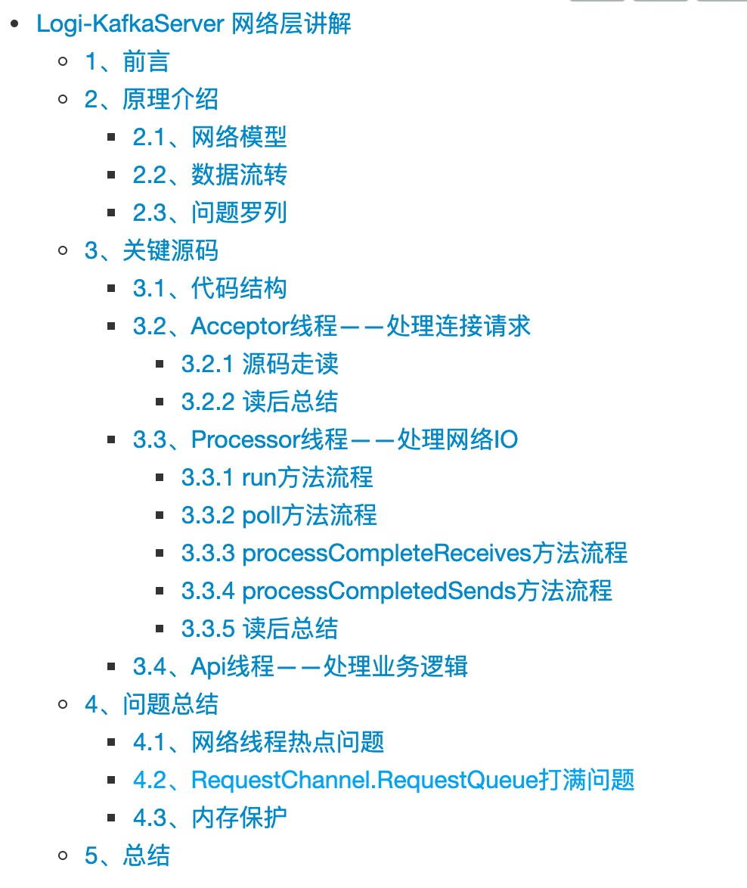
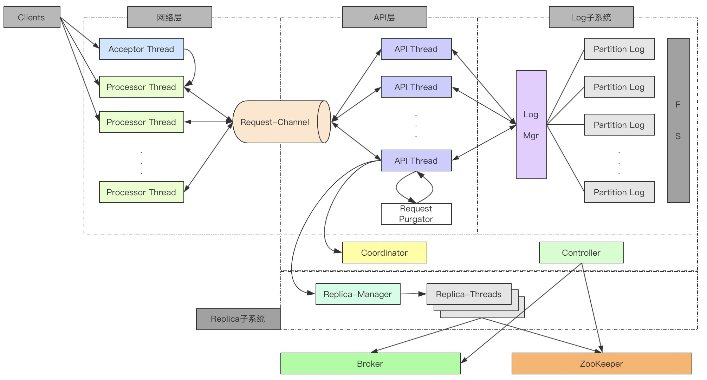
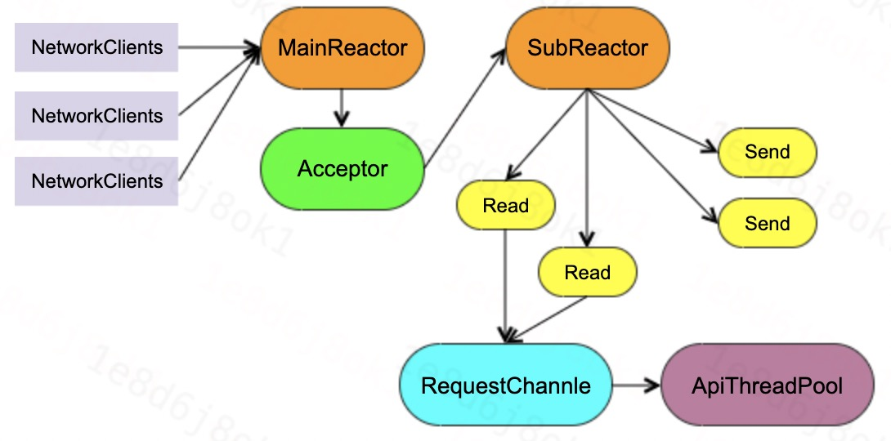
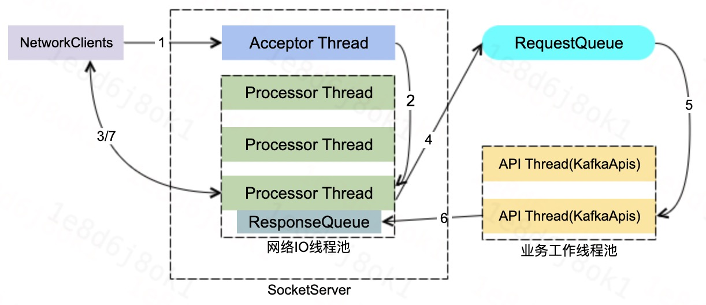
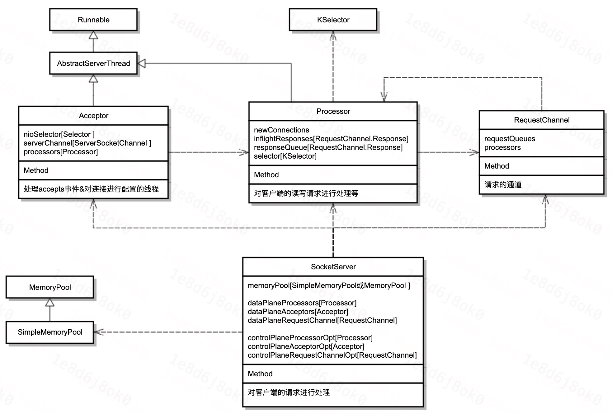
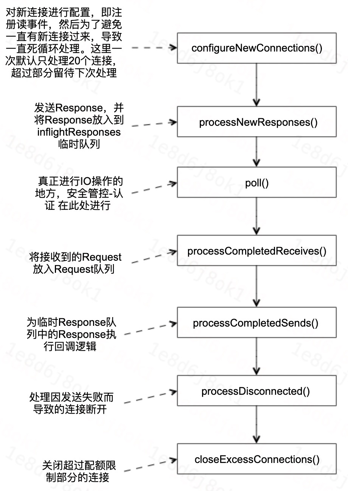
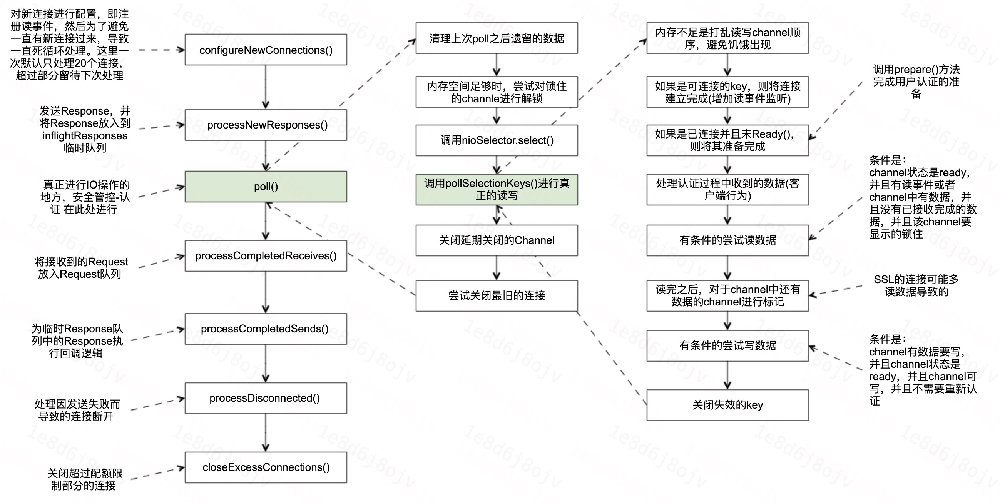
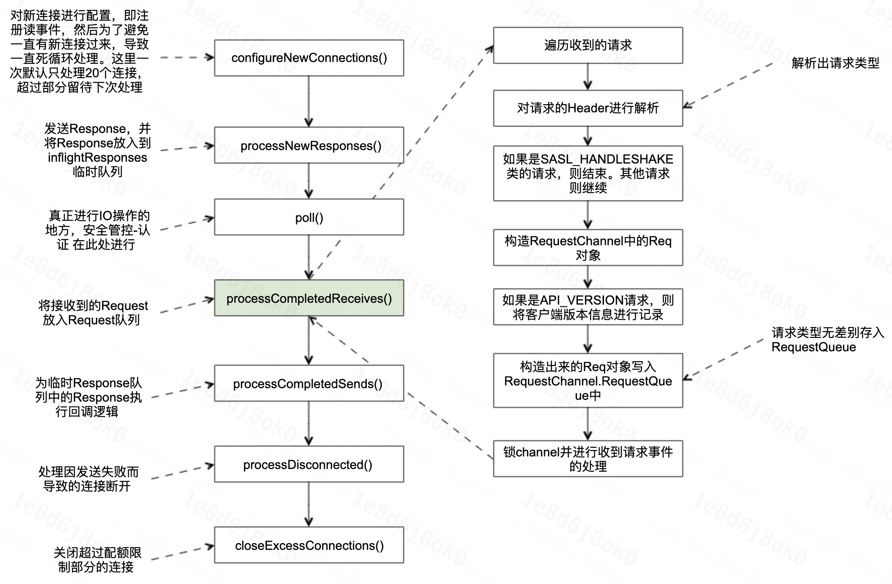
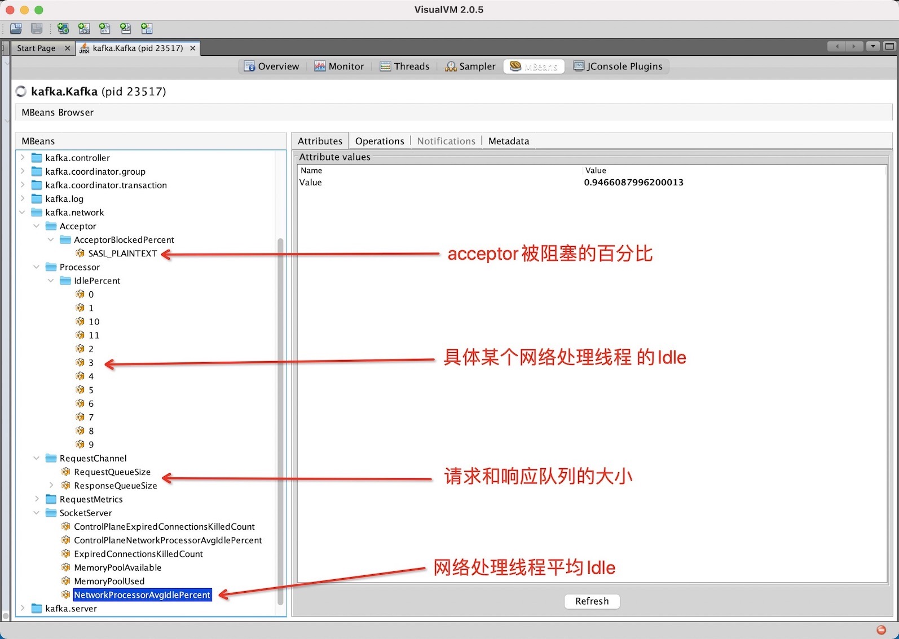

# Logi-KafkaServer 网络层讲解

<!-- [TOC] -->



## 1、前言

本节给大家介绍一下Kafka服务端的网络层的设计，首先在具体介绍之前，我们先来回顾一下`KafkaServer`的架构：



本次我们将分享一下Kafka服务端网络层的源码。Kafka网络层的通信是基于Java NIO进行实现的。

## 2、原理介绍

### 2.1、网络模型



- MainReactor负责监听ServerSocket，用来处理新连接的建立，将建立的SocketChannel指定注册给subReactor。
- SubReactor维护自己的selector，基于MainReactor注册的SocketChannel多路分离IO读写时间，读写网络的数据，然后将其丢给RequestChannel(请求队列)，最后业务线程(ApiThreadPool)读取队列中的请求，并对其进行处理。

Kafka的网络通信模型是基于NIO的Reactor多线程模型来设计的，主要采用的是1+M+N的模式，其中：
- 1：1个Acceptor线程；
- M：M个Processor线程(网络IO线程)；
- N：N个业务处理线程(工作线程))；

### 2.2、数据流转



- 步骤一：客户端连接KafkaServer，此时不会进行权限校验等安全管控相关的操作。
- 步骤二：KafkaServer对连接请求进行处理，处理完成之后将其移交给Processor线程，Processor线程会对该连接注册读事件。Processor线程就是网络IO线程。
- 步骤三：客户端将请求发往KafkaServer；
- 步骤四：Processor线程在监听到可读的时候，读取该请求，并将该请求存到RequestChannel的RequestQueue中。
- 步骤五：API线程从RequestQueue中不断的拉取请求进行处理。
- 步骤六：API处理完成之后，将Response存入相应的Processor线程的ResponseQueeu中。
- 步骤七：Processor线程将请求返回给客户端。

以上就是完整的网络线程的数据处理过程，基于该模型，我简单思考一下这个模型可能存在的问题。

### 2.3、问题罗列

下面基于我的一些理解，先提出以下几个问题，然后我们再去看网络层的源码，看是如何对这些问题进行解决。

1. 看架构只有一个RequestQueue，这个Queue会不会存在贫瘠，或者被打满的情况，如果出现了瓶颈会有什么问题。
2. 线程池是否会出现热点的问题？即Processor线程和API线程这两类线程是否可能出现热点的问题。
3. 网络层这块有什么保护措施以避免被客户端打挂？比如客户端连接非常多，加IOPS高，然后再加上消息体太大等等的时候，各会有什么问题。
4. 出现问题时，会有哪些现象，以及可以通过哪些指标，哪些日志快速的发现问题。
5. 数据接收与发送过程中，是否存在不合理的内存拷贝、CPU消耗的地方。


## 3、关键源码

介绍完网络层原理之后，我们再来看一下关键地方的设计，以及上面提到的那些问题是否存在。

网络层这块，比较关键的几个线程分别是：
- Acceptor线程：处理客户端的连接事件并将连接移交Processor线程处理；
- Processor线程：处理网络读写请求；
- API线程：工作线程，即处理业务逻辑；(概要说明)

下面我们就先看一下网络层的代码结构，然后再仔细走读一下Acceptor线程和Processor线程的关键处理逻辑，然后为了便于阅读Kafka-Broker的源码，这里也概要说明一下API线程。

### 3.1、代码结构

服务端网络层的类图如下所示：



### 3.2、Acceptor线程——处理连接请求

Acceptor线程主要的功能是对ACCEPT事件进行处理，线程的主要逻辑就是run()方法。run()方法代码逻辑比较简单，这里我们就直接看代码吧。

#### 3.2.1 源码走读

```scala
  /**
   * Accept loop that checks for new connection attempts
   */
  def run(): Unit = {
    // 注册监听OP_ACCEPT事件
    serverChannel.register(nioSelector, SelectionKey.OP_ACCEPT)
    startupComplete()
    try {
      var currentProcessorIndex = 0
      while (isRunning) {
        try {
          // 获取nio事件数
          val ready = nioSelector.select(500)
          if (ready > 0) { // 因为是非阻塞的，所以可能获取到<=0的事件数

            // 获取待处理事件的key集合
            val keys = nioSelector.selectedKeys()
            val iter = keys.iterator()
            while (iter.hasNext && isRunning) {
              try {
                val key = iter.next
                iter.remove()

                if (key.isAcceptable) {
                  
                  // 重要：这里会对同个IP的连接数做限制。
                  // accept()方法会判断该客户端的连接数是不是超过限制了，如果超过限制了则关闭该连接，同时下面的方法不再继续执行。
                  // 如果连接数没有超过限制，则accept()方法会创建一个非阻塞的ServerSocketChannel
                  accept(key).foreach { socketChannel =>

                    // 使用轮训调度算法(round-robin)对连接进行分配, 如果Processor里面的存储新连接的队列池都满了，则等待直到最后一个池子有空间
                    // 这块有个指标衡量回去衡量加入队列池的等待时间
                    var retriesLeft = synchronized(processors.length)
                    var processor: Processor = null
                    do {
                      retriesLeft -= 1
                      processor = synchronized {
                        // 。。。
                        currentProcessorIndex = currentProcessorIndex % processors.length
                        processors(currentProcessorIndex)
                      }
                      currentProcessorIndex += 1
                    // 等待直到将连接放到Processor的新链接队列池中
                    } while (!assignNewConnection(socketChannel, processor, retriesLeft == 0))
                  }
                } else
                  throw new IllegalStateException("Unrecognized key state for acceptor thread.")
              } catch {
                case e: Throwable => error("Error while accepting connection", e)
              }
            }
          }
        }
        catch {
          。。。
        }
      }
    } finally {
      。。。
    }
  }
```

#### 3.2.2 读后总结

没有比较深的调用，整个流程还是非常的简单清晰的。这里有个**保护机制，即会对同个IP的客户端的连接数做限制**。

此外，这里也有个问题，就是在分配连接的时候，是按照轮训调度算法分配给Processor线程的，没有依据Processor线程的负载进行分配，因此这块有可能会导致Processor线程出现**线程冷热不均**的问题。

那么当出现这个问题之后，该如何解决呢？这块文末我们进行统一的解答。

### 3.3、Processor线程——处理网络IO

Acceptor线程的主要工作是处理ACCEPT事件，而真正的数据的读写等，是Processor线程做的。

Processor线程这块，整个处理逻辑都是在run()方法中，下面我们以流程图加代码的方式看一下这块比较其中比较重要或者繁琐的几个地方的处理逻辑。

#### 3.3.1 run方法流程

首先Processor线程的run()方法的处理流程：



#### 3.3.2 poll方法流程

真正做网络IO的方法的处理流程：



因为这块是真正进行网络IO的地方，同时还涵盖了安全认证等等功能的穿插，代码比较的繁杂，相关文章或者书籍基本讲到这个地方就跳过了。

本次这里仅对整个流程进行串讲，具体每一步背后的原理，后续还需要持续研读。

#### 3.3.3 processCompleteReceives方法流程

对于已收到的请求的处理流程：



这块的逻辑相对比较简单，调用层次非常的浅，没有什么太多值得说的。此外在看代码的时候，发现两个问题：
1. 请求存入RequestChannel.RequestQueues的时候，没有区分请求的优先级及请求的类别等。
2. 请求存入RequestChannel.RequestQueues的时候，如果队列满了，则一直阻塞直到队列有空间为止。

第一点比较严重，我们下面单独分析。而对于第二点，这块即使设置了超时时间，最后对客户端的影响感觉也没啥区别，队列还是满的，没啥差别，而且还会增加代码复杂度。

#### 3.3.4 processCompletedSends方法流程

对于已成功发送的请求的处理流程，processCompletedSends方法的处理流程非常简单，代码也很短，这里就直接贴代码了。

```
  private def processCompletedSends(): Unit = {
    selector.completedSends.asScala.foreach { send =>
      try {
        val response = inflightResponses.remove(send.destination).getOrElse {
          throw new IllegalStateException(s"Send for ${send.destination} completed, but not in `inflightResponses`")
        }
        RequestChannel.setSession(response.request.session.kafkaSession)
        updateRequestMetrics(response)

        // 触发response的回调
        response.onComplete.foreach(onComplete => onComplete(send))
        RequestChannel.cleanSession

        // 如果没有被限流，则会对channel进行解锁，被限流的话，则得等到限流解除之后才会解锁
        handleChannelMuteEvent(send.destination, ChannelMuteEvent.RESPONSE_SENT)
        tryUnmuteChannel(send.destination)
      } catch {
        // 。。。
      }
    }
    selector.clearCompletedSends()
  }
```

#### 3.3.5 读后总结

整块最复杂的还是在poll方法的调用，这块代码非常的复杂，大家有空可以多去看看。

至于RequestChannel.RequestQueue满的问题，社区已经做了优化，这块留到最后`4、问题总结`部分再做说明。

### 3.4、Api线程——处理业务逻辑

这块不是本次分享的重点，但是因为这块有个地方的代码非常的重要，这里简单的提一下，方便大家后续的去看Kafka-Broker的源码。

```scala
  // KafkaRequestHandler.run()方法
  def run(): Unit = {
    while (!stopped) {
      // 。。。 指标统计

      req match {
        case RequestChannel.ShutdownRequest =>
          // 关闭broker
        case request: RequestChannel.Request =>
          try {
            request.requestDequeueTimeNanos = endTime
            trace(s"Kafka request handler $id on broker $brokerId handling request $request")
            RequestChannel.setSession(request.session.kafkaSession)
            
            // 非常重要的代码，所有业务处理的入口。
            // 大家看代码的话，如果对网络层比较了解了。
            // 那么可以直接从这块开始看每一类请求的处理逻辑。
            apis.handle(request)
            
            RequestChannel.cleanSession
          } catch { // 。。。。
          } finally { // 。。。。 }
        case null => // continue
      }
    }
    shutdownComplete.countDown()
  }
```

&nbsp;

```scala
  /**
   * 所有处理请求的入口。网络层的在收到请求之后，这块会进行真正的请求处理。
   */
  def handle(request: RequestChannel.Request): Unit = {
    try {
      trace(s"Handling request:${request.requestDesc(true)} from connection ${request.context.connectionId};" +
        s"securityProtocol:${request.context.securityProtocol},principal:${request.context.principal}")
      request.header.apiKey match {
        case ApiKeys.PRODUCE => handleProduceRequest(request)
        case ApiKeys.FETCH => handleFetchRequest(request)
        // .....
        case ApiKeys.LIST_PARTITION_REASSIGNMENTS => handleListPartitionReassignmentsRequest(request)
        case ApiKeys.OFFSET_DELETE => handleOffsetDeleteRequest(request)
      }
    } catch {
      // 。。。。。。
    } finally {
      // 。。。。。。
    }
  }
```


## 4、问题总结

### 4.1、网络线程热点问题

**一、引发原因**

- 网络线程不会对请求进行动态分配，在分配上不均衡；
- Topic的流量增加，加重热点问题；

**二、问题影响**

- 可能出现`ISR`收缩的情况；

**三、问题定位**

定位的主要方式还是通过`JMX`的`Metrics`指标，具体指标为：

- `kafka.network.SocketServer.NetworkProcessorAvgIdlePercent`
- `kafka.network.Processor.IdlePecent.{xxxx}`
 
这两个指标也可以直接使用我们开源的 [Logi-KafkaManager](https://github.com/didi/Logi-KafkaManager) 进行查看。

具体指标位置如下所示：



**四、问题解决**

首先得确定是热点问题，即网络线程的IdlePecent确实存在冷热不均的情况。

虽然Kafka本身提供了网络线程动态扩缩的能力，但是不具备调整某个线程的能力，因此想通过这个方式是不太可能的了。

这块比较常用的解决方式就是对Topic进行扩分区，当然如果可以做到限流，那么也可以考虑对客户端进行限流的方案。

### 4.2、RequestChannel.RequestQueue打满问题

**一、引发原因**

- Topic的IOPS增加；

**二、问题影响**

- 影响其他客户端的发送和消费处理速度；
- 元信息同步相关请求不能及时得到处理；
- ISR收缩；
  
**三、问题定位**

- 和上面一个问题的定位方式一样，也是可以看JMX里面的指标。

**四、问题解决**

- IOPS高的客户端做改造；
- 控制类请求和数据类请求分离(2.5版本已具备该功能)，即社区有个KIP：[KIP-291: Separating controller connections and requests from the data plane](https://cwiki.apache.org/confluence/display/KAFKA/KIP-291%3A+Separating+controller+connections+and+requests+from+the+data+plane)。


### 4.3、内存保护

**QA 一**

问题：客户端请求多且大的情况下，是否可能将服务端内存打爆了？
答案：默认配置的情况下，是有可能的。但是Broker提供了保护的能力。

```
  // SocketServer类中的memoryPool管理着收到请求之后，空间的分配，所分配的空间用于存储收到请求。
  // 因此，我们关注的重点就是memoryPool是否对内存申请做了限制？
  private val memoryPool = if (config.queuedMaxBytes > 0) new SimpleMemoryPool(config.queuedMaxBytes, config.socketRequestMaxBytes, false, memoryPoolSensor) else MemoryPool.NONE
```

就不贴代码了，这两个类底层都是ByteBuffer，具体代码大家可以直接看，这里就直接说结论了：
1. 默认情况下是会的，即默认使用的MemoryPool.NONE没有做内存申请的限制。
2. 配置了queuedMaxBytes之后，会使用SimpleMemoryPool，从而实现对内存的保护。

**QA 二**

配置了queuedMaxBytes之后，虽然解决了内存被打满的问题，但是也引出了另外一个问题。
问：内存打满之后，服务端的行为是？
答：满了之后，一些读事件会处理不了，或者说不进行处理直到内存足够。另外一点是会对读事件的处理顺序进行打散，以避免饥饿的情况出现。

**QA 三**
问：使用的是ByteBuffer，这块使用的内存是？
答：使用的是堆内存，而不是堆外内存。

这块后续可以再看看使用堆内存的原因，按照理解来说，使用堆内存虽然可以加快内存申请的速度，但是会导致数据的多一次拷贝，而使用堆外内存可以减少这一次的拷贝。

最后再补充一句，Kafka针对内存的使用情况，也是有监控指标的，有兴趣的同学也可以去看一下。

## 5、总结
 
本次仅分享了服务端网络层主要的代码，以及可能出现的问题的解决。并没有非常细致的去讲解每一行的代码，如果细致的去读代码，我们还会发现，Kafka本身除了完成了网络层通信的需求之外，还埋入了很多衡量通信性能的指标，这块对于我们平时去开发的时候也很值得学习。

最后，也遗留了一些更深层次的思考没有去讲解，比如channel的状态的变化逻辑，processor.poll方法的深层次分析等等，这块后续在讲客户端网络层的时候还会讲解到，敬请期待。

